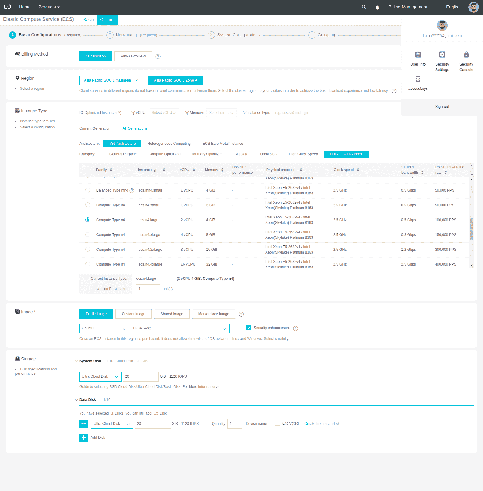
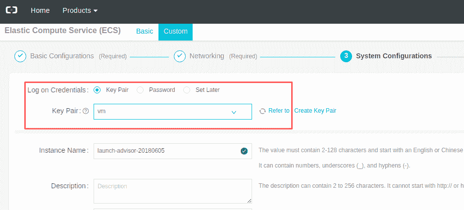
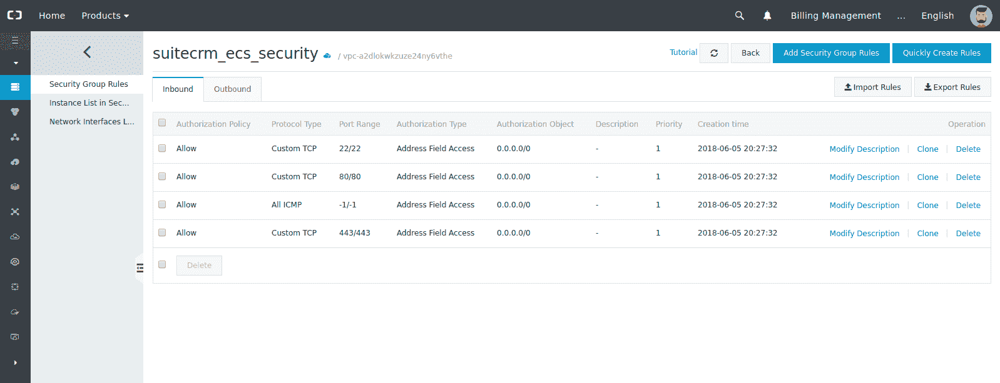
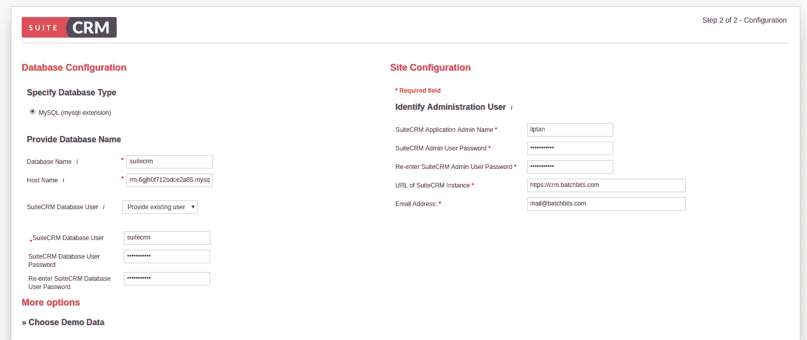
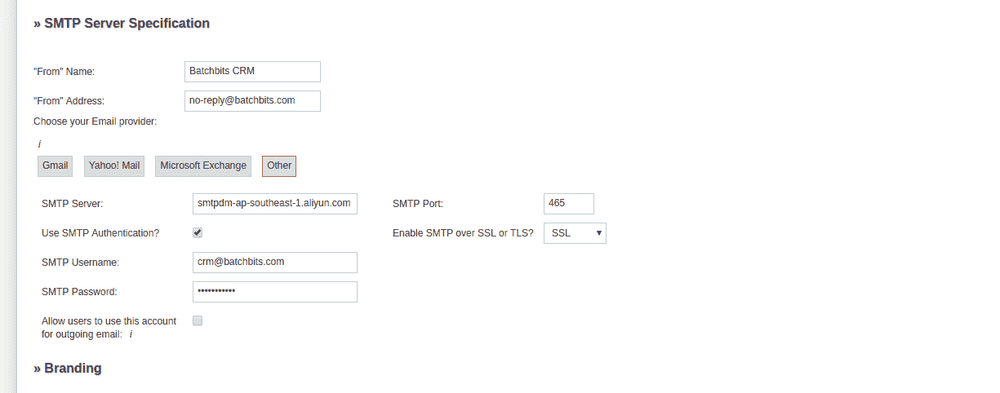

# 我在阿里云上部署 Web 应用的最佳实践

> 原文：<https://www.sitepoint.com/my-best-practices-for-deploying-a-web-application-on-alibaba-cloud/>

*本文原载于[阿里云](https://www.alibabacloud.com/blog/my-best-practices-for-deploying-a-web-application-in-alibaba-cloud_593826)。感谢您对使 SitePoint 成为可能的合作伙伴的支持。*

在这篇文章中，我想分享我在将 web 应用部署到阿里云时使用的最佳实践。我是一名自由职业者，最近我的一个客户让我为他的小公司安装 SuiteCRM。由于我经常为[阿里云](https://int.alibabacloud.com/m/1000019652/)写教程，所以我推荐客户端使用相同的云平台。对于近 100 个用户和至少 30 个并发用户，下面是我推荐的配置。

1.  使用 PHP-FPM 安装 Nginx 的 2 个 vCPUs 和 4GB RAM 的 ECS 实例。
2.  ApsaraDB for RDS instance for MySQL，具有 1GB 内核、1 GB RAM 和 10 GB 存储。
3.  用于发送电子邮件的直邮。

我所遵循的步骤非常简单，几乎所有基于 PHP 的应用程序都可以采用。

如果你是阿里云新手，可以使用[这个链接注册](https://int.alibabacloud.com/m/1000019642/)到阿里云。你将免费获得价值 300 美元的新用户信用，你可以用它来试用不同的阿里云产品。

## 创建 ECS 实例

阿里云几乎记录了你开始使用云平台所需的一切。你可以使用[入门教程](https://int.alibabacloud.com/m/1000019643/)或[技术分享博客](https://int.alibabacloud.com/m/1000019644/)来学习如何开始使用阿里云。您可以在[快速入门指南](https://int.alibabacloud.com/m/1000019645/)中找到最显而易见的步骤，让我带您了解创建 ECS 实例时使用的最佳实践。

登录你的阿里云控制台，进入*弹性计算服务*界面。您可以通过点击*创建实例*按钮轻松创建实例。需要记住的是:

1.  **地区**:由于阿里云在全球各地都有数据中心，所以总是选择地理上离应用用户更近的地区。由于数据中心更靠近用户，由于网络的低延迟，网站的加载速度会非常快。就我而言，我选择了孟买地区，因为该组织的总部就在孟买。
2.  **计费方法**:如果您计划 24/7 连续运行实例，您应该始终选择每月订阅，因为与现收现付相比，它会将价格降低一半以上。例如，由 2 个 vCPUs 和 4GB RAM 组成的共享型 ECS 实例的月订阅成本为 23 美元，但在现购现付模式下，同一实例的每小时订阅成本为 0.103 美元。每月费用变成 0.103 美元*24 美元*30 美元= 74.16 美元。
3.  **实例类型**:根据您的需求选择实例类型。以后可以根据需要增加资源。
4.  **映像**:您可能会在市场映像上找到您希望安装在 ECS 实例上的应用程序，但我们始终建议您自己安装在干净的官方映像中。稍后，如果您的应用程序遇到一些错误，您将知道在哪里查找。
5.  **存储**:ECS 实例释放时，系统磁盘被删除。尽可能使用数据磁盘，因为即使实例被意外删除，您的磁盘仍会保留。

下面是我用的配置。

您可以选择默认创建的 VPC。您可以在其中添加多达 4092 个实例。我为每个 ECS 实例使用不同的安全组，这样我可以单独配置并确保没有未使用的端口被打开。

另一件重要的事情是使用基于密钥的认证，而不是使用密码。如果你已经有了密匙对，你可以把公钥添加到阿里云。如果没有，可以用阿里云创建一个。确保密钥存储在一个非常安全的地方，并且密钥本身由密码加密。

这是创建 ECS 实例时要记住的所有事情。

## 设置 ECS 实例

一旦你创建了你的实例并登录到终端，我建议你在建立你的网站之前考虑一些事情。

1.  不要使用 root 帐户来执行命令，而是在第一次连接时设置一个 sudo 用户，并始终使用 sudo 用户来运行命令。您还可以为 sudo 用户设置基于密钥的身份验证，并完全禁用 root 登录。
2.  始终保持您的基本映像更新。
3.  阿里巴巴基础图像没有任何不需要的额外包。不要安装任何不需要的软件包。
4.  如果在安装过程中出现问题，您可以通过更换系统盘来重置实例。您不需要删除实例并重新创建它。

我创建了 sudo 用户，并在其中配置了基于密钥的 auth。我更新了基本映像并设置了无人值守的系统升级。我按照一个教程安装了 Nginx web server，这是一个轻量级的生产级 web 服务器。更进一步，我用 PHP-FPM 安装了 PHP 7.2。PHP 7.2 是目前为止 PHP 的最新版本。使用最新的软件将确保系统没有任何缺陷，我们也将获得更快的处理速度和更高的稳定性。最后，我从其官网下载了 SuiteCRM 存档，并将文件部署到 Nginx 中。

你可以使用[入门教程](https://int.alibabacloud.com/m/1000019646/)或由技术分享作者撰写的[教程来安装应用程序。](https://int.alibabacloud.com/m/1000019644/)

## 配置安全组规则

在 ECS 实例的安全组中不要打开任何未使用的端口，这一点非常重要。请看一下我为 SuiteCRM 实例使用的安全组规则。

您可以看到，我只允许端口 22、80 和 443 以及所有 ICMP 数据包。端口 22 用于 SSH 连接。端口 80 是不安全的 HTTP 端口，在我的例子中，它只是重定向到 HTTPS 上的端口 443。ICMP 数据包用于 ping 主机，以检查它是否处于活动状态。如果您也想丢弃 ICMP 数据包，这完全没问题——您只是不能 ping 您的实例。

## 创建 RDS 实例

在创建 RDS 实例之前，要问的第一个问题是我们到底为什么需要它。我们可以在 ECS 实例本身上安装任何开源数据库服务器，比如 MySQL、MariaDB、PostgreSQL 或 MongoDB 服务器。

问题的答案是 [ApsaraDB for RDS](https://int.alibabacloud.com/m/1000019647/) 针对速度和安全性进行了优化。默认情况下，我们创建的实例只能由白名单中的实例访问。

让我们看看在创建 ECS 实例时需要记住的事情。

1.  **区域:**始终为数据库实例和 ECS 实例选择相同的区域。此外，确保它们都在同一个 VPC 中。这将使您能够利用同一网络中主机之间的免费内部网数据传输。另一个优点是，您只需要将 ECS 实例的私有 IP 地址列入白名单。这在很大程度上增加了数据库的安全性。
2.  **计费:**还是那句话，包月的费用比现收现付的方式少。根据自己的需求选择。
3.  **容量:**您可以从低端配置开始，例如 1 个内核、1 GB 实例和 5 GB 存储。以后你可以增加资源。
4.  **帐户:**除非需要，否则不要为 MySQL 5.6 实例创建主帐户。您可以为每个数据库创建一个数据库和一个数据库用户。

下面是我用于 SuiteCRM 的 RDS 配置。

一旦 MySQL RDS 实例被激活，我就从实例的 *Security* 选项卡将 ECS 实例加入白名单。一旦我将 IP 地址加入白名单，我就获得了 RDS 实例的主机名和端口号，这是 MySQL 默认端口“3306”。我创建了一个名为“suitecrm”的数据库和一个名为“suitecrm”的数据库用户，并为用户提供了读/写访问权限。

## 使用 HTTPS

随着互联网的发展，越来越多的网站每天都在增加。当 Let ' s Encrypt certificate authority 开始免费提供 SSL 证书时，在每个网站上使用 SSL 成为了一种趋势。为了安全起见，在 web 应用程序中使用 SSL 非常重要。如果交换的数据是未加密的，窃听网络的人可能会提取机密信息。

阿里云也提供 [SSL 证书](https://int.alibabacloud.com/m/1000019648/)，但是在我看来，还是挺贵的。然而，昂贵的东西会带来额外的保证。阿里云提供的 SSL 证书适合企业用户。

在 SuiteCRM 部署中，我还使用 Let's Encrypt 的免费 SSL 来保护 SuiteCRM web 应用程序。对于由 Certbot 生成的证书，Certbot 是加密 CA 的一个客户端应用程序，域需要指向服务器。

阿里云以非常合理的价格提供[域名](https://int.alibabacloud.com/m/1000019649/)，并提供免费的 whois 保护。就我而言，我的客户已经在别处购买了域名。我创建了一个子域，并将该域指向 ECS 实例。我安装了 Certbot，可以轻松地生成证书。永远不要忘记设置 cron 作业来自动更新证书，因为证书每三个月到期一次。

## 设置直邮

应该避免自己设置电子邮件服务器，因为创建企业级 web 服务器需要专业知识、时间和维护成本非常高。轻微的配置错误会导致电子邮件直接进入垃圾邮件文件夹。

阿里云的[直邮服务](https://int.alibabacloud.com/m/1000019650/)提供了一种使用 SMTP 从应用程序发送电子邮件的更便宜的方式。每天前 200 封邮件是免费的。以我的情况，每天 200 封邮件就够了，超过免费额度的邮件也很便宜。我在直邮中添加了一个新的电子邮件子域。添加域名后，我被要求更新 DNS。我按照指示做了，由于传播需要时间，DNS 需要一些时间来验证。完成后，我添加了发件人地址，并准备好了应用程序使用的 SMTP 服务器。

## 基于 Web 的安装

最后，我做好了一切准备。SuiteCRM 应用程序托管在 ECS 上，数据库服务器托管在用于 RDS 的 ApsaraDB 上。我可以很容易地通过基于网络的安装来安装软件。

下面是我在基于 web 安装 SuiteCRM 期间为数据库服务器提供的配置。

类似地，我填写了所有必需的信息，并提供了 SMTP 服务器的详细信息。

最后，我的应用成功部署在阿里云上。此外，我建议客户端使用 [ApsaraDB for Memcache](https://int.alibabacloud.com/m/1000019651/) 来存储 SuiteCRM 的会话缓存，并使用 [WAF](https://int.alibabacloud.com/m/1000019653/) 来保护应用程序免受外来威胁。然而，客户不想实施这些建议，因为他们会增加每月的账单。但是，客户非常高兴看到应用程序在阿里云平台上的表现。

我经常在阿里云技术分享平台上写技术博客。去下面的[链接](https://int.alibabacloud.com/m/1000019654/)找我写的教程。我还将编写详细的步骤和命令指南，以便在阿里云技术共享平台的 Ubuntu 16.04 上安装 SuiteCRM。

## 分享这篇文章