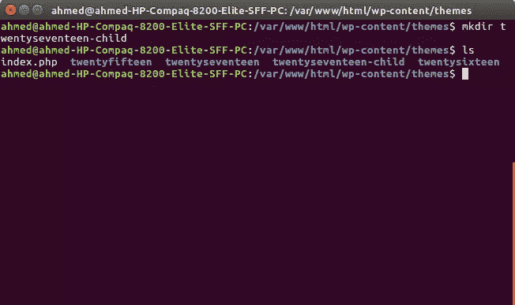
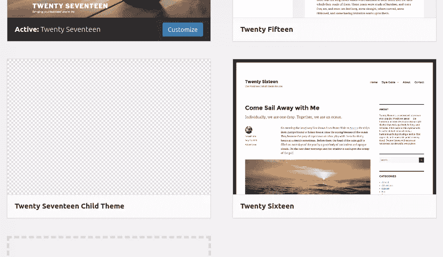
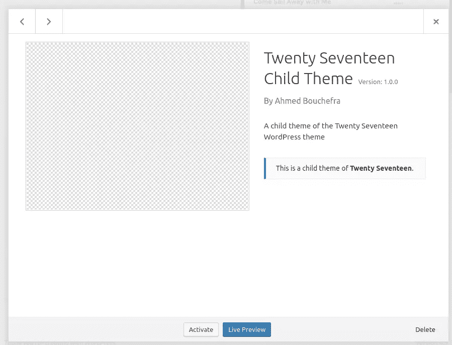
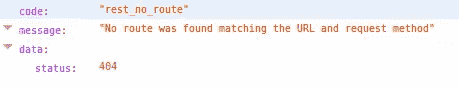
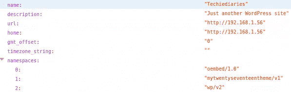
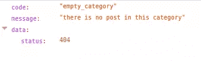
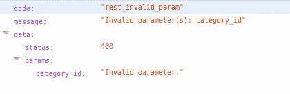
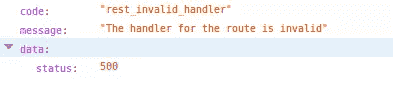
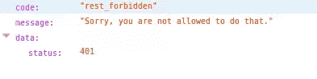

# 为 WordPress REST API 创建自定义端点

> 原文：<https://www.sitepoint.com/creating-custom-endpoints-for-the-wordpress-rest-api/>

这个 WordPress REST API 教程将带你创建一个定制的 [WP-API](http://v2.wp-api.org/) 端点。我们将首先创建默认*“Twenty seven”*主题的子主题，这将允许我们向主题添加功能，然后继续注册我们的自定义 API 端点。

WordPress REST API 提供给你的不仅仅是一组内置的路线。您还可以使用用于创建默认路由的相同 API 来创建定制路由和端点(例如，`register_rest_route()`函数和`WP_Rest_Controller`类等)。).有了 WP-API，你将有可能将 WordPress 与其他生态系统集成，这使得 WordPress 成为一个强大的现代应用开发平台。

您可以在插件或主题中创建和注册自定义端点。

## 创建子主题

在你的 WordPress 安装文件夹中，为你的子主题创建一个文件夹。姑且称之为`twentyseventeen-child`:

```
cd /var/www/html/wp-content/themes
mkdir twentyseventeen-child 
```



接下来创建一个`style.css`文件:

```
touch style.css 
```

并添加以下标题信息:

```
/*
 Theme Name:  Twenty Seventeen Child Theme
 description: A child theme of the Twenty Seventeen WordPress theme
 Author:       Ahmed Bouchefra
 Template:     twentyseventeen
 Version:      1.0.0
*/ 
```

**模板**字段指的是父主题的文件夹名称。

在 WordPress 管理器中进入*外观- >主题*，选择你的孩子主题:



接下来，点击*激活*按钮激活您的儿童主题:



在主题文件夹中，添加一个`functions.php`文件，初始代码如下:

```
<?php
// Add code here. 
```

## 创建自定义 WP-API 端点

我们希望创建一个新的路径，允许我们通过类别 ID 检索最近的帖子，格式如下:

```
http://localhost/wp-json/mytwentyseventeentheme/v1/latest-posts/<CATEGORY_ID> 
```

此时，如果我们在浏览器中访问上述 URL，我们将得到 404 错误，并显示消息*“没有找到与 URL 和请求方法匹配的路由”*:



这是因为我们实际上没有这条路线。让我们改变这一切！

在主题的`functions.php`文件中，添加以下代码:

```
add_action('rest_api_init', function () {
  register_rest_route( 'mytwentyseventeentheme/v1', 'latest-posts/(?P<category_id>\d+)',array(
                'methods'  => 'GET',
                'callback' => 'get_latest_posts_by_category'
      ));
}); 
```

我们使用带有以下参数的`register_rest_route()`:

*   一个名称空间，`mytwentyseventeentheme/v1`
*   带有正则表达式的资源路径，用于捕获类别 ID，`latest-posts/(?P<category_id>\d+)`
*   一个选项数组，我们在其中指定 GET 方法和一个处理请求的`get_latest_posts_by_category()`回调函数。

一个名称空间允许两个插件或主题使用相同的路由路径而不发生冲突，并且客户端可以通过简单地使用`/wp-json/wp/v2` API 并检查*名称空间*字段来检测对您的自定义 API 的支持。



您可以从截图中看到，我们用于自定义路由的`mytwentyseventeentheme/v1`名称空间被添加到了*名称空间*字段中(这个截图是在我们完全实现了自定义端点之后拍摄的；请在下面继续)。

注意`?P<category_id>\d+`部分。这将使我们能够从当前请求中检索类别 ID。它只是一个正则表达式，所以你可以使用常规正则表达式逻辑来创建任何模式。

### 实现回调函数

此时，如果我们访问之前的 URL，WordPress 会识别出路径，因为我们已经定义了它。但是我们仍然得到一个 *500* 错误和*“该路线的处理程序无效”*消息。


在注册了自定义路由并将`get_latest_posts_by_category()`函数指定为处理 GET 请求所调用的回调函数之后，让我们实际实现它:

```
function get_latest_posts_by_category($request) {

    $args = array(
            'category' => $request['category_id']
    );

    $posts = get_posts($args);
    if (empty($posts)) {
    return new WP_Error( 'empty_category', 'there is no post in this category', array('status' => 404) );

    }

    $response = new WP_REST_Response($posts);
    $response->set_status(200);

    return $response;
} 
```

我们首先通过直接访问从`$request`参数中检索`category_id`参数。接下来我们创建一个`$args`数组，将`category`键设置为从路线中提取的`category_id`的值。

然后我们调用`get_posts()`方法来查询具有指定类别 ID 的文章。如果我们得到一个空的 posts 数组，我们将返回一个由一个`empy_category`代码、`there is no post in this category`消息和 404 状态代码组成的错误消息——所有这些都被传递给 [`WP_Error`](https://codex.wordpress.org/Class_Reference/WP_Error) 类的构造函数。

如果我们有一个空类别，这是我们得到的屏幕截图:



我们最后创建一个 [`WP_REST_Response`](https://developer.wordpress.org/reference/classes/wp_rest_response/) 类的新实例；我们在`$posts`数组中传递；我们设置 200 状态码；我们返回其余的响应。我们也可以直接返回`$posts`数组，它会自动转换成 JSON。

`WP_Error`和`WP_REST_Response`类用于确保端点返回有效的 JSON 响应。

现在，如果我们返回浏览器，访问以下 URL:

```
http://<YOUR_SITE_DOMAIN>/wp-json/mytwentyseventeentheme/v1/latest-posts/1 
```

…我们要么得到一个空数组，要么得到属于 ID *1* 类别的帖子。

除了主回调之外，您还可以提供清理和验证回调。

您可以像使用`callback`选项一样，使用`args`选项将每条路线的参数定义为一个数组。在数组中，可以添加多个参数。键是参数的名称，值是该参数的选项数组，例如`sanitize_callback`或`validate_callback`。

*   `validate_callback`是验证参数的回调函数。它采用一个函数，该函数将被传递参数的值，如果该值有效，则应该返回 true，否则返回 false。
*   `sanitize_callback`是一个回调函数，用于在将参数值传递给主`callback`函数之前对其进行净化。该值作为参数传递给此函数。

### 净化和验证端点参数

您可以使用`validate_callback()`函数验证传递给端点的参数——在我们的例子中是类别 ID:

```
'args' => [
  'category_id' => array(
      'validate_callback' => function($value, $request, $param) {
              return $value >= 6;
      })
] 
```

参数是传递给回调的第一个参数。我们使用`$value >= 6`表达式来检查传递的类别 ID 是否大于或等于 6。如果我们传递一个小于 6 的值，将会抛出一个*无效参数:category_id* 错误。



清理允许您清理参数。为了净化数据，您需要以如下方式使用`sanitize_callback()`功能:

```
'args' => [
    'category_id' => array(
      'sanitize_callback' => function($value, $request, $param) {
              if($value < 6){
         return 6;
    };
      })
], 
```

如果类别 ID 小于 6，我们简单地返回 6。这样，我们可以确保只有当客户端传递了一个 API 不支持的值时，我们才能得到一个可接受的值事件。这个例子有点做作，因为我们实际上不需要限制类别 ID 大于或等于 6，只是为了演示两个回调函数。

验证回调将优先于清理回调。对于我们的例子，如果您使用两个回调，并且您为类别 id 提交了一个无效值(`<6`)，您将得到*无效参数:category_id* 错误，这将不会给`sanitize_callback()`被触发和清理数据的机会。

请注意，您可能不需要添加任何验证或清理，因为您在路由中使用的 regex 模式就足够了。例如，在我们的例子中，`?P<category_id>\d+`定义了一个只接受正数的 URL。任何其他输入都将抛出*“该路线的处理程序无效”*错误。



### 限制对端点的访问

您可以使用`permission_callback()`函数来限制对端点的访问，该函数在调用主处理程序回调之前检查用户是否具有执行该操作所需的权限。这使您能够告诉客户端他们能够在特定的 URL 上做什么操作，而不需要首先尝试请求。

`permission_callback()`函数应该返回一个 true 或 false 值或者一个`WP_Error`类的实例。

您只需将`permission_callback`传递给`register_rest_route()`函数，这使您能够添加控制端点访问的权限。例如:

```
add_action('rest_api_init', function () {

  register_rest_route( 'mytwentyseventeentheme/v1', 'latest-posts/(?P<category_id>\d+)',array(

      'methods'  => 'GET',
      'callback' => 'get_latest_posts_by_category',
      'permission_callback' => function() {
          return current_user_can('edit_posts');
      }

  ));

}); 
```

权限回调调用`current_user_can()`函数来检查用户是否通过了身份验证，以及是否具有执行该操作所需的能力(`edit_posts`)。所以如果客户端没有通过[认证](https://developer.wordpress.org/rest-api/using-the-rest-api/authentication/)，就会抛出一个错误。

如果你没有权限，你会得到一个`rest_forbidden`错误:



我们也可以只从`permission_callback`函数返回`true`来允许任何人访问而无需任何认证。

## 使用控制器模式

对于复杂的端点，建议使用控制器模式，而不是像我们在前面的例子中看到的那样定义自定义路由。

控制器模式只涉及扩展内置的`WP_REST_Controller`类，它实现了处理 HTTP 请求所需的基本功能，并允许您利用内置 WP-API 端点使用的健壮代码和最佳实践

使用控制器模式，您需要使用`register_routes()`方法来注册您的定制路由，并使用`get_items()`、`get_item()`、`create_item()`、`update_item()`和`delete_item()`方法来实现 GET、POST、PUT 和 DELETE 请求。

现在让我们来看一个简单的例子，将前面的例子转换成使用控制器模式。在`functions.php`文件中添加:

```
class Latest_Posts_Controller extends WP_REST_Controller {} 
```

接下来，您需要实现`register_routes()`方法来注册您的路线:

```
class Latest_Posts_Controller extends WP_REST_Controller {
  public function register_routes() {
    $namespace = 'mytwentyseventeentheme/v1';
    $path = 'latest-posts/(?P<category_id>\d+)';

    register_rest_route( $namespace, '/' . $path, [
      array(
        'methods'             => 'GET',
        'callback'            => array( $this, 'get_items' ),
        'permission_callback' => array( $this, 'get_items_permissions_check' )
            ),

        ]);     
    }
} 
```

我们简单地调用内置的`register_rest_route()`方法来为 GET 请求注册一个路由。

您需要覆盖控制器中的`get_items_permissions_check()`和`get_items()`方法:

```
 public function get_items_permissions_check($request) {
    return true;
  } 
```

此方法检查路由所需的权限。我们只需返回 true，让每个人都可以访问该路线。

接下来，我们重写`get_items()`方法:

```
 public function get_items($request) {

    $args = array(
            'category' => $request['category_id']
    );

    $posts = get_posts($args);

    if (empty($posts)) {

            return new WP_Error( 'empty_category', 'there is no post in this category', array( 'status' => 404 ) );
    }
    return new WP_REST_Response($posts, 200);
  } 
```

这个方法与我们之前的`get_latest_posts_by_category()`函数几乎相同。

就是这样！这是我们在示例中需要覆盖的两个方法。在更复杂的场景中，您需要覆盖其他方法来创建一个完全工作的 CRUD 系统——也就是说，`create_item()`、`update_item()`、`delete_item()`和`get_item()`方法。

最后，我们需要创建我们的`Latest_Posts_Controller`类的一个实例，并在一个`rest_api_init`动作钩子中调用它的`register_routes()`方法:

```
add_action('rest_api_init', function () {           
     $latest_posts_controller = new Latest_Posts_Controller();
    $latest_posts_controller->register_routes();
} 
```

在这个简单的例子中，控制器模式可能看起来不是很有用，但是对于更复杂的场景——例如，当您有一个定制的 post 类型，并且您需要提供一个定制的 RESTful API 来读取、创建、更新和删除具有多个路由和端点的项目——您将从 OOP 概念和控制器模式中受益，以便更好地组织您的代码并利用现有的类。

## 结论

在本教程中，我们已经看到了如何为 WP-API 创建自己的定制路径。这将允许你为你的 WordPress 网站创建移动和网络客户端，也可以与你的[自定义文章类型](https://www.sitepoint.com/definitive-guide-to-wordpress-custom-post-types/)交互，而不仅仅是内置的 WordPress 类型(如文章和类别等)。).

## 分享这篇文章