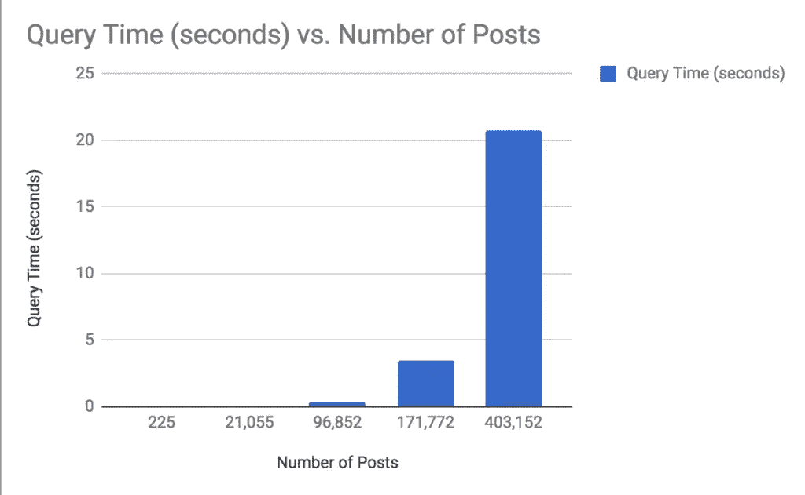
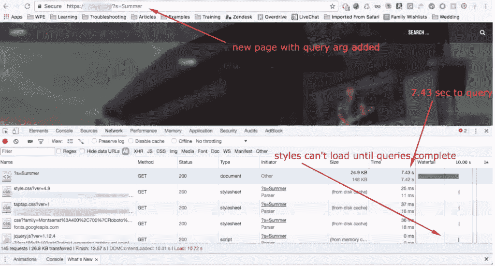
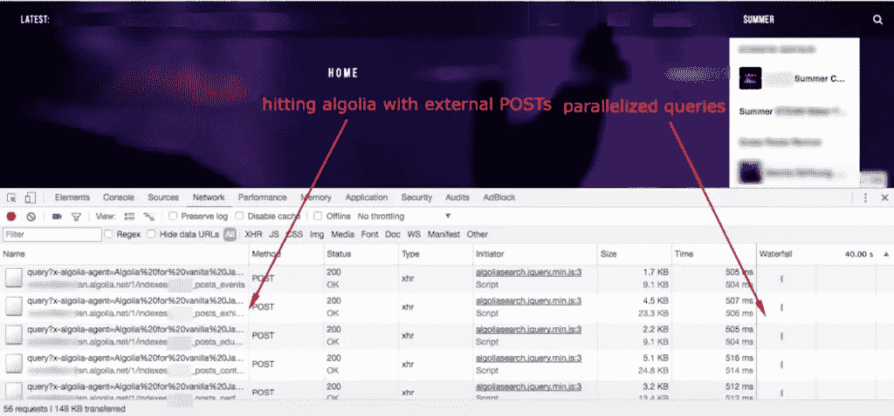

# 改进原生 WordPress 搜索

> 原文：<https://www.sitepoint.com/improving-native-wordpress-search/>

*这篇关于 WordPress search 的文章是由扭矩杂志原创的[，经允许在此转载。](https://torquemag.io/2018/04/improving-native-wordpress-search/)*

如果你曾经在拥有大量帖子和页面的 WordPress 网站上工作过，你可能已经注意到了 WordPress 搜索的一些问题:它的表现不好。在这篇文章中，我们深入探讨了为什么默认的 WordPress 搜索没有伸缩性，以及一些改进的方法。

## WordPress 如何搜索

默认情况下，原生的 WordPress 搜索在你的数据库上执行一个类似如下的查询:

让我们稍微分解一下这个查询。

*   首先，我们在`wp_posts`表上使用`SQL_CALC_FOUND_ROWS`。也就是说，如果没有限制(稍后出现)，[下面的查询会出现多少个结果](https://dev.mysql.com/doc/refman/5.7/en/information-functions.html)？
*   然后我们在`post_title`、`post_excerpt`和`post_content`列中搜索搜索词(在这个例子中，我搜索了“tech”)。
*   我们确保返回的内容是帖子、页面或附件(媒体)。
*   我们检查以确保状态是“公开的”，而不是删除或私人的(如果你是一个登录用户，它也会只搜索你自己的私人帖子)。
*   我们通过匹配标题(降序)或发布日期(降序)对结果进行排序。
*   最后，我们将结果限制为 10 个，对其余的结果进行分页。

为了返回搜索结果，WordPress 进行了大量的检查。而且每次迭代`wp_posts`执行每次检查，MySQL 都在处理 wp_posts 中的所有行。当`wp_posts`表中有几十万行时，这个查询会变得非常糟糕。以下是我的几个站点的一些基准:

在有大量帖子的网站上，查询时间超过了 20 秒！对于高流量的网站来说，这不是一个可扩展的搜索选项。

### 问题标识

知道了我们现在对默认搜索行为的了解，指出为什么这对于某些网站来说可能并不理想是很重要的。

*   WordPress 仅在“文章标题”、“文章内容”和“文章摘录”字段中搜索您的搜索词。它也只显示“文章”、“页面”和“附件”文章类型。对于拥有自定义帖子类型、自定义字段或像 WooCommerce 这样添加不同页面/帖子类型的插件的用户来说，这可能会有问题:这些项目不会出现在搜索结果中。
*   WordPress search 使用的查询在超过 100，000 篇文章中表现很差。对于拥有超过 100，000 篇帖子的新闻网站或媒体网站，搜索可能需要几秒钟的时间。
*   如果您的网站收到大量的搜索流量，搜索查询的低性能可能会导致服务器性能问题。

## 改进 WordPress 原生搜索

所以现在我们知道 WordPress 原生搜索对许多网站来说不是一个选项，我们可以探索搜索解决方案。根据我们对上述问题的识别，我们对搜索解决方案的要求包括:

*   搜索工具将搜索所有内容或定制的内容集，不限于默认定义的帖子类型或帖子字段。
*   面对大型数据集时表现良好的搜索工具。
*   在高流量情况下不会导致服务器性能下降的搜索工具。

下面我们将探讨几种解决方案，包括企业级外部服务和 WordPress 插件。

### Algolia 搜索

[Algolia](https://www.algolia.com/product) 是一个企业级搜索解决方案，可以将你的帖子和内容进行异地索引，并将结果返回给你的用户。它的功能集包括模糊搜索、地理位置搜索、多语言支持和同义词搜索。

比较一个有数千个帖子的网站的搜索性能，Algolia 有一些明显的优势。下面是默认 WordPress 搜索的性能:

注意，使用默认的 WordPress 搜索，搜索时间为 7.43 秒。然而，在实施 Algolia 搜索后，结果几乎是即时的:

Algolia 的搜索结果比标准的 WordPress 搜索快 15 倍！这是性能上的巨大进步。更不用说，如果网站支持大量的并发搜索流量，就不会对服务器造成压力。将搜索卸载到专门为搜索优化的外部服务是一个巨大的胜利。

### 弹性搜索

ElasticPress 是一款由 Elastic 开发的产品，它将你的搜索任务卸载到你自己的 Elasticsearch 服务器实例上。这个搜索工具是独一无二的，因为你可以选择在哪里托管你的 Elasticsearch 实例:你的本地桌面，专用服务器，甚至是你的 WordPress 网站所在的服务器。通过 [ElasticPress 插件](https://wordpress.org/plugins/elasticpress/)，你可以很容易地将这个实例连接到你的网站上使用。

ElasticPress + ElasticSearch 是一个成功的组合，提供出色的搜索功能，如:

*   在搜索结果中包含 WooCommerce 产品
*   显示相关帖子，无需昂贵、缓慢的查询
*   选择索引您网站上的全部、部分或仅部分内容
*   用户键入时自动完成搜索建议

因为搜索被卸载到一个为搜索而优化的服务上，所以对有成千上万帖子的网站的性能影响也提高了。

### 亚马逊云搜索

从功能、性能和可扩展性来看，亚马逊的云搜索服务是一个可行的选择。亚马逊使用“现收现付”支付服务，这使得 CloudSearch 成为一种廉价的企业级解决方案。您也可以自定义在设置过程中索引哪些项目，但是该产品的学习曲线很陡。虽然有些像 [Lift](https://wordpress.org/plugins/lift-search/) 已经创建了集成 CloudSearch 的 WordPress 插件，但它们没有被广泛使用或经常更新，并且可能不那么可靠。这意味着你可能会开发自己的 Amazon CloudSearch 插件实现。你可以使用他们的[云搜索开发者指南](https://docs.aws.amazon.com/cloudsearch/latest/developerguide/what-is-cloudsearch.html)开始。

### 雷文西

Relevanssi 是一个 WordPress 插件，它优化了 WordPress 的内部搜索。也就是说，它在你自己的服务器上搜索你自己的数据库，只是结果更好。与默认的 WordPress 搜索相比，这个插件提供了一些主要的好处:

*   模糊搜索(包括部分匹配)
*   按相关性排序，而不是按日期
*   选择结果应该匹配所有单词，还是只匹配其中一个单词
*   搜索所有内容，包括评论、类别、标签和自定义字段
*   摘录显示并突出显示上下文匹配的位置

Relevanssi 不需要改进的一个方面是搜索功能的速度和可伸缩性。这样，对于那些对 WordPress search 产生的结果类型感到失望的用户来说，Relevanssi 是理想的选择。对于寻求搜索性能提升的用户来说并不理想。

### SearchWP

最后但同样重要的是， [SearchWP](https://searchwp.com/) 是 WordPress 的另一个付费搜索解决方案。与 Relevanssi 一样，这个插件扩展了搜索以包含更好的结果，但并没有声称提高了搜索性能。SearchWP 有广泛的配置选项，可以在搜索结果中包含您想要的内容。搜索内容包括:电子商务产品、pdf 和媒体、自定义帖子和字段、类别和标签以及短码输出。除了额外的搜索向量，SearchWP 还提供关键字词干。因此，如果您的最终用户搜索一个相关的关键字，他们将在结果中获得相关关键字的内容。

SearchWP 还在记录搜索和提供搜索流量方面做了更多的工作。这有助于为您的内容策略提供信息，使您的内容更容易找到。

## 选择正确的搜索解决方案

最后，您选择的搜索解决方案将取决于您的预算，以及哪些问题是您的团队最优先考虑的。如果性能提升是你最关心的，Algolia 和 Elasticsearch 显然是赢家。然而，如果你只是想看到更好的搜索结果，Relevanssi 和 SearchWP 是简单而强大的选择。如果你想要一种经济高效的方式，在一个定制的插件中完全定制你的网站搜索方式，亚马逊云搜索可能是正确的解决方案。您可以使用上面的描述来确定您的优先事项，以及满足该需求的适当解决方案。一如既往，确保首先在一个测试或开发环境中测试任何新的集成或插件！这将允许您以不影响用户的方式自由测试新的搜索实现。

## 分享这篇文章