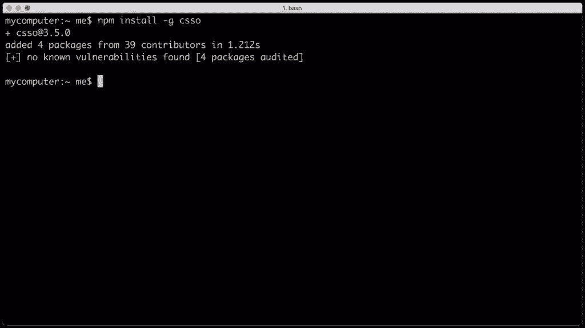

# CSS 调试和优化:用 CSSO 缩小

> 原文：<https://www.sitepoint.com/css-debugging-and-optimization-minification-csso/>

*以下对 CSS 缩小工具的介绍摘自蒂芙尼的新书《CSS 大师，第二版》。*

在你成为 CSS 大师的道路上，你需要知道如何排除故障和优化你的 CSS。如何诊断和修复渲染问题？你如何确保你的 CSS 不会给最终用户带来性能延迟？您如何确保代码质量？

知道使用哪些工具将有助于确保您的前端工作良好。在这篇文章中，我们将讨论 CSS 缩小。

开发者工具可以帮助你找到并修复渲染问题，但是效率呢？我们的文件大小尽可能小了吗？为此，我们需要缩小工具。

在 CSS 的上下文中，缩小仅仅意味着“删除多余的字符”例如，考虑这段代码:

```
h1 {
    font: 16px / 1.5 'Helvetica Neue', arial, sans-serif;
    width: 80%;
    margin: 10px auto 0px;
} 
```

它有 98 个字节长，包括换行符和空格。让我们看一个简化的例子:

```
h1{font:16px/1.5 'Helvetica Neue',arial,sans-serif;width:80%;
    ➥margin:10px auto 0} 
```

现在我们的 CSS 只有 80 字节长，减少了 18%。当然，更少的字节意味着你和你的用户更快的下载时间和数据传输的节省。

在这篇文章中，我们将看看 CSS 优化器，或 CSSO，一个运行在 [Node.js](http://nodejs.org) 上的缩小工具。要安装 CSSO，首先必须安装 Node.js 和 npm。npm 是作为 Node.js 安装过程的一部分安装的，所以您只需要安装一个包。

使用 CSSO 确实需要您熟练使用命令行界面。Linux 和 macOS 用户可以使用终端应用程序(**Applications>Terminal . app**for MAC OS)。如果您使用的是 Windows，请使用命令提示符。进入**开始**或**窗口**菜单，在搜索框中输入`cmd`。

### 安装 csgo

一旦设置好 Node.js 和 npm，就可以安装 CSSO 了。在命令行中，键入:

```
npm install -g csso 
```

标志全局安装 CSSO，这样我们可以从命令行使用它。安装完成后，npm 将在您的终端窗口中打印一条消息。

Installing CSSO with npm using macOS

现在我们准备缩小我们的 CSS。

### 用 CSSO 缩小

要缩小 CSS 文件，运行`csso`命令，将文件名作为参数传递:

```
csso style.css 
```

这将执行基本的压缩。CSSO 去掉不需要的空格，删除多余的分号，并删除 CSS 输入文件中的注释。

一旦完成，CSSO 将打印优化的 CSS 到标准输出，这意味着当前的终端或命令提示符窗口。然而，在大多数情况下，我们希望将输出保存到一个文件中。为此，将第二个参数传递给`csso`—缩小文件的名称。例如，如果我们想将缩小版的`style.css`保存为`style.min.css`，我们可以使用以下代码:

```
csso style.css style.min.css 
```

默认情况下，CSSO 将重新安排你的 CSS 部分。例如，它将合并带有重复选择器的声明块，并移除一些被覆盖的属性。考虑以下 CSS:

```
body {
    margin: 20px 30px;
    padding: 100px;
    margin-left: 0px;
}
h1 {
    font: 200 36px / 1.5 sans-serif;
}
h1 {
    color: #ff6600;
} 
```

在这个代码片段中，`margin-left`覆盖了前面的`margin`声明。我们还重复了`h1`作为连续声明块的选择器。经过优化和缩小，我们最终得到了这个:

```
body{padding:100px;margin:20px 30px 20px 0}h1{font:200 36px/1.5
    ➥ sans-serif;color:#f60} 
```

CSSO 删除了多余的空格、换行符和分号，并将`#ff6600`缩短为`#f60`。CSSO 还将`margin`和`margin-left`属性合并成一个声明(`margin: 20px 30px 20px 0`，并将我们分开的`h1`选择器块合并成一个。

如果你怀疑 CSSO 将如何重写你的 CSS，你可以禁用它的重构功能。只需使用`--restructure-off`或`-off`标志。例如，运行`csso style.css style.min.css -off`会给我们带来以下结果:

```
body{margin:20px 30px;padding:100px;margin-left:0}h1{font:200 36px/
    ➥1.5 sans-serif}h1{color:#f60} 
```

现在我们的 CSS 缩小了，但没有优化。禁用重构将使你的 CSS 文件尽可能的小。除非遇到问题，否则避免禁用重构。

预处理程序和后处理程序(如 Sass、Less 和 PostCSS)提供了作为其工具集一部分的缩小功能。然而，使用 CSSO 可以削减额外的字节从您的文件大小。

*要阅读更多关于 CSS 调试和优化的内容，请查阅蒂芙尼的书， **[CSS 大师，第二版](https://www.sitepoint.com/premium/l/css-master2)** 。*

相关文章:

*   [CSS 调试和优化:代码质量工具](https://www.sitepoint.com/css-debugging-and-optimization-code-quality-tools/)
*   [CSS 调试和优化:基于浏览器的开发工具](https://www.sitepoint.com/css-debugging-and-optimization-browser-based-developer-tools/)

## 分享这篇文章