# CSS 调试和优化:基于浏览器的开发工具

> 原文：<https://www.sitepoint.com/css-debugging-and-optimization-browser-based-developer-tools/>

*以下对 CSS 代码质量工具的介绍摘自蒂芙尼的新书 [CSS Master，第二版](https://www.sitepoint.com/premium/l/css-master2)。*

在你成为 CSS 大师的道路上，你需要知道如何排除故障和优化你的 CSS。如何诊断和修复渲染问题？你如何确保你的 CSS 不会给最终用户带来性能延迟？您如何确保代码质量？

知道使用哪些工具将有助于确保您的前端工作良好。

在本文中，我们将深入探讨 Chrome、Safari、Firefox 和 Microsoft Edge 的基于浏览器的开发工具。

## 基于浏览器的开发工具

大多数桌面浏览器都包含元素检查器功能，您可以使用它来对 CSS 进行故障诊断。右击并从菜单中选择**检测元件**，开始使用该功能。Mac 用户也可以在按下`Ctrl`键的同时点击元素来检查元素。下图显示了你在 Firefox 开发者版中可以看到的内容。

The developer tools of Firefox Developer Edition

在 Firefox、Chrome 和 Safari 中你也可以按`Ctrl` + `Shift` + `I` (Windows/Linux)或者`Cmd` + `Option` + `I` (macOS)打开开发者工具面板。下图显示了 Chrome 开发者工具。

Chrome Developer Tools

在 Microsoft Edge 中，按下`F12`键打开开发者工具，如下图所示。

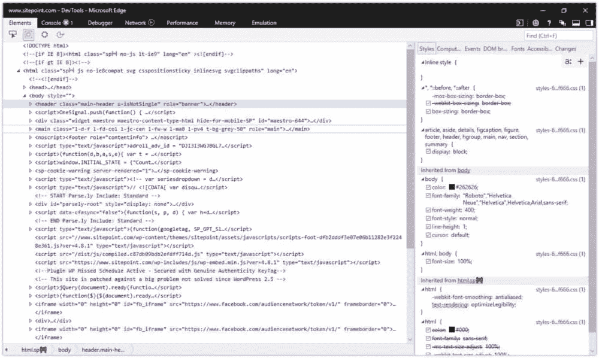Microsoft Edge Developer Tools

您也可以使用应用程序的菜单打开每个浏览器的开发人员工具:

*   微软 Edge: **工具>开发者工具**
*   火狐:**工具>网络开发者**
*   Chrome: **查看>开发者**
*   Safari: **开发>显示网页检查器**

在 Safari 中，您可能需要首先启用**开发**菜单，方法是转到 **Safari >首选项… >高级**，并选中菜单栏中**显示开发菜单旁边的复选框。Safari 开发人员工具的视图如下所示。**

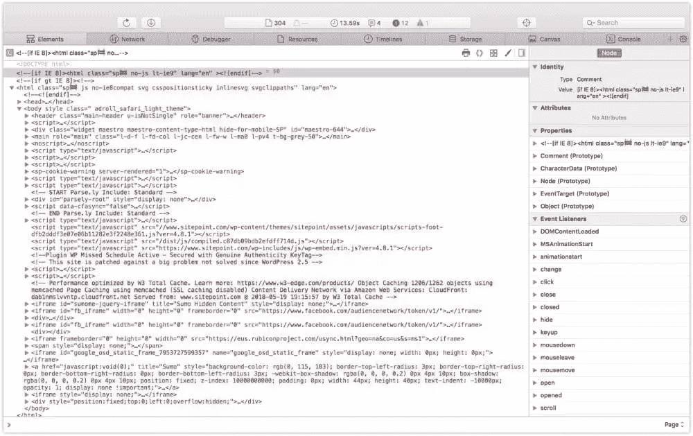Safari 11 developer tools

打开开发人员工具界面后，您可能需要选择正确的面板:

*   微软 Edge: **DOM Explorer**
*   火狐:**检查员**
*   Chrome: **元素**
*   Safari: **元素**

当你在面板的一边看到 HTML，在另一边看到 CSS 规则时，你就知道你在正确的位置。

注意:你将在 HTML 面板中看到的标记是 DOM 的一种表示。它是在浏览器解析完文档后生成的，可能与您的原始标记不同。使用**查看源**显示原始标记，但是要记住，对于 JavaScript 应用程序，可能没有任何标记可以查看。

### 使用“样式”面板

有时一个元素的样式不符合预期。可能是排印错误，或者段落周围的填充比你想要的少。您可以使用 Web 检查器的**样式**面板来确定哪些规则影响了元素。

浏览器在组织**样式**面板的方式上相当一致。内联样式(如果有)通常首先列出。这些是使用 HTML 的`style`属性设置的样式，无论是由 CSS 作者还是通过脚本编程。

内联样式后面是通过作者样式表(您或您的同事编写的样式表)应用的样式规则列表。此列表中的样式按媒体查询和/或文件名分组。

创作的样式规则位于用户代理样式之前。用户代理样式是浏览器的默认样式。它们也对你的网站的外观和感觉有影响。(在 Firefox 中，您可能需要选择**显示浏览器样式**选项来查看用户代理样式。你可以在**工具箱选项**面板中找到这个设置。)

属性和值按选择器分组。每个属性旁边都有一个复选框，允许您打开和关闭特定的规则。点击一个属性或值允许你改变它，所以你可以避免编辑，保存和重新加载。

#### 识别级联和继承问题

检查样式时，您可能会注意到有些属性被删除了。这些属性已被级联规则、冲突规则或更具体的选择器覆盖，如下所述。

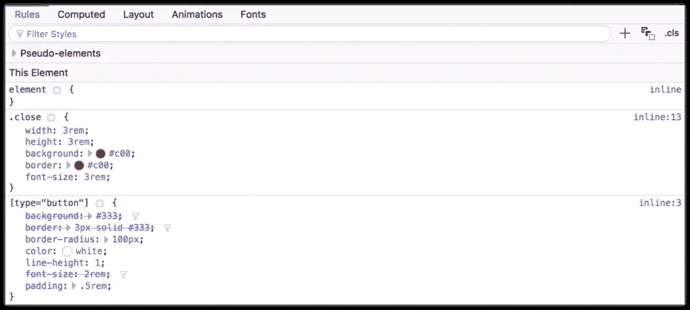Identifying property and value pairs that have been superseded by another declaration

在上图中，显示了`[type=button]`块的`background`、`border`和`font-size`声明，中间有一条线穿过。这些声明被我们 CSS 中的`[type=button]`之后的`.close`块中的声明所覆盖。

#### 发现无效的属性和值

您还可以使用元素检查器来发现无效或不支持的属性和属性值。在基于 Chromium 的浏览器中，无效的 CSS 规则都有一条横线和一个相邻的警告图标，如下所示。

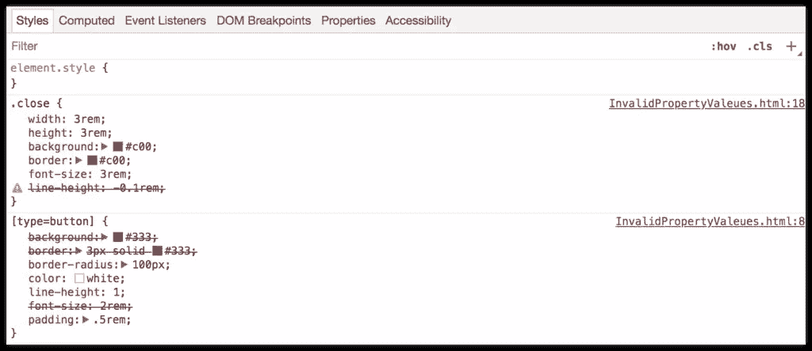Spotting an invalid CSS property value using Chrome

Firefox 还会删除无效或不支持的属性和值。Firefox 开发者版也使用了警告图标，如下所示。标准的 Firefox 显示类似的错误，但不包括警告图标。

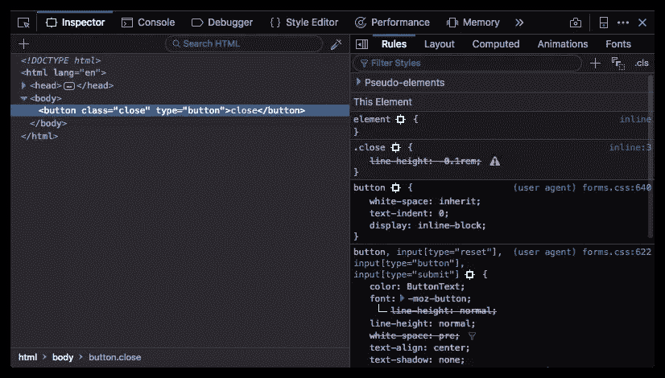How Firefox Developer Edition indicates invalid properties and values

在下面的截图中，Safari 用红线删除了不支持的规则，并用黄色背景和警告图标突出显示它们。

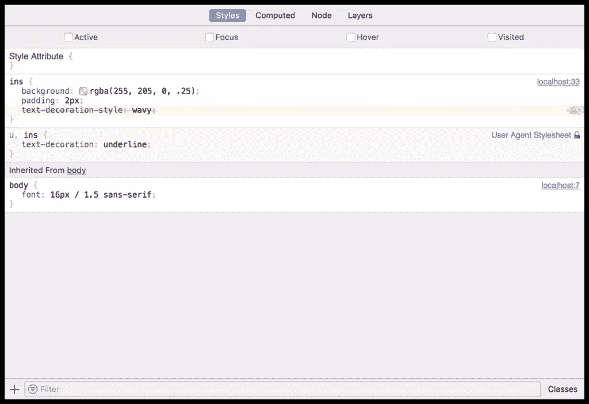An invalid CSS property value in Safari

Microsoft Edge 使用波浪下划线来表示不支持的属性或值。

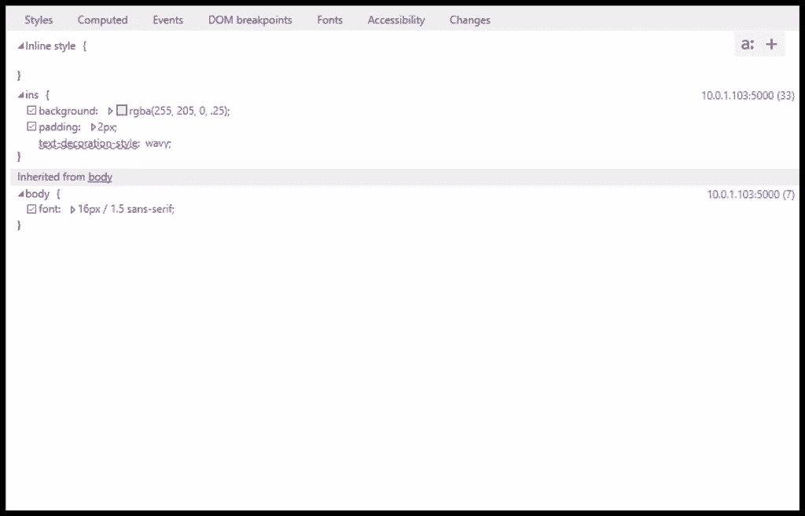An unsupported CSS property value in Microsoft Edge

当涉及到基本的调试和继承冲突时，选择哪个浏览器都无关紧要。但是，在极少数情况下，当您需要诊断特定于浏览器的问题时，请熟悉所有这些问题。

## 调试响应布局

在设备上测试总是最好的。然而，在开发过程中，用桌面浏览器模拟移动设备是很有帮助的。所有主要的桌面浏览器都包含了响应调试模式。

### 铬

Chrome 提供了一个设备工具栏功能，作为其开发者工具包的一部分。要使用它，点击左上角的设备图标(如下图所示)，在**选择一个元素**图标旁边。

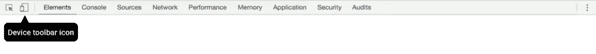Chrome’s Responsive Design Mode icon

设备模式可以让你模仿几种 Android 和 iOS 设备，包括 iPhone 5 和 Galaxy S5 等旧设备。设备模式还包括一个网络节流功能，用于模拟不同的网络速度，以及模拟离线的能力。

### 火狐浏览器

在 Firefox 中，等效模式被称为**响应式设计模式**。它的图标类似于早期的 iPods。你可以在屏幕右侧的开发者工具面板中找到它，如下所示。

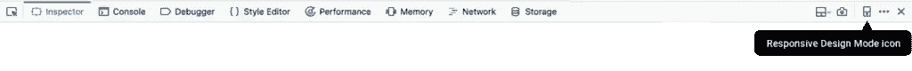Firefox’s Responsive Design Mode icon

在响应模式下，您可以在纵向和横向之间切换，模拟触摸事件，并捕捉屏幕截图。和 Chrome 一样，Firefox 也允许开发者通过节流来模拟慢速连接。

### 微软 Edge

微软 Edge 通过其**模拟**标签，可以模拟 Windows mobile 设备，比如 Surface。在**浏览器档案**菜单中选择 **Windows Phone** ，如下图所示。

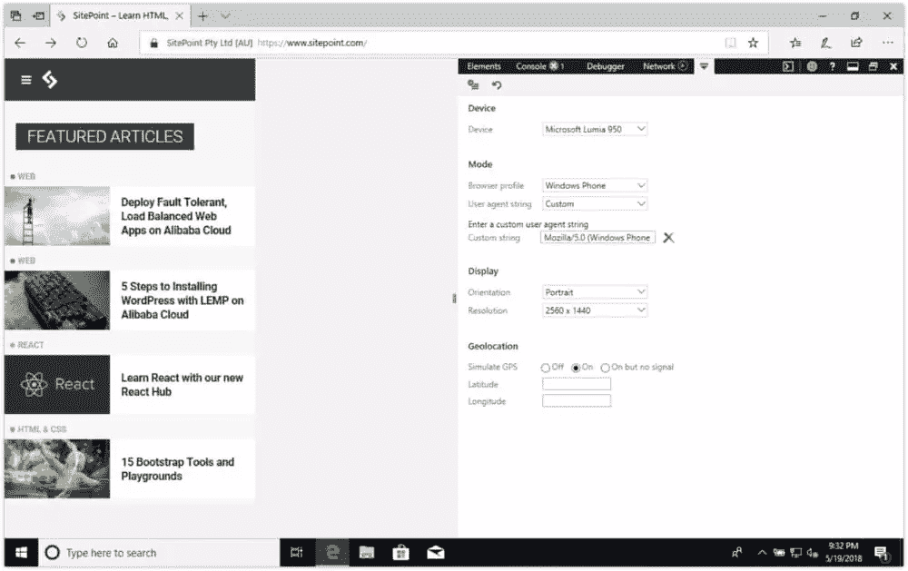SitePoint.com using Microsoft Edge’s device emulation mode

除了模拟方向和分辨率之外，仿真模式还使您能够测试地理定位功能。但是，你不能使用它的仿真模式来模拟网络条件。

### 旅行队

Safari 的响应式设计模式在它的开发者工具包里。它类似于 Firefox 中的模拟模式，但增加了模拟 iOS 设备的能力，如下图所示。

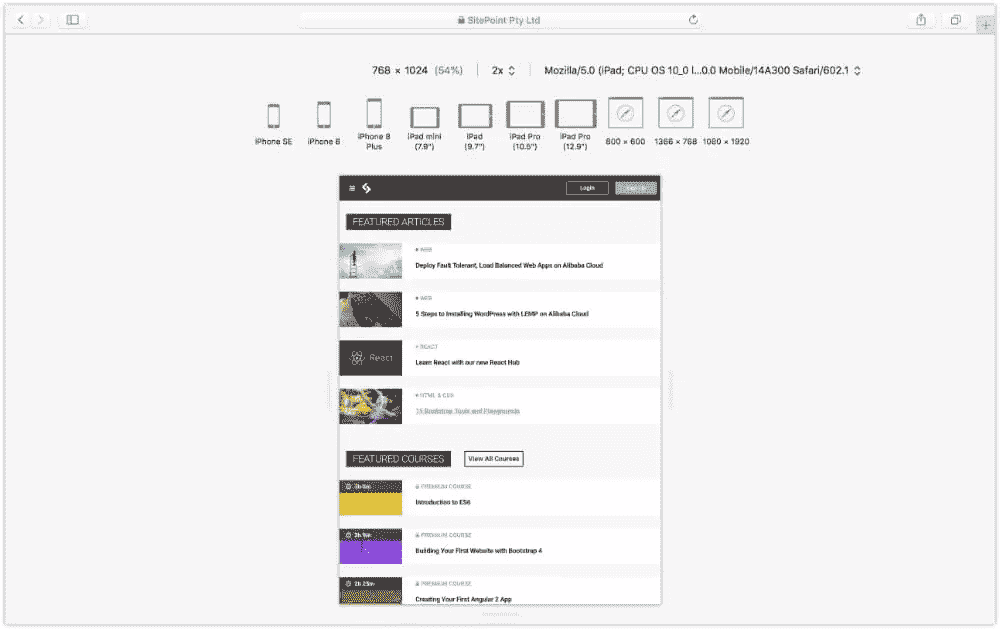SitePoint.com as viewed using Safari’s responsive design mode

要进入 Safari 的响应式设计模式，选择**开发>进入响应式设计模式**，或`Cmd` + `Ctrl` + `R`。

*Tiffany 的书继续讨论了 UI 响应的调试，涵盖了重排和重绘以及其他基于浏览器的性能工具，例如使用每个浏览器的时间轴工具。*

*要阅读更多关于 CSS 调试和优化的内容，请查阅蒂芙尼的书， **[CSS 大师，第二版](https://www.sitepoint.com/premium/l/css-master2)** 。*

相关文章:

*   [CSS 调试和优化:代码质量工具](https://www.sitepoint.com/css-debugging-and-optimization-code-quality-tools/)
*   [CSS 调试和优化:用 CSSO 缩小](https://www.sitepoint.com/css-debugging-and-optimization-minification-csso/)

## 分享这篇文章