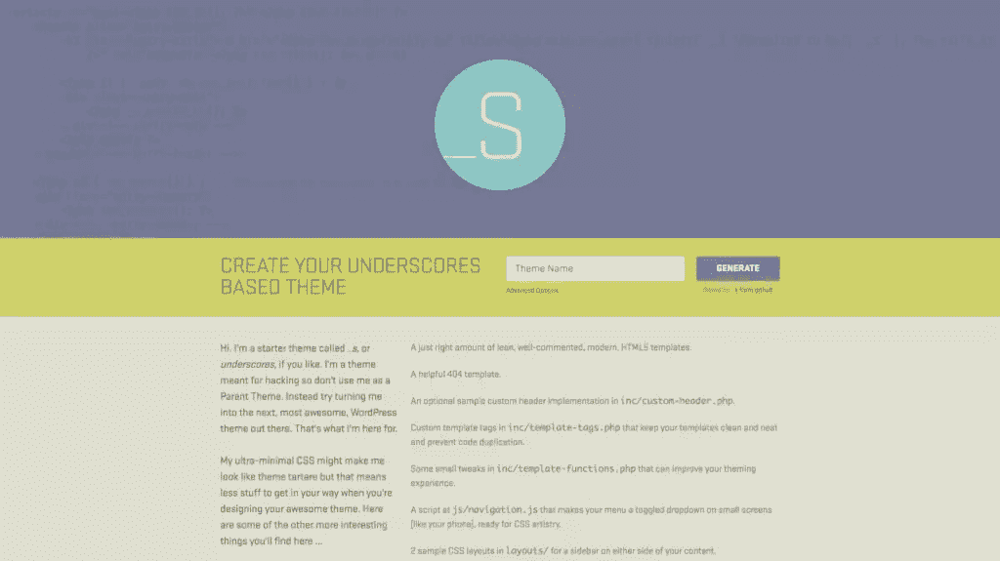
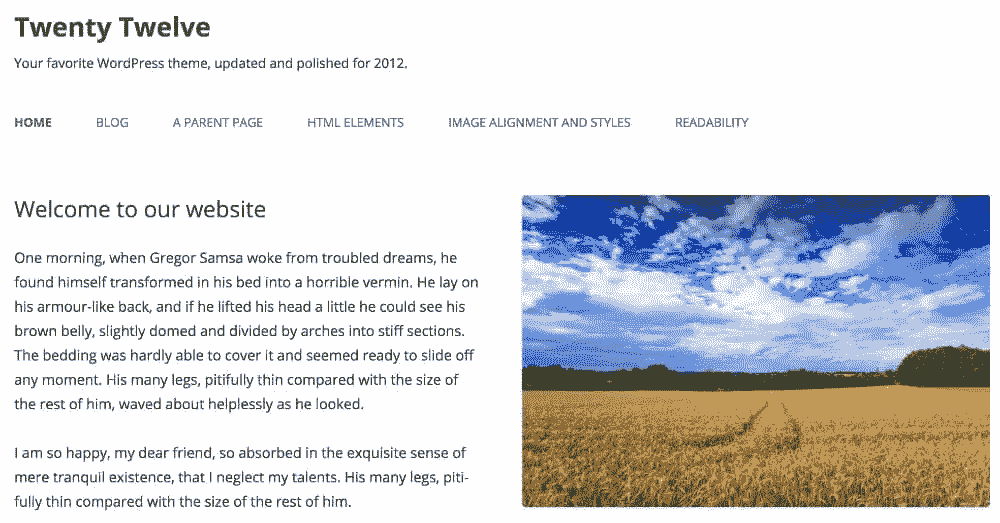
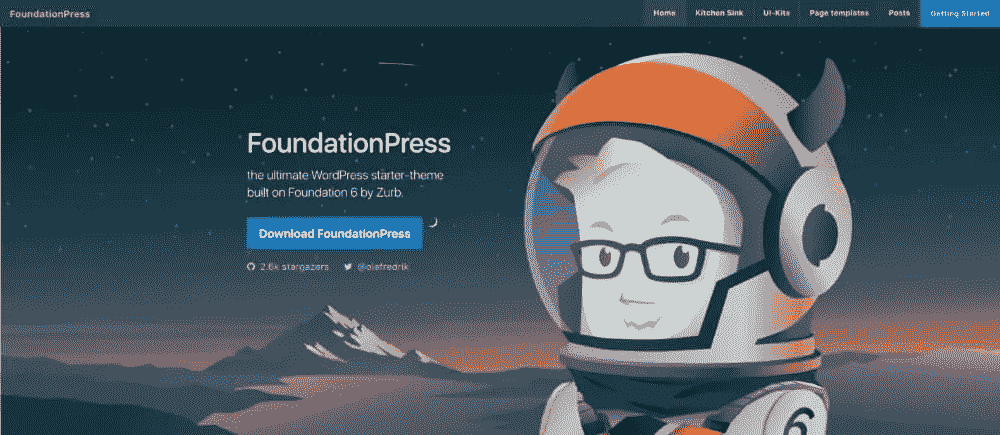
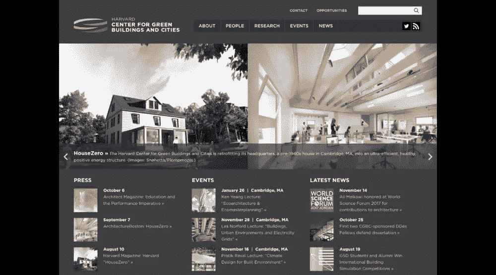
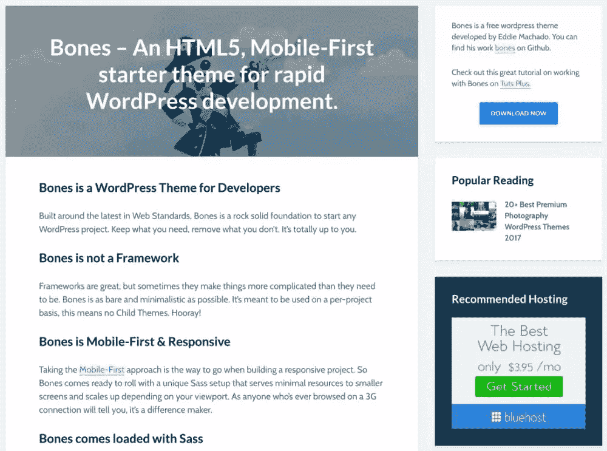
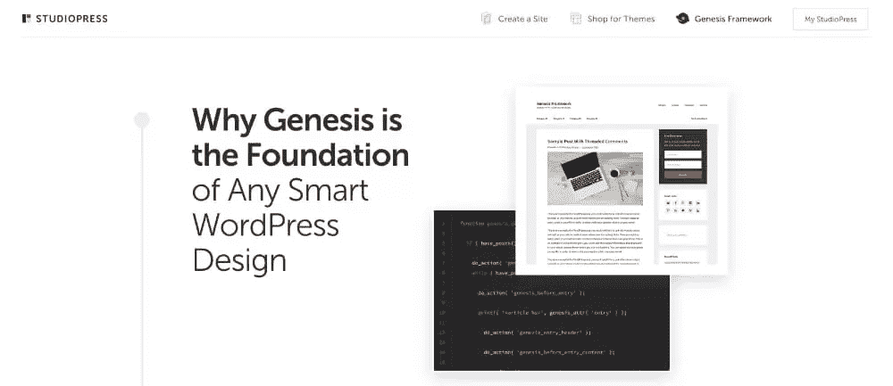
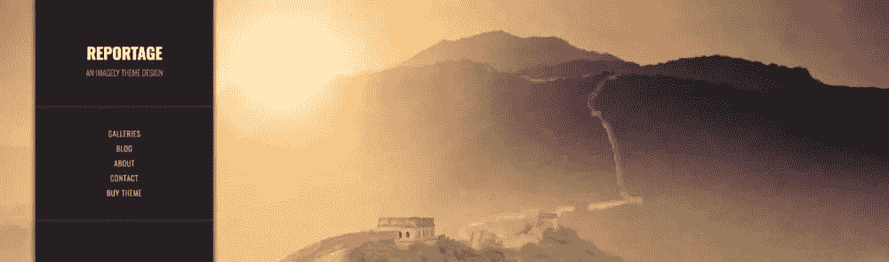
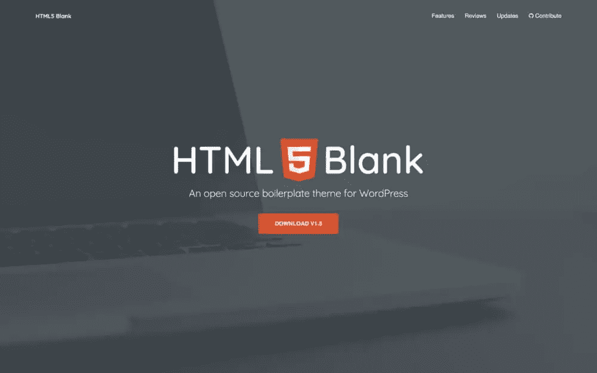

# WordPress Starter 主题的简单指南

> 原文：<https://www.sitepoint.com/wordpress-starter-themes-guide/>

*本文原载[由扭矩杂志](https://torquemag.io/2018/04/wordpress-starter-themes/)发布，经允许在此转载。*

开发主题时完全从零开始自然意味着你可以自由地做任何你想做的事情。这为创造自由打开了足够的空间，但是开始会占用很多时间。你要执行的许多初始任务都是必要的，但也是时间密集型的。

好消息是 WordPress“starter”主题或框架(也称为“空白”主题)可以为你做一些最初的繁重工作。这是因为它们包含了供您使用的基本代码。它们可以帮助您实现基本功能，并让您从一些与手头任务相关的最佳实践开始。

在本文中，我们将讨论什么是起始主题，以及为什么它们如此有用。接下来，我们将浏览一些顶级演员，如[下划线](http://underscores.me)、[基金会出版社](https://foundationpress.olefredrik.com/)和[骨头](https://themble.com/bones/)。让我们开始吧！

## 入门主题介绍

对于门外汉来说，入门主题(也称为“空白”主题)提供了一个基本框架，您可以在此基础上进行开发。然而，与标准的 WordPress 主题不同，它们只包含非常基本的结构代码。这就足够让主题工作，并让您实现任何基本功能。它们本身也不是用来作为父主题的，而是作为父主题的 T2 基础。

初学者主题对于开发来说非常方便。以下是几个原因:

*   你在主题的基本基础编码上有了一个良好的开端。
*   它们提供了您想要遵循的最佳实践的洞察力。
*   您可以灵活地编写自定义主题，同时还能获得高质量的工作基础。

当然，没有一个起始主题是完美的，在决定是否值得使用之前，你需要考虑一些事情。例如，你仍然要遵守另一个开发者的规则，他们可以决定什么功能被认为是基础的。这意味着主题可能包含一些片段，这些片段实际上并不能帮助你创建你所需要的主题。

此外，您可能还需要一些时间来浏览代码，以了解主题开箱即用的功能。当然，默认情况下，开始主题不一定准备好滚动，这有时可能是一个令人困惑的概念。

尽管如此，除非你正在使用一个特定的主题(例如，我们已经看到开发者使用像 [Divi](https://www.elegantthemes.com/gallery/divi/) 和 [Avada](https://avada.theme-fusion.com/) 这样的主题作为他们的基础)，我们认为 starter 主题对于大多数 WordPress 开发者来说是一个优秀的工具。如果你决定实现一个，下一个重要的问题是选择哪个。

## 为你的下一个项目考虑的 5 个热门主题

在 Torque 的另一篇文章中，我们简要地看了一个更大的启动器主题集合。然而，我们现在将选择一些突出的选项，并更仔细地检查它们。以下列表中的解决方案大部分是免费的，但是当涉及到价格时，我们会清楚地提到。

让我们从一个主题开始，这个主题绝对有 WordPress 的认可。

### 1.[下划线](http://underscores.me)

[下划线](http://underscores.me)可以说是最著名的起始主题。它由[automatic](https://automattic.com/)(即 WordPress 的开发者)开发和维护，最初是[工具箱主题](https://themeshaper.com/2010/07/02/toolbox-html5-starter-theme/)的一个分支。下划线的口号是，在开发主题时，它为你提供了[“1000 小时的领先优势】](https://themeshaper.com/2012/02/13/introducing-the-underscores-theme/)。

事实上，WordPress 的每个默认主题(从[2012](http://wordpress.org/themes/twentytwelve/)开始)都使用下划线作为基础:

当然，这里的主要卖点是你可以在一个方便的包中获得 WordPress 的最佳实践。因此，根据 WordPress 的需求创建一个有效的主题是很简单的。然而，除非你有一些熟练的编码技巧，否则也很容易意外地创建另一个“我也是”的 WordPress 主题。

如果你对尝试下划线感兴趣，我们之前发布了[用下划线](https://torquemag.io/2017/08/beginners-guide-to-creating-a-theme-underscores/)创建主题的初学者指南，它完全按照盒子上说的做。你可能还想看看 [WordPress 主题开发指南](https://developer.wordpress.org/themes/getting-started/)，因为这也将向你展示代码是如何在基础层面上构建的。

### 2.[基础按下](https://foundationpress.olefredrik.com/)

接下来， [FoundationPress](https://foundationpress.olefredrik.com/) 是一款基于 [Foundation 6](https://foundation.zurb.com/) 打造的开源入门主题，使用了 [Sass](https://torquemag.io/2014/07/developers-guide-learning-sass-twenty-minutes-less/) 和 [Grunt](https://gruntjs.com/) 。它于 2013 年发布，继续由开发人员社区定期更新，并被称为“世界上最先进的移动优先框架”。

您通常会看到 FoundationPress 用于为特定企业和团体开发自定义主题。GitHub 页面有一个展示区,展示了目前使用 starter 主题的许多网站。这包括[哈佛绿色建筑和城市中心](http://harvardcgbc.org/):

如果您希望为特定业务目的进行开发，这个主题是理想的。另一方面，这意味着你没有太多的主题可以下载来感受 FoundationPress 在“现实世界”中是如何使用的。你最好的办法是看一看[厨房水槽模板](https://foundationpress.olefredrik.com/kitchen-sink)，通读主题的[完整文档](https://github.com/olefredrik/foundationpress)。

### 3.[骨头](https://themble.com/bones/)

Bones 是另一个免费的、移动优先的入门主题，内置了 Sass 集成。然而，这里主要关注的是速度。例如，Bones 自带了一个很轻的标题，这与许多其他 WordPress starter 主题形成了对比。更重要的是，当你开始了解它的内部工作时，它会给你一个“帮助”。这是因为 Bones 预装了自定义仪表板功能和帖子类型，所以您可以看到它们在默认情况下是如何工作的。

虽然易用性是 Bones 的优势，但这也存在一些缺点。鉴于默认情况下包含了大量有用的代码，更有经验的主题用户可能会对不得不去掉所有他们不需要的元素感到恼火。也没有可用的展示，这使得很难确定骨头将如何转化为现实世界的主题。

即便如此，跟随一个像样的教程可以帮助你在瞬间准备好一个工作主题。对于一个新工具来说，立即动手从来都不是一件坏事，Bones 让这变得非常简单。

### 4.[创世纪框架](https://my.studiopress.com/themes/genesis/)

对于我们的倒数第二个主题，我们将打破常规来看看一个“框架”——更具体地说，是[创世纪框架](https://my.studiopress.com/themes/genesis/)。这是我们列表中唯一的高级解决方案(计划从 60 美元开始)，它要求您使用子主题进行开发，而不是直接编辑框架。即便如此，这可能是这个列表中对开发者最友好的主题。另外，它使用 [WordPress 的钩子](https://carriedils.com/genesis-hook-reference/)来帮助你创建你的主题。

创世纪儿童主题的市场正在迅速发展。你会在 StudioPress 网站上找到大量的例子，还有第三方开发者提供他们自己的主题(比如 [Imagely](https://www.imagely.com/wordpress-photography-themes/) ):

毫无疑问，丰富的可用资源和文档是 Genesis 的一大优势。像 Carrie Dils 这样的开发人员对这个框架很有经验，她的 [Lynda 作品集](https://www.lynda.com/Carrie-Dils/965233-1.html)包含了许多 Genesis 特有的课程，值得一试。然而，这是有成本的。此外，开发与框架一起使用的子主题的需求可能会转化为客户可能不希望的额外麻烦。

正如我们提到的，凯莉·狄尔斯是《创世纪》的女王。就我们而言，她关于[学习 WordPress 的 Genesis](https://www.lynda.com/Genesis-tutorials/Up-Running-Genesis-WordPress/170289-2.html)和 [WordPress 和 Genesis:从头构建子主题](https://www.lynda.com/Genesis-tutorials/WordPress-Genesis-Building-Child-Themes-from-Scratch/421805-2.html)的课程可以被认为是用这个框架开发的“福音”。

### 5. [HTML5 空白](http://html5blank.com/)

HTML5 Blank 完善了我们的列表，并且不亚于其他一些选项。这是一个开源主题，类似于 Bones 和 FoundationPress，但它以提供一种将标准 HTML 和 CSS 转换为 WordPress 的简单方法而自豪:

[https://www.youtube.com/embed/bvAKY8sQpRA?feature=oembed](https://www.youtube.com/embed/bvAKY8sQpRA?feature=oembed)

 

不幸的是，就像这个列表中的其他一些入门主题一样，HTML5 Blank 没有展示区。因此，寻找真实世界的成功故事可能很难。然而，这个主题确实遵循了 WordPress 的编码标准， [GitHub profile](https://github.com/html5blank/html5blank) 包含了很多让你在开始开发时可以投入进去的东西。

HTML5 Blank 是这个列表中唯一一个几乎没有第三方文档来说明如何开始使用它的主题。这是一个遗憾，因为它有很多支持，可以成为一个优秀的工具。然而，如果你是主题的初学者，你可能需要到别处去试试。

## 结论

在你的工作流程中使用 WordPress starter 主题可以帮助你在更短的时间内创建一个现成的 WordPress 主题。因此，不管你的专业知识如何，它们都应该是首选的开发工具。

这篇文章探讨了五个最热门的起始主题。让我们快速回顾一下每个问题:

1.  **[强调](http://underscores.me) :** 无论你最初的专业知识如何，Automattic 的产品都是一个很好的选择。
2.  [**FoundationPress**](https://foundationpress.olefredrik.com/) :这是一个手机友好的开源入门主题，在为特定目的创建自定义主题时非常有用。
3.  **:这可以说是列表中最好的初学者主题，因为它提供了大量方便的提示和建议。**
***   [**【创世纪】**](https://my.studiopress.com/themes/genesis/) :这里唯一的高级选项，这个框架有一些 WordPress 大牌的支持。*   **[HTML5 Blank](http://html5blank.com/)** :最后，这是一个基本的入门主题，将帮助把标准的 HTML 翻译成 WordPress 友好的代码。**

 **你对如何使用起始主题有什么问题吗，或者对我们错过的主题有什么建议吗？请在下面的评论区告诉我们！** 

## **分享这篇文章**