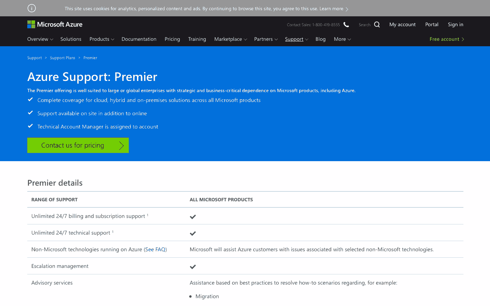

# AWS、Azure 和 Google 云备份解决方案对比

> 原文：<https://www.sitepoint.com/aws-azure-google-cloud-backup-solutions-compared/>

云备份是云存储的一种形式，其中存储数据，然后从不同的分布式和互连的基于云的资源中检索数据。基于云的备份解决方案允许企业和个人通过存储服务提供商将他们的数据安全地存储在互联网上。

可以使用这种基于云的存储解决方案，而不是将数据本地存储在硬盘等物理磁盘上。云备份还允许用户通过安全的客户端登录应用程序远程访问提供商的服务。这可用于通过安全和加密的连接将文件从用户的计算机或数据中心备份到在线存储服务器上。

在本文中，我们将深入探讨云定价的各种特征。我们将主要关注前三大云平台——[谷歌](https://cloud.google.com/)、 [Azure](https://azure.microsoft.com/en-us/) 和 [AWS](https://aws.amazon.com/) 。我们将了解一些因素，如它们的特性和功能、定价、支持和文档等。

## 特性和功能

所有的云供应商都提供大量的功能和备份解决方案。我们来看看前三名提供了什么。

### 微软 Azure

Microsoft Azure backup 可用于备份、保护以及恢复您在 Microsoft 云中的数据。它通过部署基于云的可靠且安全的解决方案，取代了任何现有的内部、本地或异地备份解决方案。

Microsoft Azure 有许多不同的组件，可以下载并部署在适当的服务器或计算机上或云中。无论您想要保护什么，所有备份组件都为用户提供了将数据备份到 Azure 提供的恢复服务存储库的能力。

微软 Azure 的一些关键特性包括:

*   自动存储管理
*   无限制缩放
*   多种存储选项
*   无限数据传输
*   数据加密
*   应用程序一致性备份，以及
*   长期保留

### S3 亚马逊网络服务公司

亚马逊 S3 或简单存储服务旨在让开发人员牢记在心，旨在帮助他们构建云计算工具。

在可用的不同云存储服务中，只有少数几个可以与亚马逊 S3 的全球数据中心区域数量相提并论–14 个。这是因为 AWS S3 共享亚马逊购物平台使用的相同基础设施。

鉴于其数据中心区域遍布全球，AWS S3 允许用户选择一个靠近他们的区域或一个靠近其大部分网络流量来源的区域。这样做的好处是，它可以更快地与云进行数据传输。

AWS S3 的一些主要功能包括:

*   耐用性和可用性
*   灵活性和可扩展性
*   成本效率
*   安全性
*   服从
*   灵活的数据传输
*   最大的合作伙伴生态系统，以及
*   其他备份和恢复资源

### 谷歌云存储

谷歌云存储是一个以企业为中心的公共云存储平台，用户可以在其中存储大型非结构化数据集。组织可以为主要数据或不常需要的数据购买存储。

作为谷歌云平台中的一项服务，谷歌云存储允许实时数据和归档数据的统一对象存储。存储在这里的对象被分组到云中的桶或容器中，并且可以被单独分配到不同的存储类。

用户可以通过网络浏览器或命令行界面访问他们的数据。与 AWS S3 类似，谷歌云存储也让用户可以选择他们喜欢的数据存储的地理位置。

谷歌云存储的一些关键功能包括:

*   跨存储类别的单一 API
*   跨所有存储类别的高可用性
*   能够扩展到千兆字节的数据
*   到达第一个字节的时间，单位为毫秒
*   非常一致的列表，以及
*   专为 99.99%的耐用性而设计

### 你应该选择哪一个？

AWS 是云备份解决方案最受欢迎的选择。它提供在实例启动时分配的临时存储，并在实例终止时销毁。它还提供了相当于硬盘的块存储，也就是说，您可以选择将其附加到任何实例，或者将其保持独立。

此外，AWS 还提供对象存储作为其 S3 服务的一部分，以及 Glacier 的归档服务。

| 互联网服务商 | 中间存储器 | 块存储器 | 对象存储 |
| --- | --- | --- | --- |
| **亚马逊 S3** | 是 | 东偏南(east by south) | S3 |
| **微软 Azure** | 临时存储-D 驱动器 | 页面 Blobs | 阻止 Blobs 和文件 |
| **谷歌云存储** | 是 | 永久磁盘 | 谷歌云存储 |

## 云定价

这三种服务都提供了出色的可扩展性，并使用每月每 GB 成本模型。这使得三者之间的比较变得极其容易。各种服务之间存在一定程度的差异，这主要源于所涉及的不同存储类别的复杂性，以及在一个类别中存储数据与在另一个类别中存储数据会如何影响速率。这是三家服务提供商的定价方面的更多细节。

### 微软 Azure

Microsoft Azure 的存储速率基于您需要的存储量、您的地理位置、您需要访问存储数据的频率以及您选择的数据冗余类型。虽然复杂，Azure 的定价模型允许用户在适当管理的情况下控制成本。

下表说明了位于美国东部的一个数据中心的 blob 存储价格

|  | LRS——酷 | LRS——热 | GRS——酷 | GRS——热 |
| --- | --- | --- | --- | --- |
| **每月前 50 TB** | $0.0152 | $0.0208 | $0.0334 | $0.0458 |
| **接下来每月 450 TB** | $0.0152 | $0.0200 | $0.0334 | $0.0440 |
| **每月超过 500 TB** | $0.0152 | $0.0192 | $0.0334 | $0.0422 |

* LRS—[本地冗余存储](https://docs.microsoft.com/en-us/azure/storage/common/storage-redundancy-lrs)。LRS 允许将数据的多个同步副本存储在一个数据中心。

* * GRS—[地理冗余存储](https://blogs.msdn.microsoft.com/windowsazurestorage/2013/12/11/windows-azure-storage-redundancy-options-and-read-access-geo-redundant-storage/)。GRS 用于在距离第一个数据中心数百英里的另一个数据中心存储第二个同步数据集。好处是 GRS 提供了额外的冗余层，使不同地理位置的用户能够更快地访问。

如果你想降低价格，Azure 平台的第三方供应商可以提供针对某类用户优化的低价备份解决方案。Nimble、HPE 和 NetApp 在这方面很受欢迎。

### 亚马逊 S3

亚马逊 S3 为扩展存储提供了很多与 Azure 相似的灵活性。用户需要为使用的存储付费，无需预付费用或终止费用。

亚马逊 S3 和微软 Azure 最实质性的区别在于，与 Azure 不同，亚马逊 S3 没有多区域存储。但是，S3 确实提供了介于标准存储和归档存储之间的中间层。这被称为“标准-不频繁访问”

下表说明了美国东部(北弗吉尼亚)地区的存储价格:

| 等级 | 标准每千兆字节 | 标准–每千兆字节的不频繁访问 |
| --- | --- | --- |
| **前 50 TB /月** | $0.023 | $0.0125 |
| **下一个 450 TB /月** | $0.022 | $0.0125 |
| **超过 500 TB /月** | $0.021 | $0.0125 |

注意:费用可能因地区而略有不同，无论是国内还是国际。然而，国内成本差异通常在几分之内。

第三方 AWS 备份解决方案提供低价存储卷，您可以将其部署在您选择的地区。您还可以为所有 AWS 资源设置 VPC 网络。AWS 备份的一些受欢迎的供应商包括 [CyberDuck](https://cyberduck.io/) 、 [CloudBerry](https://www.cloudberrylab.com/) 和 [N2WS](https://n2ws.com/product/aws-backup) 。

### 谷歌云

使用谷歌云，用户可以从微软 Azure 和亚马逊 S3 提供的不同存储类别选项的良好组合中受益。这使得谷歌云比其他两个更具可扩展性。谷歌提供的组合包括多区域和区域选项，一个被称为“近线”的中档选项和一个类似于冰川的存档选项，被称为“冷线”。

以下是谷歌云存储收取的费用:

|  | 每 GB 多区域 | 区域每 GB | 每 GB 近线 | 每 Coldline |
| --- | --- | --- | --- | --- |
| **一般定价** | $0.026 | $0.020 | $0.010 | $0.007 |
| **东京定价** | 不适用的 | $0.023 | $0.016 | $0.010 |

这里要记住的一个重要方面是，谷歌云存储采取了类似于微软 Azure 和亚马逊 S3 的方法，因为它取消了按地区可变定价以及按存储的总 GB 数分层定价的选项。

谷歌云存储只提供两种选择——针对东北亚地区的东京特定价格和针对世界其他地区的一般价格。无论用户存储 50GB 还是 1000TB 的数据，他们都要支付相同的费用。

### 你应该选择哪一个？

谈到定价，谷歌云可能是一个更好的选择。尽管这三家服务提供商都提供现收现付的计费模式，但谷歌云和微软 Azure 是按分钟向用户收费的。另一方面，亚马逊 S3 按小时向用户收费。

这一点，加上谷歌云提供了不同存储类别选项的有用组合，使其比亚马逊和 Azure 更具可扩展性，这一事实使我们相信谷歌云在定价方面优于其他两家服务提供商。

## 支持和文档

在这一部分，我们将讨论亚马逊 S3、微软 Azure 和谷歌云提供的不同客户支持服务。正如预期的那样，这三家公司都提供免费的必要支持和针对生产环境和开发人员的付费高级支持。

### 微软 Azure

除了免费的基本支持之外，Azure 还提供付费购买额外三层高级支持的选项。

免费支持为用户提供了一个 24/7 的账单问题帮助热线和在线资源来帮助其他领域。有关三种付费支持级别，请参考下表:

|  | **开发者** | **标准** | **专业指导** |
| --- | --- | --- | --- |
| 每月成本 | $29 | $300 | $1,000 |
| 技术支持 | 营业时间 | 24/7 | 24/7 |
| 关键问题的响应时间 | \< 8 小时 | \< 2 小时 | \< 1 小时 |
| 账户管理 | 不 | 不 | 是 |
| 咨询服务 | 不 | 不 | 是 |

*技术支持还包括运行在 Azure 上的非微软技术。

Azure 还有一个“高级支持”选项。这涵盖了每一个微软产品，响应时间少于 15 分钟，还为用户提供个人帐户管理和咨询服务。

[高级支持](https://azure.microsoft.com/en-gb/support/plans/premier/)的价格只能通过请求报价来获得。

所有支持请求都从票证开始。实时聊天或电话支持不是一个选项。也就是说，鉴于您的问题的性质和严重性，支持请求可能会导致实时对话，从而提供快速解决方案。

### 亚马逊 S3

亚马逊 S3 的免费支持为您提供 24/7 全天候支持，帮助您解决基本的故障诊断和账单相关问题。Amazon 的支持门户也有参考资料，包括文档、白皮书和常见问题论坛。

开发者支持计划的技术支持只能通过电子邮件获得。这将让您与云支持助理保持联系。企业和业务技术支持包括实时聊天和电话支持选项。此外，您将有更有经验的云支持工程师协助您，而不是支持助理。

技术支持的响应时间取决于问题的严重性。一般查询通常有 24 小时的响应时间。

|  | 开发者 | 商业 | 企业 |
| --- | --- | --- | --- |
| 每月成本 | 29 美元起 | 100 美元起 | 起价 15000 美元 |
| 技术支持 | 营业时间 | 24×7 | 24×7 |
| 关键问题的响应时间 | \< 12 小时 | \< 1 小时 | \< 15 分钟 |
| 建筑支持 | 最优方法 | 使用案例 | 磋商 |
| 第三方软件支持 | 不 | 是 | 是 |
| 运营支持 | 不 | 不 | 审查和报告 |
| 健康支持 | 个人健康仪表板 | 个人健康仪表板和健康 API | 个人健康仪表板和健康 API |
| 可信顾问检查 | 四 | 访问所有支票 | 访问所有支票 |

亚马逊 S3 的客户支持通过一个中央支持平台进行管理。用户可以找到当前问题的注释，并创建和监控服务台票证。

### 谷歌云存储

与微软和亚马逊类似，谷歌云存储也提供对账单查询的支持，而技术支持是一项付费服务。

谷歌的教程支持中心是免费的。这里有关于基本常见问题解答、教程以及社区论坛的文档。这里的一个优势是，由于谷歌在开发者中的绝对受欢迎程度，它可以自夸是任何云服务提供商中最活跃的社区基础之一。

谷歌得分高于同行的另一个领域是它建立的声音教程库。此外，不用说，所有这些图书馆都是索引和可搜索的。

|  | **白银** | **黄金** | **铂金** |
| --- | --- | --- | --- |
| 每月成本 | $150 | 起价 400 美元 | 仅通过引用 |
| 技术支持 | 营业时间 | 24/7(仅关键问题) | 24/7 |
| 关键问题的响应时间 | 4 个工作时间 | 1 小时 | 15 分钟 |
| 电话支持 | 不 | 是 | 是 |
| 架构支持 | 最优方法 | 使用案例 | 使用案例 |
| 磋商 | 不 | 是 | 是 |
| 技术客户管理 | 不 | 不 | 是 |

有趣的是，黄金和白金支持以最低成本收费。基于使用的费率是用户在谷歌云存储上花费的成本的百分比，只有当该数字超过最低支持价格时才收费。根据用户花费的数量，这可能在 3%到 9%之间变化。

### 你应该选择哪一个？

在我们看来，谷歌云存储再次赢得了这一部分。这一选择的决定因素在于谷歌在文档和图书馆方面积累的大量资源和参考资料。除此之外，他们还有一个非常活跃的社区论坛。通常情况下，这些会导致快速和准确的解决方案，这是每个用户所希望的。

## 摘要

虽然您可能很难做出最佳云备份服务提供商的选择，但希望我们已经为您提供了帮助您做出平衡决策的知识。

在选择这三个提供商之一之前的实际研究主要取决于您的需求以及其中一个提供商如何能够最好地满足这些需求。

然而，有一点是肯定的——随着云计算的成熟，这个领域的竞争将会越来越激烈，价格应该会下降。因此，您可以放心地获得最大的回报。

## 分享这篇文章