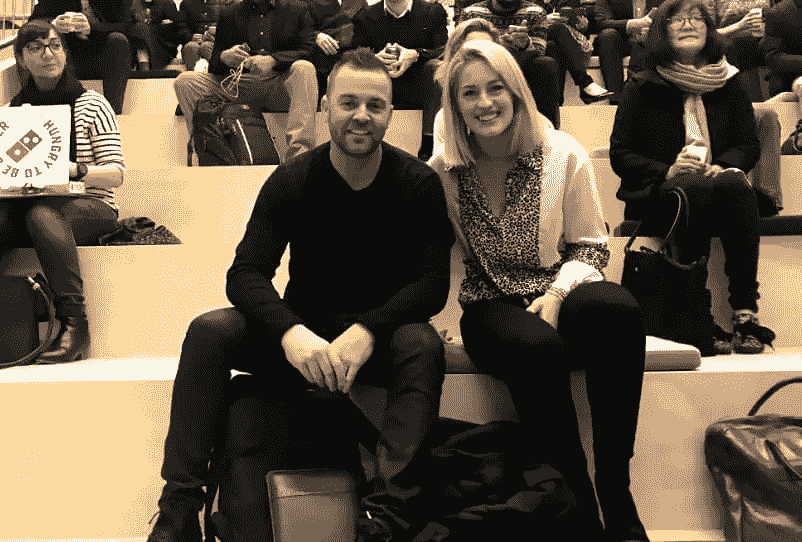

# 企业家如何在逆境中保持乐观

> 原文：<https://www.sitepoint.com/entrepreneurs-positive-adversity/>

当鸢·斯科伦抵达洛杉矶时，他有一个伟大的想法，一种创业的心态，而全球金融危机正等待着他的到来。幸运的是，他不相信消极思维。

鸢·斯科伦解释道:

> 我有这种牢不可破的精神，我无法解释我从哪里得到它，但它就在我内心深处。当像 GFC 这样的东西出现时，我只是觉得除了继续前进别无选择。对我来说，杯子总是半满的，我从来没有悲观失望过。

斯科夫龙把他的积极态度归因于许多事情，最重要的是他父亲在他 16 岁时去世。

> 这是一次改变人生的经历。我妈妈没有把注意力放在失去上，她让我们专注于我们所拥有的，所以也许这让我觉得当事情变糟时，我可以摆脱它。我就是这样的人。

这种坚持不懈的积极态度伴随着难以置信的成功雄心，这在 2003 年 Skovron 首次将 [Pet Loo](https://www.mypetwarehouse.com.au/pet-loo) 引入澳大利亚市场时派上了用场。它很快就下架了，所以斯考夫龙和他的妻子决定扩大他们的视野，带着彼得·卢去美国。

当被问及他在美国创业、发展和销售企业的经历时，他笑了。

> 太可怕了。我们晚餐吃了 4 年麦片！我没有钱，一切都很拥挤和艰难，但一旦有人给我一个机会，彼得·卢就变得非常受欢迎。谈到生意的最终成功，没有什么诀窍，全靠努力工作。这听起来很疯狂，但我确实很快了解到美国有多大。随着业务的起飞，我们很快开始向许多不同的州和城市发货，我认为我们走得太快了。如果再来一次，我会从一个城市开始，而不是整个国家。这给一切都带来了压力。然而，事后看来，这很棒，我确实学到了很多关于我的极限的东西。话说回来，当启动创意立方体时，我忽略了我所学到的一切！

Hannah Vasicek & Tobi Skovron

虽然斯科夫龙在美国市场的经历是艰苦的，但毫无疑问，这是令人难以置信的成功，并催生了他的下一个创业灵感，[创意立方体](https://creativecubes.co/)。

他解释了他在美国的时光是如何影响他搬回澳大利亚的。

> 当我们在洛杉矶时，我在家里的空房间里做所有的事情，不幸的是，在同一个 200 米的公寓里生活、工作和玩耍开始对我和我妻子的关系造成压力。我知道我必须开始划分我的生活。我最初在洛杉矶租了一个旧车库，但发现我花了很多时间管理电费和卫生纸之类的东西，而不是我的业务，所以我决定外包我的办公室。我搬进了一个旧的合作空间，这是旧的谷歌总部，加入后，我的业务蓬勃发展。我把 Pet Loo 的成功归功于和其他“饥饿”的人在一起，因为我从倾听他们的机会和挣扎中学到了很多，他们也倾听我的意见，给我建议。我也真的爱上了合作工作，当 Pet Loo 被世界上最大的宠物公司 PetSafe 收购时，退出给了我足够的现金，让我在财务上自由了。我联系了我的商业伙伴，请他来洛杉矶看看联合办公空间，看看他是否认为我们可以在澳大利亚做类似的事情。他做到了，创意立方体诞生了。

推动创意立方体的信息是包容和社区，当然还有积极性。

> 当我被问及为什么社区很重要时，答案很简单。小时候，我的父母喜欢为我做事情，他们的理由是他们想为我做他们父母没有为他们做的事情。我也想这么做。我想开发一个空间，让人们觉得他们有归属感，即使他们是一个弃儿。我想给人们我和彼得·卢一起冒险出去时所没有的东西。对我来说，最重要的是给有想法的人一个可以成为摇滚明星的地方。这是一种回馈和给予人们我刚开始时所没有的东西的方式。

这里有一段鸢·斯考夫龙在 [WeTeachMe 大师系列](https://weteachme.com/masters-series)上演讲的视频。

[https://www.youtube.com/embed/D0snYVgD2gI?rel=0](https://www.youtube.com/embed/D0snYVgD2gI?rel=0)

 

[https://www.youtube.com/embed/DLb81lgTl0U?rel=0](https://www.youtube.com/embed/DLb81lgTl0U?rel=0)

 

## 分享这篇文章