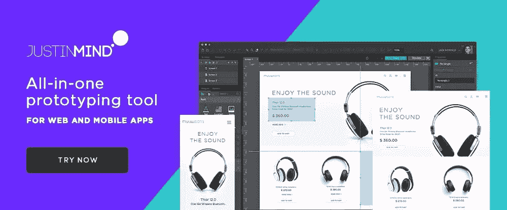
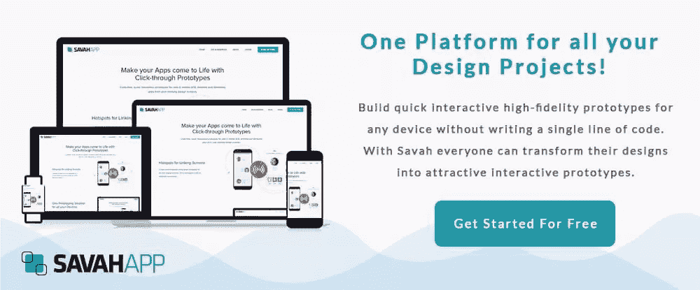

# 3 个应用程序和网站原型制作工具，你今天应该看看

> 原文：<https://www.sitepoint.com/3-app-and-website-prototyping-tools-you-should-check-out-today/>

*本文是与 [BAWMedia](https://bawmedia.com/) 合作创作的。感谢您对使 SitePoint 成为可能的合作伙伴的支持。*

原型工具是设计交流的最佳方式之一。它们在交互式软件系统设计者、开发者和项目经理中很受欢迎。原型工具被证明是成功设计和开发的关键。web 和面向移动的软件应用程序的部署也是如此。

线框也有它的位置。线框工具帮助团队成员关注软件系统的交互性。这两种方法对于向客户展示产品如何工作都是有价值的。

为了充分利用原型可以为您做的事情，您将需要最好的原型工具。这里描述的是视觉和交互保真度最好的。他们确保设计的一致性和准确性、协作以及向开发人员传递高质量的信息。

## 1. [Justinmind](https://www.justinmind.com/?utm_medium=partner&utm_source=baw+media&utm_campaign=september+promo)

Justinmind 正是您想要在早期和整个设计过程中验证您的 web 设计的工具，无论您选择的是可点击的线框、全功能 UI 原型，还是两者都有。

为了帮助您使用这两种方法，您可以访问超过 4，000 个 web、iOS 和 Android 预制 UI 元素。然后，您可以使用您的线框或原型来优化与开发人员的沟通，并将一整套高质量的设计规范交给他们。

Justinmind 还提供了团队协作构建原型的方法，或者与团队成员和其他人分享您的原型以获得反馈。回报很简单，但却是巨大的；通过加速设计工作和避免昂贵的返工，您将节省时间和金钱。

使用 Justinmind，您可以创建自己的 UI 组件库，使用来自任何库、文件系统或设计工具的设计资产，并在原型和流程图之间毫不费力地切换时，设计和验证您提议的软件系统的导航流程。

可以免费下载 Justinmind。

## 2.[超新星](https://supernova.io/?utm_source=sitepoint.com&utm_medium=content&utm_campaign=prototyping18)

Supernova 目前可以在 Mac OS X 上使用，其他平台也将在近期加入。这款原型制作工具将草图设计转换为可在 iOS、Android 和 React 原生设备上使用的生产代码。生成的代码在质量上可以与专业开发人员创建的代码相媲美。

该软件包包括允许在移动设备上测试的配套应用程序，以及可以在网络上运行移动应用程序的 Supernova Cloud。Supernova 还可以自动执行更加重复和费力的移动开发任务，包括文件命名以及代码和资源的导出

使用 Supernova 还可以创建移动动画、导航和 30 种语言的自动本地化，由于它执行的广泛有用的功能，使它值得被包括在任何最佳原型工具列表中。

你可以免费试用 Supernova。

## 3. [Savah App](https://www.savahapp.com/?utm_source=ba18&utm_medium=content&utm_campaign=top_prototyping_tools&utm_content=savah-1)

Savah App 拥有一套令人印象深刻的应用程序和网站原型工具，包括一些通常在许多最好的原型工具中找不到的功能。

例如:这个用于原型制作、设计和协作的一体化平台可以跨所有设备测试原型，包括智能手表和 iPhone X。它还可以自动化您的项目设计工作流程，为您创建的设计元素、设计和原型提供受密码保护的存储库，并促进团队协作和信息共享。

使用 Savah App，您可以在几分钟内创建一个原型，包括移动设备的过渡。您的原型被置于版本控制之下，这允许您在并排的设计屏幕上查看设计变更和进度。Savah App 集成了 Sketch、Dropbox 和其他许多常用的设计工具。

一个免费的 3 项目计划与单人、5 人团队和 10 人团队付费计划一起提供。Savah App 最适合小团队和自由职业者。

## 原型的好处

虽然原型法有利有弊，但前者远远大于后者。事实上，市场上最好的原型开发工具使原型开发变得简单。它也变得负担得起和有效。事实上，如此有效，优点与缺点不再是一个问题。

原型制作通常被认为是一项辅助任务。然而，随着项目变得更大更复杂，它变得越来越重要。应用程序和网站原型工具和 UI 原型工具使他们的用户受益。它们有助于在更短的时间内产生更高质量的软件解决方案。

这些好处如下:

*   原型可以帮助消除系统需求中不时出现的歧义。它还可以减少在解释功能时可能出现的错误。
*   一个设计良好的原型展示了软件产品应该做什么。而不是它可能做什么或应该做什么。
*   原型通过提供对设计的洞察、概述。或者，通过详细关注系统组件的工作、外观或感觉。无论组件是与其他部件集成在一起还是独立存在，这都是有效的。
*   原型开发最重要的一个方面是发现问题的能力。您可以在早期这样做，也可以澄清误解的需求或特性。
*   原型确定了最终软件产品的预期功能。在将设计交给开发人员之前，他们可以在接受和签署设计方面发挥重要作用。
*   对原型发表评论或提供反馈的能力非常棒。它给客户和其他利益相关者一种参与设计过程的感觉。这也让他们对生产最终产品的过程有了更多的了解。
*   原型和原型工具可以帮助开发人员估计开发成本。完成他们那部分项目所需的资源也是可以估计的。
*   当维护版本控制时，原型工具会非常有用。它们可以在设计阶段提供参考点，出于各种原因，可以参考这些参考点。例如，如果在开发周期的后期出现争议。

## 结论

这三个最好的应用程序和网站原型工具可以成为你的宝贵资产。它们使原型能够快速构建和共享。但更重要的是，它们在设计和开发阶段都节省了时间和金钱。此外，他们促进团队协作。

这些工具的一个共同点是，每一个都可以被视为一个多功能工具或首选工具。它可以减少错误，加快设计和开发工作流程。它可以给项目涉众一种对整个过程的拥有感。

## 分享这篇文章