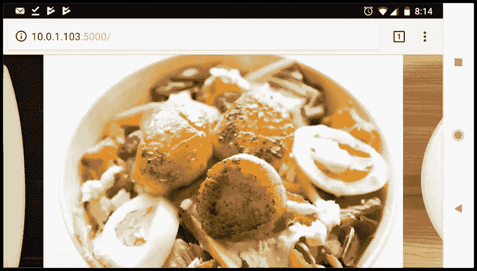

# CSS 中的滚动捕捉:控制滚动动作

> 原文：<https://www.sitepoint.com/scroll-snap-in-css/>

*以下是蒂芙尼新书《CSS 大师，第二版》的简短摘录。*

随着网络平台的发展，它也获得了模仿本地应用的特性。一个这样的特性是 [CSS 滚动捕捉模块。](https://drafts.csswg.org/css-scroll-snap-1/) Scroll snap 允许开发者定义一个界面在滚动动作中应该移动的距离。您可以用它来构建幻灯片或分页界面——这些功能目前需要 JavaScript 和昂贵的 DOM 操作。

滚动捕捉作为一项功能已经经历了很大的变化。该规范的 2013 年早期版本——当时称为滚动捕捉点(Scroll Snap)——定义了一种基于坐标和像素的方法来指定滚动距离。这个版本的规范是在微软 Edge、Internet Explorer 11 和 Firefox 中实现的。

Chrome 69+和 Safari 11+实现了该规范的最新版本，该版本使用了一种框对齐模型。这就是我们在这一部分要关注的。

*警告:
目前网上流传的许多滚动捕捉教程都是基于早期的 CSS 滚动捕捉**点**规范。标题中出现单词“points”是教程可能依赖旧规范的一个标志。然而，一个更可靠的指标是`scroll-snap-points-x`或`scroll-snap-points-y`属性的存在。*

因为 scroll snap 非常适合幻灯片放映布局，所以这就是我们要构建的。这是我们的标记。

```
<div class="slideshow">
  
  
  
  
  
</div> 
```

这就是我们所需要的。我们不需要外部包装元件和内部滑动容器。我们也不需要任何 JavaScript。

现在我们的 CSS:

```
* {
   box-sizing: border-box;
}

html, body {
    padding: 0; 
    margin: 0;
}

.slideshow {
  scroll-snap-type: x mandatory; /* Indicates scroll axis and behavior */
  overflow-x: auto;              /* Should be either `scroll` or `auto` */
  display: flex;
  height: 100vh;
}

.slideshow img {
  width: 100vw;
  height: 100vh;
  scroll-snap-align: center;
} 
```

将`scroll-snap-type`添加到`.slideshow`会创建一个滚动容器。这个属性的值`x mandatory`描述了我们想要滚动的方向，以及*滚动对齐的严格程度*。在这种情况下，`mandatory`值告诉浏览器，当没有活动的滚动操作时，它*必须*吸附到吸附位置。使用`display: flex`只是确保我们所有的图像水平堆叠。

现在我们需要的另一个属性是`scroll-snap-align`。此属性指示如何在滚动容器的对齐端口内对齐每个图像的滚动对齐区域。它接受三个值:`start`、`end`和`center`。在这种情况下，我们使用了`center`,这意味着每个图像将在视窗内居中，如下所示。



要更全面地了解滚动捕捉，请阅读谷歌网页基础指南中的 [*用 CSS 滚动捕捉*](https://developers.google.com/web/updates/2018/07/css-scroll-snap) 很好地控制滚动。

## 分享这篇文章