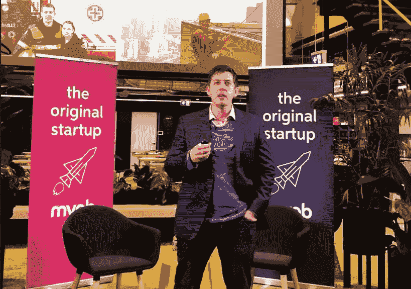

# 如何将你的业务从 0 美元增长到 2000 万美元

> 原文：<https://www.sitepoint.com/grow-business-0-to-20m/>

Steve McLeod 是澳大利亚领先的安全培训公司[澳大利亚](https://www.fireandsafetyaustralia.com.au/)消防与安全公司的创始人兼董事长。公司建立在对安全教育坚定不移的热情和改变世界的决心之上。史蒂夫与必和必拓、雪佛龙、山度士等客户合作，并在全国范围内培训了超过 50 000 人，他分享了他如何从零开始发展他的[业务](https://www.sitepoint.com/premium/books/the-lean-product-playbook/)的秘密。

## 无情的纪律如何创造你的愿景

每当我们看到成功，无论是一项发明、一场社会变革还是一位驾驶玛莎拉蒂的企业家，我们都会问自己“怎么做到的？导致这一切发生的一连串事件是什么？”

尽管没有两条路是完全相同的，但所有的成功故事都有共性。

作为一名活跃的消防员，史蒂夫经历了许多由于不安全操作而导致的可怕情况。他对安全和拯救生命充满热情，因此通过让人们活着来改善他们的生活，他看到了一个通过教育组织和个人来分享他的热情的机会，以防止他作为消防员目睹的情景。

但是怎么卖知识呢？

在发现市场空白的同时，结合史蒂夫关于安全的重要性以及如何实现安全的个人经验，机会出现了，他提供了一项服务来培训那些不知道他在做什么的人。这催生了他的“愿景”，即他的企业要取得成功需要实现什么。

一路上学到的一个特别的教训是，确保他的员工分享他的愿景，热情地体现他为自己的企业建立的价值观。史蒂夫经常问自己的一个关键问题是:“知道你现在知道什么，你会热情地重新雇用一名员工吗？”答案决定了他们该不该和你在一起。

> 如果答案是“不”，而你对此无动于衷，那么你就是阻碍业务发展的瓶颈。你必须有勇气做出艰难的决定，组建最好的团队以取得最大的成功。

Steve McLeod speaking at WeTeachMe’s Masters Series

从多年的成长经历和成功与挫折的交替中实现目标的经验来看，确保增长趋势持续的一个基本特征是史蒂夫自己创造的一个术语:**无情的纪律**。

> 在培训了 400 多名不同企业规模的企业家后，我发现人们失败的主要原因是，他们没有必要的纪律来完成日复一日、周复一周、季复一季的工作。

对你想要实现的目标有一个愿景，鼓起勇气朝着这个愿景迈出一步，并像你的主人一样拥抱“无情的纪律”,这不仅是必要的，而且是实现你对成功的定义的基础。

史蒂夫也是一家教练和咨询公司“盈利的勇气”的董事，要详细了解他的灵感之旅并获得关于如何发展你的业务的见解，请观看他在 [WeTeachMe 大师系列](https://weteachme.com/masters-series)中的故事。

[https://www.youtube.com/embed/gRHkq08Dgqg](https://www.youtube.com/embed/gRHkq08Dgqg)

## 分享这篇文章