# 如何在 CSS 中使用 2D 变换函数

> 原文：<https://www.sitepoint.com/how-to-use-2d-transformation-functions-in-css/>

*以下是蒂芙尼新书《CSS 大师，第二版》的简短摘录。*

**变换**让我们能够创造出其他方式无法实现的效果和互动。当与过渡和动画结合时，我们可以创建旋转、跳舞和缩放的元素和界面。尤其是三维变换，使得模仿物理对象成为可能。在这篇文章中，我们将看看 2D 变换函数( [3D 函数在这里](https://www.sitepoint.com/css-3d-transformation-functions/))。

有四个主要的二维变换函数:`rotate`、`scale`、`skew`和`translate`。其他六个函数让我们在一维空间中转换一个元素:`scaleX`和`scaleY`；`skewX`和`skewY`；还有`translateX`和`translateY`。

### `rotate()`

旋转变换以围绕`transform-origin`点指定的角度围绕其原点旋转元素。使用`rotate()`顺时针(正角度值)或逆时针(负角度值)倾斜元素。它的效果很像风车或风车，如下图所示。

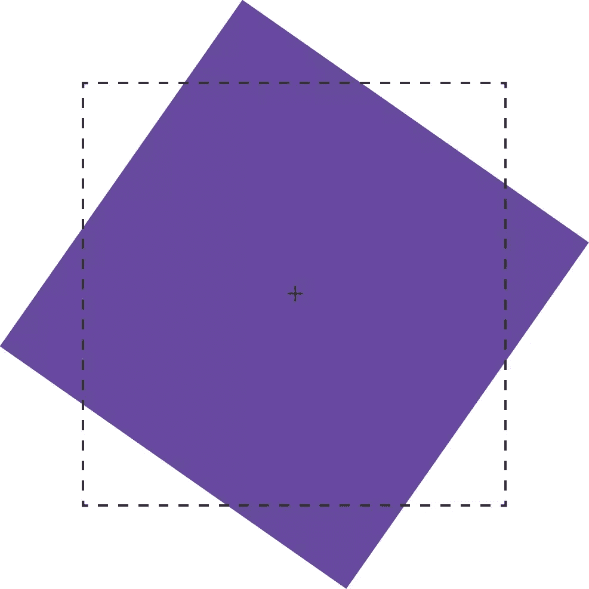

`rotate()`功能接受角度单位的值。角度单位由 [CSS 值和单位模块级别 3](http://dev.w3.org/csswg/css-values-3/#angles) 定义。这些可能是`deg`(度)`rad`(弧度)`grad`(格拉迪安)或`turn`单位。一次完整的旋转等于`360deg`、`6.28rad`、`400grad`或`1turn`。

超过一次旋转的旋转值(例如，`540deg`或`1.5turn`)会根据其剩余值进行渲染，除非设置了动画或进行了过渡。换句话说，`540deg`被渲染成与`180deg` (540 度减去 360 度)相同，`1.5turn`被渲染成与`.5turn`(1.5–1)相同。但是从`0deg`到`540deg`或者从`1turn`到`1.5turn`的过渡或动画会将元素旋转一次半。

### 2D 缩放函数:`scale`、`scaleX`、`scaleY`

使用缩放功能，我们可以在 X 维度(`scaleX`)、Y 维度(`scaleY`)或两个维度(`scale`)上增加或减少元素的渲染尺寸。下图显示了缩放比例，其中边框显示了长方体的原始边界，而+标记了其中心点。

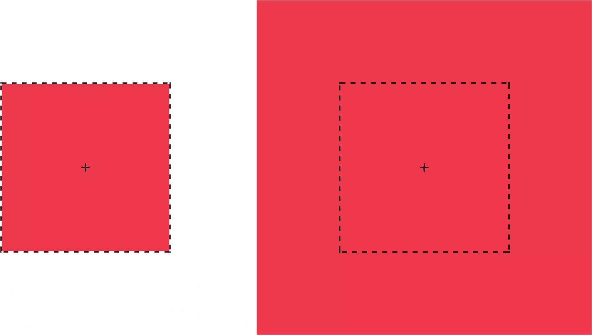

每个比例函数都接受一个乘数或因子作为其参数。这个乘数可以是任何正数或负数。不支持百分比值。大于`1`的正乘数会增加元素的大小。例如，`scale(1.5)`将元素在 X 和 Y 方向的大小增加 1.5 倍。`0`和`1`之间的正乘数将减小元素的大小。

小于`0`的值也会导致元素的大小放大或缩小，并创建反射(翻转)变换。

*警告:使用`scale(0)`会导致元素消失，因为一个数乘以零会得到零的乘积。*

使用`scale(1)`创建一个**身份变换**，这意味着它被绘制到屏幕上，就好像没有应用缩放变换一样。使用`scale(-1)`不会改变元素的绘制尺寸，但是负值会导致元素被反射。即使元素看起来没有被转换，它仍然触发一个新的堆栈上下文和包含块。

可以使用`scale`功能分别缩放 X 和 Y 尺寸。只需给它传递两个参数:`scale(1.5, 2)`。第一个参数缩放 X 维度；第二个缩放 Y 维度。例如，我们可以用`scale(-1, 1)`沿着 X 轴单独反射一个物体。传递单个参数会以相同的因子缩放两个维度。

### 2D 翻译功能:`translateX`、`translateY`、`translate`

平移元素会将其绘制位置从其布局位置偏移指定的距离。与其他变换一样，平移元素不会改变其`offsetLeft`或`offsetTop`位置。然而，它确实会影响它在屏幕上的可视位置。

每个 2D 翻译函数— `translateX`、`translateY`和`translate`—都接受参数的长度或百分比。长度单位包括像素(`px`)、`em`、`rem`和视口单位(`vw`和`vh`)。

`translateX`函数改变一个元素的水平渲染位置。如果一个元素被定位在左边零个像素处，`transform: transitionX(50px)`将它的渲染位置向它的起始位置右边移动 50 个像素。同样，`translateY`改变元素的垂直渲染位置。`transform: transitionY(50px)`的变换将元素垂直偏移 50 个像素。

使用`translate()`，我们可以使用一个函数垂直和水平移动一个元素。它最多接受两个参数:X 平移值和 Y 平移值。下图显示了一个`transform`值为`translate(120%, -50px)`的元素的效果，其中左边的绿色方块位于原始位置，右边的绿色方块从其包含的元素(虚线边框)水平平移 120%和垂直平移-50px。

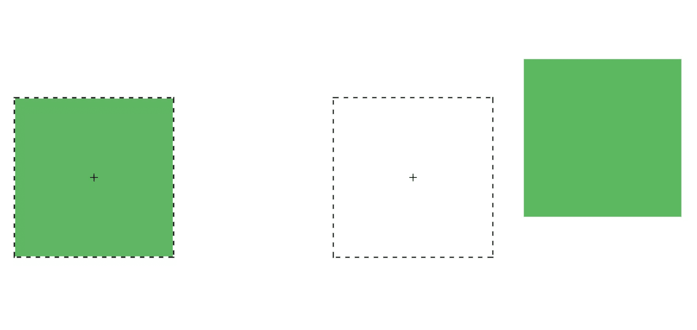

向`translate`传递一个参数相当于使用`translateX`；Y 平移值将被设置为`0`。使用`translate()`是更简洁的选择。应用`translate(100px, 200px)`相当于`translateX(100px) translateY(200px)`。

正平移值向右(对于`translateX`)或向下(对于`translateY`)移动一个元素。负值向左(`translateX`)或向上(`translateY`)移动元素。

平移对于向左、向右、向上或向下移动项目特别有用。更新`left`、`right`、`top`和`bottom`属性的值会强制浏览器重新计算整个文档的布局信息。但是在已经计算了布局之后计算变换*。它们影响元素*在屏幕上出现*的位置，但不影响它们的实际尺寸。是的，将文档布局和呈现作为独立的概念来考虑很奇怪，但是就浏览器而言，确实如此。*

#### 转换属性可能会出现在您附近的浏览器中

CSS Transforms 规范的最新版本为 CSS 添加了`translate`、`rotate`和`scale`、*属性*。转换属性的工作方式与其对应的转换函数非常相似，但是值是用空格分隔的，而不是用逗号分隔的。例如，我们可以使用`rotate`属性:`rotate: 1 1 1 45deg`来表示`transform: rotate3d(1, 1, 1, 45deg)`。同样，`translate: 15% 10% 300px`在视觉上与`transform: translate3d(15%, 10%, 300px)`相同，`scale: 1.5 1.5 3`与`transform: scale3d(1.5, 1.5, 3)`相同。有了这些属性，我们可以独立于其他变换来管理旋转、平移或缩放变换。

在撰写本文时，浏览器对转换属性的支持仍然很少。Chrome 和三星互联网支持开箱即用。在 Firefox 版本 60 及更高版本中，支持被隐藏在一个标志后面；访问`about: config`并将`layout.css.individual-transform.enabled`设置为`true`。

### `skew`、`skewX`和`skewY`

**倾斜变换**移动点之间的角度和距离，同时保持它们在同一平面上。倾斜变换也被称为*剪切变换*，它们扭曲了元素的形状，如下图所示，虚线代表元素的原始边界框。

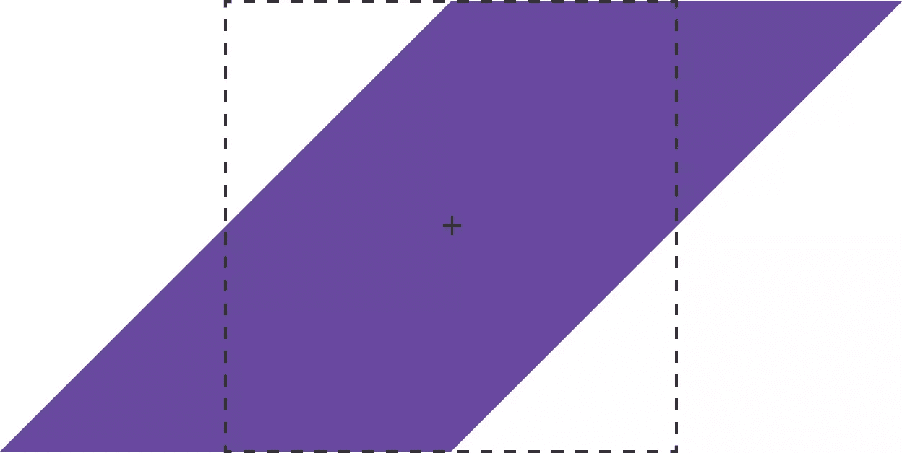

倾斜函数— `skew`、`skewX`和`skewY`—接受大多数角度单位作为参数。度、梯度和弧度是 skew 函数的有效角度单位，而转弯单位显然不是。

`skewX`功能在 X 或水平方向剪切一个元素(见下图)。它接受单个参数，该参数也必须是角度单位。正值将元素向左移动，负值将元素向右移动。

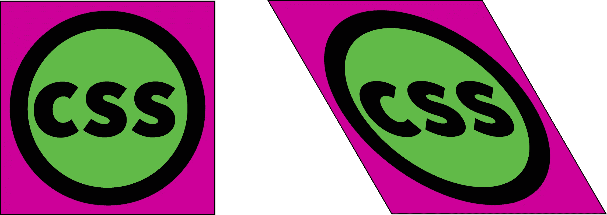

类似地，`skewY`在 Y 或垂直方向剪切一个元素。下图是`transform: skewY(30deg)`的效果。原点右侧的点向下移动正值。负值会将这些点向上移动。

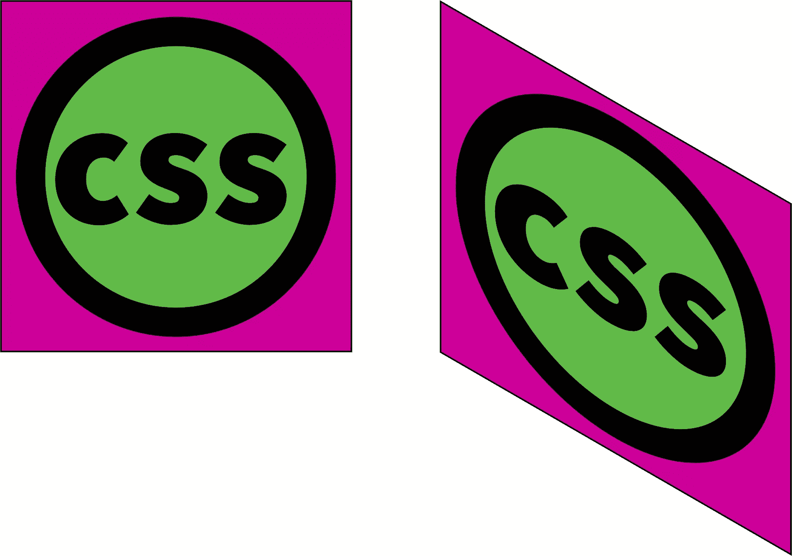

这就把我们带到了`skew`函数。`skew`函数需要一个参数，但最多接受两个。第一个参数在 X 方向倾斜元素，第二个参数在 Y 方向倾斜元素。如果只提供了一个参数，则第二个值被假定为零，这相当于只在 X 方向上倾斜。换句话说，`skew(45deg)`渲染与`skewX(45deg)`相同。

## 电流变换矩阵

到目前为止，我们已经分别讨论了转换函数，但是它们也可以组合在一起。想要缩放和旋转对象吗？没问题:使用一个**转换列表**。例如:

```
.rotatescale {
    transform: rotate(45deg) scale(2);
} 
```

这会产生您在下面看到的结果。

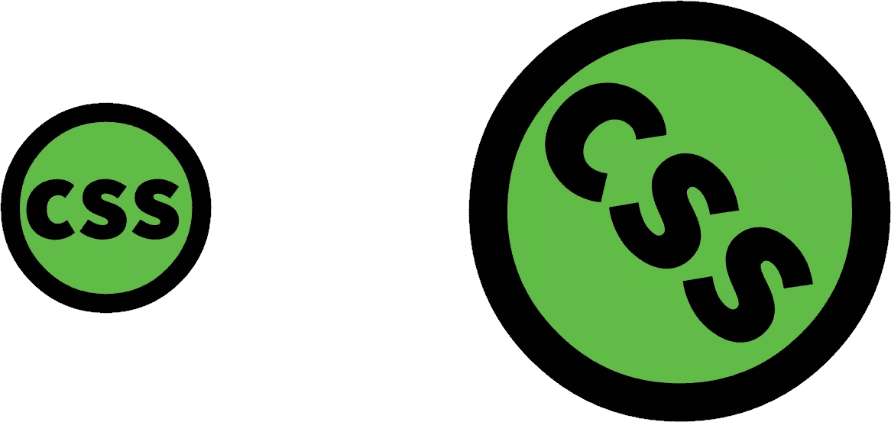

使用变换函数时，顺序很重要。这是一个展示比谈论更好的观点，所以让我们看一个例子来说明。下面的 CSS 倾斜和旋转一个元素:

```
.transformEl {
    transform: skew(10deg, 15deg) rotate(45deg);
} 
```

它给了我们你在下面看到的结果。


如果先旋转一个元素，然后将其倾斜，会发生什么情况？

```
.transformEl {
    transform:  rotate(45deg) skew(10deg, 15deg);
} 
```

如下图所示，效果截然不同。


这些变换中的每一个都有一个不同的*当前变换矩阵*，由它的变换函数的顺序创建。为了充分理解这是为什么，我们需要学习一点点*矩阵乘法*。这也将帮助我们理解`matrix`和`matrix3d`功能。

## 矩阵乘法和矩阵函数

一个**矩阵**是一个排列成行和列的矩形的数字或表达式的数组。所有的变换都可以用一个 4×4 的矩阵来表示，如下所示。


这个矩阵对应于`matrix3d`函数，它接受 16 个参数，每个参数对应 4×4 矩阵的一个值。二维变换也可以使用 3×3 矩阵来表示，如下所示。

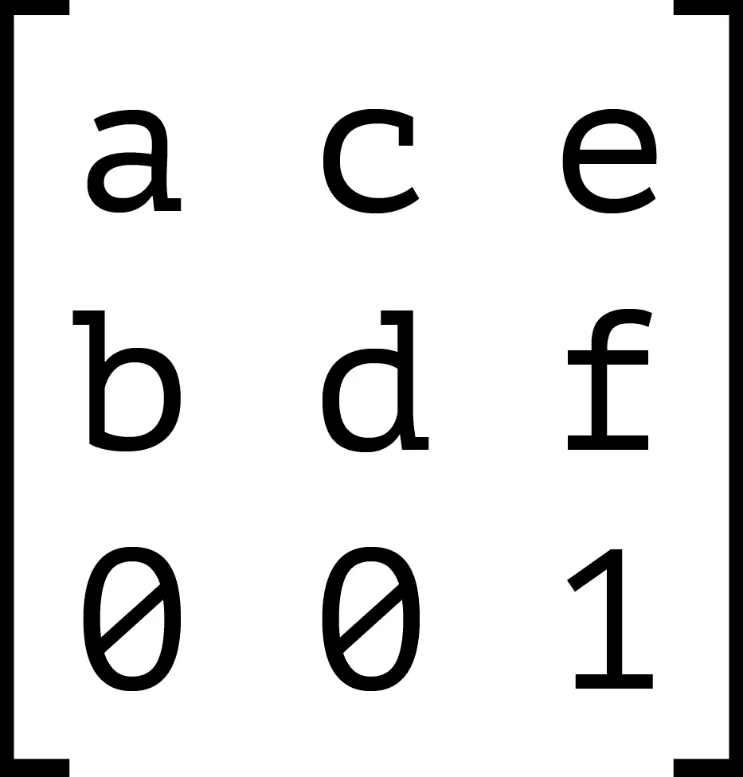

这个 3×3 矩阵对应于`matrix`变换函数。`matrix()`函数接受六个参数，每个参数对应于值 *a* 到 *f* 。

每个变换函数都可以用矩阵和`matrix`或`matrix3d`函数来描述。下图显示了`scale3d`函数的 4×4 矩阵，其中 *sx* 、 *sy* 和 *sz* 分别是 X、Y 和 Z 维度的比例因子。

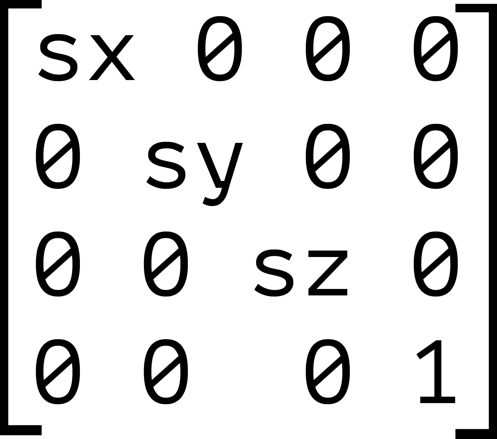

当我们组合转换时——比如`transform: scale(2) translate(30px, 50px)`—浏览器将每个函数的矩阵相乘来创建一个新的矩阵。这个新矩阵就是应用到元素上的东西。

但是矩阵乘法有一个问题:它是不可交换的。对于简单值，3×2 的乘积与 2×3 的乘积相同。然而对于矩阵来说， *A* × *B* 的乘积不一定与 *B* × *A* 的乘积相同。让我们看一个例子。我们来计算`transform: scale(2) translate(30px, 50px)`的矩阵积。

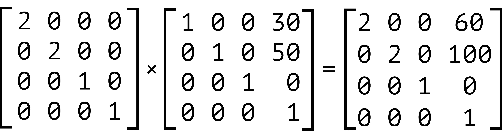

我们的元素被缩放了两倍，然后水平平移了 60 像素，垂直平移了 100 像素。我们也可以用`matrix`函数:`transform: matrix(2, 0, 0, 2, 60, 100)`来表达这个产品。现在让我们交换这些变换的顺序——也就是`transform: translate(30px, 50px) scale(2)`。结果如下所示。

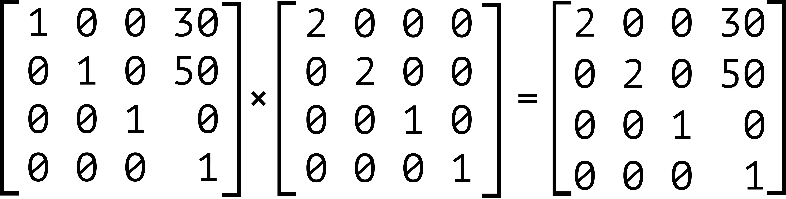

注意，我们的对象仍然被缩放了两倍，但是这里它被水平平移了 30 像素，垂直平移了 50 像素。用`matrix`函数表示，这是`transform: matrix(2, 0, 0, 2, 30, 50)`。

同样值得注意的是，继承转换的功能类似于转换列表。每个子变换都乘以应用于其父变换的任何变换。例如，以下面的代码为例:

```
<div style="transform: skewX(25deg)">
    <p style="transform: rotate(-15deg)"></p>
</div> 
```

这与下面的渲染相同:

```
<div>
    <p style="transform: skewX(25deg) rotate(-15deg)"></p>
</div> 
```

在这两种情况下，`p`元素的当前变换矩阵是相同的。虽然到目前为止我们已经关注了 2D 变换，但是上面的内容也适用于 3D 变换。第三维增加了深度的错觉。它还以新功能和属性的形式带来了一些额外的复杂性。

## 分享这篇文章