# 提升 PWA 性能的 CSS 优化工具

> 原文：<https://www.sitepoint.com/css-optimization-boosting-pwa-performance/>

使用 CSS 设计网站或 pwa 时，您应该分析 CSS 资源会如何影响性能。在本教程中，我们将通过关注 CSS 优化，使用各种工具和相关技术来帮助构建更好的 PWA。具体来说，我们将删除未使用的 CSS，内联关键路径 CSS，并缩小结果代码。

这些技术也可以用来提高一般网站和应用程序的性能。我们将把重点放在 pwa 的 CSS 优化上，因为它们应该很快，并且在用户设备上感觉很自然。

渐进式网络应用程序(PWAs)是一种集两者之长的网络体验:本地移动应用程序(可从商店安装)和网络应用程序(可从公共 URL 访问)。用户可以直接从他们的网络浏览器开始使用该应用程序，而无需等待下载、安装或需要设备中的额外空间。

服务人员和缓存允许应用程序在网络连接不良时离线工作。随着时间的推移，随着更多的资源在本地缓存，应用程序可能会变得更快。PWAs 也可以作为图标安装在主屏幕上，并通过初始闪屏全屏启动。

## 要审核的演示 PWA

在学习如何审计任何 CSS 问题的 PWA 之前，您可以从这个 [GitHub 库](https://github.com/techiediaries/unoptimized-pwa)获得一个具有 PWA 特性的简单网站的代码。PWA 使用非统一版本的 Bootstrap v4 进行 CSS 样式化，并显示一组从静态生成的 [JSON API](https://www.techiediaries.com/api/feed.json) 获取的帖子。你也可以使用这个[演示](https://www.techiediaries.com/unoptimizedpwa)的托管版本，因为学习如何构建 PWA 超出了本教程的范围。

pwa 只是具有附加功能的 web 应用程序，包括以下元素:

*   **一个清单文件**。JSON 文件为浏览器提供了关于 web 应用程序的信息，如名称、描述、图标、起始 URL、显示因子等。
*   一名服务人员。JavaScript 文件用于缓存应用程序外壳(显示用户界面所需的最少 HTML、CSS 和 JavaScript)并代理所有网络请求。
*   **HTTPS** 。PWAs 必须从安全的来源提供。

下面是应用程序外壳的屏幕截图:

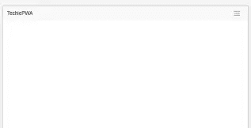

带有数据的应用程序的屏幕截图:

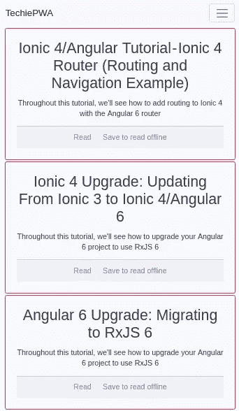

## 使用 Google 的灯塔进行审计

[Lighthouse](https://github.com/GoogleChrome/lighthouse) 是 Google 开发的开源审计工具。它可以用来提高网站和渐进式 web 应用程序的性能、可访问性和 SEO。

Lighthouse 可以从 Chrome DevTools 中的 *Audit* 选项卡访问，编程上可以作为 Node.js 模块，也可以作为 CLI 工具。它获取一个 URL 并运行一系列审计来生成一个带有优化建议的报告。

您可以手动或使用工具应用不同的技术。本文描述了如何使用这样的工具来删除多余的样式，提取上面的关键 CSS，用 JavaScript 加载剩余的 CSS，并缩减生成的代码。

启动 Chrome，访问 PWA 地址`https://www.techiediaries.com/unoptimizedpwa/`，打开*开发者工具* ( `CTRL-Shift-I`)。从开发者工具中，点击*审计*面板:

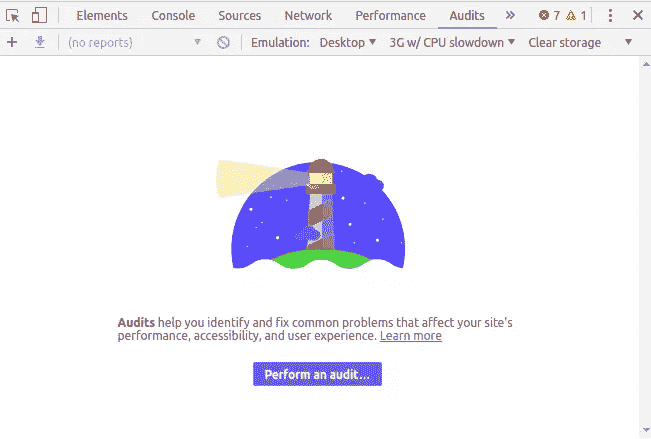

接下来，点击*执行审计…* 。一个对话框将提示您要执行的审计类型。保持所有类型被选中，点击*运行审计*按钮。

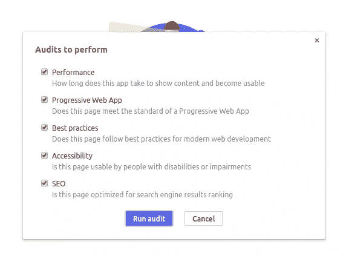

等待 Lighthouse 完成审计过程并生成报告:

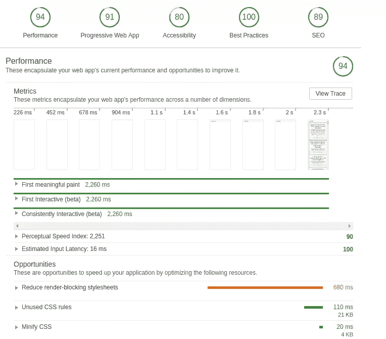

分数是在模拟环境中计算的。你不可能在你的机器上得到同样的结果，因为它们依赖于硬件和网络能力。

从报告中，您可以看到一个时间线，直观地显示页面是如何加载的。*第一次有意义的描绘*、*第一次互动*和*持续互动*是描述页面加载速度的关键时间点。我们的目标是根据*关键渲染路径*优化这些指标。

## 关键渲染路径

关键呈现路径表示浏览器在呈现初始页面视图(页面的可见区域或“折叠上方”区域)之前必须采取的步骤。当您访问 URL 时，浏览器:

*   开始下载 HTML，并在传输时对其进行解析
*   识别和下载外部资产，如 CSS、JavaScript、字体和图像
*   根据需要进行解析和呈现。

对于图像等资产，可以并行进行资产下载和解析。然而， [CSS](https://developers.google.com/web/fundamentals/performance/critical-rendering-path/render-blocking-css) 和 JavaScript 是呈现阻塞的:浏览器停止进一步的处理，直到文件被下载和解析。这是必要的，因为浏览器是单线程的，任何事情都可能发生。例如，页面重定向到另一个 URL 或更改布局样式。

如果减少呈现阻塞资产的数量，页面性能应该会提高。

## 使用 Lighthouse 机会的 CSS 优化

Lighthouse 在报告的*机会*部分提供了帮助优化应用程序的指南。有三个提高性能的建议:

*   减少渲染阻塞 CSS
*   消除未使用的 CSS 规则
*   缩小 CSS。

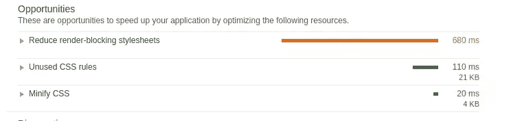

### CSS 优化:移除未使用的 CSS 规则

让我们从第二个 Lighthouse 机会开始，它与未使用的 CSS 规则有关。展开*未使用的 CSS 规则*机会:

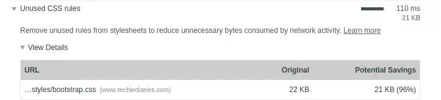

Lighthouse 估计,`bootstrap.css`文件中 96%的 CSS 没有被应用程序使用。如果我们消除未使用的 CSS，网络活动将相应减少。

这里描述的所有工具都可以用作构建系统的一部分，比如 webpack、Gulp 或 Grunt，但是本教程在命令行中使用它们。

为了消除未使用的 CSS 样式，我们将使用 [PurifyCSS](https://github.com/purifycss/purifycss) 。确保您的机器上安装了 [Node.js](https://nodejs.org/) ，然后使用`npm`全局安装该工具:

```
$ npm install -g purify-css 
```

接下来，确保您在您的`unoptimizedpwa`文件夹中并运行命令:

```
$ purifycss styles/bootstrap.css index.html -o styles/purified.css -i 
```

*   第一个参数是用于 *purify* 的 CSS 文件。
*   第二个参数是用于检查所用样式的 HTML 文件。
*   `-o`选项指定要创建的结果文件的路径和名称。
*   `-i`选项指示工具显示关于移除了多少 CSS 的信息。

*(`-m`选项指示工具缩小纯化的 CSS，但是我们将使用另一个工具来缩小。)*

在这种情况下，我们看到`PurifyCSS has reduced the file size by ~ 84.5%`。这与 Lighthouse 确定的 96%不太一样，但是工具使用了不同的技术。

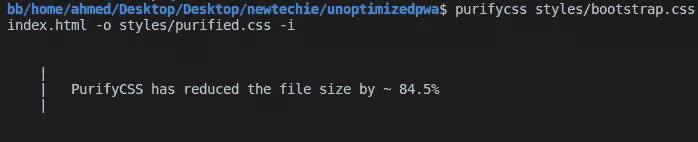

你也可以使用其他工具来删除未使用的 CSS，如 [uncss](https://github.com/uncss/uncss) ，你可以阅读这篇由 Addy Osmani 撰写的[文章来了解更多信息。](https://addyosmani.com/blog/removing-unused-css/)

你现在可以删除原来的`styles/bootstrap.css`文件，并将`styles/purified.css`重命名为`styles/bootstrap.css`。

### 减少渲染阻塞 CSS

如果我们展开*减少呈现阻塞样式表*的机会，我们可以看到更多细节:

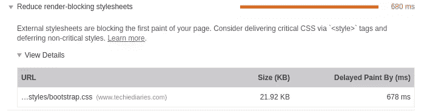

`bootstrap.css`文件将我们应用程序的第一次绘制延迟了 678 毫秒。并非所有样式都是折叠渲染所必需的，因此我们可以执行以下操作:

1.  从`bootstrap.css`中提取关键的 CSS，并使用一个`<style>`标签将其内联到`index.html`文件中。这减少了 HTTP 请求的数量，也减少了浏览器需要解析的代码。
2.  在页面顶部呈现之后，交付剩余的非关键样式。

我们将使用[关键 CSS 提取器](https://chrome.google.com/webstore/detail/critical-css-extractor/pfcjlollanbphpceofgibjopkkppbdmc)，一个 Chrome 扩展来提取当前页面的关键 CSS 规则。一旦你安装了这个扩展，你会在 DevTools 中看到一个新的面板——*Critical CSS*。

Chrome 为我们做了艰苦的工作。在站点仍然活动的情况下再次打开 DevTools，并选择 *Critical CSS* 选项卡。点击*提取关键 CSS* 按钮，下载关键 CSS 文件:

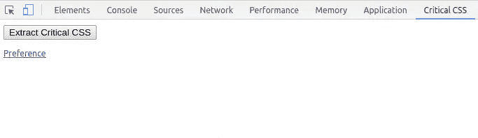

打开`index.html`并将这个关键 CSS 文件的内容添加到 HTML `<head>`的`<style>`标签中。

### 未统一的 CSS

所有样式仍然需要 CSS 文件，但是我们可以缩小它来减小它的大小。

扩大灯塔审计中的*缩小 CSS* 机会:

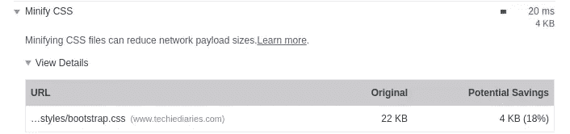

要缩小文件，我们可以使用以下工具:

*   [cssnano](https://github.com/cssnano/cssnano) —一个模块化的迷你器，构建在 PostCSS 之上
*   csso —一个具有结构优化的 CSS 精简器。

要使用 *cssnano* ，从`unoptimizedpwa`文件夹中，运行以下命令在本地安装 *cssnano* :

```
npm install cssnano 
```

接下来，使用以下命令全局安装 [PostCSS CLI](https://github.com/postcss/postcss-cli) :

```
npm install postcss-cli --global 
```

添加一个名为`postcss.config.js`的新文件，具有以下(默认)cssnano 配置参数:

```
module.exports = {
    plugins: [
        require('cssnano')({
            preset: 'default',
        }),
    ],
}; 
```

cssnano 指南提供了关于配置预置的更多信息。

通过运行以下命令来缩小`bootstrap.css`文件:

```
postcss styles/bootstrap.css > styles/bootstrap.min.css 
```

### 用 JavaScript 推迟引导加载

为了防止 CSS 文件出现渲染阻塞，可以在 DOM 准备好之后，使用 JavaScript 在页面末尾加载它。将以下 JavaScript 代码片段添加到`index.html`中，刚好在结束的`</body>`标记之前:

```
<script> const link = document.createElement('link');
link.href = 'styles/bootstrap.min.css';
link.type = 'text/css';
link.rel = 'stylesheet';
const  link0 = document.getElementsByTagName('link')[0];
link0.parentNode.insertBefore(link, link0); </script> 
```

如果在页面加载后检查 DOM，您会发现在`<head>`标签中插入了`<link>`标签:

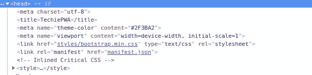

## 检查优化

我们可以针对[优化的 PWA](https://www.techiediaries.com/pwa) 再次运行 Lighthouse。结果是:

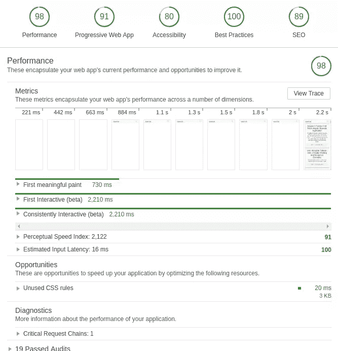

成绩有所提高。

Lighthouse 还报告说，更多未使用的 CSS 规则可能会被删除。这可能是因为 [PurifyCSS 没有移除相似命名的选择器](https://github.com/purifycss/purifycss/issues/189)。

最终优化的 PWA 可从这个 [GitHub 库](https://github.com/techiediaries/optimized-pwa)获得。

## 类似的工具

除了我们在本教程中使用的工具，还有许多替代工具。以下是净化、缩小和提取关键 CSS 的著名工具列表:

*   csso —一个具有结构优化的 CSS 精简器
*   [critical](https://github.com/addyosmani/critical) ，一个由 [Addy Osmani](https://github.com/addyosmani) 开发的工具，用于在 HTML 页面中提取和内嵌关键路径 CSS
*   一个从你的样式表中移除未使用的 css 的工具，它可以跨多个文件工作，并且支持 Javascript 注入的 CSS
*   [purgecss](https://github.com/FullHuman/purgecss) ，一个清除不用 css 的工具。

## 结论

在本教程中，我们通过删除冗余代码、内联关键资产和缩小生成的 CSS 来实现 CSS 优化。因此，PWA 下载和渲染速度会更快。类似的工具和技术可以用在你的网站和应用程序上，用来优化 CSS 以提高性能。

## 分享这篇文章