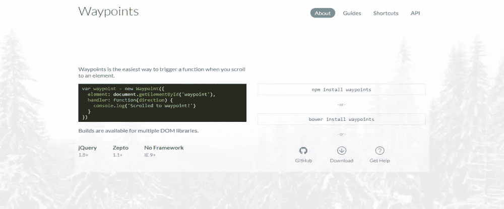
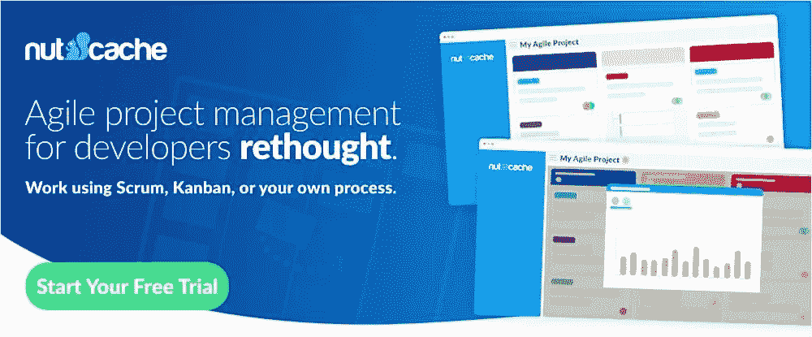

# 5 款顶级开发工具，帮助您事半功倍

> 原文：<https://www.sitepoint.com/5-top-development-tools-that-will-help-you-do-more-in-less-time/>

*本文是与 [BAWMedia](https://bawmedia.com/) 合作创作的。感谢您对使 SitePoint 成为可能的合作伙伴的支持。*

web 开发人员的生活通常是有意义的。但是让你的上司盯着你可能就不那么令人鼓舞了。尤其是当他要求你用更少的时间做更多的事情时。它有时会把你逼到边缘。

那些没有真正做这项工作的人有时会忘记这项工作有多复杂。使用硬件构建互联物联网解决方案可能相当困难。然而，有了合适的软件，诸如此类的任务就容易多了。

以下是我们收集的一些解决方案。如果你需要一个开发工具来改造一个电子商务网站，你是在正确的地方。如果您只是想了解更多关于流程和可用工具的信息，情况也是如此。我们的调查结果基于网站排名、评论和整体价值。

## [1。monday.com](https://monday.com/lp/mb/stuck/?utm_source=mb&utm_campaign=post&utm_medium=baw_140818)

让你的生活变得更简单、更快速的一个方法是投资一个高质量的团队管理工具。尽管质量的含义会因用户而异，但它通常是指整体性能、灵活性以及没有令人讨厌的约束或限制。

monday.com 在这三项上都得了满分 10 分。除了美观、丰富多彩、使用直观之外，这个团队管理工具还提供了一个平台，无论是两个人的团队，还是由成百上千的开发人员和其他项目涉众组成的分布式团队，都离不开这个平台。

monday.com 通过使项目的工作流程平稳高效地执行来提供有价值的服务。同样重要的是，它促进了透明度、团队协作和团队成员个人的授权。

它还将流程集中化，并有助于将人们与这些流程联系起来，这对于防止任务失败并导致麻烦甚至灾难性的问题非常重要。从初创公司到财富 500 强公司，超过 35，000 个团队构成了 monday.com 的用户群。

## [2。航点](http://imakewebthings.com/waypoints/?utm_source=sitepoint.com&utm_medium=content&utm_campaign=devresources)

如果你正在寻找一种完美的方式来促进滚动动画和交互，Waypoints 是你的工具箱中必不可少的工具之一。考虑到这些元素在现代网站布局中的受欢迎程度，以及 Waypoints 是一个免费计划的事实——你绝对应该得到它。

这个灵活的工具是一个库，当你滚动到一个元素时，它可以使执行一个函数变得轻而易举。它适用于 jQuery、Zepto 或普通 JavaScript。借助 Waypoints，您可以将 JavaScript 文件添加到网站中，这要归功于其模块的管理界面。此外，这个有用的插件具有丰富的 UI 模式基础，这些模式根据用户在页面上的滚动位置而变化。

Waypoints 也有一些扩展，可以更容易地实现通用 UI 模式。这些功能包括无限滚动、粘性元素和 Inview 检测。

## [3。以及来自 Fiverr](https://www.and.co/?utm_source=bawlists) 的一氧化碳

自由职业者、代理商和工作室会喜欢这个时间跟踪和发票应用程序所提供的东西。CO 已经在全球拥有超过 10 万家企业的用户群，它可以在 iOS、Android 和网络上使用，你可以用它来帮助运营你的整个企业。

CO 的功能列表令人印象深刻。这个应用程序可以做很多不同的事情，你可能会开始担心如何最好地利用你突然发现自己拥有的所有额外的空闲时间。

除了时间跟踪和发票，这一出色的应用程序执行任务管理，管理付款，跟踪费用，帮助您设计可定制的建议，设置经常性付款流程等等。

再加上，用起来超级简单；最重要的是，它是完全免费的！

## [4。坚果缓存](https://www.nutcache.com/designer-developer-tool/?utm_source=baw_media&utm_medium=newsletter&utm_campaign=top_developers_tools)

Nutcache 是一款一体化的项目管理应用。其财务能力与项目管理的整合无疑是其突出特点之一。这些功能包括帮助您进行初始项目估算和预算、时间跟踪、管理费用以及自动完成最终的计费流程。

Nutcache 特别适合敏捷开发者和项目经理。因此，这个面向业务的 web 应用程序完全支持 Scrum、看板和其他敏捷方法，同时帮助团队在项目的整个生命周期中管理项目。

## [5。TMS 外包](https://tms-outsource.com/?utm_source=sitepoint.com&utm_medium=content&utm_campaign=devresources)

如果你想利用外包开发的好处，TMS 外包正是你所需要的。TMS 是一家拥有 30 多名人才的小公司。他们共同为 20，000 名付费客户带来最佳体验，推出了 5 款自己的软件产品，并为全球公司提供开发服务。

目前，TMS Outsource 使用敏捷的 SCRUM 方法论，并以下列技术和语言为特色:PHP、MySQL、Javascript、Symfony、Slim、Vue.js、React、Redis、Elasticsearch。

## 如何成为一个更好的开发者？

作为一名开发人员，你想提高自己吗？那么，这已经是成为其中一员的一大步了。有许多开发人员认为他们在不断提高他们的编程技能。然而，没有多少人能有效地做到这一点。

在这里，我们收集了如何成为更好的开发人员的三个关键技巧。

### 1.阅读大量代码

当谈到提高你的技能时，这条指导方针可以作为最重要的规则。你可能会问为什么？

除了阅读你的代码，你还需要注意别人写的东西。这意味着你将需要阅读大量其他人的代码，以提高你自己的编码水平。

然而，不要只是浏览代码——花时间仔细阅读，并尝试从中学习一些东西。

### 2.定期写

当你从事一些编码工作时，你的技能肯定在发展。如果您从事个人编程项目，这将使您的编码达到另一个水平。

这种方法给你提供了一个很好的学习机会。您可以探索许多不同的工具和技术，就像这里提到的那些。此外，从事个人编码项目会增加你的声誉和专业知识。

### 3.特别勤奋

是的，你是对的——确保你首先满足项目的要求总是好的。然而，许多开发人员更喜欢在这一点上停下来，继续下一个项目。

然而，如果您计划完善您的编码技能，这还不够好。以下是你需要做的:一旦你完成了一个特定的项目，想想如何让它变得更好。

## 结论

遇到一个很棒的服务或应用程序总是一种很好的感觉。这正是你投资上述任何一种产品时会得到的感觉。

每一个都有双重目的；使您的工作更容易，并使任务或项目的最终结果更好。

## 分享这篇文章