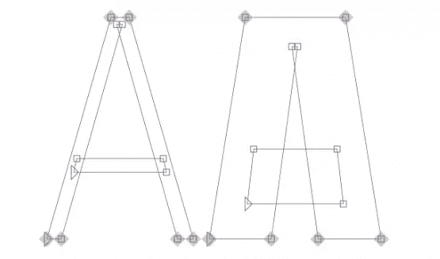
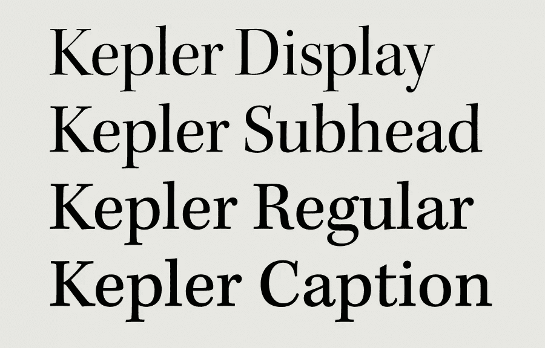

# 可变字体:它们是什么，以及如何使用它们

> 原文：<https://www.sitepoint.com/variable-fonts-introduction/>

在本文中，我们将看看围绕可变字体的令人兴奋的新可能性——现在与 OpenType 可扩展字体格式捆绑在一起——它允许单个字体像多个字体一样工作。

## 我们是如何来到这里的

创建 HTML 时，字体和样式完全由每个 web 浏览器的设置控制。在 90 年代中期，第一种基于屏幕的媒体字体诞生了:Georgia 和 Verdana。这些字体和系统字体——Arial、Times New Roman 和 Helvetica——是 web 浏览器仅有的可用字体(不完全是唯一的，但我们可以在每个操作系统中找到)。

随着网络浏览器的发展，像网景导航器上的`<font>`标签和第一个 CSS 规范这样的创新允许网页控制显示何种字体。然而，这些字体需要安装在用户的计算机上。

1998 年，CSS 工作组提出支持`@font-face`规则，允许任何字体在网页上呈现。IE4 实现了这项技术，但是将字体分发给每个用户的浏览器引发了许可和盗版问题。

21 世纪初，图像替换技术兴起，用样式化的文本图像替换 HTML 内容。每一段文字都必须用 Photoshop 之类的程序切片。这种技术的主要优点是允许设计者使用任何可用的字体，而不必处理字体许可。

2008 年，`@font-face`终于在苹果 Safari 和 Mozilla Firefox 实现后卷土重来。这是出于为设计者和开发者提供一种简单的方法来使用自定义字体而不是不可访问的图像的需要。

直到 2012 年 [CSS3 字体模块](https://www.w3.org/TR/css-fonts-3/)的到来，字体下载才变得可行。一旦实现，由网页下载的字体只能在该网页上使用，而不能复制到操作系统。字体下载允许浏览器下载和使用远程字体，这意味着网页设计者现在可以使用用户计算机上没有安装的字体。当网页设计者找到他们想要使用的字体时，他们只需要将字体文件包含在网页服务器上，当用户需要时，它会自动下载给用户。这些字体是使用`@font-face`规则引用的。

要使用`@font-face`规则，我们必须定义一个字体名称并指向字体文件:

```
@font-face {
  font-family: Avenir Next Variable;
  src: url(AvenirNext_Variable.woff);
} 
```

字体文件可以是五种不同格式之一:TTF、WOFF、WOFF2、SVG 或 EOT。各有各的[优缺点](https://en.wikipedia.org/wiki/Web_typography#File_formats)。简单地说，EOT 是由微软创建的，并且仅受 Internet Explorer 支持。TTF 是微软和苹果创造的基本类型字体，它几乎在任何地方都能完美工作。SVG 基于图像替换技术，仅适用于 Web。最后，WOFF 和 WOFF2 也是专为网络开发的，基本上都是经过额外压缩的 TTF 文件。

## 可变字体

OpenType(计算机可扩展字体格式)1.8 版本于 2016 年发布。它搭载了一种全新的技术:OpenType 字体变体，也称为**可变字体**。

这项技术允许单个字体表现得像多个字体一样。这是通过在字体中定义变化来实现的。这些变化来自于每个字符只有一个轮廓。构成这个轮廓的点有关于它们应该如何表现的指令。没有必要定义多种字体粗细，因为它们可以在非常窄和非常宽的定义之间进行插值。这也使得生成介于两者之间的样式成为可能，例如，半粗体和粗体。这些变化可以沿着字体的一个或多个轴起作用。在下图中，我们有一个字母 a 轮廓插值的例子。



### 为什么可变字体是相关的？

可变字体可以简化我们的字体结构并提高性能。举个例子，我们的网站需要五种字体样式。与必须加载五个不同的字体文件相比，提供能够呈现这五种样式的单个可变字体要小得多，也快得多。

## 使用可变字体

目前有两种不同的方法来使用可变字体。首先，我们将看看实现这些的现代方式。CSS 规范[强烈倾向于](https://drafts.csswg.org/css-fonts-4/#font-variation-settings-def)使用`font-optical-sizing`、`font-style`、`font-weight`和`font-stretch`来控制任何标准轴。

### `font-optical-sizing`

该属性允许开发人员控制浏览器是否以稍微不同的视觉表示呈现文本，以优化不同大小的查看。它可以取值`none`，当浏览器不能修改字形的形状时，或者取值`auto`，当浏览器可以修改字形的形状时。在支持`font-optical-sizing`的浏览器上，值被设置为`auto`的字体可以像下图中的字体一样变化:



值设为`none`时，字体不会有变化。

### `font-style`

此属性指定字体是否应该使用其字体系列中的正常、倾斜或倾斜字体样式。它可以取`normal`、`italic`或`oblique`值。

### `font-weight`

此属性指定字体的粗细(或粗细)。需要注意的一点是，使用普通字体，可以定义命名实例。例如，`bold`与`font-weight: 700`相同，或者`extra-light`与`font-weight: 200`相同。`font-weight`属性也可以是 1 到 1000 之间的任何数字，但是当使用可变字体时，由于两极性，我们可以有更精细的粒度。例如，像`font-weight: 200.01`这样的值现在是可能的。

### `font-stretch`

这个属性从字体中选择一个正常的、压缩的或扩展的字体。就像`font-weight`属性一样，它可以是像`extra-condensed`或`normal`这样的命名实例，也可以是 0%到 100%之间的百分比。此外，命名实例将映射到已知的百分比。比如`extra-condensed`会映射到 62.5%。

对于这个例子，我创建了一个非常简单的页面，只有一个标题和一个段落。

在 [CodePen](https://codepen.io) 上通过 SitePoint ( [@SitePoint](https://codepen.io/SitePoint) )查看钢笔[可变字体 HTML](https://codepen.io/SitePoint/pen/JBVXQM/) 。