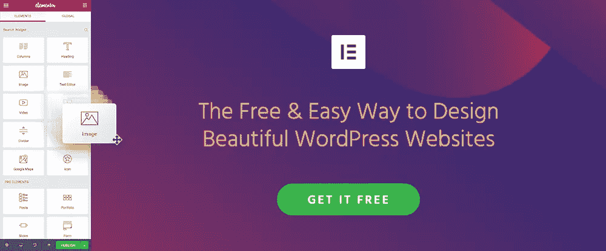
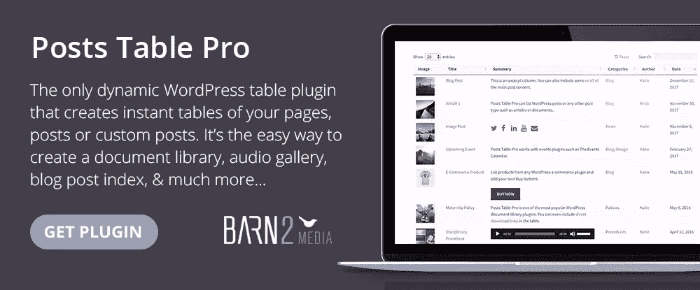
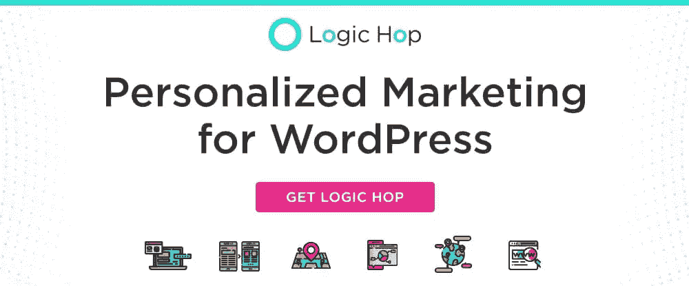
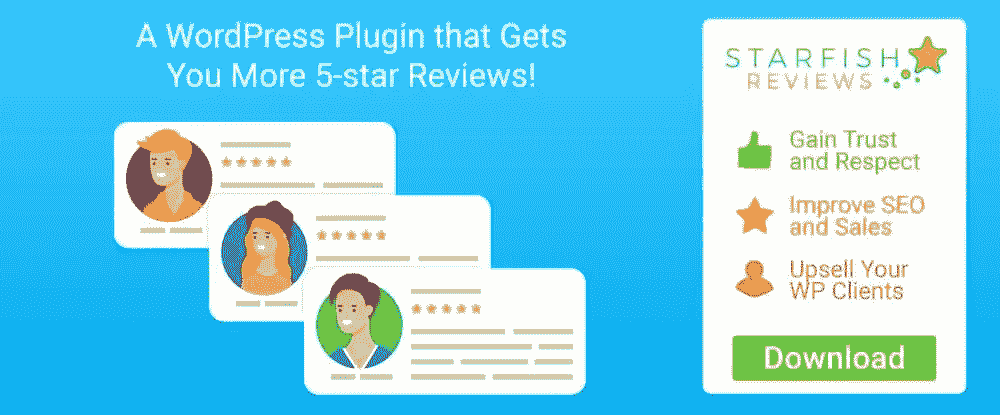

# 这些基本的 WordPress 工具和服务中有多少是你正在使用的？

> 原文：<https://www.sitepoint.com/how-many-of-these-essential-wordpress-tools-services-are-you-using/>

*本文是与 [BAWMedia](https://bawmedia.com/) 合作创作的。感谢您对使 SitePoint 成为可能的合作伙伴的支持。*

WordPress 成为了互联网的终极网站建设者。这是因为他们的设计团队将此作为他们的目标，并努力实现它。这里没有魔法。这是一个关于创建一个生成器的问题，它可以让网页设计者以他们想要的任何方式调整他们的网站。WordPress 团队也想出或推广了一些工具和插件，使他们能够做到这一点。

工具并不是唯一让 WordPress 成为终极构建者的东西。这也是企业和机构提供的服务。本文专门介绍 10 种顶级工具和服务。

这些中的任何一个都可以让你的工作和最终产品达到比你想象的更高的水平。

所以，喝杯咖啡，享受这段旅程吧。

## [1。元素或页面生成器](https://elementor.com/?utm_source=baw&utm_medium=pr&utm_campaign=top10)

当寻找建立网站的最佳方法时，你需要一个提供最大灵活性的解决方案。这正是 Elementor 所提供的，也正是这种方法让它在不到两年的时间里成为了排名第一的页面生成器。这个免费的开源页面生成器可以让你构建任何东西，不需要任何编码。

您可以从 Elementor 的 130 个设计师制作的模板之一开始，设计自己的模板，或者从其他地方导入一个模板。

Elementor 为您提供了超快的性能，由于它的实时前端编辑功能，它可以使您成为一个超快的网站建设者。特别的功能包括新的可重用模板，表单集成，自定义 CSS，可视化表单生成器和增强的菜单生成器。当然还有很多，最好的学习方法是自己尝试，看看为什么有人会上瘾。

不到两年前，Elementor 的用户群从零开始，现在已经达到了 100 万。

这说明了一些问题！

## [2 .布里兹〔t1〕](https://brizy.io/?utm_source=sitepoint.com&utm_medium=content&utm_campaign=wptools)

Brizy 是另一个首要的工具，它提供了一个轻松的可视化构建 WordPress 网站的方法。它还可以免费下载，易于使用，它提供的 UX 和你在任何地方都能找到的一样友好和直观。

出色的用户体验部分归功于其整洁的界面。虽然 Brizy 提供了大量的设计和开发功能和选项，但它们不会分散我们的注意力。它们不会被塞进遥远的边栏；他们只在你需要的时候出现。

看 Brizy 是否适合你的一个好方法是在他们的网站上测试它。它不会花费你一分钱，你甚至可以保存你创建的 HTML，在任何你想用的地方使用。

该套件包括 4000 多个图标和 150 个预制设计块。

## [3。帖子表 Pro WordPress 表插件](https://barn2.co.uk/wordpress-plugins/posts-table-pro/?utm_source=baw)

Posts Table Pro 是创建文档库、事件目录、音乐播放列表、成员目录等等的终极插件。使用这个插件时，创建库、目录和其他表不需要输入数据。这是因为数据已经存在于 WordPress 数据库中，例如作为你的文章、页面或自定义文章类型。包括音频文件、图像、视频播放器和媒体播放列表在内的多媒体内容可以显示在同一个表格中。

Post Table Pro 的常见用途包括编译 WordPress 文档库、成员目录、博客文章或网页索引，以及在表格中列出来自任何电子商务插件的产品。

Post Table Pro 易于使用，非常灵活。条目可以排序，列可以定制，表可以响应，短码可以用来选择各种表选项。

## [4。WordXpress](https://wordx.press/?utm_source=sitepoint.com&utm_medium=posts&utm_campaign=bawwparticles)

worxpress 在许多领域提供 WordPress 网站维护和支持。这项服务将通过对您的网站进行必要的更新和编辑，预测和预防潜在的问题，并在您的网站上实施 SEO 优化、安全、速度和营销工具，使您的生活更加轻松，并减少您的工作压力。

WordXpress 的管理计划包括安全性、云备份、营销工具，甚至主机托管。

## [5。逻辑跳跃 WordPress 的个性化营销](https://logichop.com/?utm_source=baw)

虽然有许多营销解决方案，但 WordPress Logic Hop 的表现最为突出。Logic Hop 提供个性化的营销解决方案，根据访问者在您网站上的活动、他们的兴趣以及他们来自哪里，提供更多的销售、线索和转换。

您可以使用 Logic Hop 即时收集数据，或者将其与 WooCommerce、Google Analytics 或其他工具集成，以获取您的个性化营销数据。

## [6。好东西](https://goodiewebsite.com/?utm_source=sitepoint.com&utm_medium=content&utm_campaign=wptools)

建立网站的最好方法之一是将设计交给开发团队或代理。由经验丰富、能力超群的开发人员组成的 Goodie 团队随时为您服务。

无论您是提供一套数字设计文件供他们使用，还是仅仅在纸上勾勒出您的设计想法，他们都会与您合作，确保您获得想要和期望的结果。

## [7。WordLift](https://wordlift.io/ai-powered-seo/?utm_source=baw)

WordLift 是一个人工智能支持的 SEO 解决方案，可以将您的内容转换为机器友好的内容，供搜索爬虫、聊天机器人和数字助理(如 Siri 和 Alexa)使用，以增加您的流量，并帮助消费者做出决定和采取行动。

不需要任何技术技能或专业知识，内容作者可以创建语义内容推荐，自动链接和其他搜索引擎优化友好的功能，以创建一个更丰富和更友好的 UX，并增加您的网站的影响范围。

## [8。海星评论-WP 插件](https://starfish.reviews/?utm_source=sitepoint.com&utm_medium=posts&utm_campaign=bawwparticles)

如果你收到的评论倾向于 1-3 星，海星评论是一个 WordPress 评论管理插件，可以帮助你做得更好。海星评论使你能够在你选择的平台上获得评论，包括亚马逊、谷歌、脸书或像 iTunes 和猫途鹰这样的专业平台。

借助这个“声誉管理”工具，你的评论评分一定会提高。

## [9。Fixmysite.com](https://fixmysite.com/?utm_source=sitepoint.com&utm_medium=content&utm_campaign=wptools)

无论是你的车还是你的网站，如果它有问题需要修理，把它交给一个合格的机械师，你会得到最大的回报(也可能省钱)。Fixmysite.com 是互联网的邻居车库，Fixmysite.com 团队是合格的网站机械师。

所提供的服务种类繁多，所提供的服务由 100%退款政策保证。

## 10。WP Review Pro

不同的产品或服务评论可以用不同的方式表达，有些比其他的更好。审核摘要的范围可以从计算出的批准百分比到几个小数位，再到拇指向上/拇指向下图标。这个 WordPress 评论插件是 WooCommerce 兼容的，给你这种灵活性。

例如，你可以使用 16 种预制模板中的任何一种，在谷歌搜索结果中显示星级，这些模板可以根据你的品牌进行定制。

## 结论

给每个人的东西，都是好的。从两个网站建设工具开始，我们转向更专业的工具和服务。这些可以扩展你的在线状态和管理你的网站的能力。他们也能修理需要修理的东西。

大多数这些网站的“增强”需要你付出巨大的努力。因此，这些比黄金的价值更高。

## 分享这篇文章