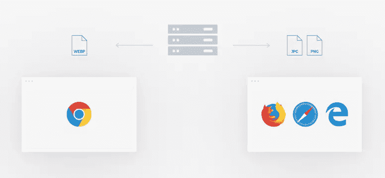
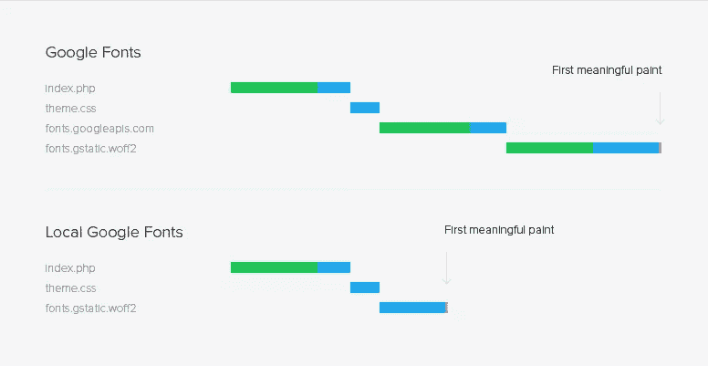

# 用 YOOtheme Pro 加速你的 WordPress 网站

> 原文：<https://www.sitepoint.com/speed-up-your-wordpress-website-with-yootheme-pro/>

*本文是与 [YOOtheme](https://yootheme.com) 合作创作的。感谢您对使 SitePoint 成为可能的合作伙伴的支持。*

从 2018 年 7 月开始，谷歌开始根据移动页面速度对他们的移动搜索结果进行排名。这使得页面速度优化比以前更加重要。幸运的是，有一些工具可以帮助你提高网站的速度。YOOtheme Pro ，一个新的 WordPress 主题和页面生成器，由于其小而干净的代码库和最新网络技术的使用，确保了你的网站的高页面速度排名。这是它的工作原理。

## YOOtheme Pro 是什么？

对于那些不熟悉 YOOtheme Pro 的人来说，它是 WordPress 和 Joomla 的一个强大的主题和页面生成器。以下是它的主要特点:

*   直观的拖放页面生成器
*   拥有 30 多个元素(包括滑块、幻灯片等)的元素库。)
*   包含 100 多种预建高级布局的布局库
*   包含 70 多种手工样式的样式库
*   综合 Unsplash 图书馆
*   woo 商务支持
*   页脚生成器
*   快速轻量级代码库

[https://www.youtube-nocookie.com/embed/c2pz2mlSfXA?rel=0&showinfo=0](https://www.youtube-nocookie.com/embed/c2pz2mlSfXA?rel=0&showinfo=0)

## YOOtheme Pro 如何加速你的网站？

YOOtheme Pro 是用 JavaScript 库 Vue.js 和前端框架 UIkit 构建的。得益于这两个库，YOOtheme Pro 极具模块化和可扩展性，其快速轻量的 JavaScript 提供了出色的用户体验。页面生成器生成小而干净的语义标记，这是为快速加载时间而优化的。所以让我们仔细看看 YOOtheme Pro 用来加快浏览器渲染时间的技术。

## 延迟加载图像

图片占了网站总大小的大部分，这会显著影响加载时间。为了提高页面速度和减少服务器流量，YOOtheme Pro 使用了延迟加载。这意味着最初只有折叠以上的图像被完全加载。其他图像在进入视口时被加载。为了防止内容跳转，会立即生成一个空的占位符图像。你的访问者甚至不会注意到图像是缓慢加载的，第一个有意义的绘图在屏幕上会变得更快。你也可以延迟加载视频元素。

## 自动生成的 srcsets

为了确保您在每台设备上都获得最佳分辨率，YOOtheme Pro 会自动生成 srcsets。这些是同一图像的不同尺寸的多个版本，每个版本用于特定的设备。当您在 YOOtheme Pro 的页面生成器中上传图像并设置宽度或高度值时，YOOtheme Pro 会生成七个 srcset 图像。前两个是目标大小的 100%和 200%。其他五个图像具有最常用的设备分辨率:768、1024、1366、1600 和 1920。当然，这些只有在图像大小允许的情况下才会生成，这就是为什么你应该总是上传尽可能高分辨率的图像。这项功能将保证从手机到视网膜显示器的最佳用户体验。

虽然 srcsets 确实提高了性能，但它们通常不适用于用作节或列背景的背景图像。这些图像扩展到全幅，通常非常大，所以在手机上加载它们需要很大的带宽。为了解决这个问题，YOOtheme Pro 还为背景图片生成了 srcsets，这对你的移动页面速度排名很有帮助。

## 下一代图像格式

为了节省带宽，谷歌还建议使用像 WebP 这样的下一代图像格式。与最常用的图像格式 JPEG 和 PNG 相比，这种格式具有更好的压缩和质量特性。使用 WebPs 可以节省空间并消耗更少的蜂窝数据。YOOtheme Pro 自动为 Chrome 浏览器生成并提供 WebP 格式的图像。如果访问者使用其他浏览器，原始 JPEG 或 PNG 图像将被提供。

## 本地谷歌字体

YOOtheme Pro 在本地存储谷歌字体。当您在 YOOtheme Pro 中选择 Google 字体时,“woff”和“woff2”字体文件会下载到您的服务器并包含在 CSS 中。这不仅有助于 GDPR 合规，而且还极大地提高了网站的速度，因为不再需要往返谷歌服务器了。而如果你的 web 服务器支持 HTTP/2，根本就没有往返。

## 其他高级功能

除了提供快速的用户体验，YOOtheme Pro 对开发者也非常友好。它允许你覆盖和扩展一切，添加自定义元素，CSS，JavaScript，甚至创建新的主题设置。YOOtheme 提供了关于 YOOtheme Pro 的大量文档，其中包括专门为开发人员编写的部分。在那里，您可以找到关于自定义资产、子主题、自定义元素等的信息、教程和示例。

## 结论

正如你所看到的，YOOtheme Pro 是一个非常通用的主题和页面生成器，它非常关心速度。它为你的 Google PageSpeed 排名集成了比现在 WordPress 市场上任何其他页面生成器更多的优化。对于设计师来说，这是一个很好的工具，它给了他们不需要任何编码就能进行创作的能力。但它也是为开发人员设计的，给他们定制一切的可能性。YOOtheme Pro 定期发布特定主题的主题包，包括经过深思熟虑的内容结构。漂亮的布局、各种风格和免费使用的图片以及定期的功能更新使 YOOtheme Pro 成为下一个值得关注的 WordPress 主题和页面生成器。因此，请使用 [YOOtheme Pro](https://yootheme.com) 亲自体验一下吧。

## 分享这篇文章