# 如何使用预建的网站来刷新网站的外观

> 原文：<https://www.sitepoint.com/how-to-use-a-pre-built-website-to-refresh-a-websites-look/>

*本文是与 [BAWMedia](https://bawmedia.com/) 合作创作的。感谢您对使 SitePoint 成为可能的合作伙伴的支持。*

有很多网站急需更新。设计师可以通过结合一个或多个当前的网页设计趋势来做到这一点。当前的趋势涉及从升级配色方案到重新组织设计内容的方方面面。

这可能是一个漫长而费力的任务，这是大多数网页设计师都希望避免的。同样的设计师也对快速修复持怀疑态度，担心他们会损害他们的工作质量。

[**BeTheme**](http://themes.muffingroup.com/be/splash/?utm_source=sitepoint.com&utm_campaign=jul18&utm_medium=content) 提供了一种快速简单的方法来重新设计一个网站。它提供了超过 350 个预建网站设计的选择。这些模板可以定制，以满足企业对网站的需求。完成后的网站将有一个最新的外观和感觉，已经内置了许多必要的变化。

## 快速重新设计

快速重新设计一个过时网站的方法不止一种。有可能将其转化为最新的奖项获得者。你可以使用一个预先建立的网站作为起点。这里有 7 种方法可供选择。它们附有预先构建的网站示例来说明可能性。

### 快速重新设计#1:让一个普通的网站更有活力

动态的主页更容易吸引访问者的注意力。这有助于说服他们留下来一段时间。大多数游客在大约 3 秒钟内决定是留下还是离开。如果你能让访问者保持更长时间的参与，你就有了一个潜在的客户。一个动态的主页激起了访问者的好奇心，并希望看到前方有什么惊喜。这可以通过引人注目的图像、视频或动画来实现。

*提示*:如果你使用视频，确保播放按钮在最前面和中间。

 **[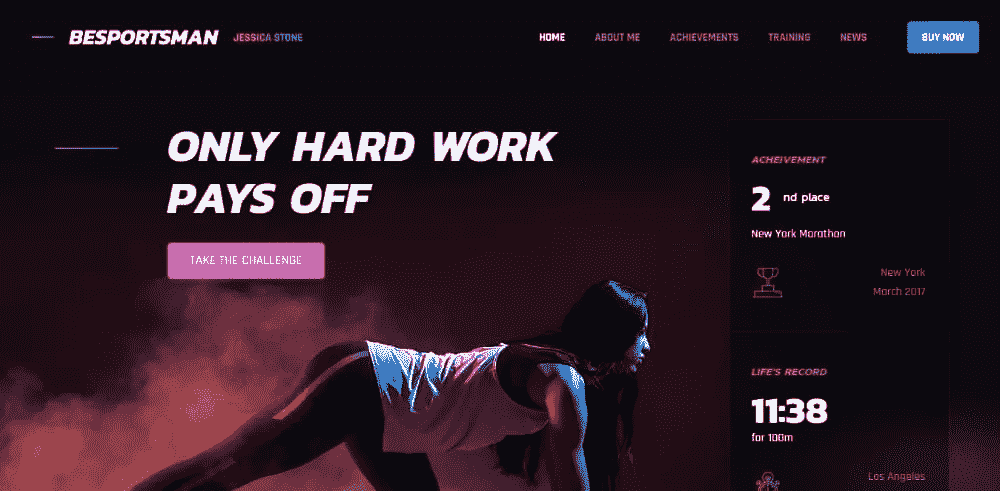](http://themes.muffingroup.com/be/sportsman/?utm_source=sitepoint.com&utm_campaign=jul18&utm_medium=content)

[**贝巴尔曼**](http://themes.muffingroup.com/be/barman/?utm_source=sitepoint.com&utm_campaign=jul18&utm_medium=content)

 [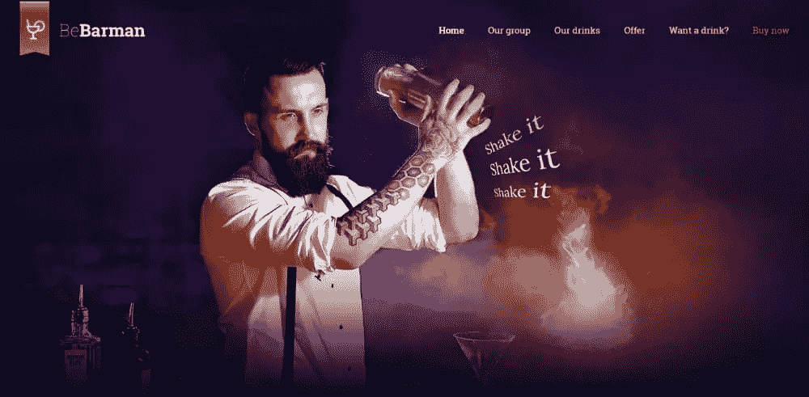](http://themes.muffingroup.com/be/barman/?utm_source=sitepoint.com&utm_campaign=jul18&utm_medium=content)

[**始于**](http://themes.muffingroup.com/be/game/?utm_source=sitepoint.com&utm_campaign=jul18&utm_medium=content)

[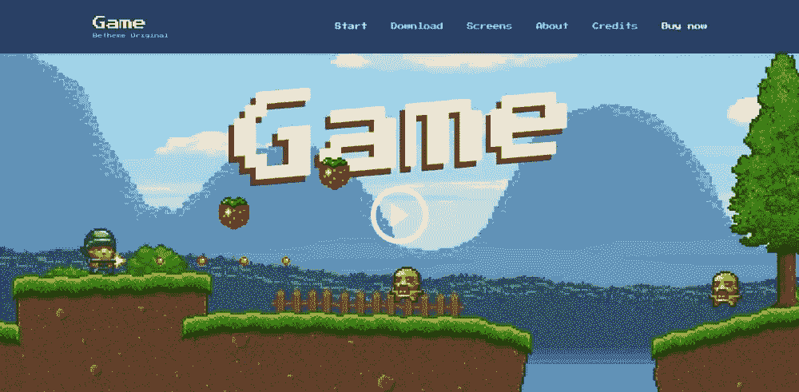](http://themes.muffingroup.com/be/game/?utm_source=sitepoint.com&utm_campaign=jul18&utm_medium=content)

### 快速重新设计#2:刷新配色方案，使之与时俱进

这通常是一个简单的解决办法，它可以通过显著改变网站的外观和感觉带来巨大的影响。新的配色方案可以在帮助企业实现目标方面发挥重要作用。

一个预建的网站使刷新配色方案变得容易。它的颜色将符合现有的行业或商业趋势。

提示:当你写的时候，使用大量的空白。它让网站看起来更时尚，让颜色更突出。

[**BeApp3**](http://themes.muffingroup.com/be/app3/?utm_source=sitepoint.com&utm_campaign=jul18&utm_medium=content)

[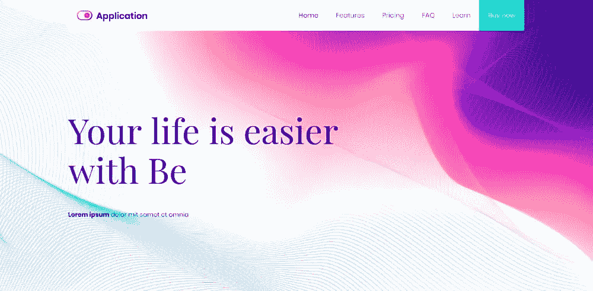](http://themes.muffingroup.com/be/app3/?utm_source=sitepoint.com&utm_campaign=jul18&utm_medium=content)

[**betea 2**](http://themes.muffingroup.com/be/tea2/?utm_source=sitepoint.com&utm_campaign=jul18&utm_medium=content)

[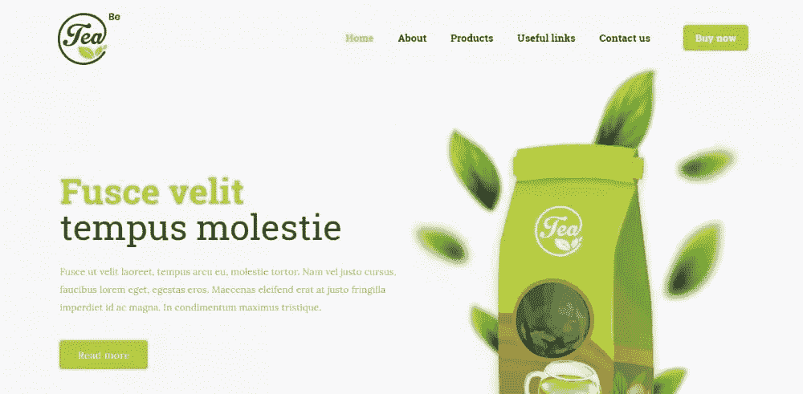](http://themes.muffingroup.com/be/tea2/?utm_source=sitepoint.com&utm_campaign=jul18&utm_medium=content)

[**求服务**](http://themes.muffingroup.com/be/gsmservice/?utm_source=sitepoint.com&utm_campaign=jul18&utm_medium=content)

### 快速重新设计#3:重组网站的内容架构

许多老网站需要一个全面的架构改革。当试图将文本和图像结合起来时，找到正确的平衡从来都不是一件容易的事。除非你正在使用一个预建的网站。这样的网站可以考虑到很多需要做的事情。从下面的例子中你可以看到，他们在吸引和吸引访问者方面做得很好。

[**比德科尔 2**](http://themes.muffingroup.com/be/decor2/?utm_source=sitepoint.com&utm_campaign=jul18&utm_medium=content)

 [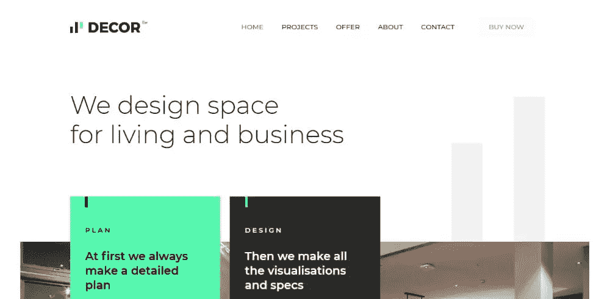](http://themes.muffingroup.com/be/decor2/?utm_source=sitepoint.com&utm_campaign=jul18&utm_medium=content)

[**bedietian 2**](http://themes.muffingroup.com/be/dietitian2/?utm_source=sitepoint.com&utm_campaign=jul18&utm_medium=content)

[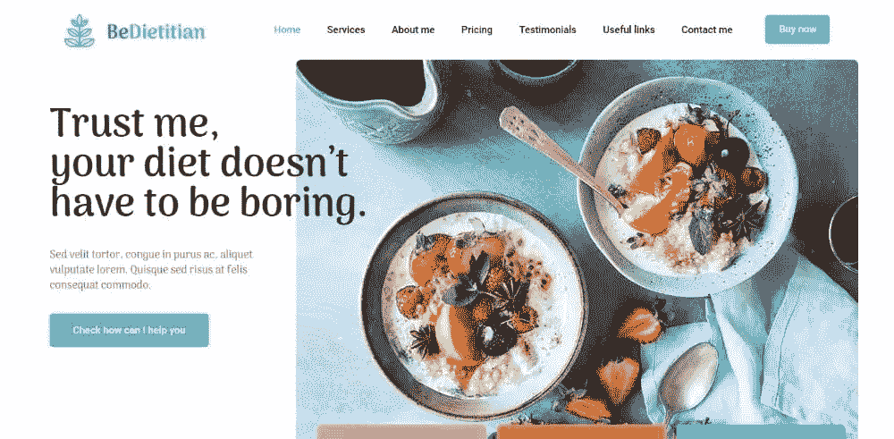](http://themes.muffingroup.com/be/dietitian2/?utm_source=sitepoint.com&utm_campaign=jul18&utm_medium=content)

[**贝记者**](http://themes.muffingroup.com/be/journalist/?utm_source=sitepoint.com&utm_campaign=jul18&utm_medium=content)

[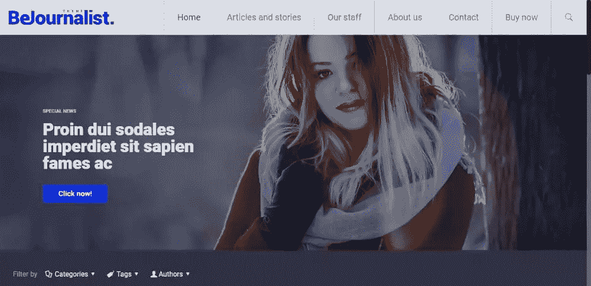](http://themes.muffingroup.com/be/journalist/?utm_source=sitepoint.com&utm_campaign=jul18&utm_medium=content)

## 快速重新设计#4:融入大而醒目的视觉效果

让网站焕然一新的第一步是从主页开始。添加一个大的，令人惊叹的视觉效果通常是吸引访问者逗留和探索网站所需要的。添加所需的图像可以在几秒钟内完成。这三个预先构建的网站表明，结果可以是杰出的。

[**BeDigital**](http://themes.muffingroup.com/be/digital/?utm_source=sitepoint.com&utm_campaign=jul18&utm_medium=content) 是使用令人着迷的 3D 静态图片的一个例子，这是不可能忽略的。

[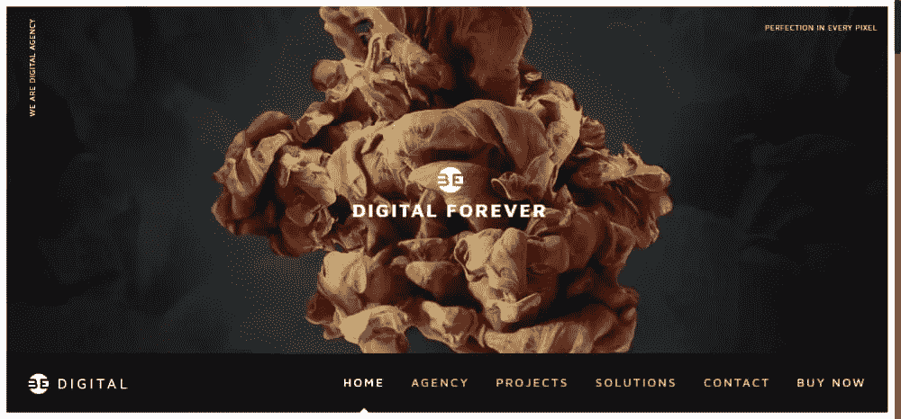](http://themes.muffingroup.com/be/digital/?utm_source=sitepoint.com&utm_campaign=jul18&utm_medium=content)

[**BeEco**](http://themes.muffingroup.com/be/eco2/?utm_source=sitepoint.com&utm_campaign=jul18&utm_medium=content) 利用意象以一种意想不到的方式整合最重要的信息。

[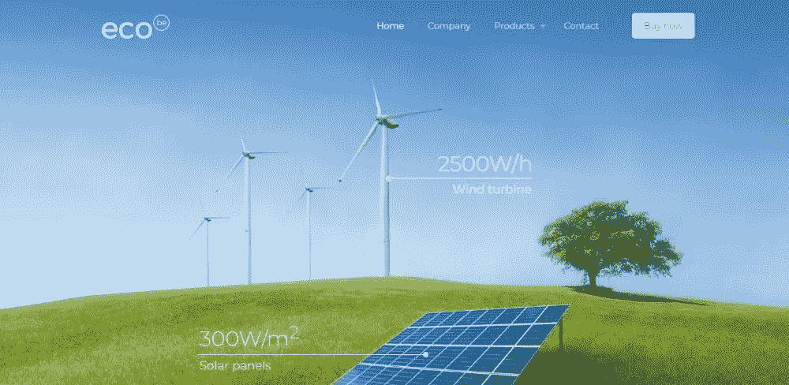](http://themes.muffingroup.com/be/eco2/?utm_source=sitepoint.com&utm_campaign=jul18&utm_medium=content)

或者试着通过改变背景给一个常见的、过度使用的图像一个巧妙的改变。BeAirport 通过将飞机的经典图像变成迷人的视觉效果来做到这一点。

[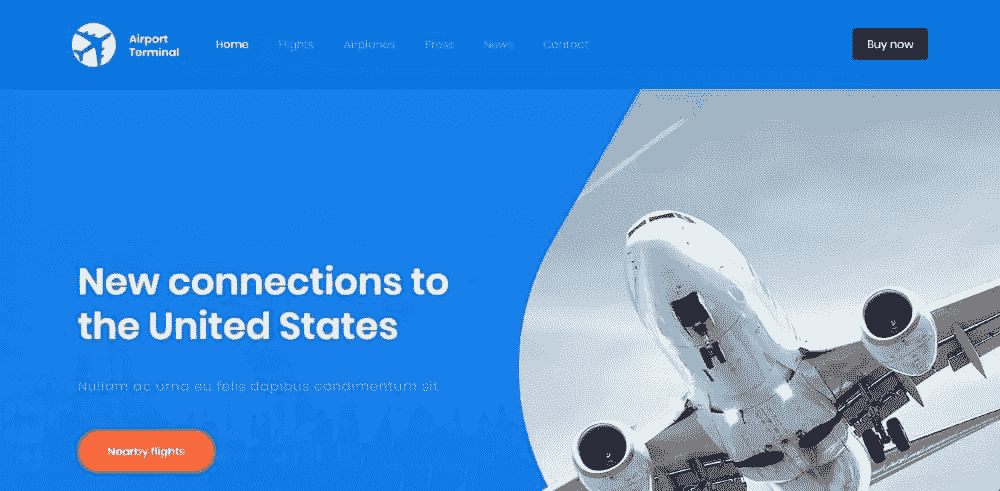](http://themes.muffingroup.com/be/airport/?utm_source=sitepoint.com&utm_campaign=jul18&utm_medium=content)

## 快速重新设计#5:重新设计网站，给访问者一个完美的购物体验

当一个现代化的网上商店就位时，有许多重要的功能和细节要做。其中一些是老网站普遍缺乏的。当刷新一个电子商务网站时，还有一件事需要考虑。这是事实，一千或更多的其他网站可以销售相同的产品。

一个预建的电子商务网站通常是你更新在线商店所需要的。像这样，你就可以让购物体验变得流畅而直观。这些模板遵循 eComm 的黄金法则。因此，只需要几个小时就可以让你重新设计的网上商店开始运行。

[**我是**](http://themes.muffingroup.com/be/denim/?utm_source=sitepoint.com&utm_campaign=jul18&utm_medium=content)

 **[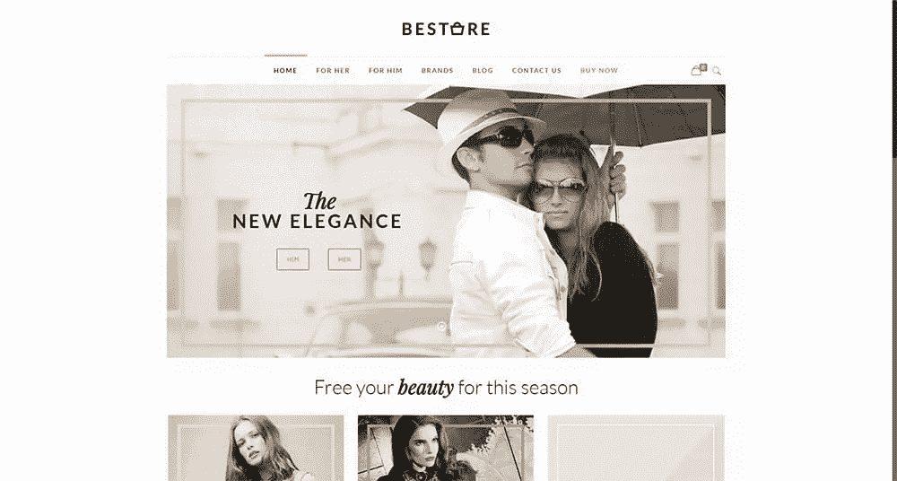](http://themes.muffingroup.com/be/store/?utm_source=sitepoint.com&utm_campaign=jul18&utm_medium=content)

[**BeVegetables**](http://themes.muffingroup.com/be/vegetables/?utm_source=sitepoint.com&utm_campaign=jul18&utm_medium=content)

[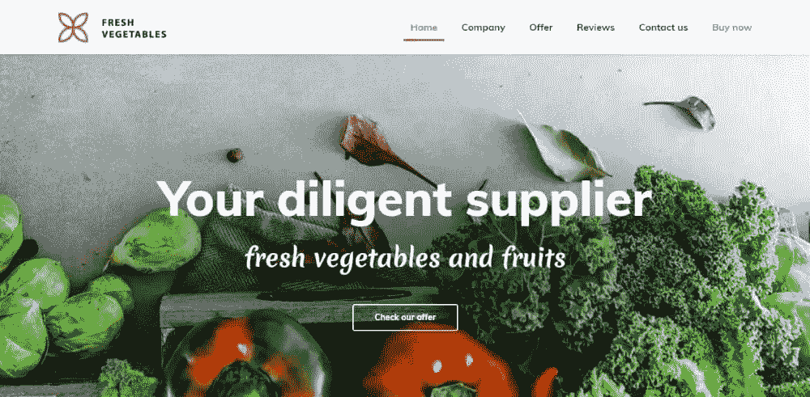](http://themes.muffingroup.com/be/vegetables/?utm_source=sitepoint.com&utm_campaign=jul18&utm_medium=content)

## 快速重新设计#6:升级投资组合网站

作品集网站的布局可以增加或减少展示的材料。许多老网站在尽可能好地展示作品集内容方面做得不太好。更新投资组合网站可能只需要使用预先构建的网站。拿着它上传你的内容。一个很酷的首页也有帮助，正如你在这里看到的。

[**摄影**](http://themes.muffingroup.com/be/photography/?utm_source=sitepoint.com&utm_campaign=jul18&utm_medium=content)

[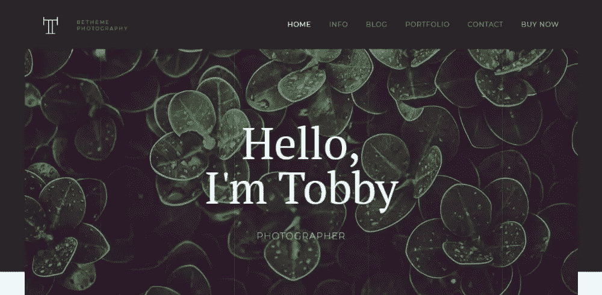](http://themes.muffingroup.com/be/photography/?utm_source=sitepoint.com&utm_campaign=jul18&utm_medium=content)

[**bear architect 3**](http://themes.muffingroup.com/be/architect3/?utm_source=sitepoint.com&utm_campaign=jul18&utm_medium=content)

 [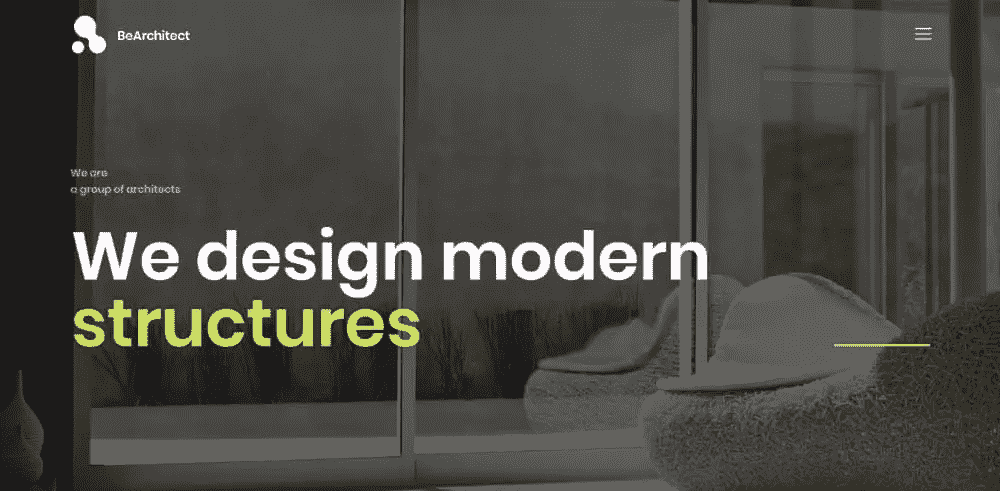](http://themes.muffingroup.com/be/architect3/?utm_source=sitepoint.com&utm_campaign=jul18&utm_medium=content)

[**Be3D**](http://themes.muffingroup.com/be/3d/?utm_source=sitepoint.com&utm_campaign=jul18&utm_medium=content)

[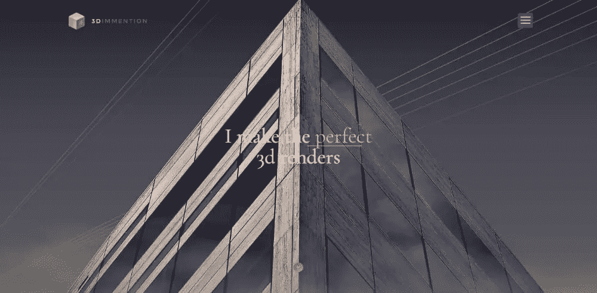
](http://themes.muffingroup.com/be/3d/?utm_source=sitepoint.com&utm_campaign=jul18&utm_medium=content)

## 快速重新设计#7:简化过度拥挤的网站，然后再简化一些

这里最难的部分是决定哪些内容如此重要以至于值得强调。您还需要确定哪些内容只需要重新组织。虽然由你来决定，但是使用一个预建的网站可以，例如，使决定过程更容易。

[**简单 2** 简单 3](http://themes.muffingroup.com/be/simple2/?utm_source=sitepoint.com&utm_campaign=jul18&utm_medium=content)

[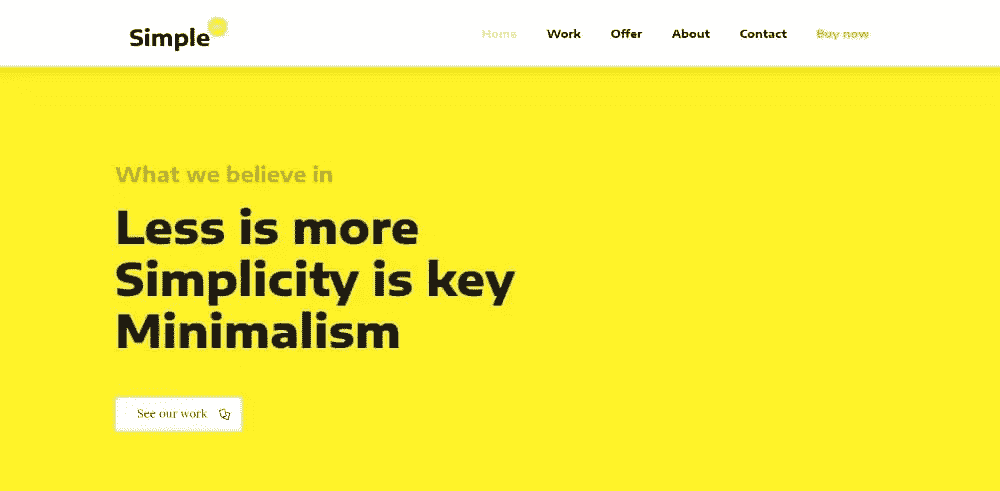](http://themes.muffingroup.com/be/simple2/?utm_source=sitepoint.com&utm_campaign=jul18&utm_medium=content)

[**贝霍姆**](http://themes.muffingroup.com/be/home/?utm_source=sitepoint.com&utm_campaign=jul18&utm_medium=content)

[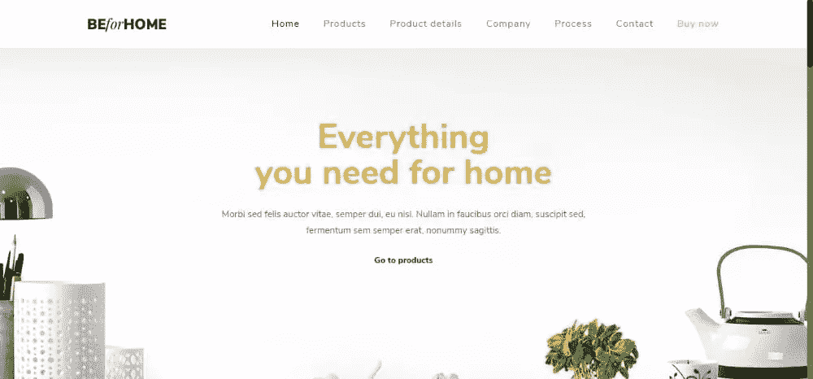](http://themes.muffingroup.com/be/home/?utm_source=sitepoint.com&utm_campaign=jul18&utm_medium=content)

 **[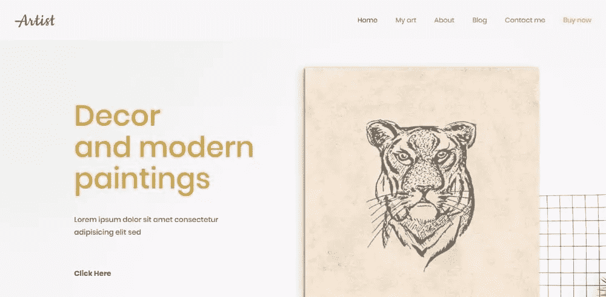](http://themes.muffingroup.com/be/artist2/?utm_source=sitepoint.com&utm_campaign=jul18&utm_medium=content)

## 结论

重新设计网站通常需要一些仔细的思考。然而，如果你知道这 7 种快速重新设计方法，并不需要做很多工作或花费大量时间。你只需要很好地利用 BeTheme 的预建网站来帮助你前进。

这些模板甚至有助于您的决策过程。大部分需要做的事情要么已经做了，要么指出了你需要做的事情。如果你没有一个或多个这些预建的网站来开始，你可以在这里得到一个。

## 分享这篇文章******