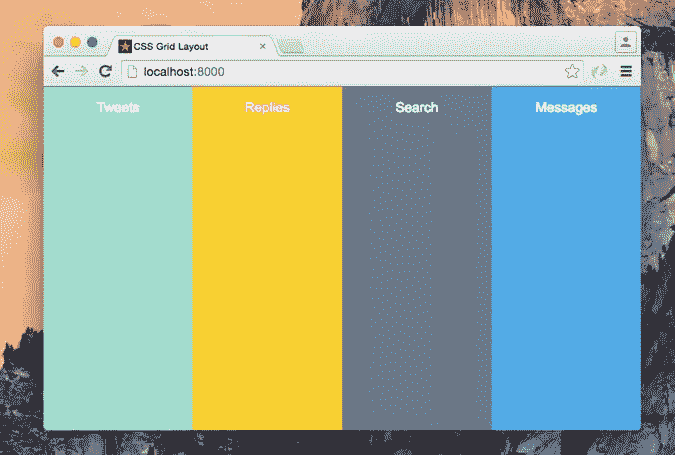
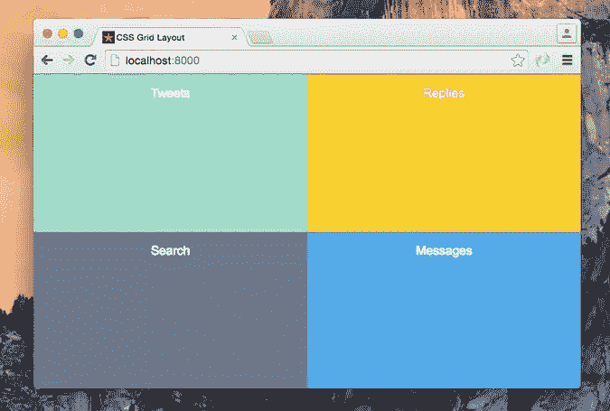
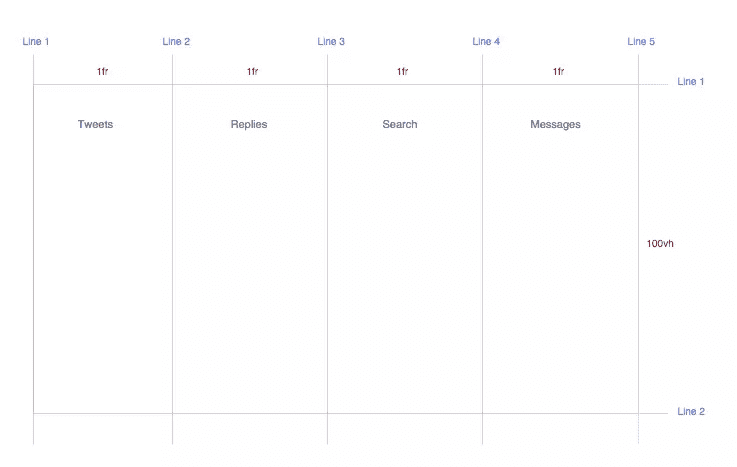
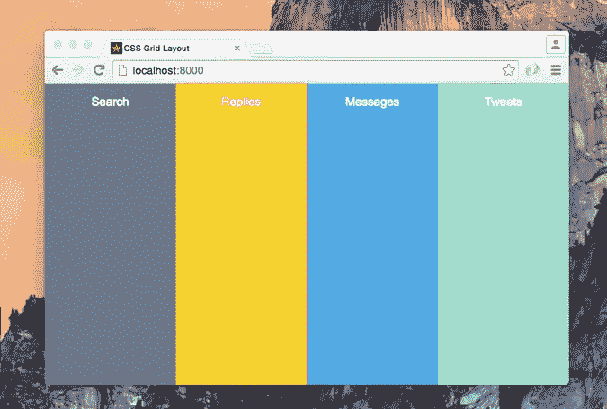
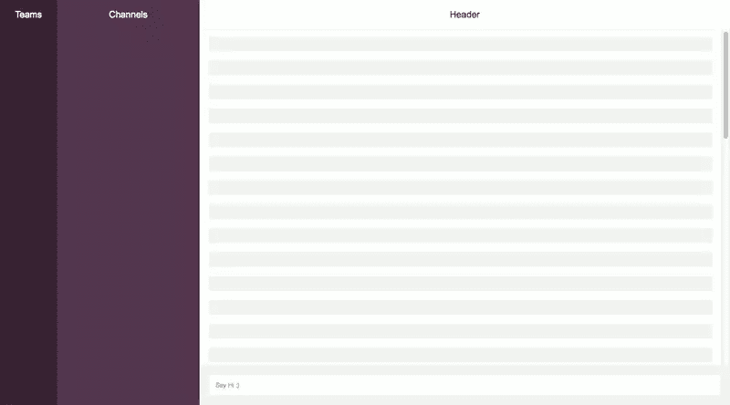
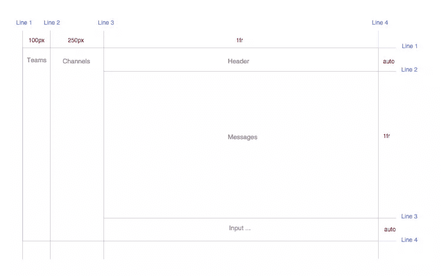

# CSS 网格布局介绍

> 原文：<https://www.sitepoint.com/introduction-css-grid-layout-module/>

CSS 网格非常适合创建页面布局。随着 web 应用程序变得越来越复杂，我们需要一种更自然的方式来轻松地进行高级布局，而不需要像浮动和其他繁琐技术这样的笨拙解决方案。

在这篇介绍性教程中，我将向您介绍这个相对较新的 CSS 特性，我将讨论当前的浏览器支持，并且我将使用一些示例向您展示 [CSS 网格布局](https://developer.mozilla.org/en-US/docs/Web/CSS/CSS_Grid_Layout)是如何工作的。

## 什么是 CSS 网格布局？

CSS 网格用于将网页或容器划分为列和行，并能够根据我们根据大小、位置和层创建的行和列来定位和调整构建块元素的大小。

网格还为我们提供了一种灵活的方式，只需要 CSS 就可以改变元素的位置，而不需要对 HTML 做任何改变。这可以与媒体查询一起使用，以改变不同断点处的布局。

## CSS 网格浏览器支持

CSS Grid 被所有流行浏览器的最新版本所支持，占全球用户的 97%。

### Internet Explorer …和其他不支持的浏览器

网格布局的第一个提议是由微软开发的，IE10 附带了一个带`-ms`前缀的实现。如果你看一下[对我能使用](http://caniuse.com/#feat=css-grid)的支持，你会发现 IE10 和 IE11 都支持 CSS 网格…但警告他们只支持旧版本的规范。真扫兴。这是不会改变的。但是改变的是这些浏览器的用法。2018 年 7 月，IE11 的使用率在全球范围内下降到 2%左右，IE10 的使用率约为 0.1%。

Caniuse.com 还指出，其他一些浏览器不支持网格布局。其中包括 Opera Mini (<1%的用户)和 Baudu 浏览器(0%)。如果你正在构建一个大规模采用的应用程序，那么建议你构建 CSS 无网格移动视图或者实现一个后备。

### 不支持浏览器的回退

鉴于目前使用的绝大多数浏览器都支持 CSS Grid，以某些浏览器可能不支持它为由不使用它是一种耻辱。使用网格并为不支持的浏览器提供完全足够的回退有多种选择。

也许最简单的选择是提供一个简单的“移动优先”布局。这对于不支持网格的移动设备以及像 IE 这样的桌面浏览器来说已经足够了。

另一种选择是使用更复杂的回退和覆盖来产生与 Grid 类似的结果，正如 Rachel Andrew 概述的[。](https://rachelandrew.co.uk/css/cheatsheets/grid-fallbacks)

## 网格布局示例

让我们从一个例子开始，看看网格布局的威力，然后我将更详细地解释一些新概念。

假设您想要创建一个 Twitter 应用程序，它有四个全高的列布局(Tweets、Replies、Search 和 Messages)，类似于下面的截图。

[](https://www.sitepoint.com/wp-content/uploads/2016/03/1456867693gridlayout04.jpg)

这是我们的 HTML:

```
<div class="app-layout">
<div class="tweets">Tweets</div>
<div class="replies">Replies</div>
<div class="search">Search</div>
<div class="messages">Messages</div>
</div>
```

然后我们将一些 CSS 应用到`.app-layout`容器元素:

```
.app-layout {
display: grid; /* 1 */
grid-template-columns: 1fr 1fr 1fr 1fr; /* 2 */
grid-template-rows: 100vh; /* 3 */
}
```

[**在这里查看试玩**](http://codepen.io/SitePoint/pen/ONPGqz)

下面是我们在前面的 CSS 中所做的解释:

1.  将显示属性设置为`grid`。
2.  将容器元素分成四列，每列是网格容器内自由空间的`1fr` [(一个分数)](https://drafts.csswg.org/css-grid/#fr-unit)。
3.  创建一行，并将高度设置为`100vh`(全视口高度)。

如您所见，网格布局模块向属性`display`添加了一个新值，即`grid`。`grid`值负责将`.app-layout`元素设置为网格容器，这也为其内容建立了一个新的[网格格式上下文](https://drafts.csswg.org/css-grid/#grid-formatting-context)。需要此属性才能开始使用网格布局。

`grid-template-columns`属性指定了网格中每个网格列的宽度，在我们的例子中，它将`.app-layout`容器分成四列；每一个都是可用空间的`1fr` (25%)。

`grid-template-rows`指定了每个网格行的高度，在我们的例子中，我们只在`100vh`创建了一行。

具有两列两行的布局如下所示:

[](https://www.sitepoint.com/wp-content/uploads/2016/03/1456867697gridlayout05.jpg)

我们将使用下面的 CSS:

```
.app-layout {
display: grid;
grid-template-columns: 1fr 1fr;
grid-template-rows: 50vh 50vh;
}
```

[**在这里查看试玩**](http://codepen.io/SitePoint/pen/grbJav)

通过将代码包装在媒体查询中，我们也可以仅在小屏幕上实现上面的示例。这为我们在不同的视窗中定制不同的布局提供了很好的机会。例如，我们可以仅在`1024px`下的视口中创建先前的布局，如下所示:

```
@media screen and (max-width: 1024px) {
.app-layout {
display: grid;
grid-template-columns: 1fr 1fr;
grid-template-rows: 50vh 50vh;
}
}
```

[**在这里查看试玩**](http://codepen.io/SitePoint/pen/aNzrdd)

## 网格布局模块概念

现在您已经看到了一个简单的例子，我想介绍一些新概念，让您更好地理解网格布局。虽然有很多新概念，但我只看其中的几个。

**网格项**
网格项是网格容器的子元素。在上面的例子中，`.tweets`和`.replies`元素可以作为网格项。

**网格线**
[](https://www.sitepoint.com/wp-content/uploads/2016/03/1456867701gridlayout06.png)

网格线是存在于列或行任一侧的线。有两组网格线:一组定义列(垂直轴)，另一组定义行(水平轴)。

根据上面的截图，代表第一个例子，我在`1fr`创建了四列，每列有五条垂直线。我还创建了一行，这给了我们两条水平线。

让我们看看如何在网格容器中放置一个网格项。

## 使用行号定位项目

您可以通过使用属性`grid-column-start`和`grid-column-end`来引用网格中的精确行号。然后我们给这些属性开始和结束行号。

看一下前面的例子，这是默认情况下浏览器为我们定位元素的方式:

```
.tweets {
grid-column-start: 1;
grid-column-end: 2;
grid-row: 1;
}

.replies {
grid-column-start: 2;
grid-column-end: 3;
grid-row: 1;
}

.search {
grid-column-start: 3;
grid-column-end: 4;
grid-row: 1;
}

.messages {
grid-column-start: 4;
grid-column-end: 5;
grid-row: 1;
}
```

查看`.tweet`列的代码，这是 CSS 中三行代码的作用:

1.  从左侧第一条垂直线开始定位子元素。
2.  在第二条垂直线处结束元素的位置。
3.  将元素放在整行中。

您可以通过改变具有不同位置的元素的顺序来改变这一点，因此元素的顺序将是:`.search`、`.replies`、`.messages`和`.tweets`。

[](https://www.sitepoint.com/wp-content/uploads/2016/03/1456867707gridlayout07.jpg)

我们可以这样做:

```
.tweets {
grid-column-start: 4;
grid-column-end: 5;
grid-row: 1;
}

.replies {
grid-column-start: 2;
grid-column-end: 3;
grid-row: 1;
}

.search {
grid-column-start: 1;
grid-column-end: 2;
grid-row: 1;
}

.messages {
grid-column-start: 3;
grid-column-end: 4;
grid-row: 1;
}
```

我们还可以使用`grid-column`速记属性在一行中设置开始行和结束行:

```
.tweets {
grid-column: 4 / 5;
grid-row: 1;
}

.replies {
grid-column: 2 / 3;
grid-row: 1;
}

.search {
grid-column: 1 / 2;
grid-row: 1;
}

.messages {
grid-column: 3 / 4;
grid-row: 1;
}
```

[**在这里查看试玩**](http://codepen.io/SitePoint/pen/BKyeKV)

这改变了仅使用 CSS 的布局结构，而标记仍然没有任何改变。这是使用网格布局模块的一个巨大优势。我们可以重新安排元素的布局，而与它们的源顺序无关，因此我们可以针对不同的屏幕大小和方向实现任何想要的布局。

## 使用命名区域定位项目

网格区域是用于布置一个或多个网格项目的逻辑空间。我们可以使用`grid-template-areas`属性显式地命名一个网格区域，然后我们可以使用`grid-area`属性将一个网格项放入一个特定的区域。

为了使这个概念更清楚，让我们重做四列的例子，首先放置`search`列:

```
.app-layout {
display: grid;
grid-template-columns: 1fr 1fr 1fr 1fr;
grid-template-rows: 100vh;
grid-template-areas: "search replies messages tweets";
}
```

在最后一行，我们将网格容器分成四个命名的网格区域，每个区域代表一列。下一步是将每个网格项目放置到指定的区域:

```
.search {
grid-area: search;
}

.replies {
grid-area: replies;
}

.messages {
grid-area: messages;
}

.tweets {
grid-area: tweets;
}
```

[**在这里查看试玩**](http://codepen.io/SitePoint/pen/LNEoZx)

## 松弛示例

如何使用网格布局模块来实现更复杂的示例，例如，创建[时差](https://slack.com/)布局的构建块。因为我们在讨论布局，所以我们将抽象和简化松散设计为网格中表示的构建块。大概是这样的:

[](https://www.sitepoint.com/wp-content/uploads/2016/03/1456867712gridlayout08.png)

从这个布局中，我们将创建三个垂直列和三个水平行，我们可以使用网格线将其可视化，如下所示:

[](https://www.sitepoint.com/wp-content/uploads/2016/03/1456867718gridlayout09.png)

以下是 HTML:

```
<div class="app-layout">
<div class="teams">Teams</div>
<div class="channels">Channels</div>
<div class="header">Header</div>
<div class="messages">
<ul class="message-list">
<li></li>
<li></li>
</ul>
</div>
<div class="input">
<input type="text" placeholder="CSS Grid Layout Module">
</div>
</div>
```

和 CSS:

```
.app-layout {
display: grid;
height: 100vh;
grid-template-columns: 100px 250px 1fr;
grid-template-rows: auto 1fr auto;
}
```

在这里，我使用`grid-template-columns`属性以 100 像素、250 像素创建三列，第三列占用了剩余的可用空间。最后一行创建了三行:第一行和第三行具有自动高度，而中间一行占用了剩余的可用空间。

CSS 的其余部分如下所示:

```
.teams {
grid-column: 1;
grid-row: 1 / 4;
}

.channels {
grid-column: 2;
grid-row: 1 / 4;
}

.header {
grid-column: 3;
grid-row: 1;
}

.messages {
grid-column: 3;
grid-row: 2;
}

.input {
grid-column: 3;
grid-row: 3;
}
```

[**在这里查看试玩**](http://codepen.io/SitePoint/pen/MyYdeN)

我们还可以使用命名区域创建松弛布局，您可以在本演示中看到[。](http://codepen.io/SitePoint/pen/BKyeLP)

## CSS 网格或 Flexbox

既然你们中的许多人已经开始使用 Flexbox，你们可能想知道:什么时候使用 Flexbox 合适，什么时候使用网格更合适？

正如， [Rachel Andrew 所说的](http://www.slideshare.net/rachelandrew/flexbox-and-grid-layout/89)，使用网格布局作为主页面的行和列结构。用于导航的 Flexbox，UI 元素，任何你可以线性化的东西。

Tab Atkins 的另一个[好解释](https://lists.w3.org/Archives/Public/www-style/2013May/0114.html):

> Flexbox 适用于许多布局和许多“页面组件”元素，因为它们中的大多数基本上都是线性的。网格适用于整体页面布局，也适用于设计中非线性的复杂页面组件。
> 
> 这两者可以任意组合，所以一旦它们都得到广泛支持，我相信大多数页面将由外部网格组成整体布局，由嵌套的 flexboxes 和网格组成页面组件，最后是页面“叶子”处的块/内联/表格布局，这里是文本和内容所在的地方

## 结论

正如您所看到的，CSS 网格布局模块非常强大，因为它代码简洁，而且您可以在不触及标记的情况下更改布局顺序。这些功能帮助我们永久性地改变了创建网页布局的方式。

*你可能也有兴趣阅读[如何使用 CSS 网格](https://www.sitepoint.com/css-grid-center-element/)使一个 Div 居中*。

## 分享这篇文章