# 使用 MongoDB、Azure 和无服务器功能构建定制仪表板

> 原文：<https://www.sitepoint.com/build-custom-dashboards-with-mongodb-azure-serverless-functions/>

*本文最初发表于 [Ahmad Awais](https://ahmadawais.com/wordpress-mongodb-atlas-microsoft-azure-serverless-functions/) 。感谢您对使 SitePoint 成为可能的合作伙伴的支持。*

**TL；DR** :我正在为一个企业客户端构建一个定制的 WordPress 仪表盘，它由 Node.js 之上的 React.js 提供支持，以 MongoDB Atlas 作为数据库。

这个仪表板使用几个微软 Azure 服务，例如认知服务、Azure 应用服务，尤其是无服务器 Azure 功能。在这篇文章中，你将学习如何用它来构建一个小模块，以及我选择堆栈、应用和产品背后的原因。

* * *

我的一个企业客户拥有一家大型网络和媒体公司，他建立了一个大规模的 WordPress 网站。他最近[咨询我](https://ahmadawais.com/contact/)关于建立一个定制的 WordPress 仪表盘(基于 [WordPress REST API](https://developer.wordpress.org/rest-api/) )的可能性——通过机器学习和人工智能帮助他做出明智的商业决策。

随着 JavaScript 蚕食世界，WordPress 通过[创建 Gutenberg 项目](https://ahmadawais.com/create-guten-block-toolkit/)来适应这一变化，我想到了一个架构/堆栈，其中 WordPress 将成为我们的内容层，这是一个熟悉的经过战斗测试的环境，它使用 JavaScript 构建的定制仪表板很好地完成了工作。

当您的任务是构建一个现代 JavaScript 应用程序时，您会发现自己处于不同框架、工具和开发工作流的混合体中。JavaScript 生态系统在过去的几年里成长了很多。今天我们有很多很多好的选择。

因此，在研究了我的选择之后，我选择在 Node.js 之上使用 React.js 来开始构建定制的 WordPress 仪表板。虽然该项目目前处于构思阶段，但我认为我在这里分享我们的一些目标以定义我选择堆栈背后的背景是很重要的。

## 自定义 WordPress 仪表板目标

假设您拥有一家大型网络公司，其中有超过 500 家酒店(位于三个不同的国家)使用您的服务为他们的会议厅、IT 会议和在线财产管理(如网站和博客)提供支持。我的客户就是这么做的。

这大部分是由一个巨大的多站点 WordPress 实例驱动的，它管理酒店、网站、在线预订、注册、活动、门票、评论和评论的一切。也有其他运行不同软件的系统能够通过 REST API 产生内容。

我们已经开始创建一个定制的 WordPress 仪表盘，并考虑了很多目标，但是我列出了一些与这篇文章相关的目标。看看我到目前为止构建的，都是基于无服务器的 Azure 函数——非常棒。

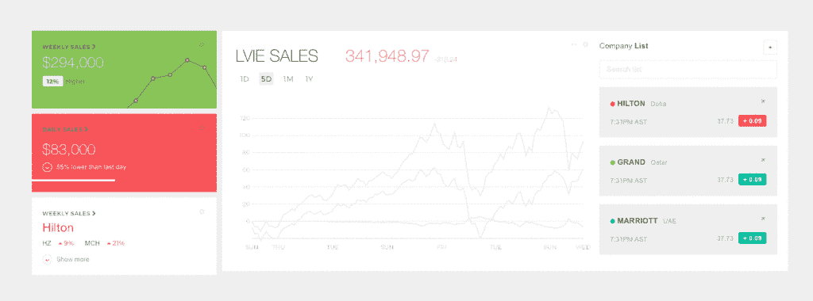

### 👀高级数据报告

定制仪表板将报告所有高级数据，例如，我的客户投资组合(500 多家酒店)中发生的实时销售、基于实体/时间和基于日期的细分。

以及他的每支球队每天、每周、每月的表现。所有这些数据都被输入到 MongoDB Atlas 中。稍后会详细介绍。

### ⚡无服务器自动化

大多数模块都是建立在无服务器架构之上的——在这种情况下，这提供了巨大的好处。所有的自动化总是在运行，费用是随用随付的，即按使用量付费。

初步粗略估计，该解决方案比让服务器虚拟机一直运行要经济 34%。我们使用 [Azure 函数](https://azure.microsoft.com/en-us/services/functions/)来实现这种无服务器自动化。

### 🔥物联网中心

大约有 200 名 IT 经理为我的客户工作，他们拥有支持物联网的设备，可以向多个在线项目提供数据。该定制仪表板还包括用于做出更好决策的数据，并将整个注册、管理和维护团队的中心连接到一个位置。

你可能已经猜到了，这个项目利用微软 Azure 的[物联网中心](https://azure.microsoft.com/en-us/services/iot-hub/)来连接、监控和管理所有的物联网资产。

### 🤖机器学习和人工智能

为了让这个仪表盘通过机器学习变得人工智能，我们使用了微软 Azure 的许多不同服务。

有一个巨大的数据集被馈送到 [ML Studio](https://studio.azureml.net/) 中，它随后帮助我们预测不同的决策，如空间管理、IT 事件的低注册趋势，以及这些事情为什么以及何时发生等问题。

虽然机器学习部分超出了本文的范围，但我仍然计划通过 Azure 的[认知服务](https://azure.microsoft.com/en-us/services/cognitive-services/)接触一些令人敬畏的人工智能。

### 🕰实时直播

这个定制仪表板最重要的一个方面是它是实时的。这意味着我需要一个托管数据库，能够处理如此大量的数据，并且仍然保持高度可用。

但同时，这是出于管理的目的，不需要对 WordPress 站点有任何影响。对于这个仪表板来说，这是一个关键的系统设计决策。

我的意思是，我们可以用这个定制的仪表板做各种各样的实验，但是它不应该对运行多站点 WordPress 实例的数据库/服务器有任何影响。

## 蒙戈布&蒙戈布地图集

对于这个定制的 WordPress 仪表板，我使用 [MongoDB Atlas](https://www.mongodb.com/cloud/atlas?utm_medium=sp-synd&utm_source=sitepoint&utm_content=serverless-functions&jmp=sp-ref) 作为 DBaaS(数据库即服务)。我非常高兴。当我第一次分享我将使用 MongoDB 时，许多开发人员都有顾虑。

[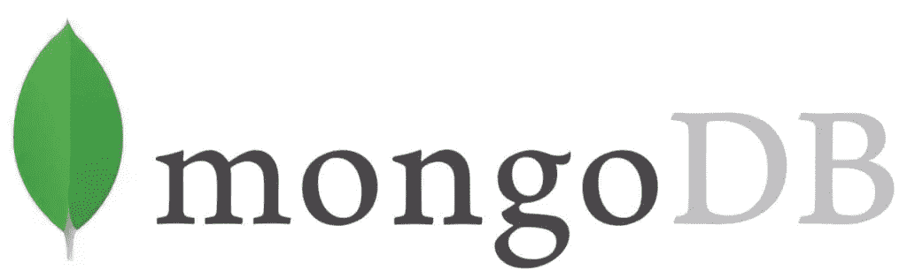](https://www.mongodb.com/?utm_medium=sp-synd&utm_source=sitepoint&utm_content=serverless-functions&jmp=sp-ref)

大多数问题都是问我为什么要通过添加另一个数据库来增加另一层复杂性。为什么不直接使用 WordPress 数据库呢？为了回答这些问题以及更多的问题，我准备了一份关于我为什么使用 [MongoDB Atlas](https://www.mongodb.com/cloud/atlas?utm_medium=sp-synd&utm_source=sitepoint&utm_content=serverless-functions&jmp=sp-ref) 的理由清单。

### ♨不喜欢 RDBMS

我个人不喜欢关系数据库。大多数时候，对我来说，它们是构建应用程序的绊脚石。我必须完全摆脱我正在构建的应用程序，考虑我未来的数据库，并设计一个好的模式，这对于我的开发工作流来说总是一个糟糕的练习。这充其量是反直觉的——至少对我来说是这样。

### 💸硬盘很便宜——CPU/RAM 不便宜

旧的数据库主要是为了节省磁盘空间而设计的。这导致了过多的问题，如标准化、索引，并使分片、自动缩放和复制更加困难。

如今，磁盘空间非常便宜。另一方面，CPU/RAM 不是，如果您最终做出了错误的选择，您的系统管理员成本可能会迅速飙升。

就像你想创建一个定制的仪表板，但是你的系统设计架构师让你的两个系统管理员为他们选择如何设计你的系统付出了代价。同样，我的客户想要一个托管解决方案，而不需要雇用 IT/DevOps 团队——至少对于一个实验性的定制仪表板来说是这样。

### 🍀MongoDB 的优点

*   **无模式**。成功的灵活模式。我不需要改变任何东西，我的常规应用程序开发工作流程，创建一个基于 Node.js 的应用程序，我用 JSON 类型的数据操作它，我只需要把它输入 MongoDB，它就工作了。
*   **工作流一致性**。按照我的自定义仪表板的表示方式创建文档。销售、视频、讲座、评论、评论、注册等。所有这些在前端和后端都有相似的数据表示，甚至在数据库中也是如此。我通过中间件管理第三方数据。*这种一致性转化为干净的代码。*
*   **易于横向扩展**。它通过使用副本集来扩展读取。通过使用分片(自动平衡)来扩展写入。只要启动另一台机器，你就可以走了。最重要的是，与通过 RDBMS 进行垂直扩展不同，MongoDB 允许您以不同的一致性水平进行水平扩展。这是一个很大的优势。➕
*   **成本**。当然，这取决于是哪种 RDBMS，但是 MongoDB 是免费的，可以在 Linux 上运行，非常适合在更便宜的商品套件上运行。

### 🍃为什么 [MongoDB 图集](https://www.mongodb.com/cloud/atlas?utm_medium=sp-synd&utm_source=sitepoint&utm_content=serverless-functions&jmp=sp-ref)？

好了，现在我知道 MongoDB 是正确的数据库选择，有这么多不同的选项来托管您的数据库。我可以通过 DigitalOcean 在我的 Linux 机器上进行自托管，使用 AWS/Azure 这样的云提供商，或者选择特定于 MongoDB 的 DBaaS 服务。

[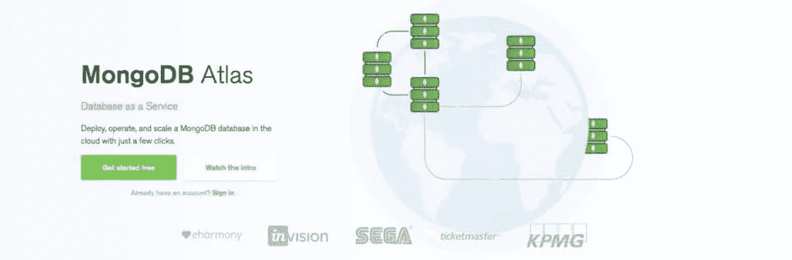](https://www.mongodb.com/cloud/atlas?utm_medium=sp-synd&utm_source=sitepoint&utm_content=serverless-functions&jmp=sp-ref)

但是我想要一个快速、安全和可管理的 MongoDB 解决方案，我可以随着我们在这个定制的 WordPress 仪表板中附加的模块数量的增长而轻松扩展。那是 [MongoDB 图集](https://www.mongodb.com/cloud/atlas?utm_medium=sp-synd&utm_source=sitepoint&utm_content=serverless-functions&jmp=sp-ref)。

> MongoDB Atlas 是一个云托管的 MongoDB 服务，由构建数据库的同一个团队设计和运行。您猜怎么着，我相信他们遵循了最佳操作实践，因为他们是构建 MongoDB 的第一人。

我希望这个定制仪表板是自我管理的，无服务器的，使用 MongoDB Atlas 使我不必担心软件修补、备份和新数据库更新的可靠配置设置。这又是一大优势。➕

此外，MongoDB Atlas 支持跨平台、跨地区和不同云提供商的事实使它成为一个更好的选择。我认为每个集群都有两个副本集，随时可以扩展。

### 🔋MongoDB 罗盘

既然我们要使用 MongoDB，那么最好有一个工具，通过它我们可以探索我们的数据库，查看更改，调试等等。为此，MongoDB 再次率先推出了名为 [MongoDB Compass](https://www.mongodb.com/products/compass?utm_medium=sp-synd&utm_source=sitepoint&utm_content=serverless-functions&jmp=sp-ref) 的产品。看一看。

[](https://www.mongodb.com/products/compass?utm_medium=sp-synd&utm_source=sitepoint&utm_content=serverless-functions&jmp=sp-ref)

我建议你继续下载 [MongoDB Compass](https://www.mongodb.com/products/compass?utm_medium=sp-synd&utm_source=sitepoint&utm_content=serverless-functions&jmp=sp-ref) 。这是可视化 MongoDB 数据库的最佳工具。这里有一组功能:

*   **可视化和探索:**看看你的数据库，了解事情的进展，甚至可视化地图/坐标等东西。
*   **插入、修改和删除:**您还可以在 MongoDB compass 中对您的 DB 执行 CRUD 操作。使测试更容易。
*   **调试和优化:**最后，分析您的数据，进行调试，甚至在一个出色的数据库 GUI 中找出性能问题。如果您使用 MongoDB，这个工具是必备的。
*   可扩展:最好的部分是你可以构建自己的插件来扩展 MongoDB Compass。这是关于构建你自己的指南针插件的文档。
*   企业版 : MongoDB Compass 有几种版本:社区版(免费)和企业版(授权)——企业版可以让你可视化 DB 模式。

## ✅开始使用 MongoDB Atlas

让我们开始构建一个简单的模块，它是我正在构建的自定义 WordPress 仪表盘的一部分。在本模块中，我们将收集所有与销售相关的数据。为此，我们需要一个 MongoDB 实例，当然我们在这里使用的是 MongoDB Atlas。

### 步骤#1:转到 [MongoDB Atlas →](https://www.mongodb.com/cloud/atlas?utm_medium=sp-synd&utm_source=sitepoint&utm_content=serverless-functions&jmp=sp-ref)

到 [MongoDB Atlas](https://www.mongodb.com/cloud/atlas?utm_medium=sp-synd&utm_source=sitepoint&utm_content=serverless-functions&jmp=sp-ref) 站点注册一个完全免费的 MongoDB 实例，托管在 AWS 上，共享 RAM 和 512 MB 存储空间。点击*免费入门*按钮。

[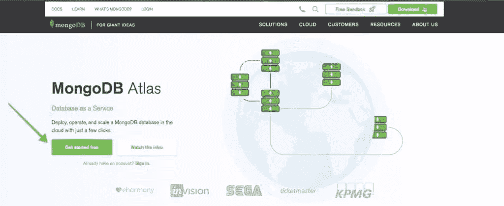](https://www.mongodb.com/cloud/atlas?utm_medium=sp-synd&utm_source=sitepoint&utm_content=serverless-functions&jmp=sp-ref)

### 第二步:在 [MongoDB Atlas 注册→](https://www.mongodb.com/cloud/atlas?utm_medium=sp-synd&utm_source=sitepoint&utm_content=serverless-functions&jmp=sp-ref)

现在继续用你的电子邮件 ID 注册并填写详细信息。令人惊讶的是，你可以注册并使用一个免费的 MongoDB Atlas 托管数据库实例，他们甚至不要求你为此添加信用卡。

[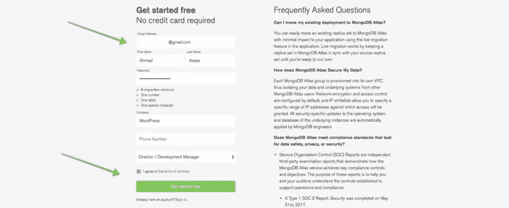](https://www.mongodb.com/cloud/atlas?utm_medium=sp-synd&utm_source=sitepoint&utm_content=serverless-functions&jmp=sp-ref)

### 步骤 3:创建集群

现在，您将被重定向到一个页面，其中包含关于您将要创建的新 MongoDB 集群的大量信息。我建议您查看这些信息，然后点击底部的*创建集群*按钮，就像下面的截图一样。

[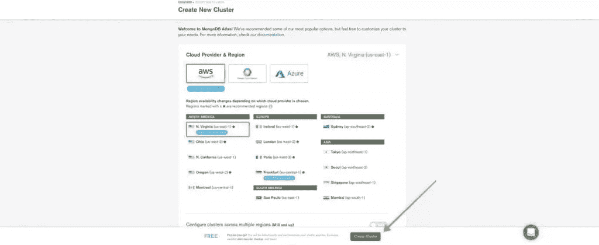](https://www.mongodb.com/cloud/atlas?utm_medium=sp-synd&utm_source=sitepoint&utm_content=serverless-functions&jmp=sp-ref)

### 步骤 4:创建数据库用户名和密码

这需要一分钟的时间，您的数据库将被创建。一旦发生这种情况，前往*安全* > *MongoDB 用户*并点击右侧的 *+添加新用户*按钮，为您的数据库创建一个新用户。为了这篇介绍性文章，让我们保持所有其他设置为默认设置。

我将用户/通行证设置为`usermongo`,但你知道得更清楚。

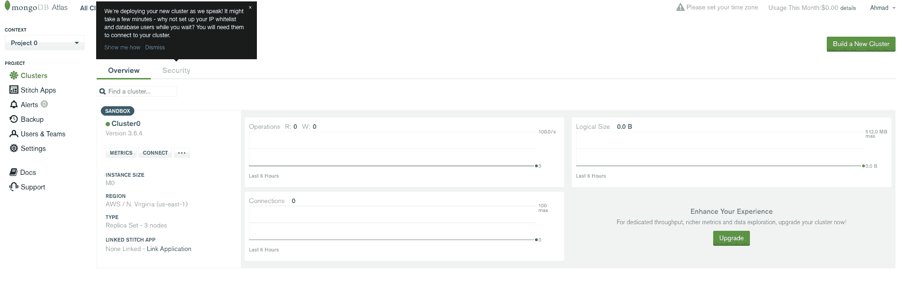

### 步骤#5:将 IP 添加到白名单中进行访问

为了能够访问您的 MongoDB Atlas 数据库，您需要使用托管您的应用程序的服务器的 IP 来设置 IP 白名单。身份验证超出了我在这里讨论的范围，所以为了演示的目的，让我们只允许每个人(显然这是生产中的一个坏习惯)。

所以，再次，前往*安全* > *IP 白名单*，点击右边的 *+添加 IP 地址*按钮，最后点击*允许从任何地方访问*按钮，允许匿名访问。

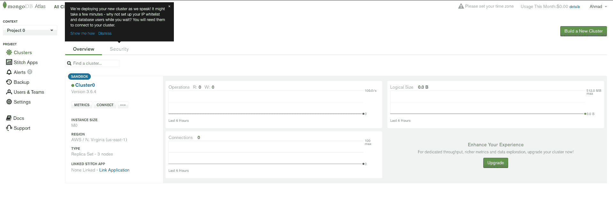

### 步骤 6:通过 MongoDB Compass 连接

既然我们的数据库的 IP 访问和用户已经创建，我们可以选择连接字符串并使用它通过 MongoDB Compass 应用程序连接到我们的数据库。

前往*连接*然后选择*连接 MongoDB Compass* 并下载 Compass(如果您还没有下载 Compass)。复制 URI 连接字符串。最后，打开指南针，它应该能够检测到剪贴板中的连接字符串，允许它连接到您的数据库。

您可以可视化您的数据库，分析其性能，甚至运行完整的 CRUD 操作。厉害！💯

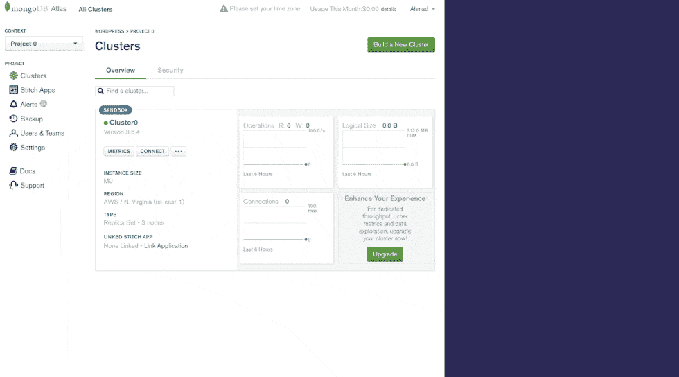

现在我们已经创建了一个 MongoDB Atlas，并将其与 MongoDB Compass 连接起来，我们可以继续前进，开始构建我们的 Node.js 应用程序。

## WordPress REST API — FTW！

这个基于 WordPress 的 Node.js 定制仪表板通过 [WordPress REST API](https://developer.wordpress.org/rest-api/) 与 WordPress 实例交互。由于这是一个 Node.js 应用程序，我使用了一个由[K·亚当·怀特](https://twitter.com/kadamwhite)编写的名为 [`wpapi`](https://www.npmjs.com/package/wpapi) 的超棒的库。他还开发了一个基于 WordPress 应用程序的演示版。这就是我在构建这个定制仪表板时受到的启发，所以你会在这里看到很多。

### 🚀基于 [Express](https://www.npmjs.com/package/express) 的定制路由器

路由器设置有 [Express](https://www.npmjs.com/package/express) 。这里有一个使用 WordPress 和 express 的基本错误处理程序和路由器模板。

```
'use strict';

var express = require('express');
var router = express.Router();
var siteInfoMiddleware = require('../middleware/site-info');

// Set global site info on all routes
router.use(siteInfoMiddleware);

// Public Routes
// =============

router.get('/', require('./index'));
router.get('/page/:page', require('./index'));
router.get('/:slug', require('./single'));
router.use('/tags/:tag', require('./tag'));
router.use('/categories/:category', require('./category'));

// Catch 404 and forward to error handler.
router.use(function (req, res, next) {
    var err = new Error('Not Found');
    err.status = 404;
    next(err);
});

// Error Handling
// ==============

// Development error handler will print stacktrace.
function developmentErrorRoute(err, req, res, next) {
    res.status(err.status || 500);
    res.render('error', {
        message: err.message,
        error: err
    });
}

// Production error handler. No stacktraces leaked to user.
function friendlyErrorRoute(err, req, res, next) {
    res.status(err.status || 500);
    res.render('error', {
        message: err.message,
        error: {}
    });
}

// Configure error-handling behavior
if (router.get('env') === 'development') {
    router.use(developmentErrorRoute);
} else {
    router.use(friendlyErrorRoute);
}

module.exports = router; 
```

查看[要点](https://gist.github.com/ahmadawais/d249897d8cf724e244a833a97d9ff053)上的代码。

### 基于🎚基本快递的实施

我不会在 WordPress 上主持整个事情，但最初的计划就是这样做。如果你想这么做，为了方便和并行，你会想通过使用 [`RSVP.hash`实用程序](https://github.com/tildeio/rsvp.js/#hash-of-promises)查询所有信息来构建索引。为此，你应该这样做。

```
'use strict';

var wp = require( '../services/wp' );
var contentService = require( '../services/content-service' );
var pageNumbers = require( '../services/page-numbers' );
var pageTitle = require( '../services/page-title' );
var RSVP = require( 'rsvp' );

function getHomepage( req, res, next ) {
  var pages = pageNumbers( req.params.page );

  RSVP.hash({
    archiveBase: '',
    pages: pages,
    title: pageTitle(),
    // Primary page content
    posts: wp.posts().page( pages.current ),
    sidebar: contentService.getSidebarContent()
  }).then(function( context ) {
    if ( req.params.page && ! context.posts.length ) {
      // Invalid pagination: 404
      return next();
    }

    res.render( 'index', context );
  }).catch( next );
}

module.exports = getHomepage; 
```

查看[要点](https://gist.github.com/ahmadawais/056c0f19551356f0740a64c1f7528989)上的代码。

### 🦏内置认证

对于这个设置，您还需要通过向 Node.js 应用程序提供认证数据来对其进行认证，认证数据和`wpapi`可以像这样进行处理。请注意，如果您没有使用正确的权限和环境变量设置，这并不总是最佳实践。

```
var WP = require( 'wordpress-rest-api' );
var _ = require( 'lodash' );

var config = _.pick( require( './config' ).wordpress, [
  // Whitelist valid config keys
  'username',
  'password',
  'endpoint'
]);

var wp = new WP( config );

module.exports = wp; 
```

查看[要点](https://gist.github.com/ahmadawais/432f285e2ec7dc70bac6973d7f23a1ff)上的代码。

### 🦁网站内容积累

最后，您可以通过创建一个处理递归获取的内容服务来使用所有内容:

*   分页集合的所有页面。
*   你的 WordPress 站点信息。
*   按字母顺序排列的类别列表。
*   内容缓存中的特定类别(由 slug 指定)。
*   按字母顺序排列的标签列表。
*   内容缓存中的特定标签(由 slug 指定)
*   其他需要和 WP 有一些功能对等的内容。

这个的代码看起来有点像这样。

```
'use strict';

var wp = require( './wp' );
var cache = require( './content-cache' );
var _ = require( 'lodash' );
var RSVP = require( 'rsvp' );

/**
 * Recursively fetch all pages of a paged collection
 *
 * @param {Promise} request A promise to a WP API request's response
 * @returns {Array} A promise to an array of all matching records
 */
function all( request ) {
  return request.then(function( response ) {
    if ( ! response._paging || ! response._paging.next ) {
      return response;
    }
    // Request the next page and return both responses as one collection
    return RSVP.all([
      response,
      all( response._paging.next )
    ]).then(function( responses ) {
      return _.flatten( responses );
    });
  });
}

function siteInfo( prop ) {
  var siteInfoPromise = cache.get( 'site-info' );

  if ( ! siteInfoPromise ) {
    // Instantiate, request and cache the promise
    siteInfoPromise = wp.root( '/' ).then(function( info ) {
      return info;
    });
    cache.set( 'site-info', siteInfoPromise );
  }

  // Return the requested property
  return siteInfoPromise.then(function( info ) {
    return prop ? info[ prop ] : info;
  });
}

/**
 * Get an alphabetized list of categories
 *
 * All archive routes display a sorted list of categories in their sidebar.
 * We generate that list here to ensure the sorting logic isn't duplicated
 * across routes.
 *
 * @method sortedCategories
 * @return {Array} An array of category objects
 */
function sortedCategories() {
  return all( wp.categories() ).then(function( categories ) {
    return _.chain( categories )
      .sortBy( 'slug' )
      .value();
  });
}

function sortedCategoriesCached() {
  var categoriesPromise = cache.get( 'sorted-categories' );

  if ( ! categoriesPromise ) {
    categoriesPromise = sortedCategories();
    cache.set( 'sorted-categories', categoriesPromise );
  }

  return categoriesPromise;
}

/**
 * Get a specific category (specified by slug) from the content cache
 *
 * The WP API doesn't currently support filtering taxonomy term collections,
 * so we have to request all categories and filter them down if we want to get
 * an individual term.
 *
 * To make this request more efficient, it uses sortedCategoriesCached.
 *
 * @method categoryCached
 * @param {String} slug The slug of a category
 * @return {Promise} A promise to the category with the provided slug
 */
function categoryCached( slug ) {
  return sortedCategoriesCached().then(function( categories ) {
    return _.findWhere( categories, {
      slug: slug
    });
  });
}

/**
 * Get a specific tag (specified by slug) from the content cache
 *
 * The WP API doesn't currently support filtering taxonomy term collections,
 * so we have to request all tags and filter them down if we want to get an
 * individual term.
 *
 * To make this request more efficient, it uses the cached sortedTags promise.
 *
 * @method tagCached
 * @param {String} slug The slug of a tag
 * @return {Promise} A promise to the tag with the provided slug
 */
function tagCached( slug ) {
  return sortedTagsCached().then(function( tags ) {
    return _.findWhere( tags, {
      slug: slug
    });
  });
}

/**
 * Get an alphabetized list of tags
 *
 * @method sortedTags
 * @return {Array} An array of tag objects
 */
function sortedTags() {
  return all( wp.tags() ).then(function( tags ) {
    return _.chain( tags )
      .sortBy( 'slug' )
      .value();
  });
}

function sortedTagsCached() {
  var tagsPromise = cache.get( 'sorted-tags' );

  if ( ! tagsPromise ) {
    tagsPromise = sortedTags();
    cache.set( 'sorted-tags', tagsPromise );
  }

  return tagsPromise;
}

function getSidebarContent() {
  return RSVP.hash({
    categories: sortedCategoriesCached(),
    tags: sortedTagsCached()
  });
}

module.exports = {
  // Recursively page through a collection to retrieve all matching items
  all: all,
  // Get (and cache) the top-level information about a site, returning the
  // value corresponding to the provided key
  siteInfo: siteInfo,
  sortedCategories: sortedCategories,
  sortedCategoriesCached: sortedCategoriesCached,
  categoryCached: categoryCached,
  tagCached: tagCached,
  sortedTags: sortedTags,
  sortedTagsCached: sortedTagsCached,
  getSidebarContent: getSidebarContent
}; 
```

查看[要点](https://gist.github.com/ahmadawais/f1155503694e258d3e2bb16990c4e37d)上的代码。

### 🛠定制路线和销售数据

最后，我在相当多的自定义路线中烹饪，从那里我可以获得任何种类的销售相关数据。对于我所拥有的特定架构，为了方便和并行，我再次使用了 [`RSVP.hash`实用程序](https://github.com/tildeio/rsvp.js/#hash-of-promises)。它非常有效。

```
var WPAPI = require( 'wpapi' );
var RSVP = require('rsvp');

// Using the RSVP.hash utility for convenience and parallelism
RSVP.hash({
  categories: wp.categories().slug( 'it-services' ),
  tags1: wp.tags().slug('hotel-name'),
  tags2: wp.tags().slug('march-events')
}).then(function( results ) {
    // Combine & map .slug() results into arrays of IDs by taxonomy
    var tagIDs = results.tags1.concat( results.tags2 )
        .map(function( tag ) { return tag.id; });
    var categoryIDs = results.categories
        .map(function( cat ) { return cat.id; });
    return wp.posts()
        .tags( tags )
        .categories( categories );
}).then(function( posts ) {
    // These posts are all fiction, either magical realism or historical:
    console.log( posts );
}); 
```

查看[要点](https://gist.github.com/ahmadawais/3f37580dee585eeaad071bf3b01c8a42)上的代码。

一旦我有了数据，我就把它和购买订单请求一起发送到 Paddle.com 进行处理，这样它就可以通过无服务器的⚡ Azure 函数添加到我们的 MongoDB 实例中。

```
// Registering custom routes.
site.itSales = site.registerRoute( 'sales/v1', '/resource/(?P<some_part>\\d+)' );
site.itSales().somePart( 7 ); // => myplugin/v1/resource/7

// Query Parameters & Filtering Custom Routes.
site.handler = site.registerRoute( 'sales/v1', 'receipts/(?P<id>)', {
    // Listing any of these parameters will assign the built-in
    // chaining method that handles the parameter:
    params: [ 'before', 'after', 'author', 'parent', 'post' ]
});

// Yields from the custom data of buyers.
site.handler().post( 8 ).author( 92 ).before( dateObj )... // Sent to paddle. 
```

查看[要点](https://gist.github.com/ahmadawais/6b986735aa2f2e36a60b939cf8b30925)上的代码。

有些人可能会觉得奇怪，但是 WordPress 允许你设置自定义文章类型和自定义分类，这就是我在这里使用的，然而，上面的代码并不是精确的实现，而是类似于我通过类别和标签使用的方法。

这些数据被发送到 Paddle，并被大量缓存，这样当我们使用自定义仪表板时，我们的 WordPress 实例不会有任何负载。我还编写了一个小的`data-refresh`模块，可以根据需要从 WordPress 实例中获取数据。

## 微软 Azure & Azure 函数

在构建这个定制的 WordPress 仪表盘的时候，我想确保这个仪表盘的每个模块都以一个无服务器的应用程序的形式存在，具有多种无服务器的功能。这个决定是基于尽可能降低仪表板的成本。

### 👀三种选择

目前有三大云服务提供商。这些是[微软 Azure](https://azure.microsoft.com/en-us/) 、[谷歌云平台](https://cloud.google.com/)和[亚马逊网络服务](https://aws.amazon.com/)。其中每一个都有可用的无服务器功能，分别称为 Azure 功能、GCP 云功能和 AWS Lambdas。

### 📘选择 Azure

Azure 拥有最大的云架构和全球业务之一。50 个 Azure 地区，比任何云提供商都多，在测试了这三个地区后，我发现 Azure functions 在阿联酋的响应时间最短(因为我的客户的业务是在阿联酋之外)。

此外，我们使用 Azure ML Studio、AI 认知服务和虚拟机来托管这个项目的一部分，这意味着将 Azure 功能用于无服务器架构是完全有意义的。

## Azure 函数入门

让我们从 Azure 函数开始。我将带你完成创建一个简单的无服务器 Azure 函数的过程，这个函数将通过 HTTP 请求触发，在这个函数中，我们将处理从 Paddle.com 发给我们的销售信息。

### ⚙我们在建造什么？！

1.  我正在构建一个无服务器的 Azure 函数，它基于 JavaScript，特别是 Node.js 代码。
2.  这个 Azure 功能将由来自我们的第三方支付解决方案，即 Paddle.com 的一个简单的`GET` HTTP 请求触发。
3.  只要 Paddle.com 上有销售，它就会[触发一个 webhook](https://paddle.com/docs/reference-using-webhooks) ，其中包含与我们的销售、数量、商品、收入相关的信息，以及 WordPress 发送给 Paddle 的一些会员相关数据。
4.  使用 WordPress REST API，我添加了一些与购买产品的用户相关的自定义数据，比如用户在 WordPress DB 中的 ID，哪个 WordPress 站点有这次销售，以及该用户的元信息。
5.  当 Azure 函数接收到这个`GET`请求时，它处理信息，取出我需要保存在 MongoDB Atlas 集群中的内容，并形成一个准备保存在 DB 中的 JavaScript 对象。
6.  然后，Azure 函数通过一个名为[mongose](http://mongoosejs.com/)的 npm 包连接到 MongoDB Atlas 实例，在连接数据库后，我创建了一个 DB 模型/模式，然后这些数据被保存到 MongoDB Atlas 集群中。
7.  之后，Azure function 就在那里等待下一次销售，我的客户只为 Azure function 的执行时间和执行量付费。([其中 100 万每月免费](https://azure.microsoft.com/en-us/pricing/details/functions/)😮).

现在，这只是对正在发生的事情的高级总结，我在这里跳过了许多步骤，例如身份验证，这超出了本文的范围。您应该始终设置认证和验证，以保持文明，避免任何超龄。

所以，让我们继续建造这个东西。

### 步骤 1:设置 Microsoft Azure 和 VSCode

我希望你能在你那边设置好 Azure 账户。你需要用信用卡订阅，因为我们需要存储来托管 Node.js 文件，这些文件将与 Azure 函数一起使用，你必须为存储付费(你可能会在第一个月获得 200 美元的免费信用，即使在那之后费用也很低)。

因此，请继续设置以下内容:

1.  ✅在账单中用信用卡设置了一个微软 Azure 账户。
2.  ✅安装 [Visual Studio 代码](https://code.visualstudio.com/) (Psst。我正在制作一个关于 VSCode 的[课程。](https://ahmadawais.com/visual-studio-code-power-user/)
3.  ✅在你的 VSCode 上安装 Azure 函数扩展。
4.  💡要启用本地调试，请安装 [Azure Functions 核心工具](https://github.com/Azure/azure-functions-core-tools#installing)。
5.  🗂创建了一个新目录，并在 VSCode 中打开它。

如果你想知道我用的是哪种主题和字体，那就是[紫色阴影💜](https://marketplace.visualstudio.com/items?itemName=ahmadawais.shades-of-purple)——更多信息请参见我使用的[软件和硬件](https://ahmadawais.com/uses/)。

[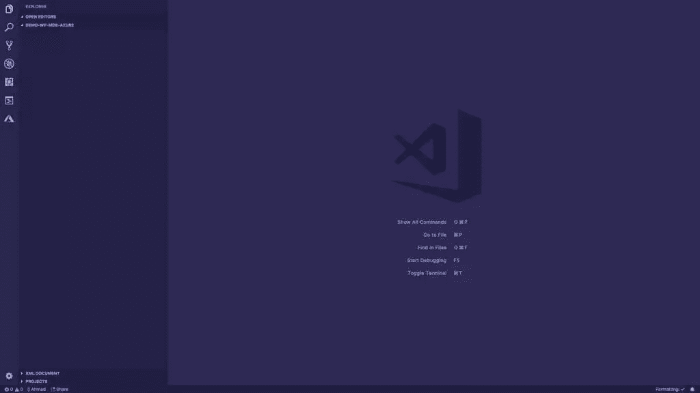](https://marketplace.visualstudio.com/items?itemName=ahmadawais.shades-of-purple)

### 步骤 2:创建一个新的函数应用程序项目

现在让我们创建一个新的函数应用程序项目。这对于 VSCode 来说非常简单。你所要做的就是进入活动栏中的 Azure 扩展浏览器。从那里进入`FUNCTIONS`选项卡并点击第一个`Create New Project`图标。

这将创建一个演示项目，包含入门所需的基本文件，并将为您初始化一个 Git repo。我将继续提供基于 GIF 的小演示，让您的工作更轻松。

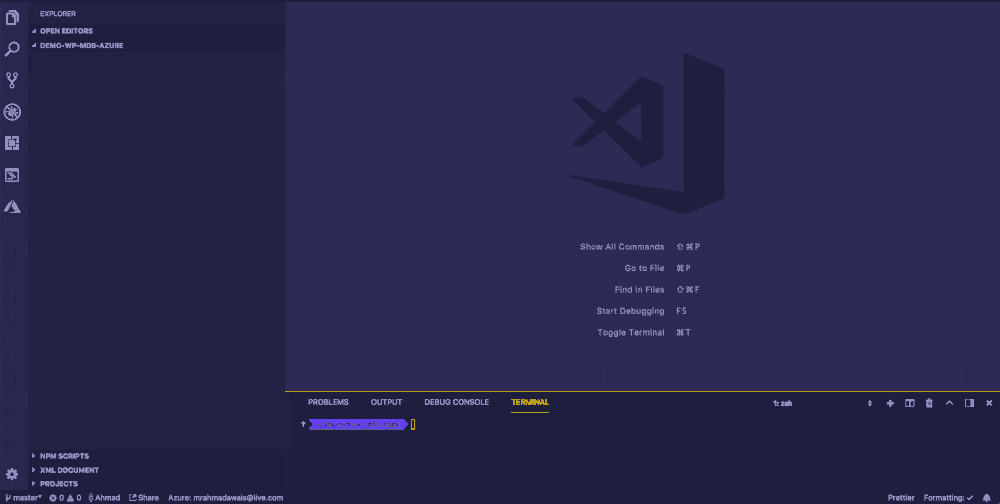

### 步骤 3:创建一个 HTTP 触发的 Azure 函数

现在我们已经创建了一个函数 app 项目，让我们创建一个 HTTP 触发的无服务器 Azure 函数。为此，请访问活动栏中的 Azure Extension explorer。从那里进入`FUNCTIONS`选项卡并点击第二个图标`Create Function`。

出于演示目的，我选择保持身份验证部分简单，因此我将选择匿名访问。我们的 Azure 函数的名字是`HttpTriggerJS`,所以你可以在你的项目中找到一个用这个名字创建的新目录。这应该包含两个文件，即`functions.json`和`index.js`

⚡ A *函数*是 Azure 函数中的一个主要概念。您可以用自己选择的语言编写函数代码，并将代码和配置文件保存在同一个文件夹中。

🛠配置名为`function.json`，包含 JSON 配置数据。它定义了函数绑定和其他配置设置。运行库使用该文件来确定要监视的事件，以及如何将数据传入函数执行并从函数执行返回数据。[点击](https://docs.microsoft.com/en-us/azure/azure-functions/functions-reference#function-code)在官方文档中阅读更多关于这个文件的信息。

下面是一个创建的示例`function.json`文件。

```
{
  "disabled": false,
  "bindings": [
    {
      "authLevel": "anonymous",
      "type": "httpTrigger",
      "direction": "in",
      "name": "req"
    },
    {
      "type": "http",
      "direction": "out",
      "name": "res"
    }
  ]
} 
```

查看[要点](https://gist.github.com/ahmadawais/9e0b7a61e4b50c671a132547c5c148ae)上的代码。

然后，有一个`index.js`文件，它包含一个基本代码，你可以用它来测试你的 Azure 功能。它接收一个参数`name`并把它打印给你，或者显示一个要求这个参数的错误。

```
module.exports = function (context, req) {
    context.log('JavaScript HTTP trigger function processed a request.');

    if (req.query.name || (req.body && req.body.name)) {
        context.res = {
            // status: 200, /* Defaults to 200 */
            body: "Hello " + (req.query.name || req.body.name)
        };
    }
    else {
        context.res = {
            status: 400,
            body: "Please pass a name on the query string or in the request body"
        };
    }
    context.done();
}; 
```

查看[要点](https://gist.github.com/ahmadawais/d9791f74cfe114548a58227ed8db2dd1)上的代码。

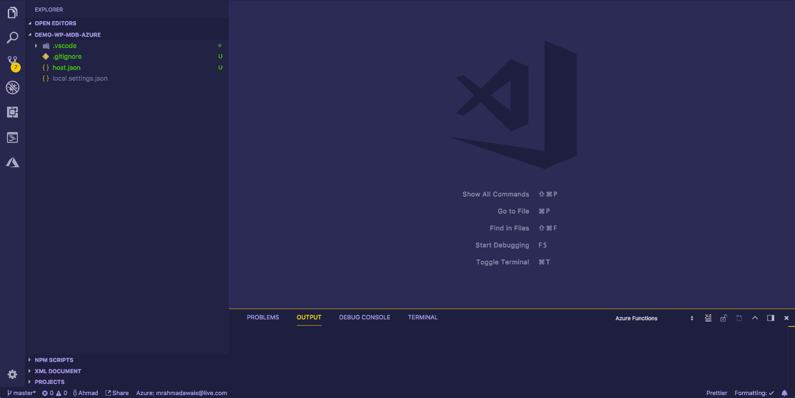

### 步骤 4:部署和测试你的 Azure 功能

现在我们已经创建了一个可以被`GET` HTTP 请求触发的 Azure 函数，让我们继续用 VSCode 部署它，并用 [Postman](https://www.getpostman.com/) API Explorer 测试它。

要部署该功能，请转到活动栏中的 Azure Extension explorer。从那里进入`FUNCTIONS`选项卡，点击第三个图标`Deploy to Function App`。

这将问你一堆关于你的应用程序名称的问题，使用任何独特的。我使用了`demo-wp-mdb-azure`——vs code 然后使用它来创建一个资源组，将你的功能应用相关的资源、它的存储(用于保存文件)和创建的 Azure 函数组合在一起——最后用一个公共 URL 来响应我们。

然后我继续访问这个 URL，它按照代码要求输入`name`参数。当我用邮差 app 发送`name` param 时，它回复了`Hello Ahmad Awais`。👍

VSCode 还要求我将功能扩展应用版本更新到 beta，我选择了 yes——因为这将帮助我使用 Node.js v8 进行 async/await。

### 步骤 5:创建`package.json`并安装[猫鼬](http://mongoosejs.com/)

既然我们的 Azure 函数已经启动并运行，让我们在项目的根目录下创建一个`package.json`文件并安装[mongose](http://mongoosejs.com/)。我们将需要它来连接和保存数据到我们的 MongoDB Atlas 集群。

Mongoose 为应用程序数据建模提供了一个直接的、基于模式的解决方案。它包括内置的类型转换、验证、查询构建、业务逻辑挂钩等等，开箱即用。挺牛逼的。💯

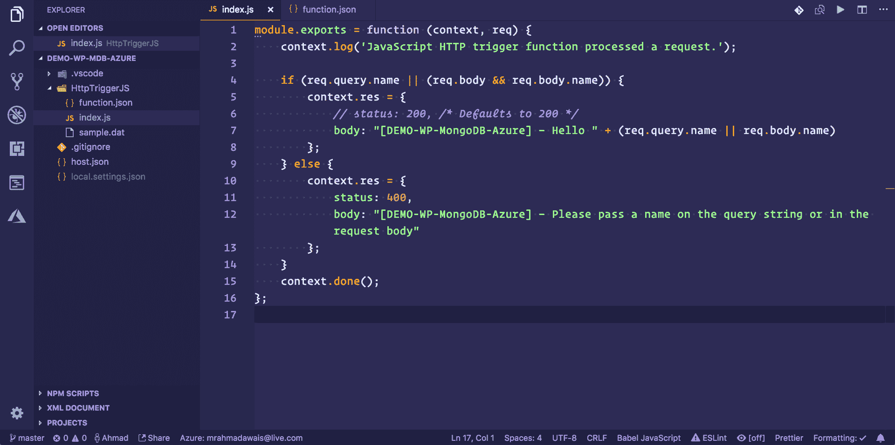

### 步骤 6:为 MongoDB 连接添加应用程序设置

现在我们几乎准备好开始为我们的应用程序编写代码了。但是在此之前，我们需要一个连接字符串来连接到我们的 MongoDB Atlas 集群(就像我们对 MongoDB Compass 所做的那样)。这个连接字符串是私有的，您不应该将它提交给 git repo。

💯这个连接字符串属于项目根目录中的`local.settings.json`文件。让我们首先下载设置，然后用我们的连接字符串添加`MongodbAtlas`设置(从 MongoDB Atlas 仪表板获取该字符串)并上传应用程序设置。

为此，请转到活动栏中的 Azure Extension explorer。从那里进入*功能*选项卡，选择您的订阅，然后选择您的 Azure 功能应用，即`demo-wp-mdb-azure`。在设置中添加`MongodbAtlas`连接字符串后，右击*应用设置*，选择*下载远程设置…* 下载，选择*上传本地设置…* 上传设置。

### 步骤 7:更新 Azure 函数的节点版本

在代码中，我打算使用`async` / `await`，这是 Node.js v6.5.0 上没有的，它是 Azure functions 的默认版本 1 附带的。在第 4 步中，VSCode 要求我将 Azure function 的运行时版本更新为 beta 版，我照做了。这使得 Azure 函数支持最新的 Node.js 版本。

因此，让我们在本地设置中更新`WEBSITE_NODE_DEFAULT_VERSION`应用程序设置，并将其更新为远程设置。

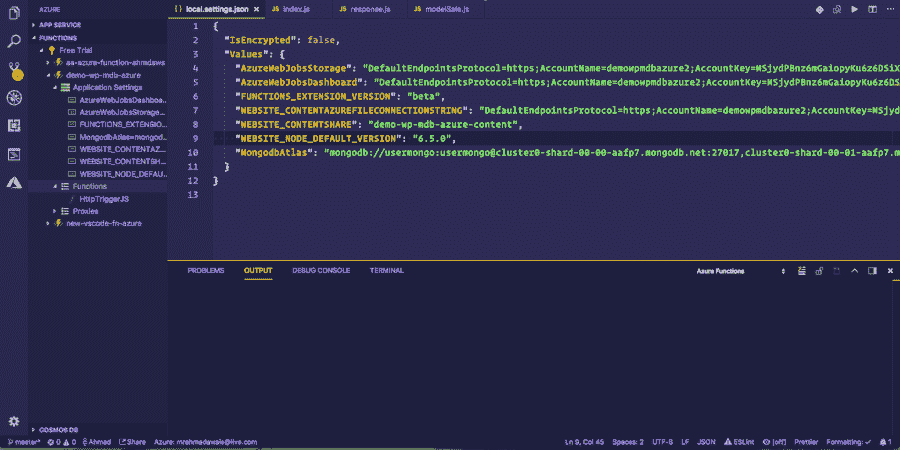

### 步骤 8:创建 MongoDB 模型/模式

在我们将任何数据保存到我们的 MongoDB Atlas 集群之前，让我们创建一个`modelSale.js`文件，它将包含我们打算保存在数据库中的模型的模式。这是一个极其简单的模式实现，我建议你仔细阅读一下在这里用[mongose](http://mongoosejs.com/docs/guide.html)和 [MongoDB](https://docs.mongodb.com/manual/data-modeling/?utm_medium=sp-synd&utm_source=sitepoint&utm_content=serverless-functions&jmp=sp-ref) 能做些什么。

这个文件基本上是不言自明的。

```
/**
 * Model: Sale
 */
const mongoose = require('mongoose');
mongoose.Promise = global.Promise;

// Sale Schema.
const saleSchema = new mongoose.Schema({
    sale_gross: Number,
    earnings: Number,
    currency: String,
    memberSince: Date,
    customerEmail: String,
    event_time: {
        type: Date,
        default: Date.now
    },
});

// Export the model.
module.exports = mongoose.model('Sale', saleSchema); 
```

查看[要点](https://gist.github.com/ahmadawais/c4c33b2a0e519ef79efa50e9aeb7f40f)上的代码。

### 步骤 9:用 Node.js 编写⚡ Azure 函数

现在让我们编写 Azure 函数。为了这个演示的目的，我将所有主要代码添加到了`index.js`文件中。我还将使用[上下文对象](https://docs.microsoft.com/en-us/azure/azure-functions/functions-reference-node#context-object)作为第一个参数，所以请确保[已经了解了那个](https://docs.microsoft.com/en-us/azure/azure-functions/functions-reference-node#context-object)。下面的代码片段解释了所有其他内容。

所以，这只是本文的演示代码。它执行以下操作:

*   ✅从 Paddle.com 获得数据
*   ⚡通过我们在应用程序设置中添加的连接字符串连接到 MongoDB Atlas。
*   📘使用在`test`数据库中定义的 DB 模式，在那里创建一个`sales`集合，包括我们销售的文档。
*   ⚙验证数据并创建一个保存在 MongoDB Atlas 集群中的`finalData`对象。耶！
*   最后，如果一切顺利，🥅用一个`200`状态码响应 Paddle webhook，并且让 [`context.done()`](https://docs.microsoft.com/en-us/azure/azure-functions/functions-reference-node#context-object) 跳舞。

内联文档解释了所有的事情。

```
/**
 * Azure Function: Sale.
 *
 * Gets data from Paddle.com (which in turn gets data
 * from WordPress) and processes the data, creates a
 * finalData object and saves it in MongoDB Atlas.
 *
 * @param context To pass data between function to / from runtime.
 * @param req HTTP Request sent to the Azure function by Paddle.
 */
module.exports = async function (context, req) {
    // Let's call it log.
    const log = context.log;

    // Log the entire request just for the demo.
    log('[RAN] RequestUri=%s', req.originalUrl);

    /**
     * Azure function Response.
     *
     * Processes the `req` request from Paddle.com
     * and saves the data to MongoDB Atlas while
     * responding the `res` response.
     */

    // Database interaction.
    const mongoose = require('mongoose');
    const DATABASE = process.env.MongodbAtlas;

    // Connect to our Database and handle any bad connections
    mongoose.connect(DATABASE);
    mongoose.Promise = global.Promise; // Tell Mongoose to use ES6 promises
    mongoose.connection.on('error', (err) => {
        context.log(`ERROR→ ${err.message}`);
    });

    // Sale Schema.
    require('./modelSale');
    const Sale = mongoose.model('Sale');

    // Create a Response.
    if (req.query.customFieldName) { // Simple authentication for the purpose of demo.

        // Build the data we need.
        const sale_gross = req.query.p_sale_gross || '0';
        const earnings = JSON.parse(req.query.p_earnings)['16413'] || '0'
        const currency = req.query.p_currency || 'USD';
        const memberSince = req.query.memberSince || new Date();
        const customerEmail = req.query.customerEmail || '';
        const event_time = new Date();

        log('[OUTPUT]—— sale_gross: ' + sale_gross);
        log('[OUTPUT]—— earnings: ' + earnings);
        log('[OUTPUT]—— currency: ' + currency);

        const finalData = {
            sale_gross: sale_gross,
            earnings: earnings,
            currency: currency,
            memberSince: memberSince,
            customerEmail: customerEmail,
            event_time: event_time,
        }

        // Save to db.
        const sale = await (new Sale(finalData)).save();
        log("[OUTPUT]—— SALE SAVED: ", sale);

        // Respond with 200.
        context.res = {
            status: 200,
            body: "Thank You for the payment! " + (req.query.customFieldName || req.body.customFieldName)
        };
    } else {
        context.res = {
            status: 400,
            body: "Please pass a name on the query string or in the request body"
        };
    }

    // Informs the runtime that your code has finished. You must call context.done, or else the runtime never knows that your function is complete, and the execution will time out.
    // @link: https://docs.microsoft.com/en-us/azure/azure-functions/functions-reference-node#contextdone-method
    context.done();
}; 
```

查看[要点](https://gist.github.com/ahmadawais/50bf1af0fb30ca80aca1800e46d8af27)上的代码。

### 步骤 10:重新部署 Azure 功能

现在让我们重新部署 Azure 功能。为此，请访问活动栏中的 Azure Extension explorer。从那里进入*功能*选项卡，点击第三个*部署到功能应用*图标。

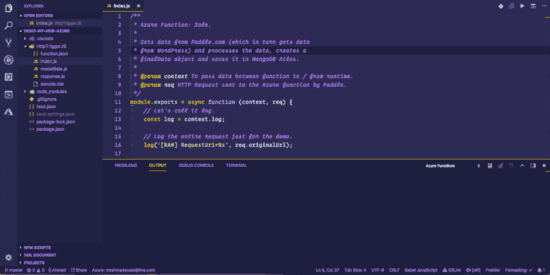

### 步骤 11:通过 Paddle 的 Webhook 测试 Azure 功能

看起来我们差不多完成了。剩下的就是通过 Paddle.com 触发一个虚拟的 webhook 来测试我们的 Azure 功能。就这么办吧。此外，当一切正常时，让我们探索一下我们的数据在 MongoDB Compass 中是什么样子的。

*哇，哼！太多了。很高兴成功了。🎉*

## 🤔刚刚发生了什么？！

准备吃一口吧。我在我正在构建的自定义 WordPress Dashboard 应用程序中创建了一小部分的`Sales`模块。我使用了 MongoDB Atlas 和 Compass，然后通过带有 VSCode 的函数应用程序创建了一个 Microsoft Azure 函数，使用 env secret 作为带有 MongoDB 连接字符串的应用程序字符串部署了该应用程序，更新了 Node.js 版本，并通过来自 Paddle.com 的虚拟 webhook(就像它会在销售发生时触发)触发该函数，以将数据(从 Paddle + WordPress)发送到我们的 Azure 函数，并从那里发送到 MongoDB Atlas。*而且成功了，哈哈！*

## 机器学习和人工智能

在软件技术领域，机器学习和人工智能一直是一个令人着迷的话题，但我们在 WordPress 或 WP 社区中并没有谈论太多。

我开始改变这种情况，为我的客户在一些精选的 WordPress 网站上添加一些小的改进，并打算用这个定制的 WordPress 仪表盘进行同样的探索。

我以前讨论过这个话题，并分享了我正在做的事情，看看我为 WordPress 构建的这个小人工智能插件，并将其与不同的 Azure 认知服务集成。

*我在另一个帖子的视频中解释了这一点，你可以在这里找到:[构建 WordPress 人工智能插件→](https://ahmadawais.com/wordpress-artificial-intelligence/)* 。

我已经用`wpapi`包在这个仪表板上完成了类似的结果。首先，我将图像上传到认知服务，然后在一个自信的响应中，我将它发送到 WordPress，通过 WordPress REST API 上传，带有由计算机视觉人工智能生成的图像描述。

```
/**
 * Get Image Alt Recognition with Computer Vision
 * using Azure Cognitive Services.
 */
var WPAPI = require('wpapi');
var wp = new WPAPI({
    endpoint: 'http://src.wordpress-develop.dev/wp-json'
});

/**
 * Handle Image Alt Generation.
 */
function processImage() {
    // **********************************************
    // *** Update or verify the following values. ***
    // **********************************************

    // Replace <Subscription Key> with your valid subscription key.
    var subscriptionKey = "<Subscription Key>";

    // You must use the same region in your REST call as you used to get your
    // subscription keys. For example, if you got your subscription keys from
    // westus, replace "westcentralus" in the URI below with "westus".
    //
    // Free trial subscription keys are generated in the westcentralus region.
    // If you use a free trial subscription key, you shouldn't need to change
    // this region.
    var uriBase =
        "https://westcentralus.api.cognitive.microsoft.com/vision/v2.0/analyze";

    // Request parameters.
    var params = {
        "visualFeatures": "Categories,Description,Color",
        "details": "",
        "language": "en",
    };

    // Display the image.
    var sourceImageUrl = document.getElementById("inputImage").value;
    document.querySelector("#sourceImage").src = sourceImageUrl;

    // Make the REST API call.
    $.ajax({
            url: uriBase + "?" + $.param(params),

            // Request headers.
            beforeSend: function (xhrObj) {
                xhrObj.setRequestHeader("Content-Type", "application/json");
                xhrObj.setRequestHeader(
                    "Ocp-Apim-Subscription-Key", subscriptionKey);
            },

            type: "POST",

            // Request body.
            data: '{"url": ' + '"' + sourceImageUrl + '"}',
        })

        .done(function (data) {
            // Show formatted JSON on webpage.
            $("#responseTextArea").val(JSON.stringify(data, null, 2));

            // Extract and display the caption and confidence from the first caption in the description object.
            if (data.description && data.description.captions) {
                var caption = data.description.captions[0];

                if (caption.text && caption.confidence >= 0.5) {
                    const imgDescription = caption.text;

                    // ⬆ Upload to WordPress.
                    wp.media()
                        // Specify a path to the file you want to upload, or a Buffer
                        .file(sourceImageUrl)
                        .create({
                            title: imgDescription,
                            alt_text: imgDescription,
                            caption: imgDescription,
                            description: imgDescription
                        })
                        .then(function (response) {
                            // Your media is now uploaded: let's associate it with a post
                            var newImageId = response.id;
                            return wp.media().id(newImageId).update({
                                post: associatedPostId
                            });
                        })
                        .then(function (response) {
                            console.log('Media ID #' + response.id);
                            console.log('is now associated with Post ID #' + response.post);
                        });
                }
            }
        })

        .fail(function (jqXHR, textStatus, errorThrown) {
            // Display error message.
            var errorString = (errorThrown === "") ? "Error. " :
                errorThrown + " (" + jqXHR.status + "): ";
            errorString += (jqXHR.responseText === "") ? "" :
                jQuery.parseJSON(jqXHR.responseText).message;
            alert(errorString);
        });
}; 
```

查看[要点](https://gist.github.com/ahmadawais/0e3a72a255624f6e906c4da71317c202)上的代码。

### 👀内容审核自动化

我们的想法之一是将 Azure 的 AI/ML 用作[内容审核平台](https://docs.microsoft.com/en-us/azure/cognitive-services/content-moderator/overview)，它提供内置的人在回路+机器学习来帮助审核图像、文本和视频。这是一项正在进行中的工作，但它确实很有趣，你绝对应该看一看。

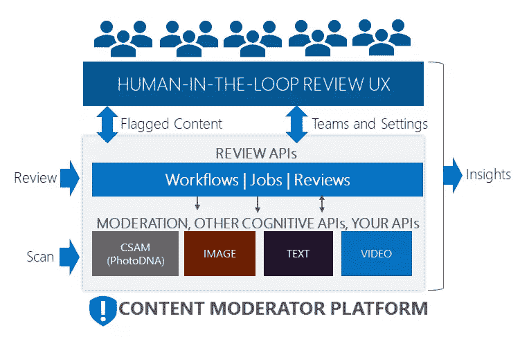

### 🕵语法(纳粹)情报

你们都有一遍又一遍打同样的错别字的习惯。我一直都这么做。最酷的事情是像 Bing 和 Google 这样的搜索引擎可以为你进行拼写检查和校对。

想象一下如果 WordPress 有这样的功能会怎么样？！所以，我开始工作，当你在文章标题中输入一个错别字(或者不止一个错别字，我才不管呢!)时，我在 WordPress 管理区做了同样的功能。).

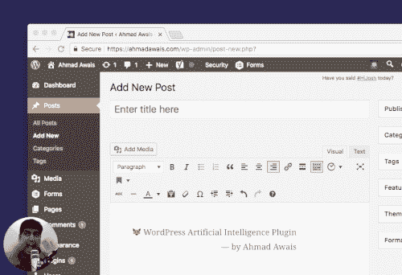

我太激动了，无法控制自己，所以左下角有我。所有的快乐和惊讶！ *🙌👐👏👊💪🎶☝😌🎧*

## 现在轮到你了！

我真的希望你喜欢所有这些现代 JavaScript 框架、AI/ML 产品和无服务器功能之间的潜在集成。

这个项目非常有趣。我认为，如果你给这个技术堆栈一个机会，你也可以得到这种疯狂的乐趣。所以，我让你在 WordPress 的环境下尝试一下[MongoDB Atlas](https://www.mongodb.com/cloud/atlas?utm_medium=sp-synd&utm_source=sitepoint&utm_content=serverless-functions&jmp=sp-ref)——也许把所有这些都附加到一堆无服务器功能上。

## 分享这篇文章