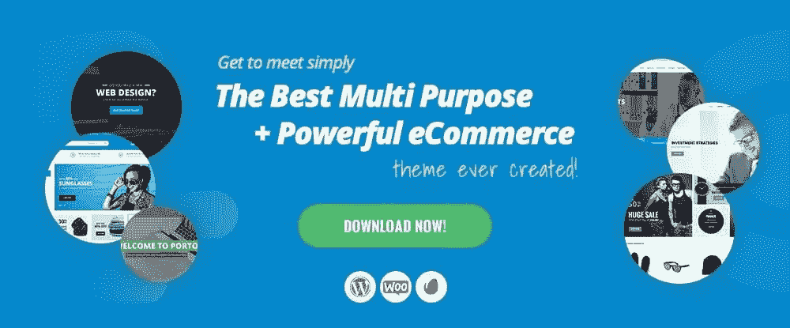
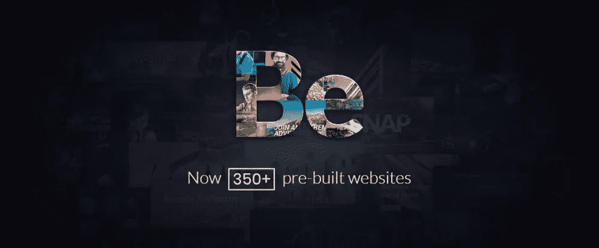
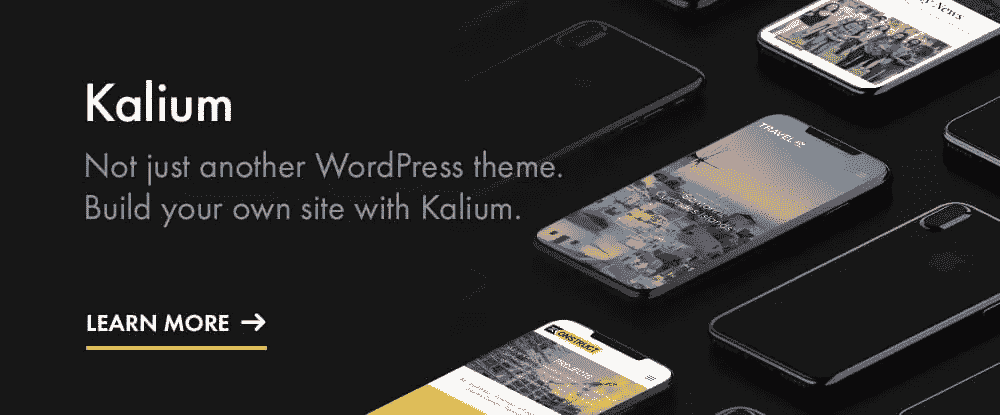
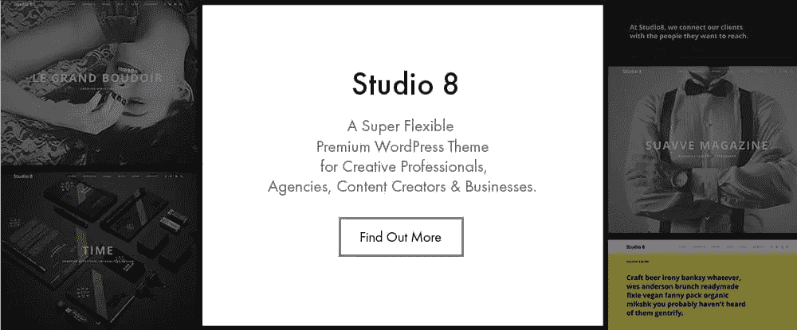
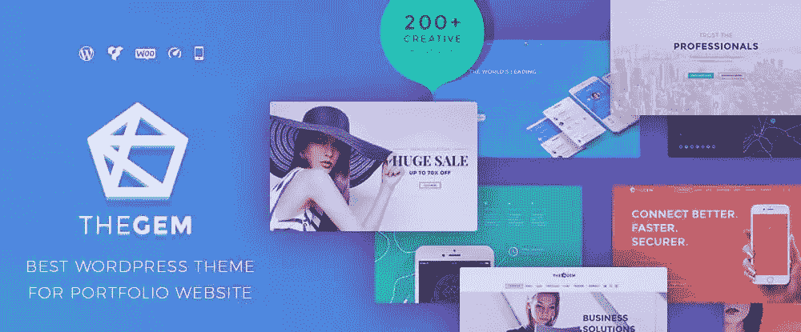
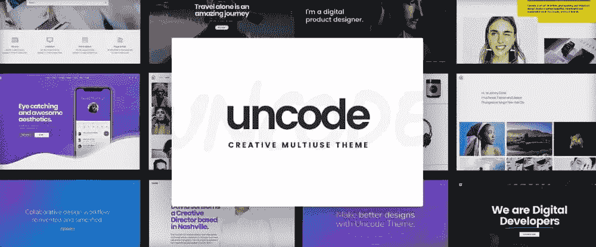
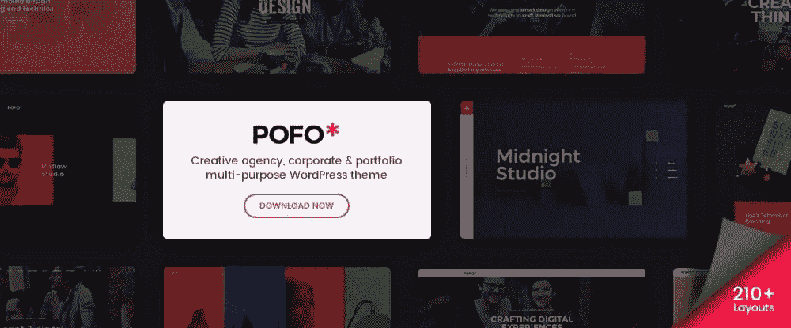
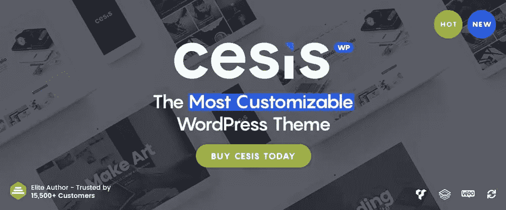

# 你的作品集的 8 个最好的主题

> 原文：<https://www.sitepoint.com/8-of-the-best-wordpress-themes-for-your-portfolio/>

*本文是与 [BAWMedia](https://bawmedia.com/) 合作创作的。感谢您对使 SitePoint 成为可能的合作伙伴的支持。*

建立一个像样的设计作品集一点也不难。但是，如果你的业务取决于你选择如何展示你的工作，“体面”通常不会削减它。

在某些情况下，一幅标题为“秋色”的好画可能就足够了。但是更多时候，一张照片、一件艺术品、一段视频或一件产品需要更多的解释。将文本和图像融合是困难的地方。

你也不想要一个看起来像所有其他网站的投资组合。这些图像可能不同，但总体上的相同可能会让人感到厌倦。由于用户倾向于浏览，你的作品集的外观和风格必须抓住他们的注意力。他们需要研究你的作品，而不是浏览它。

这就是拥有最好的投资组合主题和工具的地方。它们不仅能帮助你建造，还能激发你的创造力——就像这 8 种方法一样。

## 1.[波尔图——终极 WordPress +电子商务主题](http://www.portotheme.com/wordpress/porto_landing/?utm_source=sitepoint.com&utm_medium=content&utm_campaign=wp-portfolios)

Porto 是一个超快的，基于 Bootstrap 4 的，100%移动就绪的多用途 WordPress 主题，它不仅为你的网站设计项目提供了一个更好的选择，也为你的作品集创作活动提供了一个更好的选择。Porto 的作者一直遵循最新的设计趋势，并坚持最佳的编码实践——这是显而易见的。

灵活性对网页设计师来说非常重要。除非投资组合的设计非常简单明了，否则他们经常会发现他们使用的主题或工具对他们试图完成的事情有太多的限制。Porto 非常灵活，它的速度优化向导可以帮助你逐步优化你的站点速度。

阅读它的功能列表，你会发现一个完整的演示主机，包括非常强大的电子商务演示和面包屑，滑块，皮肤，网格选项，等等。

还有一个优秀的投资组合选择，包括六种不同的方式来展示您的投资组合。Porto 是 retina 和 WooCommerce ready，配备了可视化编辑器和 Revolution Slider，并与大量插件兼容。

## 2.贝瑟姆

BeTheme 的可定制预建网站库是市场上最大的，而且还在不断增长。这些专业设计和制作的网站建设工具的数量现在已经超过了 350 个。BeTheme 长期以来以其为网页设计师提供的灵活性而闻名，随着每个新的预建网站的发布，这种情况更加明显。

你可能需要的每一个特性、功能和设计选项都在那里，包括流行的拖放式 Muffin Builder、强大的管理面板、短代码、字体、网格选项和丰富的配色方案。

这本 ThemeForest 前五名的畅销书自然反应迅速，支持也很棒，使用 BeTheme 可以在短短 4 个小时内建立一个复杂的网站，并在更短的时间内创建一个设计精美的作品集。

## 3.钾

你可以用 Kalium 建立任何类型的网站，而且相对容易。它的 WPBakery 页面生成器通常被描述为世界上同类产品中最好的，可以让你在几分钟内建立页面。Kalium 的一键式安装程序可以让你克隆任何演示网站的所有内容，以快速启动项目，还有大量的设计元素、选项和 100 多个短代码以及特殊效果来帮助你。

投资组合呢？首先，Kalium 提供了 30 多种不同的投资组合布局，分为七种主要类型。在每种类型中，您都可以找到对齐图像、创建和调整间距和文本所需的子选项。也有大量的商店和博客布局，Kalium 反应灵敏，有 16 种语言，不需要编码。

## 4.[第八演播室](http://bit.ly/2MnzsFI)

Studio 8 是一个现代、优雅的 WordPress 主题，它将帮助你以完全专业的方式向你的站点访问者介绍你和展示你的作品。这个令人惊叹的设计，灵活，完全响应的主题迎合机构，网页设计师，艺术家和其他专业人士。

它帮助他们创建引人注目的网站和投资组合，旨在让他们在竞争中获得优势。

## 5.[the gem–创意多用途高性能 WordPress 主题](http://preview.themeforest.net/item/thegem-creative-multipurpose-highperformance-wordpress-theme/full_screen_preview/16061685?sort_priority_group=meta-portfolio&utm_source=baw_media&utm_medium=best-portfolio&utm_campaign=baw-portfolio)

TheGem 拥有构建几乎任何类型网站所需的工具，但它可能是市场上构建作品集网站的最佳 WordPress 主题。支持最流行的项目组合布局样式，它们是灵活的，间距和列设置是可变的和可调整的。

您还可以添加侧栏、突出显示项目、调整页面宽度以及混合内容和作品集——您几乎可以做任何您想做的事情。

## 6.[未编码](https://undsgn.com/uncode/?utm_source=sitepoint.com&utm_medium=content&utm_campaign=wp-portfolios)

这个创造性的多用途主题拥有在短短几个小时内建立一个令人敬畏的投资组合所需的一切。Uncode 的最小化设计及其 16 种组合风格、高级网格和缩略图系统，以及幻灯片滚动和画廊管理器功能提供了使您的组合成为真正艺术品所需的所有功能。

查看他们的用户建立的网站展示伟大的想法和灵感。

## 7.[Pofo–创意作品集和博客主题](http://wpdemos.themezaa.com/pofo/?utm_source=sitepoint.com&utm_medium=content&utm_campaign=wp-portfolios)

Pofo 是一个现代的，创造性的，多用途的主题，将特别吸引艺术家，创意团队和机构。亮点包括投资组合、电子商务和博客功能、免费捆绑插件、革命滑块和流行的 WPBakery 页面生成器。

这个速度极快且极其灵活的主题包含 150 多个预建的设计元素、25 多个现成的主页和 200 多个演示页面。

## 8.[Cesis–响应式多功能 WordPress 主题](https://cesis.co/ts/rs.php?theme=cesis&utm_source=bawmedia&utm_medium=article&utm_campaign=bawmedia_cesis_july2018&utm_content=post)

易于使用的界面和丰富的设计元素和选项的结合通常会产生一个主题，允许您以任何方式构建任何您想要的东西。这正是 Cesis 所提供的。

只需一键导入演示或预制模板，即可快速启动投资组合项目。如果愿意，您可以导入自己的模板。不需要编码。

## 结论

你可能需要一个作品集来展示你自己的作品。或者，你需要为企业、创意团队或机构创建一个。也许你有许多不同的客户需要满足？这里有东西给你。

这些主题有很多共同点，如速度、力量和灵活性。然而，每一个都有其独特的功能。这只是选择一个最适合你的需求的问题。

## 分享这篇文章