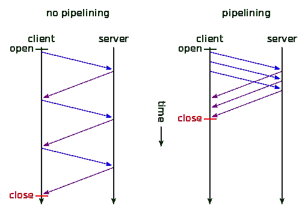
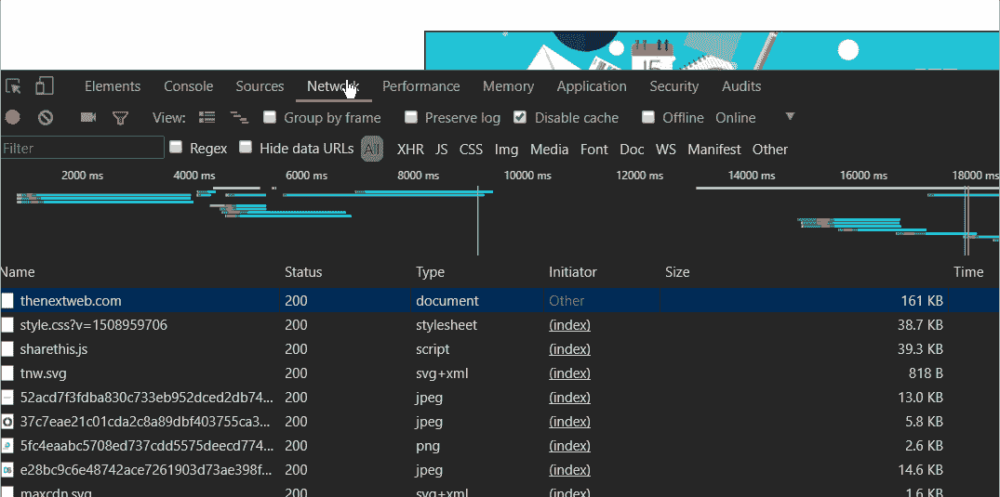

# HTTP/2:背景、性能优势和实现

> 原文：<https://www.sitepoint.com/http2-background-performance-benefits-implementations/>

在互联网的基础设施(或物理网络层)之上，坐落着互联网协议，作为 TCP/IP 或传输层的一部分。它是我们所有或大部分互联网通信的基础结构。

我们在此之上使用的更高级别的协议层是*应用层*。在这一层，各种应用程序使用不同的协议来连接和传输信息。我们有发送和接收电子邮件的 SMTP、POP3 和 IMAP，聊天的 IRC 和 XMPP，远程服务器访问的 SSH，等等。

其中最著名的协议是 HTTP(超文本传输协议)，它已经成为互联网使用的同义词。这是我们每天用来访问网站的。早在 1989 年，它就由欧洲粒子物理研究所的蒂姆·伯纳斯·李设计出来了。1.0 版的规范发布于 1996 年(RFC 1945)，1.1 版发布于 1999 年。

HTTP 规范由万维网联盟维护，可以在 https://www.w3.org/standards/techs/HTTP.找到

这种协议的第一代(版本 1 和 1.1)一直统治着 web，直到 2015 年 HTTP/2 发布，行业(web 服务器和浏览器供应商)开始采用它。

## HTTP/1

HTTP 是一个无状态协议，基于 T2 请求-响应结构，这意味着客户端向服务器发出请求，这些请求是原子的:任何单个请求都不知道前面的请求。(这就是我们使用 cookies 的原因——在一个用户会话中弥合多个请求之间的差距，例如，能够向登录用户提供网站的认证版本。)

传输通常由客户端发起，即用户的浏览器，服务器通常只对这些请求做出响应。

我们可以说，HTTP 的当前状态是相当“愚蠢”的，或者更好地说，是低级的，需要给浏览器和服务器提供许多关于如何有效通信的“帮助”。这一领域的变化并不是那么容易引入的，有这么多现有的网站，它们的功能依赖于向后兼容任何引入的变化。任何改进协议的工作都必须以无缝的方式进行，不会破坏互联网。

在许多方面，当前的模型已经成为这种严格的请求-响应、原子、同步模型的瓶颈，进展主要采取黑客形式，通常由行业领导者如谷歌、脸书等带头。通常的情况是，访问者请求一个网页，当他们的浏览器从服务器接收到该网页时，它解析 HTML 并找到呈现该网页所需的其他资源，如 CSS、图像和 JavaScript，这种情况正在以各种方式得到改进。当它遇到这些资源链接时，它停止加载其他所有东西，并向服务器请求指定的资源。在收到这个资源之前，它不会移动一毫米。然后它请求另一个，以此类推。


加载世界上最大的网站所需的请求数量通常有数百个。

这包括大量的等待，以及大量的往返行程，在此期间，我们的访问者只能看到一个白屏或一个半渲染的网站。这些都是浪费的时间。在这些请求周期中，大量可用带宽闲置不用。

cdn 可以缓解很多这样的问题，但它们也不过是黑客而已。

正如来自 Mozilla [的 Daniel Stenberg(HTTP/2 标准化工作人员之一)指出的那样](https://bagder.gitbooks.io/HTTP2-explained/content/en/part2.html)，该协议的第一个版本很难充分利用底层传输层 TCP 的能力。
一直致力于优化网站加载速度的用户知道，委婉地说，这通常需要一些创造力。

随着时间的推移，互联网带宽速度急剧增加，但 HTTP/1.1 时代的基础设施没有充分利用这一点。它仍然在努力解决一些问题，比如 HTTP 管道化——在同一个 TCP 连接上推送更多的资源。浏览器中的客户端支持一直拖得最多，Firefox 和 Chrome 默认禁用，或者根本不支持，像 IE、Firefox 54+版等。
这意味着即使很小的资源也需要打开一个新的 TCP 连接，随之而来的是所有的膨胀——TCP 握手、DNS 查找、延迟……并且由于[行首阻塞](https://www.wikiwand.com/en/Head-of-line_blocking)，一个资源的加载导致阻塞所有其他资源的加载。



同步、非流水线连接与流水线连接的比较，显示了加载时间的可能节省。

在 HTTP/1 模式下，一些优化巫术 web 开发人员不得不求助于优化他们的网站，包括[图像精灵](https://developer.mozilla.org/en-US/docs/Web/CSS/CSS_Images/Implementing_image_sprites_in_CSS)，CSS 和 JavaScript 连接，分片(将访问者对资源的请求分布在多个域或子域上)，等等。

改进是应该的，它必须以无缝、向后兼容的方式解决这些问题，以便不中断现有 web 的工作。

## spy 的

2009 年，谷歌宣布了一个项目，该项目将成为新一代协议的提案草案， [SPDY](https://www.chromium.org/spdy/spdy-whitepaper) (发音为 *speedy* )，增加对 Chrome 的支持，并在随后的几年里将其推广到其所有的网络服务中。然后是 Twitter 和服务器供应商，如 Apache、nginx 及其支持 Node.js，后来是 WordPress.com 脸书和大多数 CDN 提供商。

SPDY 引入了**多路复用**——通过单个 TCP 连接并行发送多个资源。默认情况下，连接是加密的，数据是压缩的。首先， [SPDY 白皮书](https://www.chromium.org/spdy/spdy-whitepaper)中对排名前 25 的网站进行的初步测试显示，速度从 27%提高到 60%以上。

在它在生产中证明了自己之后， [SPDY 版本 3 成为了 HTTP/2](https://bagder.gitbooks.io/HTTP2-explained/content/en/part4.html) 初稿的基础，由超文本传输协议工作组 httpbis 于 2015 年制定。

HTTP/2 旨在通过以下方式解决困扰第一版协议的问题—延迟问题:

*   压缩 HTTP 头
*   实现[服务器推送](https://en.wikipedia.org/wiki/HTTP/2_Server_Push)
*   在单个连接上复用个请求。

它还旨在解决排队头堵塞问题。它传输的数据是[二进制格式，提高了效率](https://HTTP2.github.io/faq/#why-is-HTTP2-binary)，默认情况下需要加密(或者至少，这是各大浏览器强加的要求)。

使用 HPACK 算法执行头压缩，[解决 SPDY](https://blog.cloudflare.com/hpack-the-silent-killer-feature-of-HTTP-2/) 中的漏洞，并将 web **请求**大小减少一半。

**服务器推送**是旨在解决浪费等待时间的功能之一，通过在浏览器需要资源之前将资源提供给访问者的浏览器。这样就减少了往返时间，这是网站优化的一大瓶颈。

由于所有这些改进，HTTP/2 给表带来的加载时间差异可以在 imagekit.io 的[这个示例页面](https://imagekit.io/demo/HTTP2-vs-HTTP1)上看到。

网站拥有的资源越多，加载时间的节省就越明显。

## 如何查看网站是否通过 HTTP/2 提供资源

在主流浏览器中，如 Firefox 或 Chrome，我们可以在 inspector 工具中检查网站对 HTTP/2 协议的支持，方法是打开 *Network* 选项卡，右键单击资源列表上方的条。在这里我们可以启用*协议*项。



另一种方法是安装一个基于 JavaScript 的小工具，允许我们通过命令行检查 HTTP/2 支持(假设我们已经安装了 Node.js 和 npm):

```
npm install -g is-HTTP2-cli 
```

安装后，我们应该能够像这样使用它:

```
is-HTTP2 www.google.com

✓ HTTP/2 supported by www.google.com
Supported protocols: grpc-exp h2 HTTP/1.1 
```

## 履行

在撰写本文时，所有主流浏览器[都支持 HTTP/2](https://en.wikipedia.org/wiki/Comparison_of_web_browsers#Protocol_support) ，尽管要求所有的 HTTP/2 请求都要加密，但 HTTP/2 规范本身并不要求。

### 服务器

Apache 2.4 通过其 [mod_HTTP2](https://httpd.apache.org/docs/2.4/howto/http2.html) 模块来支持它，该模块现在应该已经可以生产了。Apache 需要通过在`./configure`命令中添加`--enable-HTTP2`参数来构建。我们还需要确保至少安装了 1.2.1 版的`libngHTTP2`库。在系统找不到它的情况下，我们可以通过添加`--with-ngHTTP2=<path>`来提供到`./configure`的路径。

下一步是通过将指令添加到 Apache 的配置中来加载模块:

```
LoadModule HTTP2_module modules/mod_HTTP2.so 
```

然后，我们将把`Protocols h2 h2c HTTP/1.1`添加到我们的虚拟主机块中，并重新加载服务器。Apache 的文档警告我们启用 HTTP/2 时的注意事项:

> 在 Apache 服务器上启用 HTTP/2 会影响资源消耗，如果您有一个繁忙的站点，您可能需要仔细考虑这种影响。
> 
> 启用 HTTP/2 后，第一件值得注意的事情是您的服务器进程将启动额外的线程。原因是 HTTP/2 将收到的所有请求交给自己的 **Worker** 线程进行处理，收集结果并将其发送给客户端。

你可以在这里阅读更多关于阿帕奇配置的信息。

**nginx** [从版本 1.9.5](https://www.nginx.com/blog/nginx-1-9-5/) 开始就支持 HTTP/2，我们只需将 *http2* 参数添加到我们的虚拟主机规范中即可启用它:

```
server {
    listen 443 ssl http2 default_server;

    ssl_certificate    server.crt;
    ssl_certificate_key server.key; 
```

然后重新加载 nginx。

不幸的是，**服务器推送**在撰写本文时还没有正式实现，但[已经将其添加到开发路线图](https://trac.nginx.org/nginx/roadmap)中，计划于明年发布。对于更喜欢冒险的人来说，有一个[非官方的 nginx 模块](https://github.com/ghedo/HTTP2-push-nginx-module)，它增加了对 HTTP/2 服务器推送的支持。

LiteSpeed 和 OpenLiteSpeed [也声称](https://www.litespeedtech.com/products/litespeed-web-server/features/HTTP-2-support)支持 HTTP/2。

在在服务器端激活 HTTP/2 之前有一个警告**,就是要确保我们有 SSL 支持。这意味着我们上面提到的所有虚拟主机片段——对于 Apache 和 nginx——都需要进入 SSL 版本的虚拟主机块，监听端口 443。一旦我们安装了 Apache 或 nginx，并且配置了常规的虚拟主机，获得 LetsEncrypt SSL 证书并将其安装在任何主要的 Linux 发行版上应该只需要几行代码。 [Certbot](https://certbot.eff.org/) 是一个命令行工具，可以自动化整个过程。**

## 结论

在本文中，我提供了 HTTP/2 的概述，这是第二代 web 协议的新的和不断发展的规范。

新一代 HTTP 实现的完整列表可以在[这里](https://github.com/HTTP2/HTTP2-spec/wiki/Implementations)找到。

对于不太懂技术的人来说，过渡到这个新协议的最短路径可能是简单地在 web 栈中实现一个 [CDN](https://www.sitepoint.com/what-is-a-cdn-and-how-does-it-work) ，因为 CDN 是 HTTP/2 的最早采用者之一。

## 分享这篇文章