# 性能审计:Firefox 开发人员工具深度探讨

> 原文：<https://www.sitepoint.com/performance-auditing-a-firefox-developer-tools-deep-dive/>

在本文中，我们将介绍 Firefox Web 开发工具(“dev Tools”)——一套旨在帮助开发人员检查、调试、分析和优化网站和 Web 应用程序性能的工具。我们将特别关注与性能相关的工具，但我们也将了解如何开始使用 DevTools，并了解一些有用的设置。

您可以通过不同的方式访问 DevTools:

*   点击导航工具栏右侧的汉堡菜单，点击 *Web Developer* ，然后选择您想要使用的子工具
*   使用键盘组合，如`Shift+F5` (Windows 和 macOS)用于性能工具，而`Ctrl+Shift+E` (Windows)或`Cmd+Option+E` (macOS)用于网络工具
*   在页面的任意位置点击右键选择*检查元素*。

## DevTools Settings

Firefox DevTools 有许多选项可以帮助开发人员定制他们的体验，例如在 Web 控制台中选择**启用时间戳**，或者**禁用 HTTP 缓存**，这用于模拟所有打开 DevTools 的页面的首次加载性能。

您可以通过不同的方式访问 DevTools 设置面板:

首先打开 DevTools，接下来:

*   或者点击工具栏中的*设置*按钮
*   按`F1`在任何当前工具的顶部显示设置面板
*   按`Ctrl+Shift+O` (Windows 和 Linux)、`Cmd+Shift+O` (macOS)显示设置面板。

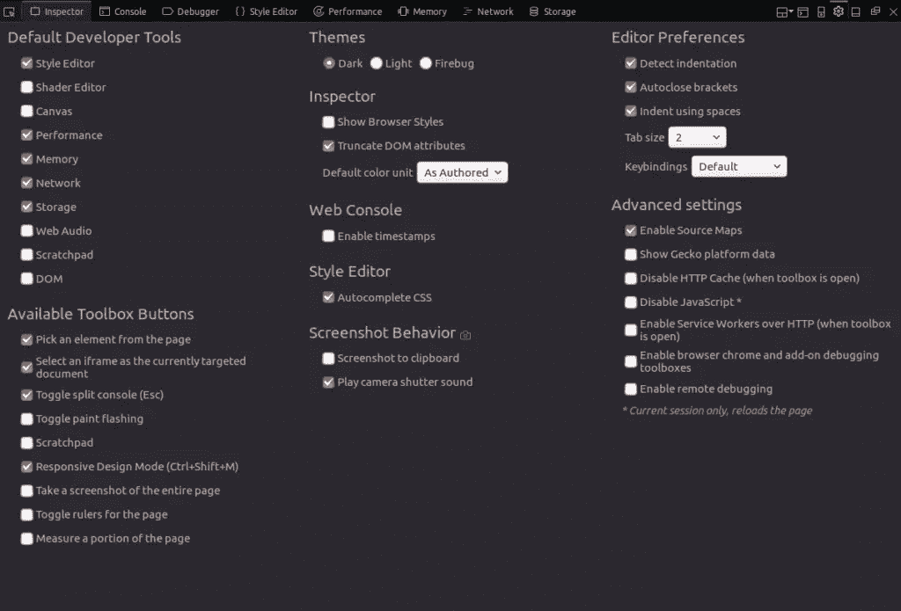

在这里你可以选择你的默认工具，你想在工具箱中显示的按钮，主题(暗光火虫)和其他高级设置。

## 注重性能的工具

在分析 web 应用程序的性能时，您需要区分加载时性能和运行时性能。

加载时性能回答了诸如“哪些资源加载时间太长？”在处理运行时性能时，我们需要关注 JavaScript 和 CSS(特别是 CSS 动画)，这样我们就能够看到代码在哪里花费了大部分时间，以及是什么导致了瓶颈。

让我们看看网络监视器和性能工具。

## 网络监视器

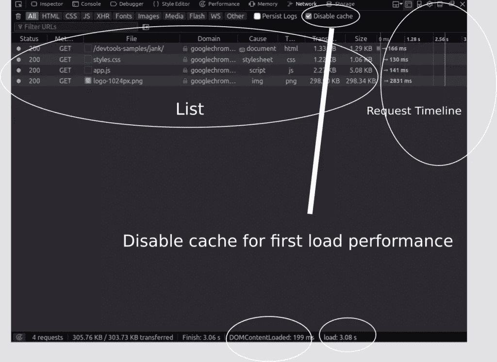

网络监视器向你展示了火狐发出的所有网络请求的表格视图(例如，当它加载一个页面，或者发送`XMLHttpRequest` s，获取 API 请求等等)。).

它还可以显示与请求相关的 HTTP 头、HTTP 响应和 cookies，并允许您对它们进行搜索。您还可以使用它来执行、显示和保存当前页面负载的性能分析。

简而言之，这个工具可以用来确定浏览器下载一个网页的不同资源需要多长时间。

您还可以使用这个工具来监控和挑选出那些减缓或阻碍网页快速加载的请求。网络面板显示何时触发主要事件(`DOMContentLoaded`和`load`)。

### 请求时间线

网络列表中的每个请求都有一个时间线列，显示与请求相关的计时信息，例如加载资源所用的总时间。

DevTools 在报告中标记主要的生命周期事件，如`DOMContentLoaded`和`load`页。蓝色表示事件`DOMContentLoaded`被触发的时间；紫色线表示页面的`load`事件被触发的时间。

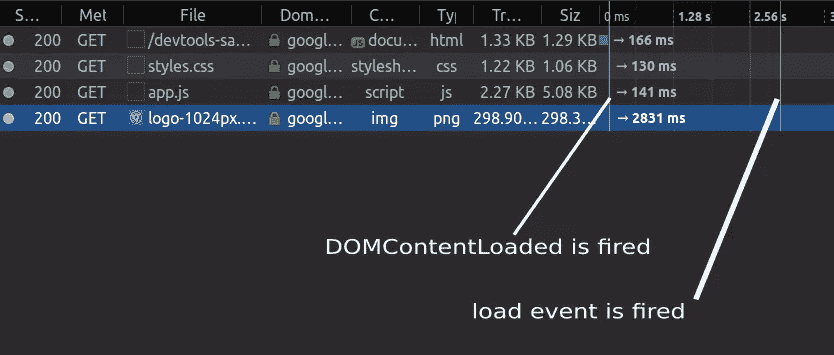

### DOMContentLoaded 与 Load 事件

当 HTML 文档被完全加载和解析时，不包括 CSS 样式表、图像和框架，就会触发`DOMContentLoaded`事件。

当 HTML 文档和所有相关联的样式表、图像和框架被完全加载时，事件`load`被触发。

### 请求详细信息面板

单击请求列表中的请求后，您可以看到右停靠的详细信息窗格，其中有许多不同的选项卡，如标题、参数、响应、计时和安全性。

为了提高性能，我们将特别关注时间信息。

### 网络计时

在此窗格中，有许多与每个请求相关的计时指标:

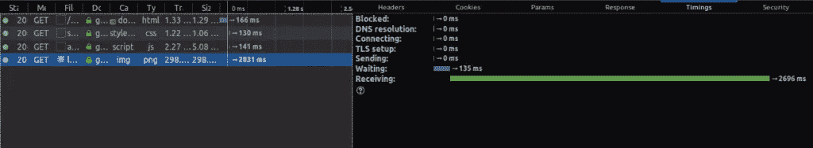

**阻塞**是在队列中等待网络连接所花费的时间。

**发送**是向服务器发送请求所花费的时间。

**接收**是从服务器接收响应或(如果缓存了)从缓存中读取响应所花费的时间。

**等待**是客户端在收到第一个字节之前等待的总时间。在其他性能分析工具中，如 WebPageTest.org 或 Chrome 的 DevTools，这被称为 **TTFB** 或首字节时间。

还有 **DNS 解析**，这是解析服务器主机名所花的时间，还有**连接**，这是打开 TCP 连接所花的时间。

### 如何分析加载时间性能

网络监视器集成了一个性能分析工具，可用于分析网页的加载时性能。

要开始分析加载时性能，您可以:

*   点击底部状态栏中的*分析*图标
*   在网络监视器打开的情况下，重新加载页面或发出网络请求(实际上，这只是为了显示请求的表格信息，而不是进行加载时性能分析)。

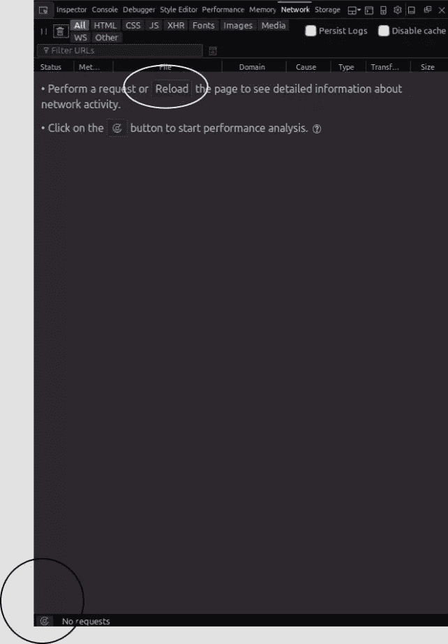

最终的报告显示了一个饼状图和一个相应的表格，按类型显示接收到的资源:JavaScript、CSS、图像和字体等。以及包含以下详细信息的摘要:

*   缓存的响应数
*   请求总数
*   大小
*   转移尺寸
*   装载时间

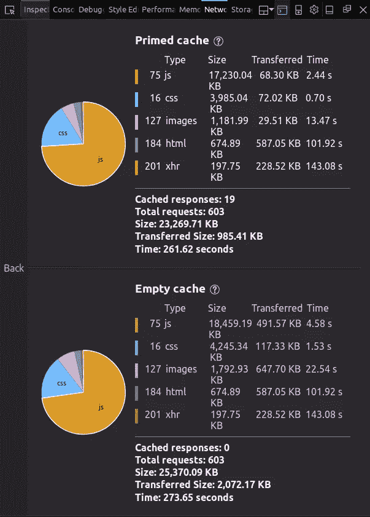

使用空的缓存和准备好的缓存来测试网页。

### 首次负载性能

Firefox 的 DevTools 允许您在两种不同的情况下分析 web 应用程序的性能:

*   没有缓存，这模拟了资产仍然没有缓存时的第一次访问。
*   使用缓存，模拟第二次访问。浏览器已经缓存了应用程序的资源，消除了许多到服务器的往返。

您还可以使用*禁用缓存*设置来模拟 DevTools 在任何选项卡上打开时网页的首次加载。

## JavaScript 性能和响应能力

JavaScript 是单线程的，这意味着浏览器同步运行代码，但由于 HTML5 Web Workers(多线程 JavaScript 的标准 API)，你也可以在其他线程中运行代码。

这个单线程负责运行浏览器正在做的所有工作，如布局渲染、计算样式和收集垃圾。

同样，方法如`setTimeout`、事件如`click`和`load`以及资源获取都由单线程执行。(诚然，这些任务是异步执行的，但是 JavaScript 中的 asynchronously 是不同的:它是通过使用事件驱动的方法来模拟的，具有事件循环和队列。)

良好的性能和响应性是由于 JavaScript 的异步模型，但长时间运行的函数可能会导致糟糕的性能和糟糕的 UI 响应。

### 性能工具

Performance tool 通过让您深入了解网页的 UI 响应性(响应用户交互)和 JavaScript 代码性能，允许您发现网页的瓶颈和性能问题。

使用 Performance tool，您可以在一段时间内对当前打开的网页进行性能分析，您可以使用 start 和 stop recording 按钮来控制这段时间。然后，该工具会向您显示浏览器呈现页面时所做操作的摘要、表格和图表视图。

您可以使用性能工具来查找和检测阻塞单线程的长时间运行的代码段。

### 如何使用性能工具

使用性能工具的步骤非常简单:

*   打开您的网页，打开性能面板，然后开始记录性能
*   等待几秒钟，同时确保在分析过程中与您的页面进行交互，然后停止记录
*   寻找任何长时间运行的函数或事件，并关注(放大)FPS 较低的时间部分。
*   当您发现任何可以进一步优化的活动时，您可以使用其他子工具来获得关于在哪里采取行动的详细信息。

确保遵循一些用户交互场景，并在分析过程中与应用程序 UI 的不同部分进行交互，尤其是您想要优化的部分。还要避免不必要的额外操作:例如，不要与你不想分析的部分交互，因为它们只会给你的报告结果增加更多的噪音。

### 选择时间范围

Firefox 的 DevTools 支持选择或缩小配置文件的时间范围。您可以单击时间线或 FPS 图表部分，然后拖动鼠标选择一段时间。一旦停止拖动，DevTools 就会更新其他视图和图表，只显示在这段时间内发生的事件的信息。

[https://www.youtube.com/embed/BzfkBRFucp8](https://www.youtube.com/embed/BzfkBRFucp8)

### FPS 图表

帧速率图表显示录制期间每秒的帧数。录音运行时，此图表就像一个带有实时值的 FPS 指示器。

FPS 图表显示了 FPS 的最大值、最小值以及一段时间内的平均 FPS 值。所有这些值可以快速告诉您是否有任何性能瓶颈。

如果你正在运行任何动画，FPS 应该是 *60 fps* 。观看此视频，了解这一价值的重要性:

[https://www.youtube.com/embed/CaMTIgxCSqU?rel=0](https://www.youtube.com/embed/CaMTIgxCSqU?rel=0)

您可以使用此图表快速发现视觉差距(崩溃)和不一致，这表示帧速率严重下降(意味着浏览器存在性能瓶颈)。

您可以从该屏幕截图中看到一个带有折叠的 FPS 图表:

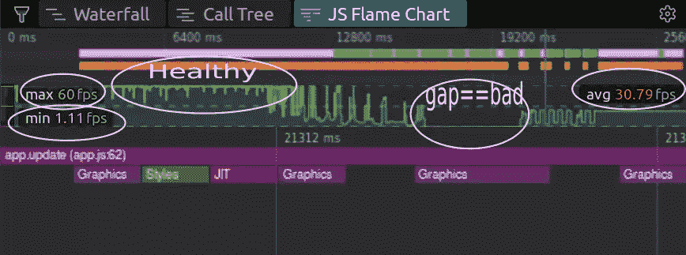

### 瀑布图

[维基百科](https://en.wikipedia.org/wiki/Waterfall_chart)将瀑布图解释为:

> 一种数据可视化形式，有助于理解连续引入的正值或负值的累积效应。由于柱子(砖块)明显悬浮在半空中，瀑布图也被称为飞砖图或马里奥图。

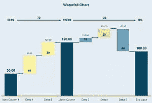

*[图片来源](https://en.wikipedia.org/wiki/Waterfall_chart)*

对于性能工具，瀑布图显示浏览器正在执行的活动和特定于浏览器的事件的明细，例如:

*   布局渲染或布局元素(也称为重排)
*   式样
*   动画帧请求
*   重画或像素绘制
*   垃圾收集等。

布局操作或回流和样式计算是昂贵的，所以这些可能是优化的潜在领域。更多详情请见这篇[谷歌文章](https://developers.google.com/web/fundamentals/performance/rendering/reduce-the-scope-and-complexity-of-style-calculations)。

下面是一个示例应用程序的瀑布图的屏幕截图:

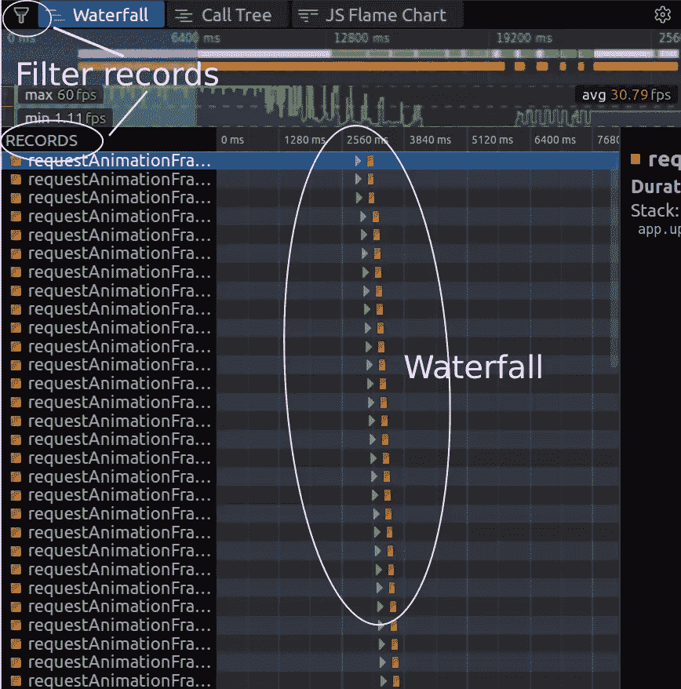

### 呼叫树视图

调用树视图显示浏览器花费大部分时间的 JavaScript 函数，以及重要的度量，如活动的总时间、自身时间及其相对于总分析时间的百分比。

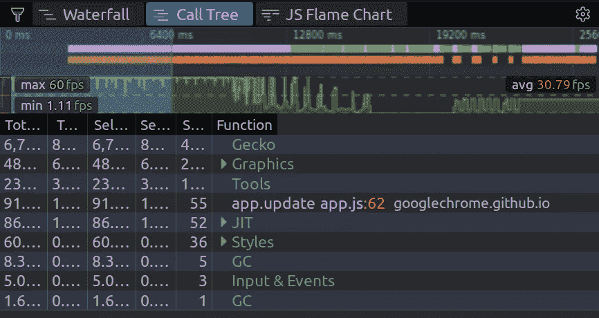

**自身时间**是指不考虑所调用的函数，单独由操作所花费的时间。

**总时间**是指操作及其调用的函数所花费的时间。

根据统计数据，调用树会告诉您，在一次记录中，您的浏览器在哪个函数(聚合)中花费的时间最多。

### JS 火焰图

火焰图显示分析期间 JavaScript 调用堆栈的火焰图。火焰图是由布兰登·格雷格创造的一种可视化表现形式。

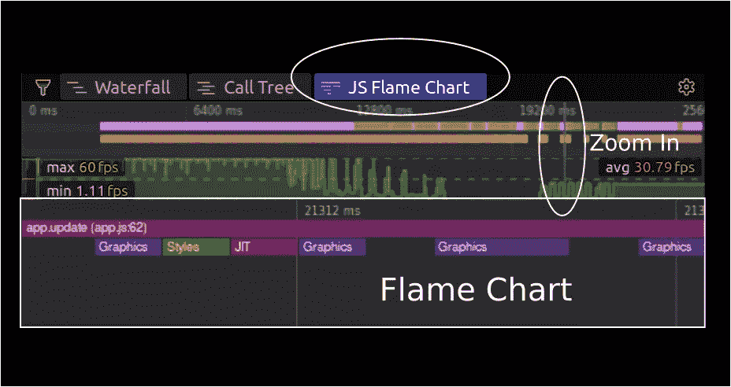

火焰图能够快速准确地识别大多数热代码路径。

堆叠的条意味着直接存在于 CPU 中的顶层操作调用了底层操作。

你可以在这里阅读更多关于火焰图表[。](http://queue.acm.org/detail.cfm?id=2927301)

您可以使用帧速率和 JavaScript 火焰图、瀑布图和调用树视图来找出性能问题所在，并挑出需要优化的特定函数。

火焰图显示了特定函数在特定记录时间的调用堆栈状态。

火焰图有大量的数据，所以为了获得有意义的读数，你需要放大，直到你选择几毫秒。

### 颜色代码

不同的图表和部分使用相同的颜色进行颜色编码，用于相同类型的操作和资产— JavaScript、CSS、渲染、绘画等。

您可以使用颜色来区分不同视图中的操作，快速发现导致问题的操作类型，并在不同视角之间切换时跟上操作的类型。

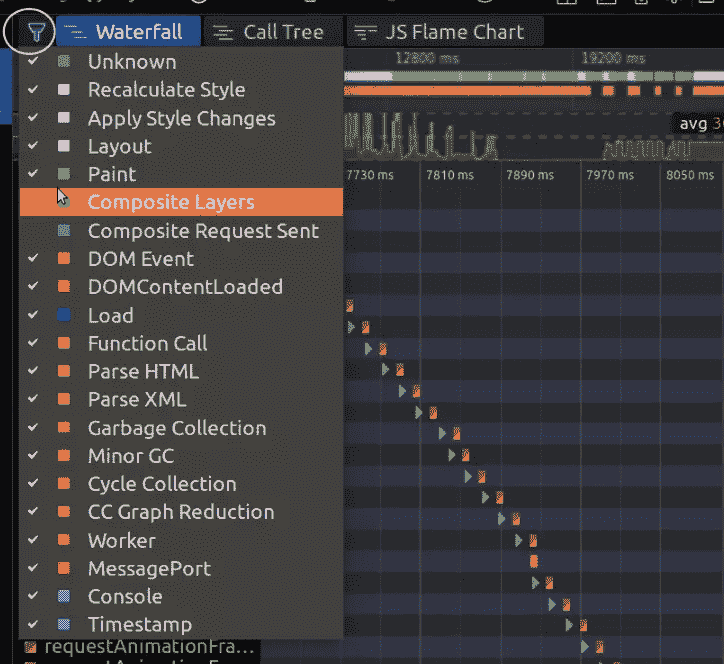

您可以通过此菜单过滤出您希望在图表和视图中看到的单个活动，在这里您还可以看到与不同操作相关联的不同颜色。

例如，如果您正在处理 CSS 动画，您需要关注的是诸如重新计算样式、应用样式更改、布局和绘画等活动。您可以过滤掉其他活动以减少噪音。

对于 JavaScript，你需要专注于函数调用，解析 HTML，解析 XML。

## 结论

在本文中，我们已经了解了如何开始使用 Firefox 的 DevTools，以及如何使用不同的与性能相关的子工具。Firefox 的 DevTools 非常全面，随着 Firefox 最近的性能升级，它更加能够准确地识别网站渲染过程中真正有问题的区域。既然您已经熟悉了术语并知道要寻找什么，我们鼓励您自己进一步探索。

## 分享这篇文章