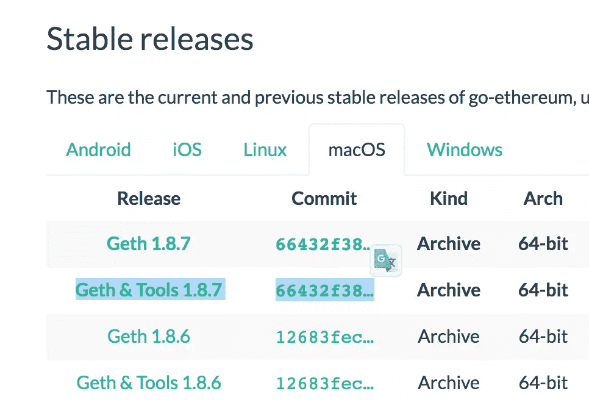
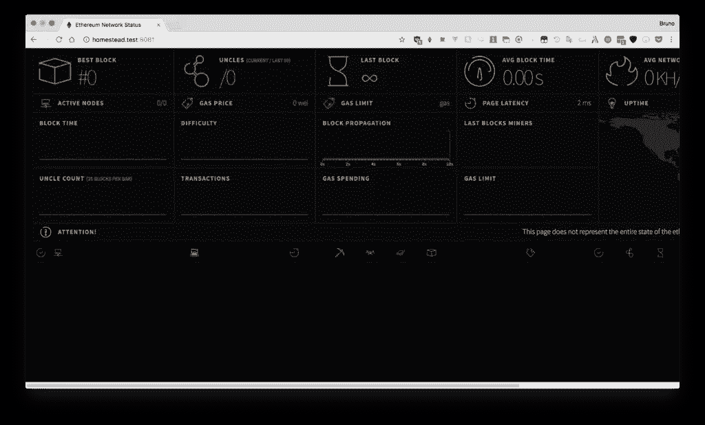
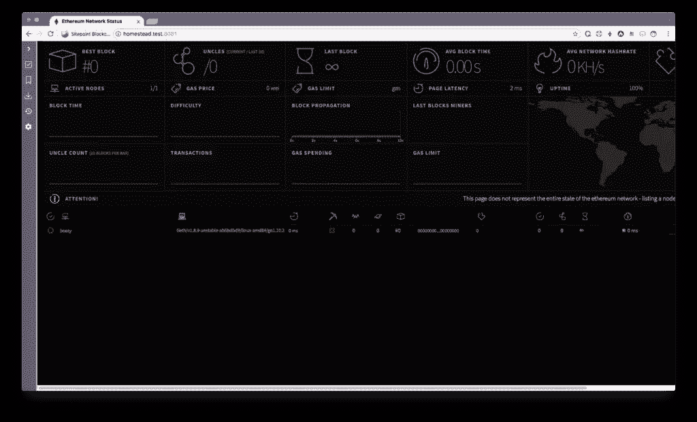
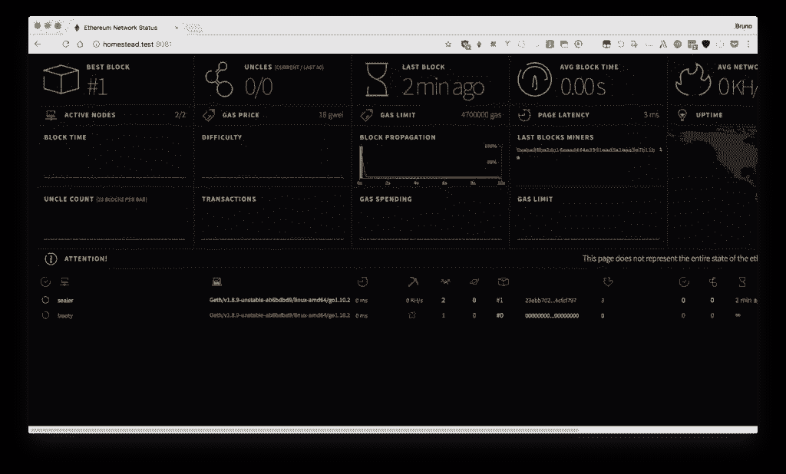
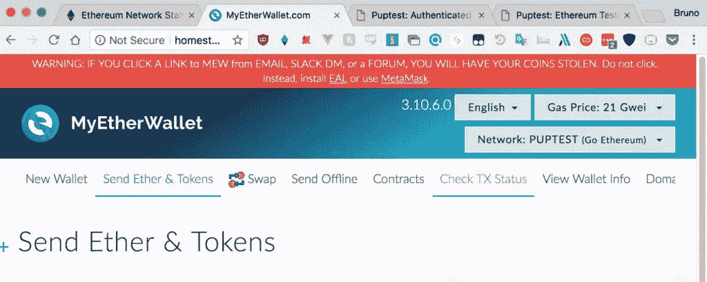
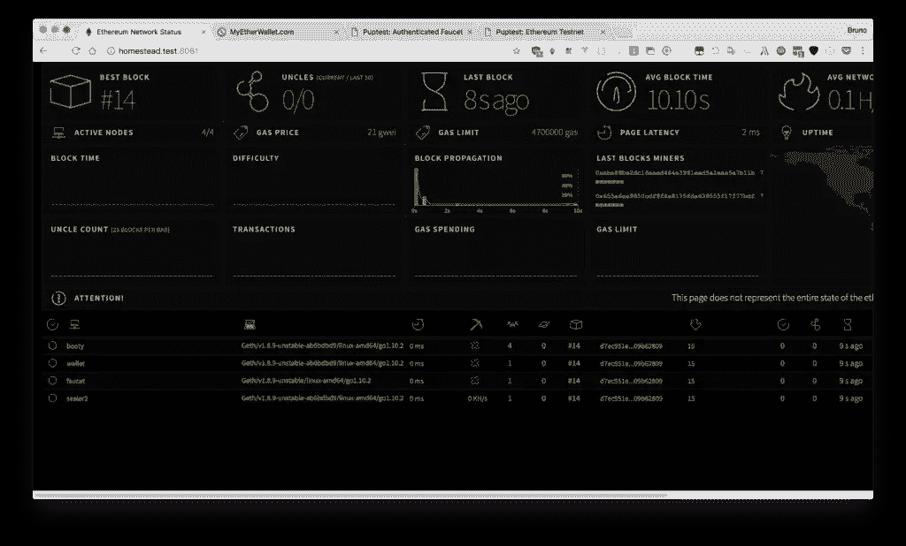
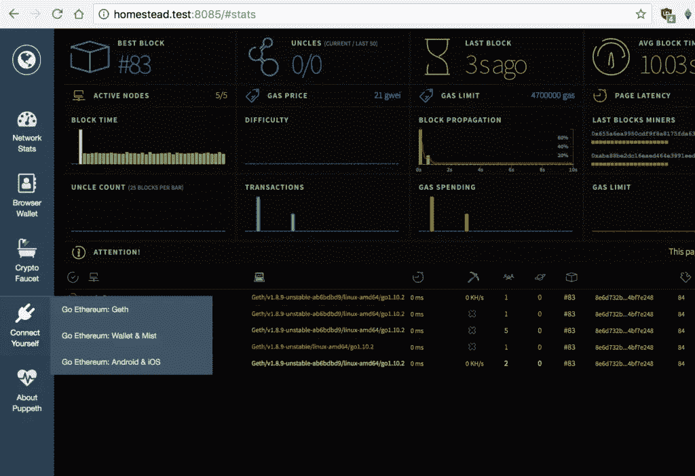

# 使用 Puppeth，以太坊专用网络管理器

> 原文：<https://www.sitepoint.com/puppeth-introduction/>

我们之前已经写过关于 Geth 的文章，这是最受欢迎的以太坊节点之一。



当您安装 Geth with helper tools 时，它附带了一个名为 Puppeth 的便利工具，您可以使用它来维护和安装各种助手工具，以管理和部署您的私有区块链。如果您已经安装了 Go，也可以使用以下命令独立安装 Puppeth:

```
go get github.com/ethereum/go-ethereum/cmd/puppeth 
```

让我们来看看这个工具。

注意:本教程要求你有两台远程机器供你使用。不管那是一个像 [Homestead Improved](https://www.sitepoint.com/quick-tip-get-homestead-vagrant-vm-running/) 这样的虚拟机，还是你网络上的实际服务器，或者两者的组合，都没有关系。在本教程中，我们将介绍虚拟机的设置过程。

**注意:由于 Puppeth 中的一个[错误，如果你的虚拟机(见下文)太小，这种方法可能不起作用。要么制造更大的虚拟机(更多的 RAM)，要么等待修复(如果这不是一个选项)。](https://github.com/ethereum/go-ethereum/issues/16905)**

## 拔靴带

我们将按照[流程](https://www.sitepoint.com/quick-tip-get-homestead-vagrant-vm-running/)启动并运行两个虚拟机。我们需要两台机器，因为我们将运行两个以太坊节点，每个节点都有自己的 IP 地址。

*注意:这是 Puppeth 的一个限制，因为不可能使用这个工具在同一台机器上部署一个密封节点。*

如果你不知道什么是流浪者，以及我们在这里使用什么工具，我们建议你阅读[这篇关于流浪者](https://www.sitepoint.com/re-introducing-vagrant-right-way-start-php/)的介绍，它以一种新手友好的方式对其进行了分解。

```
mkdir my_project; cd my_project
git clone https://github.com/swader/homestead_improved hi_puppeth1
git clone https://github.com/swader/homestead_improved hi_puppeth2 
```

通过进入`hi_puppeth2`文件夹并将`IP address`字段修改为`192.168.10.11`而不是`192.168.10.10`，更改第二个克隆的 IP 地址。

接下来，通过修改每个克隆的`Homestead.yaml`的最后一部分，打开虚拟机上的一些端口，如下所示:

```
 ports:
     - send: 8545
       to: 8545
     - send: 30301
       to: 30301
     - send: 30302
       to: 30302
     - send: 30303
       to: 30303
     - send: 30304
       to: 30304
     - send: 30305
       to: 30305
     - send: 30306
       to: 30306 
```

不要忘记将这些虚拟主机添加到您的主机的`/etc/hosts`文件中。否则虚拟机将无法通过其域名访问！

```
192.168.10.10 homestead.test
192.168.10.11 puppethnode.test 
```

*注意:如果您的虚拟机地址不同，请更改 IP 地址。*

最后，运行`vagrant up; vagrant ssh`来引导每台机器并 SSH 到其中。记得从*两个独立的标签*运行这个，这样你可以让两台机器都打开并运行。

## 先决条件

现在让我们在每台机器上安装必备软件*。*

Puppeth 在 Docker 容器中为你运行助手应用和以太坊节点，所以我们需要 Docker。安装 Geth 本身也很有用。

```
sudo add-apt-repository -y ppa:ethereum/ethereum
sudo apt-get update
sudo apt-get install \
    apt-transport-https \
    ca-certificates \
    curl \
    software-properties-common \
    ethereum \
    docker.io \
    docker-compose 
```

所有其他先决条件将由 Puppeth 通过 docker 本身引入，但是我们需要首先确保当前用户被允许操作 Docker 命令:

```
sudo usermod -a -G docker $USER 
```

在主机上(在虚拟机之外)，我们应该在运行项目的文件夹中创建新的以太坊帐户。

如果你使用上面建议的虚拟机，如果`myproject`是包含`hi_puppeth1`和`hi_puppeth2`的父文件夹，那么它可以在`myproject`中。

```
mkdir node1 node2
geth --datadir node1 account new
geth --datadir node2 account new 
```

记下此过程生成的地址:

```
$ mkdir node1 node2
$ geth --datadir node1 account new
INFO [05-20|10:27:20] Maximum peer count                       ETH=25 LES=0 total=25
Your new account is locked with a password. Please give a password. Do not forget this password.
Passphrase:
Repeat passphrase:
Address: {aba88be2dc16eaed464e3991eed5a1eaa5e7b11b}
$ geth --datadir node2 account new
INFO [05-20|10:27:35] Maximum peer count                       ETH=25 LES=0 total=25
Your new account is locked with a password. Please give a password. Do not forget this password.
Passphrase:
Repeat passphrase:
Address: {655a6ea9950cdf9f8a8175fda639555f17277bdf} 
```

我们需要两个账户，因为在区块链的授权证明中至少需要两个*签名人*(稍后将详细介绍)。

## 木偶

现在我们的虚拟机正在运行，我们的帐户已经初始化，让我们看看 Puppeth 提供了什么。在远程服务器/虚拟机仍在运行的情况下，在主机上的一个新选项卡中运行 Puppeth with `puppeth`。

它首先会询问网络名称。如果您在本地机器上运行多个区块链，这对于识别各种不同的应用程序非常有用。我们将在这里使用“puptest”。

```
Please specify a network name to administer (no spaces or hyphens, please)
> puptest

Sweet, you can set this via --network=puptest next time!

INFO [05-20|10:32:15] Administering Ethereum network           name=puptest
WARN [05-20|10:32:15] No previous configurations found         path=/Users/swader/.puppeth/puptest 
```

现在让我们连接到我们的“远程”服务器，这样 Puppeth 就可以将它们包含在列表中，并可以对它们进行操作。

### 跟踪新的远程服务器

使用此选项可以连接到将运行区块链相关服务的服务器。选择选项 3，然后输入如下值:

```
Please enter remote server's address:
> vagrant@192.168.10.10
What's the decryption password for /Users/swader/.ssh/id_rsa? (won't be echoed)
>

The authenticity of host '192.168.10.10:22 (192.168.10.10:22)' can't be established.
SSH key fingerprint is 38:53:d3:c2:85:cf:77:54:a5:54:26:3b:93:5b:6f:09 [MD5]
Are you sure you want to continue connecting (yes/no)? yes
What's the login password for vagrant at 192.168.10.10:22? (won't be echoed)
>
INFO [05-20|10:39:53] Starting remote server health-check      server=vagrant@192.168.10.10
+-----------------------+---------------+---------+--------+-------+
|        SERVER         |    ADDRESS    | SERVICE | CONFIG | VALUE |
+-----------------------+---------------+---------+--------+-------+
| vagrant@192.168.10.10 | 192.168.10.10 |         |        |       |
+-----------------------+---------------+---------+--------+-------+ 
```

Puppeth 会询问您的 SSH 密钥密码，以防 SSH 用于连接服务器。如果没有，它将询问 SSH 密码(如上例所示)。相关虚拟机上用户`vagrant`的默认 SSH 密码是`vagrant`。

最后的输出反映了远程服务器的“健康”状态。因为它没有运行服务，所以它将只列出 IP。选择选项 1: `Show network stats`可以看到同样的结果。

对另一个虚拟机重复该过程，使两个虚拟机都出现在运行状况屏幕中。

### 新创世纪

要启动我们的区块链，我们应该配置一个新的 genesis 文件。起源文件是构建第一个(起源)块的文件，每个后续块都在该文件上生长。

选择选项 2，`Configure new genesis`，并像这样填充选项:

```
Which consensus engine to use? (default = clique)
 1. Ethash - proof-of-work
 2. Clique - proof-of-authority
> 2

How many seconds should blocks take? (default = 15)
> 10

Which accounts are allowed to seal? (mandatory at least one)
> 0xaba88be2dc16eaed464e3991eed5a1eaa5e7b11b
> 0x655a6ea9950cdf9f8a8175fda639555f17277bdf
> 0x

Which accounts should be pre-funded? (advisable at least one)
> 0x655a6ea9950cdf9f8a8175fda639555f17277bdf
> 0xaba88be2dc16eaed464e3991eed5a1eaa5e7b11b
> 0x

Specify your chain/network ID if you want an explicit one (default = random)
>
INFO [05-20|11:25:55] Configured new genesis block 
```

你可以在这里了解 PoW 和 PoA [的区别。PoW 浪费了大量计算能力，在本地机器上运行是不切实际的，所以我们在这里选择 PoA。我们将阻止时间减少到 10 秒，以便更快地确认我们的交易，并且我们添加了之前生成的地址，作为允许的密封者和预先注资。成为密封者意味着他们被允许创造新的区块。由于在 PoA 中没有采矿奖励，我们还用几乎无限的乙醚预先资助它们，以便我们可以用这些帐户测试我们的交易。](https://www.sitepoint.com/proof-of-stake-vs-proof-of-work/)

现在生成了 genesis 文件，为了备份的目的，如果您愿意，可以通过再次选择选项 2 将其导出到外部文件中。现在没必要这样。

现在让我们部署一些区块链组件！

## 部署网络组件

Puppeth 使用`docker-compose`工具将这些组件部署在单独的 docker 容器中。Docker 作为一个工具超出了本文的范围，但是你不需要熟悉它就可以使用它。让我们从第一个组件开始，Ethstats。

### Ethstats

安装 Ethstats 安装并运行 ethstats.net 网站的本地版本[。选择第一个选项。](https://ethstats.net/)

```
Which server do you want to interact with?
 1\. vagrant@192.168.10.10
 2\. Connect another server
> 1

Which port should ethstats listen on? (default = 80)
> 8081

Allow sharing the port with other services (y/n)? (default = yes)
>
INFO [05-20|11:43:32] Deploying nginx reverse-proxy            server=192.168.10.10         port=8081
Building nginx
Step 1/1 : FROM jwilder/nginx-proxy
 ---> e143a63bea4b
Successfully built e143a63bea4b
Recreating puptest_nginx_1

Proxy deployed, which domain to assign? (default = 192.168.10.10)
> homestead.test

What should be the secret password for the API? (must not be empty)
> internet2
Found orphan containers (puptest_nginx_1) for this project. If you removed or renamed this service in your compose file, you can run this command with the --remove-orphans flag to clean it up.
Building ethstats
Step 1/2 : FROM puppeth/ethstats:latest 
```

我们选择先前添加的第一台服务器。然后，我们添加一个部署该软件的端口，然后命名我们将通过其访问应用程序的域。最后，我们生成一个简单的“秘密”来访问应用程序的 API。Docker 然后接管并为我们构建软件。

最终结果应该是另一个健康屏幕输出，但这次该表将有另一个条目:它还将列出`ethstats`应用程序及其配置详细信息:

```
INFO [05-20|11:44:23] Starting remote server health-check      server=vagrant@192.168.10.10
+-----------------------+---------------+----------+-----------------------+----------------+
|        SERVER         |    ADDRESS    | SERVICE  |        CONFIG         |     VALUE      |
+-----------------------+---------------+----------+-----------------------+----------------+
| vagrant@192.168.10.10 | 192.168.10.10 | ethstats | Banned addresses      | []             |
|                       |               |          | Login secret          | internet2      |
|                       |               |          | Website address       | homestead.test |
|                       |               |          | Website listener port | 8081           |
|                       |               |          | --------------------- | -------------- |
|                       |               | nginx    | Shared listener port  | 8081           |
+-----------------------+---------------+----------+-----------------------+----------------+ 
```

在浏览器中访问 URL `homestead.test:8081`应该会显示如下屏幕:



这个应用程序目前是无用的:我们需要为这个应用程序部署至少一个节点来开始显示一些东西！

### 启动模式

让我们部署一个 bootnode。

bootnode 是以太坊[节点](https://bitfalls.com/2017/11/26/whats-bitcoin-node-mining-vs-validation/)连接到其他节点的第一个连接点。它基本上是一个帮助节点连接的信息中继器。

选择选项 2 来部署 bootnode。同样，部署在同一个远程服务器上，选择一些缺省值，然后为节点命名为“health stats”表:

```
Which server do you want to interact with?
 1. vagrant@192.168.10.10
 2. vagrant@192.168.10.11
 3. Connect another server
> 1

Where should data be stored on the remote machine?
> /home/vagrant/mychain

Which TCP/UDP port to listen on? (default = 30303)
>

How many peers to allow connecting? (default = 512)
>

How many light peers to allow connecting? (default = 256)
>

What should the node be called on the stats page?
> booty 
```

Docker 将构建节点并运行它。远程机器上存储数据的位置是任意的。我们选择了`vagrant`用户的主目录。

如果您现在重新访问`ethstats`页面(`homestead.test:8081`)，您会注意到`booty`在节点列表中！



*注意:如果不是这种情况，并且您的 bootnode 在健康检查中被列为离线，请重新启动远程服务器(使用虚拟机，这是`vagrant reload`)，然后再次检查*。

### 海豹节点

密封节点是可以作为新块的挖掘器的节点。让我们部署下一个:

```
Which server do you want to interact with?
 1. vagrant@192.168.10.10
 2. vagrant@192.168.10.11
 3. Connect another server
> 1

Where should data be stored on the remote machine?
> /home/vagrant/mychainsealer

Which TCP/UDP port to listen on? (default = 30303)
> 30301

How many peers to allow connecting? (default = 50)
>

How many light peers to allow connecting? (default = 0)
>

What should the node be called on the stats page?
> sealer

Please paste the signer's key JSON:
> {"address":"655a6ea9950cdf9f8a8175fda639555f17277bdf","crypto":{"cipher":"aes-128-ctr","ciphertext":"9278db9216e3c58380864bb53edcec245c5bc919a51733333410fe4b22818914","cipherparams":{"iv":"ca6579d08e97c25f46e127e026bafadb"},"kdf":"scrypt","kdfparams":{"dklen":32,"n":262144,"p":1,"r":8,"salt":"93e5f080d76e50c0e08add15d3fdd9b143295d0ccaeec9dae89446e0478ba4a1"},"mac":"28fcdaaf6008d82a0fe22ac60de3398f12a47e471a21618b2333fe15d8d6c9c3"},"id":"20ae40fe-ebf9-4047-8203-711bf67213e9","version":3}

What's the unlock password for the account? (won't be echoed)
>

What gas limit should empty blocks target (MGas)? (default = 4.700)
>

What gas price should the signer require (GWei)? (default = 18.000)
> 
```

所有默认值，除了存储数据的位置和节点名称。对于 JSON，在创建新的以太坊帐户时，从我们之前生成的文件中获取内容。那会在`my_project/node1/keystore`里。该文件的全部内容应该粘贴在这里，然后 Puppeth 将询问密码来解锁该钱包。从那时起，其他一切都是自动的。

健康屏幕应该显示该节点正在工作，并且它应该以您给它的名称出现在 Ethstats 屏幕中。



接下来，对另一台机器(IP 地址为`192.168.10.11`的机器)重复该过程。为该节点指定一个不同的名称，并使用另一个密钥库文件。也就是说，将我们创建的*其他*账户设置为该节点的封存人。

您的节点现在将一起运行和挖掘。您应该能够在上一步中部署的 Ethstats 屏幕上看到一些进展。

*注意:如果状态不变或者单个块被开采，然后什么也没有发生，则节点被锁定。这可能发生在新安装上。重启虚拟机，它将正常工作。*

### 钱包

为了能够方便地发送以太和自定义令牌，您可以使用 Puppeth 部署自己版本的 [MyEtherWallet](https://www.sitepoint.com/ethereum-wallets-myetherwallet/) 。

在选择要部署的组件中选择 Wallet，并按如下方式填充选项:

```
Which port should the wallet listen on? (default = 80)
> 8083

Allow sharing the port with other services (y/n)? (default = yes)
> no

Where should data be stored on the remote machine?
> /home/vagrant/wallet

Which TCP/UDP port should the backing node listen on? (default = 30303)
> 30304

Which port should the backing RPC API listen on? (default = 8545)
>

What should the wallet be called on the stats page?
> wallet 
```

钱包应该可用并自动连接到您的测试网络。



您可以通过选择 JSON 文件作为解锁钱包的方式，并指向我们之前在`my_project/nodeX/keystore`文件夹中生成的 JSON 文件之一来打开钱包。然后输入密码，你就有万亿以太要发了。您可以使用这个本地版本的钱包在您的私人区块链上创建帐户，并彻底测试一切。去送些乙醚来！

### 水龙头

一个**水龙头**是一个网站，用户可以很容易地要求一些测试乙醚。像 [Rinkeby 水龙头](https://faucet.rinkeby.io/)这样的公共水龙头有防止垃圾邮件的保护机制，但我们本地的水龙头可能不太安全，因为它是一个测试区块链。

```
Which port should the faucet listen on? (default = 80)
> 8084

Allow sharing the port with other services (y/n)? (default = yes)
> no

How many Ethers to release per request? (default = 1)
>

How many minutes to enforce between requests? (default = 1440)
> 1

How many funding tiers to feature (x2.5 amounts, x3 timeout)? (default = 3)
>

Enable reCaptcha protection against robots (y/n)? (default = no)
>
WARN [05-20|12:51:13] Users will be able to requests funds via automated scripts

Where should data be stored on the remote machine?
> /home/vagrant/faucet

Which TCP/UDP port should the light client listen on? (default = 30303)
> 30305

What should the node be called on the stats page?
> faucet

Please paste the faucet's funding account key JSON:
> {"address":"655a6ea9950cdf9f8a8175fda639555f17277bdf","crypto":{"cipher":"aes-128-ctr","ciphertext":"9278db9216e3c58380864bb53edcec245c5bc919a51733333410fe4b22818914","cipherparams":{"iv":"ca6579d08e97c25f46e127e026bafadb"},"kdf":"scrypt","kdfparams":{"dklen":32,"n":262144,"p":1,"r":8,"salt":"93e5f080d76e50c0e08add15d3fdd9b143295d0ccaeec9dae89446e0478ba4a1"},"mac":"28fcdaaf6008d82a0fe22ac60de3398f12a47e471a21618b2333fe15d8d6c9c3"},"id":"20ae40fe-ebf9-4047-8203-711bf67213e9","version":3}

What's the unlock password for the account? (won't be echoed)
>

Permit non-authenticated funding requests (y/n)? (default = false)
> y 
```

添加完这些服务后，您应该能够在 Ethstats 列表中看到它们。



### 仪表盘

最后，Puppeth 提供了“仪表板”，这是一个 web 界面，它结合了我们迄今为止推出的所有界面。部署过程同样简单:只需按照步骤操作，当询问是否链接到现有组件时，选择那些我们已经启动的组件。最终结果应该是这样的:



仪表板是到目前为止我们部署的所有工具的集合，加上一些关于如何手动连接到我们构建的区块链的说明。

## 结论

您现在可以轻松地开始开发您的智能合约，并通过本地版本的 MyEtherWallet 或 Remix 的 MetaMask 集成，或任何其他组合[将它们部署到您的测试区块链。](https://bitfalls.com/2018/03/26/connecting-myetherwallet-mist-metamask-private-blockchain/)

Puppeth 是区块链服务管理工具的一站式商店。当您经常进行区块链开发时，这非常方便，但是要理解起来可能会很复杂。希望这个指南已经帮助你理解了它做什么和它是如何做的，并且将在你未来的区块链努力中帮助你。

运行这些组件的 Docker 容器被配置为在启动时自动运行，因此重新启动任何一个虚拟机都不需要任何重新配置，但是如果您想要进一步调整一些组件或安装新的组件，则需要将服务器重新添加到 Puppeth 中。

有什么问题吗？ping Twitter 上的作者！

## 分享这篇文章