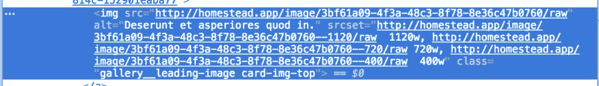
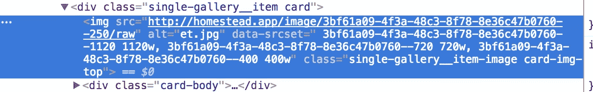
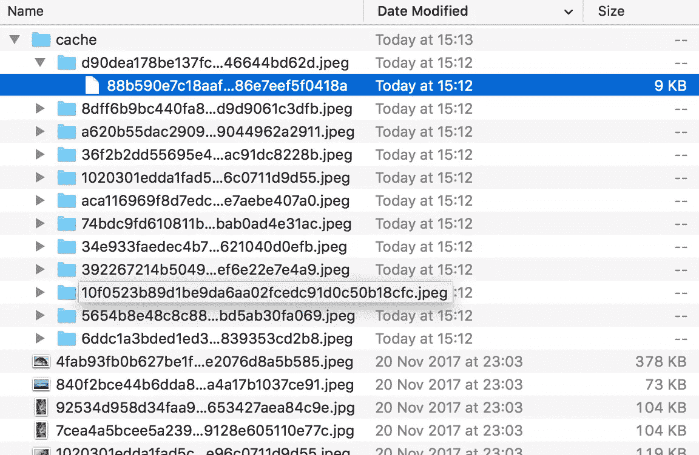
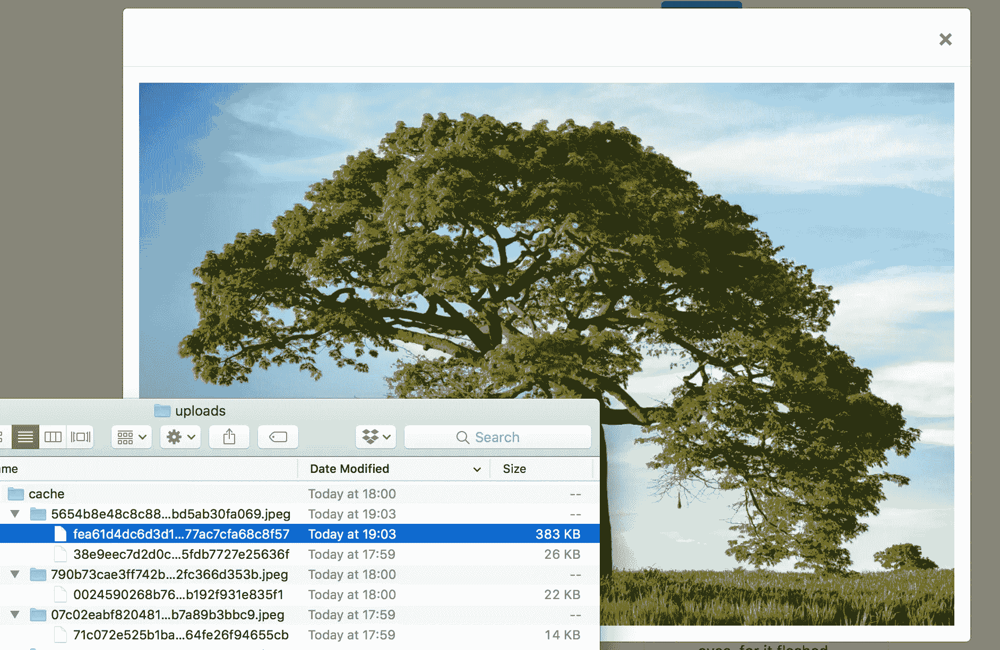
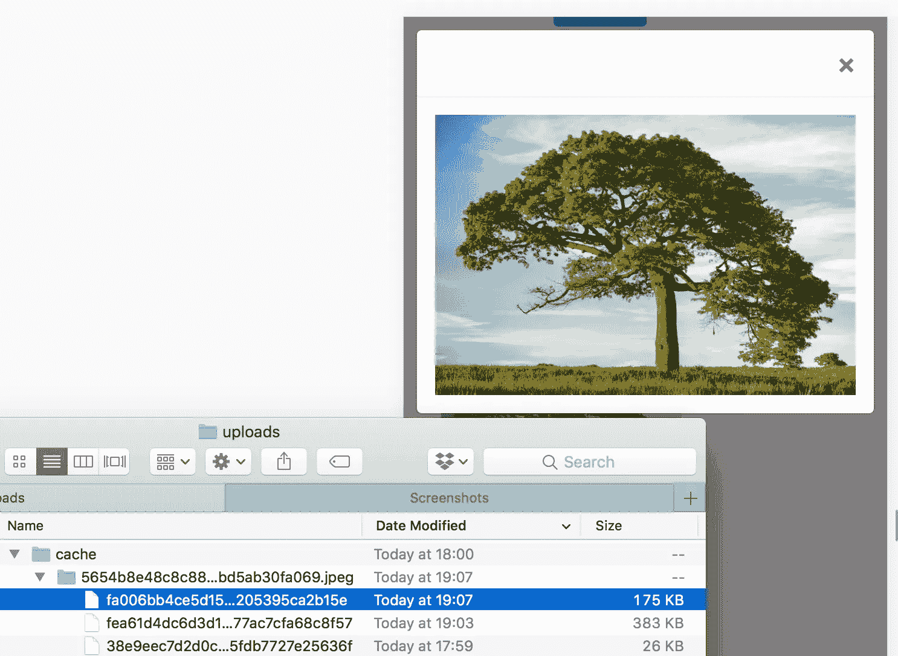
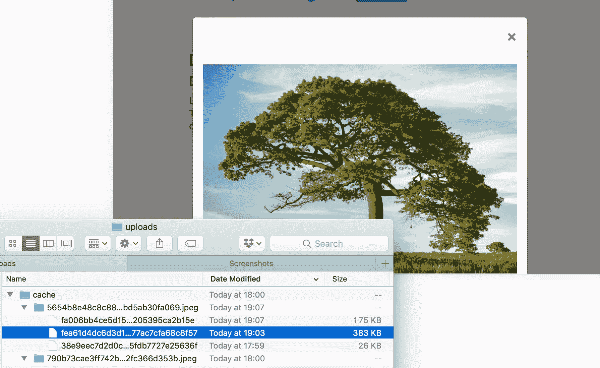

# 提高性能感知:按需调整图像大小

> 原文：<https://www.sitepoint.com/improving-performance-perception-on-demand-image-resizing/>

本文是构建一个示例应用程序——一个多图片画廊博客——的系列文章的一部分，用于性能基准测试和优化。(点击此处查看[回购](https://github.com/sitepoint-editors/multi-image-gallery-blog/)。)

* * *

我们已经构建了一个示例应用程序——一个多图片画廊博客——用于性能基准测试和优化。在这一点上，我们的[应用程序](https://github.com/sitepoint-editors/multi-image-gallery-blog/releases/tag/1.2)提供相同的图像，而不管它的分辨率和屏幕大小。在这个图像大小调整教程中，我们将修改它，以提供一个根据显示大小调整大小的版本。

## 目标

这种改善有两个阶段。

1.  我们需要让所有的图像在有用的地方都有反应。一个位置是主页和画廊页面上的缩略图，另一个位置是在画廊中单击单个图像时的全尺寸图像。
2.  我们需要在我们的应用程序中添加调整大小逻辑。重点是*根据需要动态生成*调整大小的图像。这将防止不流行的图像污染我们的硬盘，并确保流行的图像在后续请求中以最佳大小提供。

## 响应图像？

正如本帖所解释的，现代网络中的图像极其复杂。我们现在有了像这样疯狂的东西，而不仅仅是来自过去的日子:

```
<picture>
<source media="(max-width: 700px)" sizes="(max-width: 500px) 50vw, 10vw"
srcset="stick-figure-narrow.png 138w, stick-figure-hd-narrow.png 138w">

<source media="(max-width: 1400px)" sizes="(max-width: 1000px) 100vw, 50vw"
srcset="stick-figure.png 416w, stick-figure-hd.png 416w">


</picture> 
```

当你怀疑在较小的屏幕上使用相同的图像时，图像的主要对象可能会变得太小时，组合使用`srcset`、`picture`和`sizes`是必要的。您希望以不同的屏幕尺寸显示不同的图像(更侧重于主要主题)，但仍希望根据设备像素比率显示同一图像的不同资产，并希望根据视口自定义图像的高度和宽度。

因为我们的图像是照片，我们总是希望它们在默认的 DOM 指定的位置，填满它们的父容器的最大值，所以我们不需要`picture`(它让我们为不同的分辨率或浏览器支持定义一个替代源——比如尝试渲染 SVG，如果 SVG 不受支持，则渲染 PNG)或`sizes`(它让我们定义一个图像应该占据哪个视口部分)。我们可以只使用`srcset`，它根据屏幕大小加载同一张图片的不同尺寸版本。

## 添加 srcset

我们遇到图像的第一个位置是在`home-galleries-lazy-load.html.twig`中，它是呈现主屏幕图库列表的部分模板。

```
<a class="gallery__link" href="{{ url('gallery.single-gallery', {id: gallery.id}) }}">
  
</a> 
```

这里我们可以看到图像的链接是从一个 Twig 过滤器中获取的，这个过滤器可以在`src/Twig/ImageRendererExtension.php`文件中找到。它获取图像的 ID 和路线的名称(在`ImageController`的`serveImageAction`路线的注释中定义)，并基于该公式生成一个 URL:`/image/{id}/raw`->用给定的 ID 替换`{id}`:

```
public function getImageUrl(Image $image)
{
  return $this->router->generate('image.serve', [
      'id' => $image->getId(),
  ], RouterInterface::ABSOLUTE_URL);
} 
```

让我们将它更改为以下内容:

```
public function getImageUrl(Image $image, $size = null)
{
  return $this->router->generate('image.serve', [
      'id' => $image->getId() . (($size) ? '--' . $size : ''),
  ], RouterInterface::ABSOLUTE_URL);
} 
```

现在，我们所有的图片 URL 都将使用`--x`作为后缀，其中`x`是它们的大小。这也是我们将应用到我们的`img`标签上的改变，以`srcset`的形式。让我们把它改成:

```
<a class="gallery__link" href="{{ url('gallery.single-gallery', {id: gallery.id}) }}">
  
</a> 
```

如果我们现在刷新主页，我们会注意到列出了 srcset 的新大小:



不过，这对我们没什么帮助。如果我们的视窗很宽，这将要求全尺寸的图像，尽管它们是缩略图。因此，与其使用`srcset`，不如在这里使用一个固定的小缩略图:

```
<a class="gallery__link" href="{{ url('gallery.single-gallery', {id: gallery.id}) }}">
  
</a> 
```

我们现在有了按需缩略图，但是当缩略图已经生成时，就会被缓存和获取。

现在让我们去寻找其他的地点。

在`templates/gallery/single-gallery.html.twig`中，我们应用与之前相同的修复。我们正在处理缩略图，所以让我们通过将 size 参数添加到我们的`getImageUrl`过滤器中来缩小文件:

```
 
```

现在是最后的`srcset`实现！

单个图像视图在同一个单图库视图的底部以 JavaScript 模式窗口呈现:

```

    {{ parent() }}

    <script> $(function () {
            $('.single-gallery__item-image').on('click', function () {
                var src = $(this).attr('src');
                var $modal = $('.single-gallery__modal');
                var $modalBody = $modal.find('.modal-body');

                $modalBody.html('');
                $modalBody.append($(''));
                $modal.modal({});
            });
        }) </script>
 
```

有一个`append`调用将`img`元素添加到模态体中，所以这就是我们的`srcset`属性必须去的地方。但是由于我们的图像 URL 是动态生成的，我们不能真正从`script`中调用 Twig 过滤器。一种替代方法是将`srcset`添加到缩略图中，然后通过从 thumb 元素复制它来在 JS 中使用它，但这不仅会使全尺寸图像加载到缩略图的背景中(因为我们的视口很宽)，而且还会为每个缩略图调用 4 次过滤器，从而减慢速度。相反，让我们在`src/Twig/ImageRendererExtension.php`中创建一个新的树枝过滤器，它将为每个图像生成完整的`srcset`属性。

```
public function getImageSrcset(Image $image)
{
    $id = $image->getId();
    $sizes = [1120, 720, 400];
    $string = '';
    foreach ($sizes as $size) {
        $string .= $this->router->generate('image.serve', [
            'id' => $image->getId() . '--' . $size,
        ], RouterInterface::ABSOLUTE_URL).' '.$size.'w, ';
    }
    $string = trim($string, ', ');
    return html_entity_decode($string);
} 
```

我们不能忘记注册这个过滤器:

```
public function getFilters()
{
    return [
        new Twig_SimpleFilter('getImageUrl', [$this, 'getImageUrl']),
        new Twig_SimpleFilter('getImageSrcset', [$this, 'getImageSrcset']),
    ];
} 
```

我们必须将这些值添加到一个自定义属性中，我们将在每个缩略图上将其称为`data-srcset`:

```
 
```

现在，每个单独的缩略图都有一个带有所需的`srcset`值的`data-srcset`属性，但这不会触发，因为它在一个自定义属性中，数据将在以后使用。



最后一步是更新 JS 以利用这一点:

```

    {{ parent() }}

    <script> $(function () {
            $('.single-gallery__item-image').on('click', function () {
                var src = $(this).attr('src');
                var srcset = $(this).attr('data-srcset');
                var $modal = $('.single-gallery__modal');
                var $modalBody = $modal.find('.modal-body');

                $modalBody.html('');
                $modalBody.append($(''));
                $modal.modal({});
            });
        }) </script>
 
```

## 添加滑动

Glide 是一个做我们想要的事情的库——按需调整图像大小。让我们安装它。

```
composer require league/glide 
```

接下来，我们在 app 里注册一下。为此，我们在`src/Services`中添加了一个新服务，内容如下:

```
<?php
namespace App\Service;

use League\Glide;

class GlideServer
{
    private $server;

    public function __construct(FileManager $fm)
    {
        $this->server = $server = Glide\ServerFactory::create([
            'source' => $fm->getUploadsDirectory(),
            'cache' => $fm->getUploadsDirectory().'/cache',
        ]);
    }

    public function getGlide()
    {
        return $this->server;
    }
} 
```

该服务使用已经声明的 FileManager 服务，该服务是自动注入的，因为 Symfony 采用了新的自动连接方法。我们将输入和输出路径都声明为`uploads`目录，给输出目录添加一个`cache`后缀，并添加一个返回服务器的方法。服务器基本上是 Glide 的实例，它调整大小并返回一个调整过大小的图像。

我们需要公开`FileManager`中的`getUploadsDirectory`方法，因为它目前是`private`:

```
public function getUploadsDirectory()
{
    return $this->path;
} 
```

最后，让我们修改 ImageController 的`serveImageAction`方法，使其看起来像这样:

```
/**
 * @Route("/image/{id}/raw", name="image.serve")
 */
public function serveImageAction(Request $request, $id, GlideServer $glide)
{
    $idFragments = explode('--', $id);
    $id          = $idFragments[0];
    $size        = $idFragments[1] ?? null;

    $image = $this->em->getRepository(Image::class)->find($id);

    if (empty($image)) {
        throw new NotFoundHttpException('Image not found');
    }

    $fullPath = $this->fileManager->getFilePath($image->getFilename());

    if ($size) {

        $info        = pathinfo($fullPath);
        $file        = $info['filename'] . '.' . $info['extension'];
        $newfile     = $info['filename'] . '-' . $size . '.' . $info['extension'];
        $fullPathNew = str_replace($file, $newfile, $fullPath);

        if (file_exists($fullPath) && ! file_exists($fullPathNew)) {

            $fullPath = $fullPathNew;
            $img      = $glide->getGlide()->getImageAsBase64($file,
                ['w' => $size]);

            $ifp = fopen($fullPath, 'wb');

            $data = explode(',', $img);
            fwrite($ifp, base64_decode($data[1]));
            fclose($ifp);
        }
    }

    $response = new BinaryFileResponse($fullPath);
    $response->headers->set('Content-type',
        mime_content_type($fullPath));
    $response->headers->set('Content-Disposition',
        'attachment; filename="' . $image->getOriginalFilename() . '";');

    return $response;
} 
```

这个方法现在通过双划线分解图像 ID，将大小与图像 ID 分开。一旦 Doctrine 从数据库中获取了图像的文件路径，如果传入了一个文件路径，则大小会被重新附加到文件名上，否则将使用原始图像。如果这个图像不存在，将从原始路径生成一个图像，并保存下来供以后使用。

出于演示的目的，我们在这里走了一条更长的路，通过将大小附加到文件上并保存到`uploads`文件夹中来手动生成文件。需要注意的是，你也可以使用 Glide 中的`outputImage`方法直接输出图像，它将直接从`cache`子文件夹中提供，而不是以后缀保存在主`upload`文件夹中。您也可以使用`makeImage`方法来创建图像，让获取图像的旧逻辑接管。这是我们在下面选择的方法:

```
/**
 * @Route("/image/{id}/raw", name="image.serve")
 */
public function serveImageAction(Request $request, $id, GlideServer $glide)
{
    $idFragments = explode('--', $id);
    $id          = $idFragments[0];
    $size        = $idFragments[1] ?? null;

    $image = $this->em->getRepository(Image::class)->find($id);

    if (empty($image)) {
        throw new NotFoundHttpException('Image not found');
    }

    $fullPath = $this->fileManager->getFilePath($image->getFilename());

    if ($size) {

        $info        = pathinfo($fullPath);
        $file        = $info['filename'] . '.' . $info['extension'];

        $cachePath = $glide->getGlide()->makeImage($file, ['w' => $size]);
        $fullPath = str_replace($file, '/cache/' . $cachePath, $fullPath);
    }

    $response = new BinaryFileResponse($fullPath);
    $response->headers->set('Content-type',
        mime_content_type($fullPath));
    $response->headers->set('Content-Disposition',
        'attachment; filename="' . $image->getOriginalFilename() . '";');

    return $response;
} 
```

我们按需调整图像大小的业务已经开始运作。现在我们要做的就是测试。

## 测试

一旦我们刷新主页，现在会稍微慢一点，图像将开始在`var/uploads`文件夹中生成。让我们检查一下，不要滚动到第二页。



果不其然，我们现在在主页上有了每张图片的缩略图版本，这就是被提供的图片。请注意小文件的大小。现在让我们进入一个图库，点击一张图片就可以看到它的大图。



是的，我们的图像是从原始图像生成的。

但是移动呢？在现代浏览器中，打开移动模式很容易。让我们尝试在移动视图中打开图库图像，然后检查图像文件夹。



如果我们改变方向，然后检查文件夹呢？



成功，我们的图像的移动大小已经成功生成，之前的全屏图像已经被重用，因为这就是我们的“移动”屏幕在横向模式下的大小。按需`srcset`成功实施！

升级后的应用被标记为[这个版本](https://github.com/sitepoint-editors/multi-image-gallery-blog/releases/tag/1.3)。

## 结论

在这篇文章中，我们经历了在面向照片的网站中优化图片的过程。我们将缩略图保持在固定大小以获得最佳效果，对于全屏图像，我们专注于实现`srcset`——任何现代网站的简单附加功能——以及 Glide，这是一个按需调整图像大小的包，可以为我们完成繁重的工作。

但是当我们调整图像大小时，通过删除元数据来自动优化图像的质量和大小不是很聪明吗？当用户等待的时候，按需调整它们的大小真的是最好的选择吗？或者有其他更实际的方法吗？在下一部分找到答案。

## 分享这篇文章