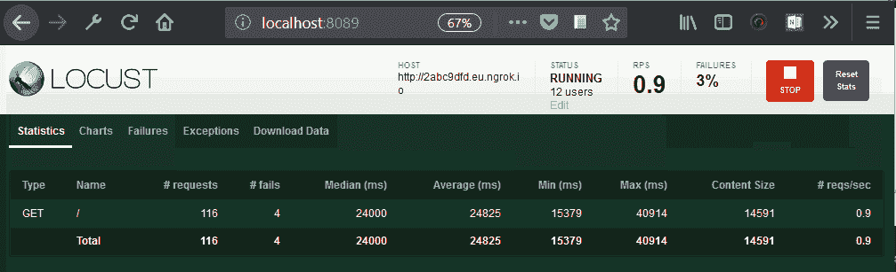
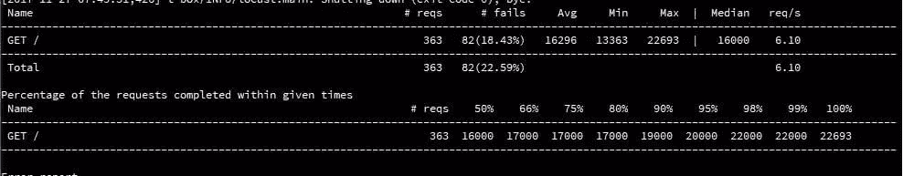
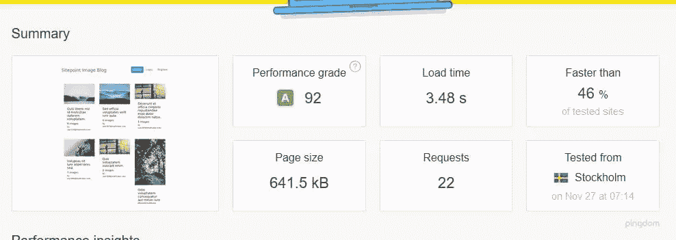
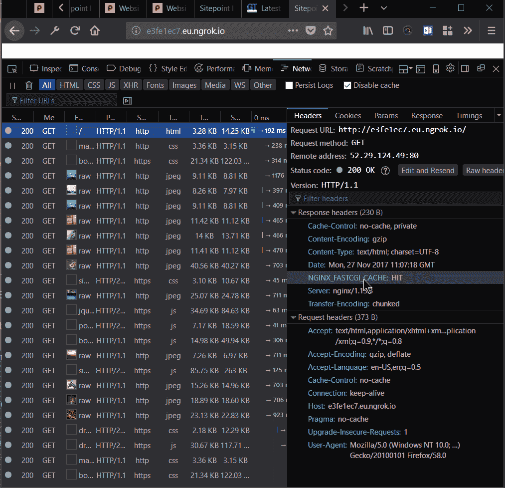
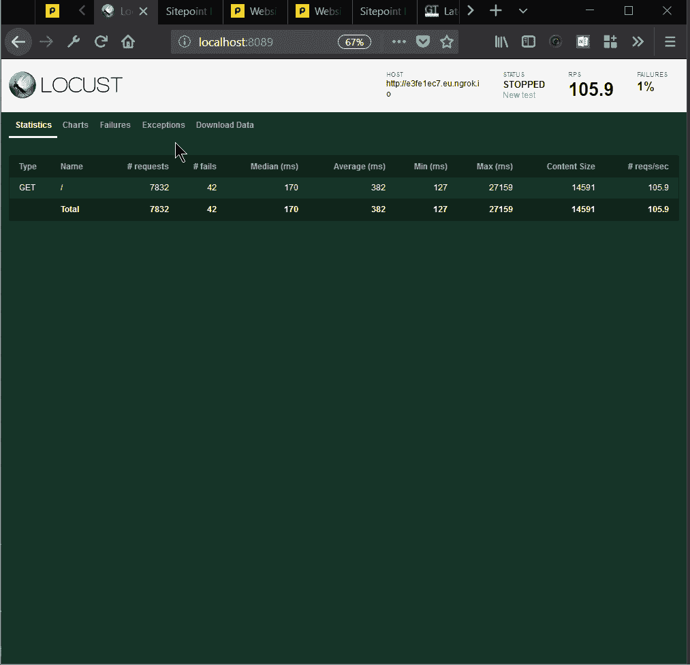
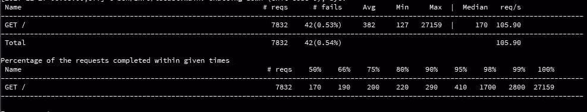

# 使用 Nginx 和 pm-static 进行服务器端优化

> 原文：<https://www.sitepoint.com/server-side-optimization-with-nginx-and-pm-static/>

本文是构建一个示例应用程序——一个多图片画廊博客——的系列文章的一部分，用于性能基准测试和优化。(点击此处查看[回购](https://github.com/sitepoint-editors/multi-image-gallery-blog/)。)

* * *

**让我们继续优化[我们的应用](https://www.sitepoint.com/building-image-gallery-blog-symfony-flex-setup/)。我们从动态缩略图生成开始，每个请求需要 28 秒，这取决于运行您的演示应用程序的平台(在我的例子中，这是主机操作系统和 vagger 之间的一个缓慢的文件系统集成)，并将其降低到一个非常可接受的 0.7 秒。**


诚然，这 28 秒应该只发生在初始负载。调整后，我们能够实现生产就绪时间:


### 解决纷争

假设您已经完成了[引导过程](https://www.sitepoint.com/building-image-gallery-blog-symfony-flex-setup/)，并且在您的机器上运行了应用程序——无论是虚拟的还是真实的。

注意:如果你在 Windows 机器上运行[家园改进版](https://www.sitepoint.com/quick-tip-get-homestead-vagrant-vm-running/)盒子，共享文件夹可能会有问题。这可以通过将`type: "nfs"`设置添加到`Homestead.yaml`中的`folder`来解决:


如果问题仍然存在，您还应该从具有管理权限的 shell/powershell 界面运行`vagrant up`(右键单击，以管理员身份运行)。

在之前的一个例子中，我们每个请求的加载时间为 20 到 30 秒，不能超过每秒一个请求的速度(接近每秒 0.5 秒):



## 该过程

让我们来看一下测试过程。我们在主机上安装了[蝗虫](https://locust.io/)，并创建了一个非常简单的`locustfile.py`:

```
from locust import HttpLocust, TaskSet, task

class UserBehavior(TaskSet):
    @task(1)
    def index(self):
        self.client.get("/")

class WebsiteUser(HttpLocust):
    task_set = UserBehavior
    min_wait = 300
    max_wait = 1000 
```

然后，我们将 [ngrok](https://www.sitepoint.com/use-ngrok-test-local-site/) 下载到我们的客户机上，并通过它隧道化所有 HTTP 连接，这样我们就可以通过静态 URL 测试我们的应用程序。

然后我们启动了 Locust，让 100 个并行用户涌入我们的应用程序:


我们的服务器堆栈由 PHP 7.1.10、Nginx 1.13.3 和 MySQL 5.7.19 组成，运行在 Ubuntu 16.04 上。

## PHP-FPM 及其进程管理器设置

独立于 web 服务器进程，生成自己的进程。这些进程的数量管理在`/etc/php/7.1/fpm/pool.d/www.conf`中配置(这里的 7.1 可以换成当前使用的实际 PHP 版本号)。

在这个文件中，我们找到了`pm`设置。该设置可以设置为`dynamic`、`ondemand`和`static`。动态也许是最常见的智慧；它允许服务器在几个设置之间改变产生的 PHP 进程的数量:

```
pm = dynamic
; The number of child processes to be created when pm is set to 'static' and the
; maximum number of child processes when pm is set to 'dynamic' or 'ondemand'.
; This value sets the limit on the number of simultaneous requests that will be
; served.
pm.max_children = 6
; The number of child processes created on startup.
; Note: Used only when pm is set to 'dynamic'
; Default Value: min_spare_servers + (max_spare_servers - min_spare_servers) / 2
pm.start_servers = 3
; The desired minimum number of idle server processes
; Note: Used only when pm is set to 'dynamic'
; Note: Mandatory when pm is set to 'dynamic'
pm.min_spare_servers = 2
; The desired maximum number of idle server proceses
; Note: Used only when pm is set to 'dynamic'
; Note: Mandatory when pm is set to 'dynamic'
pm.max_spare_servers = 4 
```

这些值的含义是不言自明的，流程的生成是按需完成的，但是受到这些最小值和最大值的约束。

在用`nfs`解决了 Windows 共享文件夹问题，并用 Locust 进行测试后，我们能够在 100 个并发用户的情况下，每秒处理大约 5 个请求，故障率大约为 17–19%。一旦收到大量请求，服务器就会变慢，每个请求需要十几秒钟才能完成。

然后我们把`pm`设置改成了`ondemand`。

Ondemand 意味着没有最小进程:一旦请求停止，所有进程都将停止。有些人提倡这种设置，因为这意味着服务器在空闲状态下不会消耗任何资源，但是对于专用(非共享)服务器实例来说，这不一定是最好的。生成一个进程包括一个开销，在内存中获得的东西在按需生成进程所需的时间中丢失了。这里相关的设置有:

```
pm.max_children = 6
; and
pm.process_idle_timeout = 20s;
; The number of seconds after which an idle process will be killed.
; Note: Used only when pm is set to 'ondemand'
; Default Value: 10s 
```

测试时，我们稍微增加了这些设置，不必太担心资源问题。

还有`pm.max_requests`，它是可以改变的，它指定了*每个子进程在重新显示之前应该执行的请求数。*

这个设置是速度和稳定性的折衷，其中`0`表示无限制。

没有带来太多的变化，除了我们注意到当我们开始用请求挤满我们的应用程序时，更多的初始等待时间，以及更多的初始失败。换句话说，没有大的变化:应用程序每秒能够处理大约 4 到最多 6 个请求。等待时间和故障率与`dynamic`设置相似。

然后我们尝试了`pm = static`设置，允许我们的 PHP 进程接管最大限度的服务器资源，除了交换，或者驱动 CPU 停止。这种设置意味着我们一直在迫使我们的系统达到最大限度。这也意味着——在我们服务器的限制范围内——不会产生任何时间开销。

我们看到的是 20%的改善。但是，失败请求的比率仍然很高，响应时间仍然不是很好。该系统远未准备好投入生产。



然而，在 Pingdom 工具上，当系统没有压力时，我们得到了可承受的 3.48 秒:



这意味着`pm static`是一个改进，但在更大负载的情况下，它仍然会下降。

在之前的一篇文章中，我们解释了 Nginx 本身如何充当静态和动态内容的缓存系统。所以我们使用了 Nginx 的魔法，试图将我们的应用程序带到一个全新的性能水平。

我们成功了。让我们看看怎么做。

## Nginx 和 fastcgi 缓存

```
proxy_cache_path /home/vagrant/Code/ng-cache levels=1:2 keys_zone=ng_cache:10m max_size=10g inactive=60m;
proxy_cache_use_stale error timeout http_500 http_502 http_503 http_504;
fastcgi_cache_path /home/vagrant/Code/ngd-cache levels=1:2 keys_zone=ngd_cache:10m inactive=60m;
fastcgi_cache_key "$scheme$request_method$host$request_uri";
fastcgi_cache_use_stale error timeout invalid_header http_500;
fastcgi_ignore_headers Cache-Control Expires Set-Cookie;
add_header NGINX_FASTCGI_CACHE $upstream_cache_status;

server {
    listen 80;
    listen 443 ssl http2;
    server_name nginx-performance.app;
    root "/home/vagrant/Code/project-nginx/public";

    index index.html index.htm index.php;

    charset utf-8;

    proxy_cache ng_cache;

    location / {
        try_files $uri $uri/ /index.php?$query_string;
    }

    location = /favicon.ico { access_log off; log_not_found off; }
    location = /robots.txt  { access_log off; log_not_found off; }

    access_log off;
    error_log  /var/log/nginx/nginx-performance.app-error.log error;

    sendfile off;

    client_max_body_size 100m;

    location ~ \.php$ {
        fastcgi_split_path_info ^(.+\.php)(/.+)$;
        fastcgi_pass unix:/var/run/php/php7.1-fpm.sock;
        fastcgi_index index.php;
        include fastcgi_params;
        fastcgi_param SCRIPT_FILENAME $document_root$fastcgi_script_name;

        fastcgi_intercept_errors off;
        fastcgi_buffer_size 16k;
        fastcgi_buffers 4 16k;
        fastcgi_connect_timeout 300;
        fastcgi_send_timeout 300;
        fastcgi_read_timeout 300;

      fastcgi_cache ngd_cache;
      fastcgi_cache_valid  60m;
    }

    location ~ /\.ht {
        deny all;
    }

    ssl_certificate     /etc/nginx/ssl/nginx-performance.app.crt;
    ssl_certificate_key /etc/nginx/ssl/nginx-performance.app.key;
} 
```

我们打开了我们的 Nginx 虚拟主机文件，并添加了上述设置。我们来解释一下。

```
proxy_cache_path /home/vagrant/Code/ng-cache levels=1:2 keys_zone=ng_cache:10m max_size=10g inactive=60m; 
```

正如在[Apache vs Nginx Performance:Optimization Techniques](https://www.sitepoint.com/apache-vs-nginx-performance-optimization-techniques)中解释的那样，`proxy_cache_path`用于缓存*静态资产*——比如图像、样式表、JavaScript 文件。路径本身需要存在；我们需要创建这些目录。`levels`指定路径/文件夹中目录的深度。对于请求时间来说，遍历可能代价很高，所以保持请求时间较小是好的。密钥区域是一个名称；每个虚拟主机都可以(也应该)使用单独的一个。最大大小表示缓存的最大大小，非活动表示即使项目未被请求，它们也将保留在缓存中的时间。

在这段不活动时间之后，资源的缓存将被重新填充。

`proxy_cache_use_stale`和`fastcgi_cache_use_stale`很有趣，因为它们可以提供我们在 Cloudflare 等 CDN 提供商那里看到的“永远在线”功能:如果后端离线，Nginx 将从缓存中提供这些资源。这在一定程度上证明了我们网站的失败。

所有的`fastcgi_cache_*`设置都是针对 PHP 生成的(动态)内容的，而`proxy_cache_*`设置是针对静态文件的。

`fastcgi_cache_key`定义一个缓存键。

`fastcgi_ignore_headers` [禁止处理 FastCGI 后端](http://nginx.org/en/docs/http/ngx_http_fastcgi_module.html#fastcgi_ignore_headers)的一些响应头字段。

我们还可以使用另一个有趣的设置:

```
fastcgi_cache_purge 
```

这定义了能够清除缓存的请求。Nginx(它的`ngx_http_fastcgi_module`)为我们提供了相当全面的缓存工具集。使用上述指令的一个例子是:

```
fastcgi_cache_path /data/nginx/cache keys_zone=cache_zone:10m;

map $request_method $purge_method {
    PURGE   1;
    default 0;
}

server {
    ...
    location / {
        fastcgi_pass        backend;
        fastcgi_cache       cache_zone;
        fastcgi_cache_key   $uri;
        fastcgi_cache_purge $purge_method;
    }
} 
```

在这里，PURGE REST 请求将能够从缓存中删除内容。

在某些情况下，也可以重新验证缓存。

在我们的配置中，我们没有使用 Nginx 的所有复杂性和功能，但是如果我们需要它们，知道它们在那里是很好的。

我们在响应中添加了 Nginx 头，以便能够判断资源是否由缓存提供:

```
add_header NGINX_FASTCGI_CACHE $upstream_cache_status; 
```

然后，我们可以检查和分析我们的页面加载时间，看看哪些有效，哪些无效:



为了预热缓存，我们需要检查每个资源的请求。

`fastcgi_cache_methods`可以用于缓存特定的请求方法，比如 POST。默认情况下，GET 和 HEAD 被缓存。

还有字节范围缓存，可用于视频流优化，如[这里](https://www.nginx.com/blog/smart-efficient-byte-range-caching-nginx/)所述。

人们可以很容易地设计一个完整的私有 CDN 网络，拥有 Nginx 提供的所有可配置性。

启用了上面的配置——针对我们网站的静态和动态内容——我们启动了 Locust，并在我们的系统中部署了 100 个并行用户。结果的差异简直令人吃惊。以前服务器承受的压力现在已经感受不到了。



我们可以看到每个请求的平均时间是 170 毫秒。这大约是 100 倍的改进。每秒请求数超过 100。

我们还可以在平均响应时间图中看到，初始请求的响应时间出现峰值，之后，响应时间越来越短，大约为 130 毫秒。

Nginx 缓存给我们带来了一些很大的改进。这个应用程序的主要瓶颈不是硬件资源，即使它们并不多。



我们还可以看到失败请求的百分比从 17%上升到了 0.53%。

然后我们去了 Pingdom 的页面测试并测试了我们的网站:


我们可以看到，我们成功地将页面加载时间降低到了一秒钟以下！

我们还测试了单个图片库页面，该页面包含其他相关的最新图片库:


我们[附上一份 HAR 文件](https://uploads.sitepoint.com/wp-content/uploads/2017/12/1512521827har.json_.zip)的测试报告以供分析。

## 结论

在本文中，我在前面关于 Nginx 性能的讨论中提到的一些要点得到了测试，并且讨论和分析了其他设置，如进程管理，以及它对页面加载时间的影响。

我们错过了什么值得一提的吗？你能想到其他 Nginx 设置，我们可以应用到这个应用程序，以提高性能吗？

## 分享这篇文章