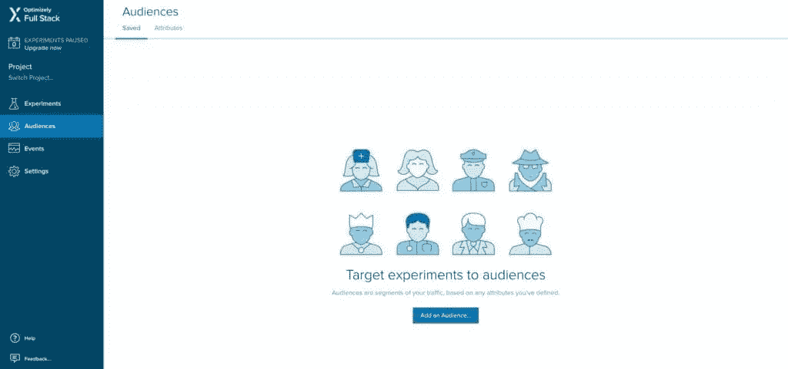
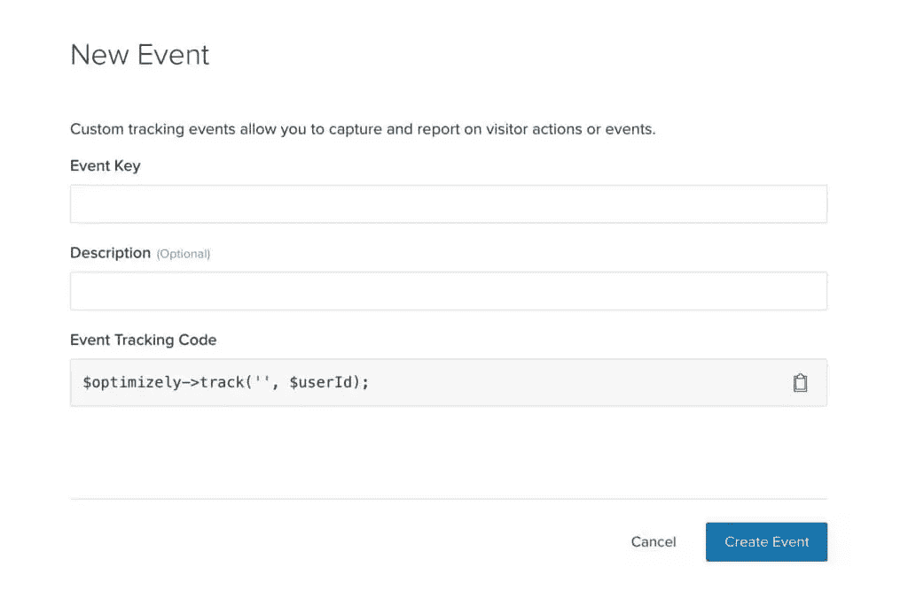
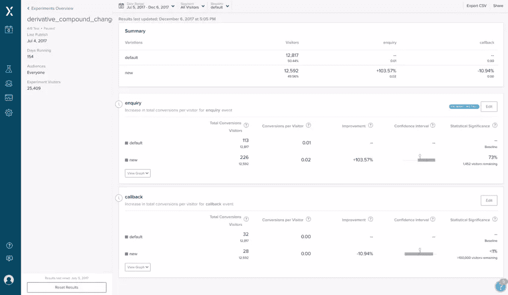

# 优化的 A/B 测试工具:知道哪个适合你

> 原文：<https://www.sitepoint.com/optimizely-ab-testing-tools-knowing-which-is-right-for-you/>

**已经成长为主要的 A/B 测试工具之一。它适合各种规模的公司，从初创公司、小企业到大公司。Optimizely 的工具和集成允许任何人快速了解他们的受众，并通过 A/B 测试无损地试验设计和内容更改。例如，通过 A/B 测试，您可以确认哪种 CTA(行动号召)导致了最多的点击，或者哪种版本的收银台导致了最多的在线销售。**

Optimizely 还集成了移动应用程序和电视应用程序，这意味着您可以在几乎任何平台上分析指标并提高转化率。

这听起来雄心勃勃(甚至可能有点复杂)，但是您可以从简单的可视化编辑器开始，它允许您试验相当简单的 A/B 测试(不需要代码)。当你觉得你已经掌握了 Optimizely(它实际上非常容易使用)的窍门时，你可以使用他们的许多 SDK 更自然地集成 Optimizely。在本文中，我将总结 Optimizely 提供的工具，并确定何时可以使用它们的合适场景。

因为它是一个雄心勃勃的工具，提供了大量的产品，所以让我们来分析一下它的特性。

## 优化使用前您需要什么

虽然没有关于优化使用的官方要求，但是您应该已经预先建立了 KPI。KPI(关键绩效指标)是一种衡量成功的指标，例如用户注册数、销售额、时事通讯注册数等等。简言之，你网站的目标是什么？让他们记下来。

(如果你需要一些网站目标、分析等方面的背景知识，可以看看我们最近关于利用分析提高 UX 的文章，比如我们的[Google Analytics](https://www.sitepoint.com/google-analytics-basics-and-pitfalls/)简介。)

你的网站(或应用程序)也应该有合理的流量，这样收集的数据就足够丰富了。我还建议在你想优化的页面上至少有 1000 名访客在 1-2 天内访问，以证明优化服务的成本是合理的。如果你还没有达到这些水平，可以考虑使用 [Google Optimize](https://www.sitepoint.com/perform-ab-testing-google-optimize) 作为免费的替代品。

Optimizely 为他们的所有服务提供标准的 30 天免费试用，这样你就可以在投资之前亲自体验这些好处，并像专业人士一样学习如何使用它。就像我说的，要充分利用 30 天的试用期，事先建立你的关键绩效指标和实验，充分利用每一天的空闲时间。

好了，现在让我们深入了解一下特性。

## [网络实验](https://www.optimizely.com/products/experimentation/)

Web Experimentation 本质上是一个可视化编辑器，用于在您的网站上创建 A/B 测试。使用编辑器，您可以更改内容、颜色和布局顺序，以创建一个或多个不同的网页。

然后，使用*受众构建器*，你可以根据地理位置、时间、性别等因素锁定特定的受众群体。有了这些强大的定位功能，您就可以针对特定的受众测试您的变体。结果被输入到一个实时报告系统中，该系统为您提供所有变化的详细反馈，以帮助您确定转化率最高的变化，然后您可以永久实施这些变化。

不需要对代码进行更改，也不会干扰您的原始版本。

## [网页个性化](https://www.optimizely.com/products/personalization/)

Optimizely 的 Web 个性化工具与其 Web 实验工具相似，但侧重于 A/B 测试内容而不是视觉效果，目的是显示与受众相关且受众感兴趣的内容。

例如，考虑一个运动服商店的主页。具有与徒步旅行者匹配的用户角色的访问者可以被展示具有最新的徒步旅行鞋的山景背景。为了更进一步，你可以向在寒冷地区的徒步旅行者展示保暖衣服和下雪的场景。Optimizely 的特殊定位功能，选项是无穷无尽的。

通过根据受众的位置、当前天气状况等因素为其量身定制内容，您的企业可以最大限度地提高销售额，并通过为用户提供他们想要的内容而在竞争中脱颖而出。

## [网页推荐](https://www.optimizely.com/products/#recommendations)

通过 Web 推荐工具，优化使用智能机器学习软件在正确的时间显示正确的东西，根据各种因素显示用户可能希望看到的内容和产品，从而最大限度地提高参与度和转化率。这个推荐引擎允许您试验算法、推荐小部件的位置及其可视化设计。

考虑到亚马逊的推荐引擎贡献了超过 35%的亚马逊销售额，你会惊讶于这个工具有多有用！

## [针对移动应用进行优化](https://www.optimizely.com/products/mobile/)

Optimizely 的移动工具允许您使用代码将 A/B 实验直接集成到原生移动应用程序中。它包含了 Optimizely 的许多网络功能，但专注于基于代码的实验而不是可视化编辑器的使用，这意味着你可以立即发布应用更新，而不必等待 iOS/Android 应用商店的批准。

实验是全栈，所以 A/B 测试可以跨越前端和后端，使用 Optimizely 的任何移动 SDK(Android，Swift，Objective-C)。

## [全栈(用于更深入的实验)](https://www.optimizely.com/products/full-stack/)

说到 SDK(和基于代码的实验)，Optimizely 允许您使用我们今天使用的任何编程语言来创建您的 A/B 实验(针对 web 和移动),包括上面提到的三种移动应用程序语言。除了这些，还有 Python，Java，Ruby，Node，PHP，C#和 JavaScript SDKs，都是开源的。

无论你的应用程序或网站是用什么语言构建的，Optimizely 都可以集成到其中，与使用可视化编辑器进行的测试相比，它可以为你的团队提供更多的控制和全面的定制。如前所述，你将能够尝试比视觉和内容变化更多的东西。

如果你正在为 SaaS 创业公司开发一个工具或功能，你可以创建两个完全不同的版本来看看哪个转换得更好。

完整的堆栈集成与 Web 个性化使用的相同目标引擎挂钩，因此您可以利用相同的能力在更高的级别锁定目标受众，同时在您的网站中进行更大程度的定制。

## [OTT(针对电视应用)](https://www.optimizely.com/products/ott/)

Optimizely 已经创建了一个 OTT 工具，允许电视应用程序的创作者跨各种 OTT 平台(如 tvOS 和 Chromecast)进行 A/B 测试。OTT 代表“over the top”，这意味着通过互联网传输视频，而无需订阅天空或 HBO 等订阅服务。

Optimizely 的新 OTT 工具允许设计师和营销人员为不同的电视平台试验视觉和内容——例如，为 Apple TV 显示与 Vimeo 或 YouTube 略有不同的主题或布局，以确保视觉体验看起来和感觉上都像苹果体验。

与移动 SDK 一样，即时功能推出意味着用户将看到最新的变化和实验，而无需更新他们的电视应用程序，这意味着您将立即获得有价值的反馈。

## [分析](https://www.optimizely.com/statistics/)

无论你使用什么优化工具，分析统计引擎都可以帮助你评估结果。像 Google Analytics 这样的传统统计引擎只有在实验完成后才会给出相关的结果。这意味着，如果你在实验中途查看你的结果，它们可能会有高达 30%的误差！这可能导致你先发制人地做出错误的设计决定，过早地结束你的实验。

Optimizely 的引擎使用一种新的算法向你展示实验中期的实时统计数据，误差仅为 5%。这意味着你不太可能在实验中做出错误的决定。

使用详细的报告来评估你的实验表现。这些报告利用 Optimizely 创建的独特分析方法，以最快的速度提供最准确的结果，即使在实验中期也是如此。

## 结论

Optimizely 真正推动了边界，为以前没有 A/B 测试工具的市场(如 OTT)提供了这些工具，同时改革了分析和报告，使其比以往任何时候都更具信息量。

它适合所有类型的角色——设计师、开发人员、营销人员、经理以及所有一起工作的人。优化确保无论你的技能水平如何，都有一个工具可以让你对你的应用或网站进行 A/B 测试。

## 分享这篇文章