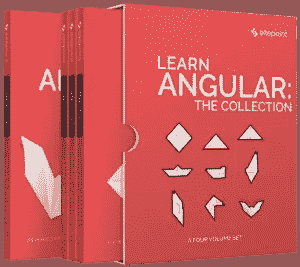

# 了解 Angular:该系列于 2018 年 6 月发布

> 原文：<https://www.sitepoint.com/learn-angular-the-collection-released-june-2018/>

Angular 不仅仅是一个框架，更是一个平台，让开发者能够为 web、移动和桌面构建应用。

这是一套旨在帮助你快速掌握 Angular 的书籍。它包含:

*   *[学棱角分明:你的第一周](https://www.sitepoint.com/premium/books/learn-angular-your-first-week?ref_source=sitepoint&ref_medium=article_copy&ref_campaign=learn-angular-your-first-week)* ，介绍棱角分明的文章集
*   *[学习 Angular:构建一个 Todo App](https://www.sitepoint.com/premium/books/learn-angular-build-a-todo-app?ref_source=sitepoint&ref_medium=article_copy&ref_campaign=learn-angular-build-a-todo)* ，一个从头到尾构建完整 Angular 应用的深度项目教程
*   *[学角度:4 个角度项目](https://www.sitepoint.com/premium/books/learn-angular-4-angular-projects?ref_source=sitepoint&ref_medium=article_copy&ref_campaign=learn-angular-4-angular-projects)* 呈现 4 个实用角度项目
*   *[Learn Angular:相关工具&技能](https://www.sitepoint.com/premium/books/learn-angular-related-tools-skills?ref_source=sitepoint&ref_medium=article_copy&ref_campaign=learn-angular-related-tools)* 包含一系列文章，概述了每个现代 JavaScript 开发人员都应该知道的基本工具和技能。

这本书是为所有想要精通 Angular 及其相关工具的前端开发人员准备的。为了跟上讨论，您需要熟悉 HTML 和 CSS，并对 JavaScript 有一定的理解。

## 去哪里买

在[亚马逊](https://www.amazon.com/Learn-Angular-Collection-Ilya-Bodrov-Krukowski-ebook/dp/B07DTXNJRY/?utm_source=sitepoint&utm_medium=article-copy&utm_campaign=angular-bookset&utm_content=amazon)或 [SitePoint Premium](https://www.sitepoint.com/premium/l/join?ref_source=sitepoint&ref_medium=article-copy&ref_campaign=angular-collection&ref_content=angular-release) 上获取收藏——我们所有的书籍和课程，每月只需**9 美元**。

## 分享这篇文章