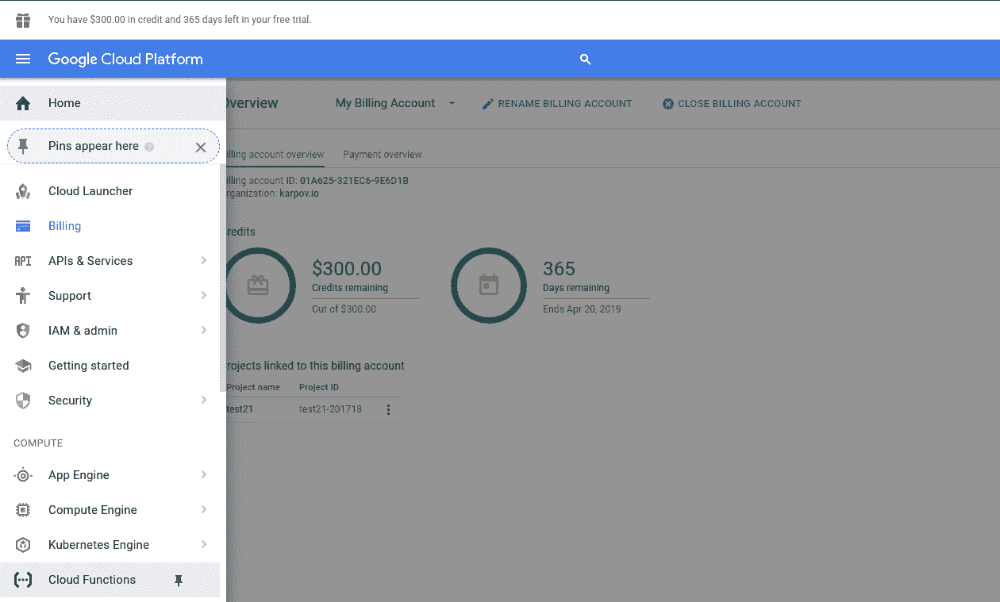
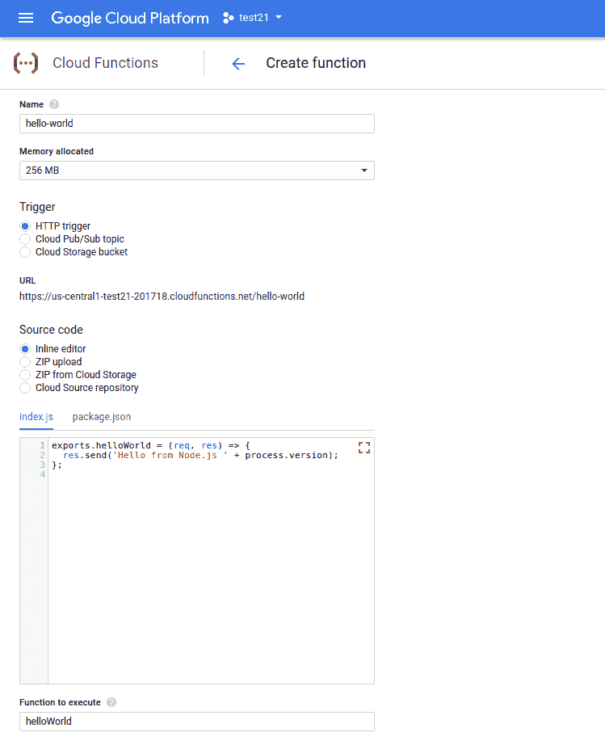
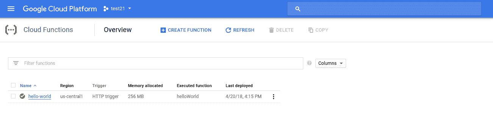
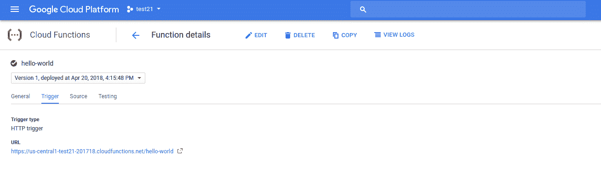
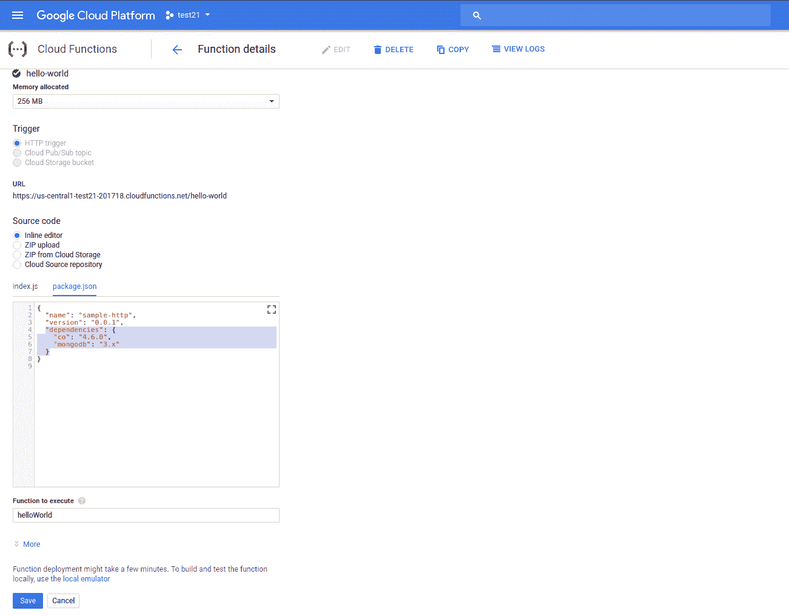
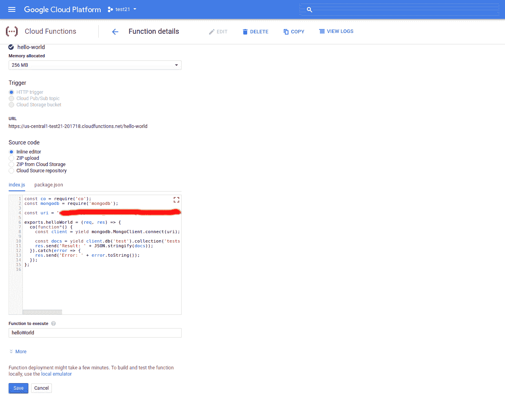

# Google 云功能和 MongoDB 入门

> 原文：<https://www.sitepoint.com/getting-started-google-cloud-functions-mongodb/>

*本文原载于[代码野蛮人](http://thecodebarbarian.com/getting-started-with-google-cloud-functions-and-mongodb.html)。感谢您对使 SitePoint 成为可能的合作伙伴的支持。*

无服务器架构正变得越来越流行，这是有充分理由的。根据我的经验，基于容器的编排框架有一个陡峭的学习曲线，对于大多数面向消费者的公司来说是多余的。有了 [FaaS 架构](https://martinfowler.com/articles/serverless.html)，像 [AWS Lambda](https://www.mongodb.com/blog/post/serverless-development-with-nodejs-aws-lambda-mongodb-atlas?utm_medium=sp-synd&utm_source=sitepoint&utm_content=google_functions&jmp=sp-ref) 和 [Azure Functions](http://thecodebarbarian.com/getting-started-with-azure-functions-and-mongodb.html) ，理论上你唯一需要的 devops 就是捆绑和上传你的应用。

本文将带您在 Node.js 中设置一个连接到 MongoDB 的 Google Cloud 函数。然而，无状态函数的一个主要限制是需要在每次运行无状态函数时建立一个单独的数据库连接，这会导致严重的性能损失。不幸的是，我还没能想出如何在谷歌云功能中重用数据库连接，这种技巧适用于 [IBM Cloud](http://thecodebarbarian.com/getting-started-with-ibm-cloud-functions-and-mongodb.html) 、 [Azure Functions](http://thecodebarbarian.com/getting-started-with-azure-functions-and-mongodb.html) 和 [AWS Lambda](https://www.mongodb.com/blog/post/serverless-development-with-nodejs-aws-lambda-mongodb-atlas?utm_medium=sp-synd&utm_source=sitepoint&utm_content=google_functions&jmp=sp-ref) 、**不适用于谷歌云功能。**

## 谷歌云功能中的“你好，世界”

进入[谷歌云功能登陆页面](https://cloud.google.com/functions/)，点击“免费试用”。


点击左上角的汉堡图标，在侧边栏找到“云函数”链接，然后点击“创建函数”。



将您的函数命名为“hello-world ”,并保留“创建函数”表单中的其余选项不变。将“Function to execute”保留为“helloWorld”，因为这需要与您的代码导出的函数的名称相匹配。下面是您应该输入的代码，这样您就可以确认您的函数运行在哪个版本的 Node.js 上。

```
exports.helloWorld = (req, res) => {
  res.send('Hello from Node.js ' + process.version);
}; 
```



点击“创建”，等待谷歌部署你的云功能。一旦部署了您的功能，单击它以显示该功能的详细信息。



点击“触发”选项卡，找到您的云功能的网址。



复制网址，用 [curl](https://en.wikipedia.org/wiki/CURL) 运行你的云功能。

```
$ curl https://us-central1-test21-201718.cloudfunctions.net/hello-world
Hello from Node.js v6.11.5
$ 
```

谷歌云功能不会让你控制你运行什么版本的 Node.js，他们目前运行的是 Node.js v6.11.5。在撰写本文时，您还不能在 Google Cloud 函数上使用 async/await。

## 连接到 MongoDB Atlas

点击功能详情中的“Source”选项卡，然后点击“Edit”按钮。您会注意到您的源代码中有两个文件，其中一个是`package.json`。编辑`package.json`以匹配以下代码。

```
{
  "name": "sample-http",
  "version": "0.0.1",
  "dependencies": {
    "co": "4.6.0",
    "mongodb": "3.x"
  }
} 
```



一旦您重新部署，Google Cloud 将自动为您安装 npm 依赖项。现在，修改你的`index.js`来匹配下面的代码，用你的 [MongoDB Atlas](https://www.mongodb.com/cloud/atlas?utm_medium=sp-synd&utm_source=sitepoint&utm_content=google_functions&jmp=sp-ref) URI 替换`uri`。

```
const co = require('co');
const mongodb = require('mongodb');

const uri = 'ATLAS_URI_HERE';

exports.helloWorld = (req, res) => {
  co(function*() {
    const client = yield mongodb.MongoClient.connect(uri);

    const docs = yield client.db('test').collection('tests').find().toArray();
    res.send('Result: ' + JSON.stringify(docs));
  }).catch(error => {
    res.send('Error: ' + error.toString());
  });
}; 
```



单击“保存”部署您的功能。一旦它被部署，你应该能够卷曲你的云函数并从 [MongoDB Atlas](https://www.mongodb.com/cloud/atlas?utm_medium=sp-synd&utm_source=sitepoint&utm_content=google_functions&jmp=sp-ref) 取回一个文档。

```
$ curl https://us-central1-test21-201718.cloudfunctions.net/hello-world
Result: [{"_id":"5a7b7df69d07887542605888","name":"Hello!","__v":0}]
$ 
```

此时，您可以尝试使用在 AWS Lambda 和其他云函数提供者中使用的相同全局状态技巧来重用数据库连接。

```
const co = require('co');
const mongodb = require('mongodb');

const uri = 'ATLAS_URI_HERE';

// Other cloud providers would retain this, but not Google Cloud
let client = null;

exports.helloWorld = (req, res) => {
  co(function*() {
    const reusedConnection = client != null;
    if (client == null) {
      client = yield mongodb.MongoClient.connect(uri);   
    }

    const docs = yield client.db('test').collection('tests').find().toArray();
    res.send('Result: ' + JSON.stringify(docs) + ', Reused: ' + reusedConnection);
  }).catch(error => {
    res.send('Error: ' + error.toString());
  })
}; 
```

不幸的是，全局状态的把戏似乎在谷歌云中不起作用。

```
$ curl https://us-central1-test21-201718.cloudfunctions.net/hello-world
Result: [{"_id":"5a7b7df69d07887542605888","name":"Hello!","__v":0}], Reused: false
$
$ curl https://us-central1-test21-201718.cloudfunctions.net/hello-world
Result: [{"_id":"5a7b7df69d07887542605888","name":"Hello!","__v":0}], Reused: false
$ 
```

## 继续前进

FaaS 是一个强大的范例，但是纯粹的无状态函数在处理数据库时会受到性能限制，因为建立一个新的数据库连接成本很高。大多数云函数提供者都有在函数调用之间保留数据库连接的机制，但显然 Google Cloud Functions 没有。这严重限制了谷歌云功能作为传统网络服务器替代品的能力。

## 分享这篇文章