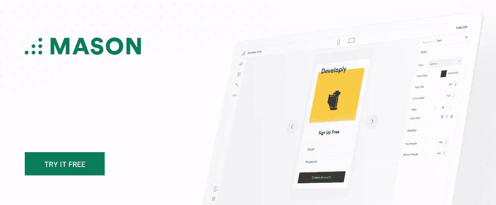
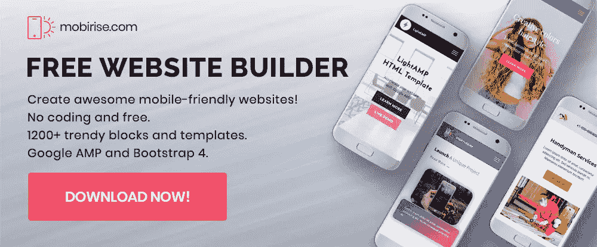
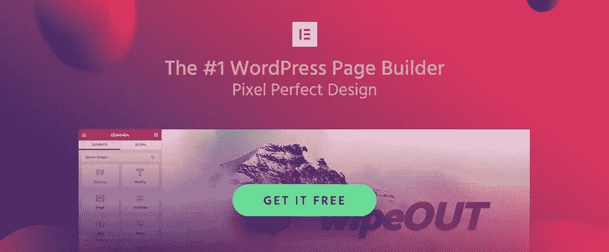
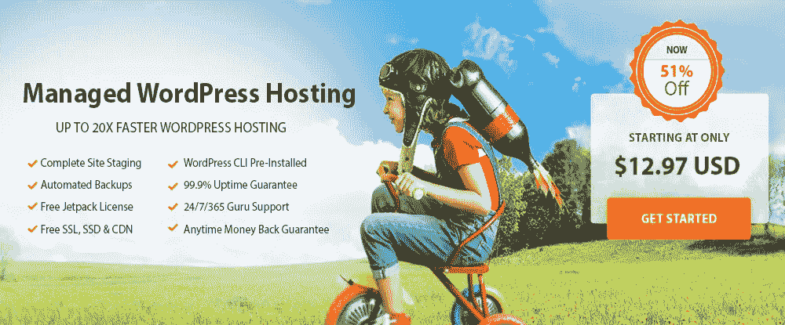
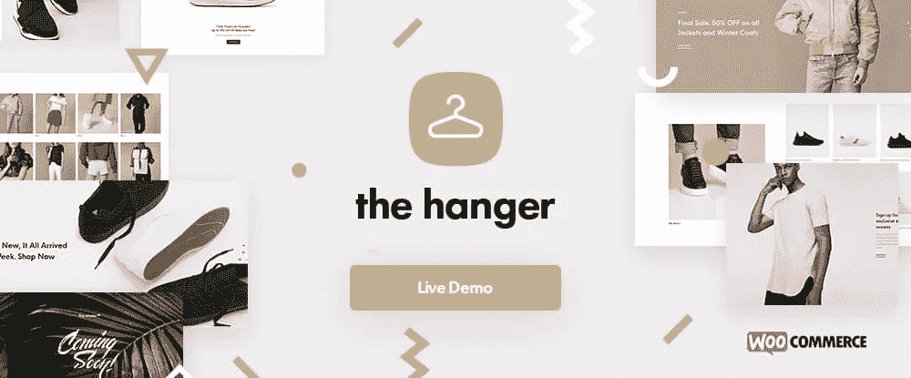
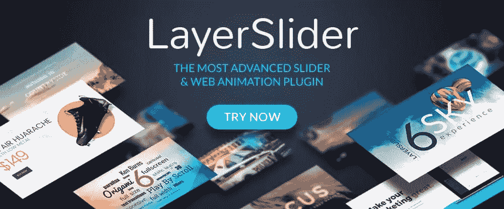
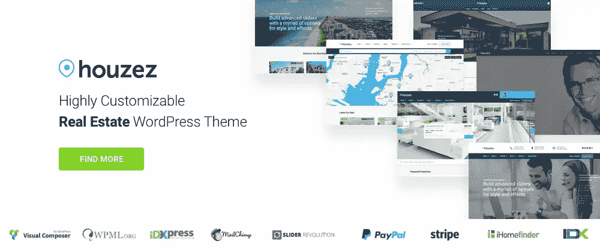
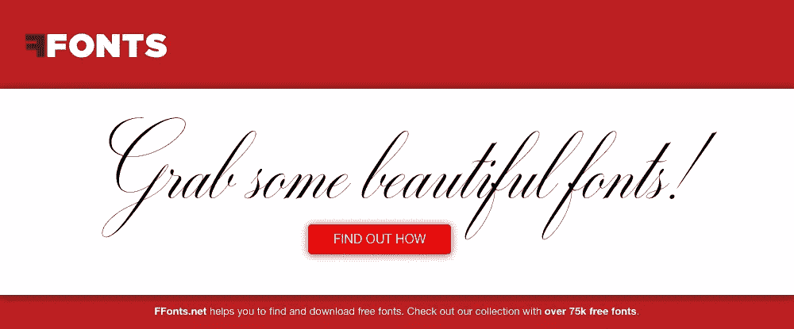
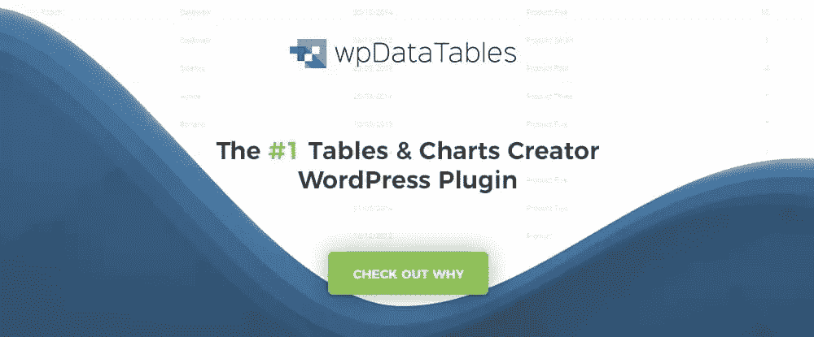
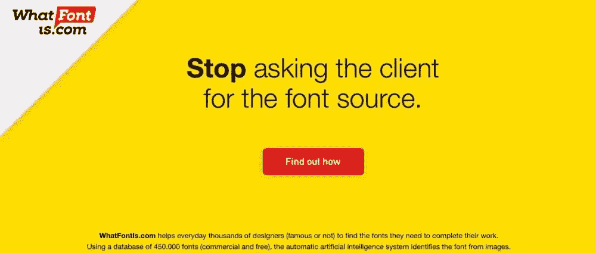

# 帮助你成长为设计师的 15 种工具和资源

> 原文：<https://www.sitepoint.com/15-tools-and-resources-that-will-help-you-grow-as-a-designer/>

*本文是与 [BAWMedia](https://bawmedia.com/) 合作创作的。感谢您对使 SitePoint 成为可能的合作伙伴的支持。*

当趋势和技术处于不断变化的状态时，很难呆在你的网页设计舒适区。您的许多设计和开发工具可能会在一段时间内继续为您服务。你所依赖的资源可能也是如此。

然而，总有一天，一种受欢迎的工具或资源不再胜任这项任务。投资新的工具或资源通常是跟上时代变化的最简单的方法。尤其是当工具或资源很容易负担得起，甚至在某些情况下是免费的时候。

这可能是一个很好的时间来盘点你的设计师工具箱里有什么。看看是否有必要做些改变。这份 2018 年 15 个顶级工具和资源的列表应该会让你有一个良好的开端。

## 1.梅森

需求总是会发生变化。这些变化可能会让设计人员和开发人员头疼，因为它们通常涉及重复的工作周期。今天的许多软件工具只能处理一定程度上的需求变更，它们可以重复先前的任务。

梅森有一种不同的方法。

Mason 是一个设计/开发和维护/协作相结合的工具，它可以通过减轻设计人员或开发人员进行不必要的修改或修复的任务来结束重复的部署周期。

Mason 拥有丰富的软件设计特性，包括解决常见需求的预打包构建块。Mason 所做的与众不同的是，允许下游用户(软件维护个人或团队，甚至客户)在这些构建模块中进行更改，以响应不断变化的修复或产品更新的要求或需求。

Mason 的登录和用户注册协议确保您始终拥有对产品变更的完全控制权，即使作为团队领导或设计师，您不再需要自己做出变更。

## 2.[莫比里斯](https://mobirise.com/?utm_source=sitepoint.com&utm_medium=content&utm_campaign=top-tools-resources18-2)

创建移动友好网站和应用的能力不再是一个好的选择。在当今世界，这是强制性的。一些主题仍然认为设备友好是一个很好的设计选择。另一方面，Mobirise 是为移动设备设计的。

Mobirise 不仅包含了你构建设备友好的网站和应用程序所需的一切，而且对你没有任何成本，也没有任何限制。Mobirise 可免费用于您的个人和商业追求。只需现在下载并开始使用即可。

Mobirise 是一个离线应用程序，所以你可以完全控制产品设计和托管。对于小型项目，如小型网站、作品集、登录页面和推广网站，这也是一个很好的选择。

## 3.[元素或](https://elementor.com/?utm_source=sitepoint.com&utm_medium=pr&utm_campaign=bawmedia)

如果你不相信 Elementor 是市场上排名第一的 WordPress 页面生成器，你可以仔细看看这些数字。在不到两年的时间里，大约有 90 万用户下载了这个免费的、开源的、功能丰富的页面构建平台。

性能和易用性是 Elementor 受欢迎的部分原因，但它的用户也喜欢它卓越的工作流功能、可视化表单生成器、自定义 CSS 和菜单生成器。

对于该产品的用户来说，事情只会变得更好——如果你选择下载它，对你也一样。Elementor 2.0 发布版已经在进行中，并将在今年剩余的时间里继续增加。

新功能包括增强的 WooCommerce 商店产品页面、单篇文章页面生成器、新的电子商务页面构建选项等等。用户仍然可以享受他们喜欢的 1.0 版本的功能。

## 4.[goodie 网站](https://goodiewebsite.com/?utm_source=sitepoint.com&utm_medium=content&utm_campaign=top-tools-resources18-2)

Goodiewebsite 已经帮助了数百名客户进行网站开发。这是一个平台，专门做大小在 1-10 页量级的网站，设计到代码转换(PSD，Sketch，Figma，XD 等。)，以及简单的 WordPress 站点。

Goodiewebsite 服务具有成本效益，分配给他们的任务总是以专业和可靠的方式执行。

## 5.[monday.com](https://monday.com/lp/mb/board-custom/?utm_source=mb&utm_campaign=post&utm_medium=bawmedia_050618)

无论你是两个人的团队，还是分散在全球各地的 20，000 人的团队，无论是面向技术还是面向非技术，如果你正在寻找一个高性能的团队管理工具，monday.com 将完美地满足你的需求。

这个团队管理工具允许你在没有电子表格或白板的情况下完成任务，并避免安排一系列无休止的会议。monday.com 促进项目透明度，并赋予团队成员权力。

## 6. [A2 的完全托管 WordPress 主机](https://www.a2hosting.com/wordpress-hosting/managed?utm_source=Bawmedia&utm_campaign=grassroots)

A2 主机会根据您的特定主机需求进行调整，而不是相反。您可以期望以其他服务无法比拟的价格获得您想要和需要的虚拟主机体验。站点暂存、自动备份、超高速服务器、24/7 专家支持–一切尽在掌握！

## 7.[衣架](https://themeforest.net/item/the-hanger-modern-classic-woocommerce-theme/21753302?utm_source=BAWMedia&utm_medium=Listing&utm_campaign=Tools%20And%20Resources%20for%20Designers%202018&utm_content=Banner)

无论计划是为现有的服装零售商创建一个在线业务，还是开设一个严格的电子商务业务，你都可以用一点活力来吸引客户。

衣架是一个现代经典的 WordPress 主题，它非常适合在任何时候建立一个高质量的在线商店，并定制它以适应你的品牌或你的客户。

## 8\. [LayerSlider](https://layerslider.kreaturamedia.com/?utm_medium=content&utm_campaign=baw201805)

有了这个反应灵敏、多用途的动画平台，您可以创建独特的滑块组合、令人惊叹的幻灯片、图片库，甚至登录页面和完整的网站。LayerSlider 具有一个可视化的拖放构建器，大量专业设计的手工模板，以及大量的设计元素和选项。

不需要编码，LayerSlider 的文档非常好，他们的客户支持质量也很好。

## 9.[未编码——创意多用途 WordPress 主题](https://undsgn.com/uncode/?utm_source=sitepoint.com&utm_medium=content&utm_campaign=top-tools-resources18-2)

有了 Uncode，只需要几个小时就可以创建一个令人敬畏的作品集来展示你的作品。这个创造性的、多用途的主题包含了很多特性，所以不需要从头开始，也不需要编码。

幻灯片滚动、形状分隔线和强大的图库管理器等新功能肯定会派上用场。Uncode 的网站模型库是思想和灵感的绝佳来源。

## 10.侯塞兹

由于其各种各样的列表选项、高级搜索和地理定位功能以及房地产经纪人和房地产代理机构每天都需要和使用的其他功能，Houzez 增加了新功能来大大扩展其功能。

其中包括一个搜索编辑器和一个自定义字段生成器，它们大大增强了机构管理房地产市场和协调代理活动的能力，同时严格遵守其业务模型。Houzez 的客户支持也是最高级别的。

## 11\. [FFonts.net](https://www.ffonts.net/?utm_source=rs18)

无论你是偶尔需要一种新字体，还是一天之内需要很多，FFonts.net 都是一个有价值的资源。FFonts.net 是一个 75，000 种分类良好的免费字体的目录。

当你找到一个你需要的，或者一个或多个你感兴趣的，你可以写一串文字，看看这个或这些字体在实际使用时是如何出现的。

## 12.[流体界面](https://www.fluidui.com/?utm_campaign=baw)

像 Fluid UI 这样的高质量原型工具将为您做几件事，包括加速项目的设计工作流程，以及增强团队或项目利益相关者的沟通和协作。

Fluid UI 使您能够创建丰富多彩、信息丰富的交互式原型和模型，以供审阅和评论。套件中包含全面的桌面、Android 和 iOS 设计元素。

## 13. [Pixpa](https://www.pixpa.com/?refcode=trackbm)

Pixpa 使摄影师、艺术家和设计师能够轻松创建像素完美的组合网站，不仅允许他们展示自己的作品，还可以通过内置的电子商务商店销售他们的作品。创意人员还可以发布博客，并通过他们的 Pixpa 网站向客户分享、验证和交付他们的作品。

一切都在一个平台上管理，该平台由 Pixpa 的同类最佳主机和 24×7 支持提供支持。开始免费试用 15 天。

## 14.[WP 数据表](https://wpdatatables.com/?utm_source=sitepoint.com&utm_medium=content&utm_campaign=top-tools-resources18-2)

wpDataTables 使得将大量复杂的数据转换成丰富多彩、信息丰富的图表和表格成为无数网页设计者的一项轻松任务。这个主要的 WordPress 插件接受来自多种来源的最常见格式的数据。它生成的图表和表格具有响应性、交互性和易编辑性。

不少网页设计师已经转向使用 WordPress，仅仅是为了有机会使用这个强大的插件。

## 15.[WhatFontis.com](https://www.whatfontis.com/?utm_source=rs18)

遇到一种你很想用的字体，但是你不知道它的名字，也不知道去哪里找，这不是很有趣吗？论坛总是一个可能的来源，但 WhatFontis.com 提供了一个更简单、更快捷的解决方案。

这仅仅是提交一个字体图像，让这个工具的自动人工智能系统搜索 450，000 个字体数据库的问题。你通常会在不到一分钟的时间内得到字体的名称——省去了你几个小时的沮丧。

## 结论

利用好最新的工具和资源！然后，担心如何应对新的趋势和技术将成为过去。深入了解你的设计师的工具箱，看看什么对你仍然有效，什么不再有效，并采取行动。

这份清单中的一项或多项可以让你更容易跟上时代的步伐，照亮你自己、你的团队和你的客户的日子。

## 分享这篇文章