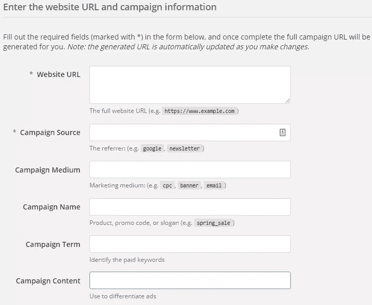
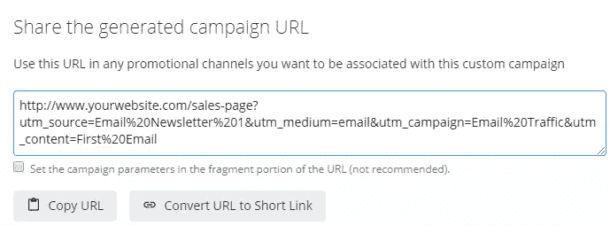
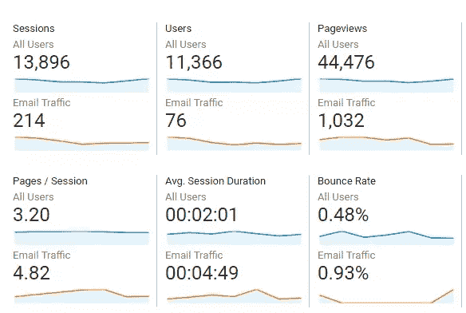
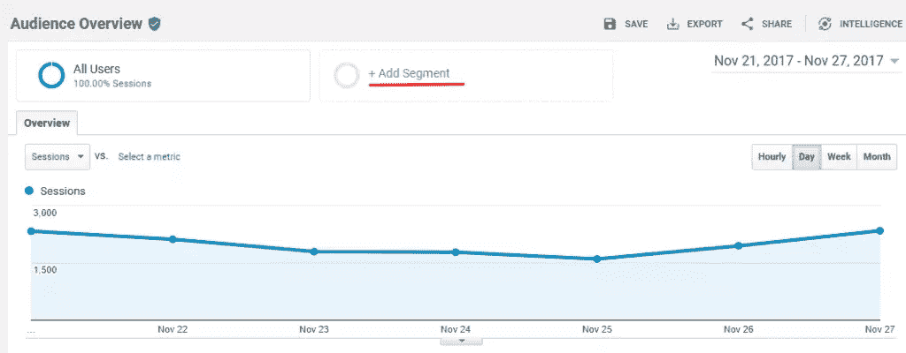
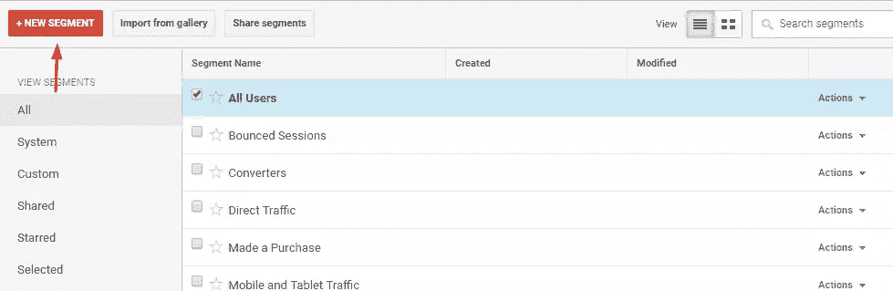
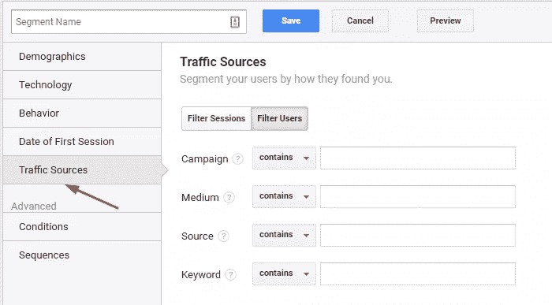

# 如何使用分析创建有针对性的电子邮件活动

> 原文：<https://www.sitepoint.com/how-to-use-analytics-to-create-targeted-email-campaigns/>

当我们想到 UX 时，我们会想到帮助用户浏览网站的方式。在各种类型的转换(订阅、提交表单等)中。)，主要的目标是直接转化为收入的转化。这些转化可能是带来广告收入的点击，也可能是带来销售的结账。

所以我们优化了我们的视觉设计，优化了我们的导航，减少了混乱，用户通常会发现浏览你的网站更容易。但是……当用户找不到他们喜欢的东西时，不管用户体验有多好，会发生什么呢？当有如此多的东西可以消费，以至于他们需要的东西就像大海捞针一样，会发生什么？

在这篇文章中，我将和你谈谈**有针对性的用户体验**，这是发现用户想要什么并交付给他们的艺术。我们可以使用这些概念根据用户的需求定制内容。虽然有些人可能会认为这是营销，但它实际上是设计*和*营销的结合。设计并不总是意味着*视觉*设计。

## 我们在这里会学到什么

我们将学习如何使用分析找出用户想要什么，将他们划分到定制的电子邮件列表中，然后通过电子邮件向他们发送内容推荐。同样的概念也适用于访问你的网站的用户(例如，“流行内容”，“你可能也会感兴趣…”等等)。)，但由于电子邮件 UX 是设计中一个非常容易被忽视的方面，我们将以此为例。

我们还将讨论 UX，当用户点击电子邮件中他们喜欢的东西时会发生什么。

## 电子邮件营销 101(可选阅读)

电子邮件营销有两种主要方法:

*   传统的“批量处理”方法，即你把所有的订阅者放在一起，给他们发同样的邮件
*   有针对性的方法，根据用户的兴趣将相关电子邮件发送给细分的用户。

发送*有针对性的*电子邮件是迄今为止最有效的方法(尽管大型网站受益最大)。事实上，它非常有效，以至于 T2 MarketingSherpa 的一项研究发现，它可以将电子邮件的转化率提高 208%。我们将结合使用电子邮件营销和分析来提供相关内容。(我所说的“内容”是指产品或文章。)

## 步骤 1:隔离电子邮件流量

首先:你需要*将你的电子邮件流量与任何其他流量*隔离开来，这样你就可以*了解个人电子邮件活动的进展*。你需要知道你的电子邮件在大格局中是如何帮助你转化的。有了谷歌分析，这可以通过*标签*和*高级段*来完成。

首先使用[Google Analytics Campaign URL Builder](https://ga-dev-tools.appspot.com/campaign-url-builder/)创建链接跟踪标签。这将帮助您创建带有 *utm_parameters* 的 URL，这将帮助您跟踪点击和活动。

填写相关详细信息:

*   **网址**:这应该就是你要链接的网页
*   **活动来源**:流量的来源(在这种情况下，是你的时事通讯的名称)
*   **活动媒介**:这里的媒介是“电子邮件”
*   **活动名称**:活动的唯一、友好名称(用于进行分析/识别)
*   **竞选术语** : *我们现在不需要这个*
*   **活动内容**:这是出于 A/B 测试的原因，例如，如果您想在同一封电子邮件中创建同一链接的多个版本，这可以用来区分它们(如“文本徽标”、“图像徽标”)。

一旦您填写了所有相关的详细信息，向下滚动，您的链接将如下所示:

您将把您的电子邮件订户发送到此链接，您定义的 *utm_parameters* 将被自动标记为来自您的电子邮件营销活动。对于您想要跟踪的每个电子邮件链接，您将重复这些步骤。虽然一些电子邮件营销软件自动做到这一点，但了解其工作原理的基本概念是很重要的。

## 步骤 2:创建高级细分市场

接下来，我们需要在 Google Analytics 中创建*高级段*，这样我们就可以了解哪些用户在点击什么。

从您的 Google Analytics 仪表板，导航到*受众→概览*，然后点击 *+添加细分市场*按钮(在下面的截图中用红色下划线标出，以防您看不到)。

它显示了这样的内容:

接下来，点击 *+新段* *按钮。点击“流量来源”选项后，您会看到这样的屏幕:

您将希望输入我们在创建 *utm_tags* 时使用的许多相同的细节。填写详细信息:

*   **活动**:这应该是在 *utm_tags* 中定义的活动名称
*   **介质**:应该“完全匹配”“电子邮件”
*   **来源(可选)**:“电子邮件简讯”

为您的细分市场命名并保存。完成后，您将开始看到新细分市场的指标以及正常的流量指标。你会看到这样的东西:

创建了 *utm_tags* 并配置了分段后，无论何时查看流量报告，电子邮件流量都会显示出来，并与正常流量进行比较。这将自动隔离电子邮件流量，使您可以很容易地看到它如何与您的其他流量来源进行比较。

## 步骤 3:分析关键指标

一旦您配置了分析工具来隔离电子邮件流量，下一步就是将关键指标从[虚荣指标](https://www.sitepoint.com/designers-guide-kpis-vanity-metrics)中分离出来，这样我们就可以专注于真正重要的指标。以下是一些具体的提示:

### 忽略打开

你的邮件打开率微不足道。忽略它。如果你发送了一封被 15%的订阅者打开的邮件，而你随后的邮件被不到 9%的订阅者打开，你可能想看看为什么会这样。要么是功能出了问题，你的订户收不到邮件，要么是你在第一封邮件中超越了自己。除此之外，电子邮件打开作为一个指标并不是很有用。许多设备(尤其是移动设备)无法可靠地跟踪打开。

相反，你应该把注意力集中在*的点击*上。

### 关注点击量和转化率

相反，使用 *utm_tags* 来跟踪用户的点击。您需要跟踪电子邮件活动中的所有链接，这样您就可以看到在单个活动中是否有链接胜过其他链接，或者某个特定活动是否胜过另一个活动。深入数据，看看哪些链接被点击。

## 第四步:创建“目标”来跟踪转化

既然你在跟踪点击，你就要抢先一步，找出哪些点击真正转化了(例如，导致订阅、销售或其他)。

*这个*是最终的度量。

更重要的是，确定哪些人口统计数据正在转化为哪些链接，并根据他们的兴趣/位置/性别等向这些细分市场发送有针对性的电子邮件。，从而通过满足用户组的需求来改善用户体验。(在*受众*标签下的报告将在这里帮助你。)

例如，这里有一个关于用谷歌分析跟踪电子商务交易的极好的指南。如果你把你在这里学到的东西和那篇文章结合起来，你将能够看到哪些电子邮件和特定链接导致了哪些转化，并以此为基础建立你未来的活动。

## 个性化、一致性和熟悉性

缓慢但稳定地，通过正确的集成技术，你可以开始根据个人用户的兴趣和浏览、搜索和购买习惯来锁定他们。大多数电子商务软件将与分析软件集成，以允许这种情况发生。我们称之为*个性化*。

**个性化**是指内容为个人量身定制。以下是亚马逊如何利用分析和心理学做到这一点…

### 一致性

亚马逊和他们的邮件一致。不一致的视觉设计或电子邮件的规律性会让用户感到困惑，甚至会让他们觉得垃圾邮件。

亚马逊在他们的电子邮件的开头会附上客户的全名。你可以选择包括用户的名字，或者一个简单的称呼，如“嘿”或“嗨”。不管你使用什么技术，保持一致性，甚至可能实现 [A/B 测试](https://www.sitepoint.com/a-b-testing-introduction/)来看看哪种技术会导致更多的点击。

### 熟悉原则

听说过“[熟悉性原则](https://www.psychologytoday.com/blog/sense-and-sensitivity/201302/the-familiarity-principle-attraction)”吗？简而言之:用户接触到的东西越多，他们就越容易接受。亚马逊在他们的电子邮件营销方法中有效地使用了这种技术。他们的方法是双重的:

1.  首先，使用他们的分析系统，亚马逊能够通过他们的用户活动*预测*用户想要什么。
2.  在此基础上，*个性化的*电子邮件会持续发送给该特定用户，以确保交易完成。考虑[这个例子](http://www.kwasistudios.com/resources/email-marketing-amazon-case-study/)，一位亚马逊客户正在寻找数码相机。他没有买，所以亚马逊跟进，在两周内给**发了 9 封不同的电子邮件，都是关于数码相机的。相当令人印象深刻。**

## 结束语:消除不必要的步骤

使用分析来提高你的电子邮件 UX 的主要优势之一是，它允许你为用户消除不必要的额外步骤。让我们以亚马逊为例(是的，再次)。来自亚马逊的电子邮件会指引你用户想要采取的具体行动——无论是购买一件商品，还是为他们已经购买的商品留下评论。亚马逊很少强迫你翻所有的跟斗。一旦你对你的用户数据进行了细分，并且你准确地理解了一个用户组或者特定用户想要什么，你就可以通过去除任何不必要的步骤来进一步提升用户体验。

最重要的是，确保你的网页加载速度快！

## 结论

个性化和有针对性的内容可以成倍地提升用户体验，帮助用户找到某些东西，而无需搜索和其他不良交互。电子邮件营销尤其可以将转化率提高 208%，但没有理由不使用相同的细分技术结合现场内容推荐来提高电子邮件之外的销售。(你甚至可以两者并用！)

如您所见，本文中讨论的技术会对您的底线产生重大影响。

## 分享这篇文章