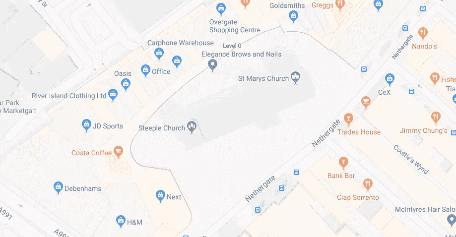
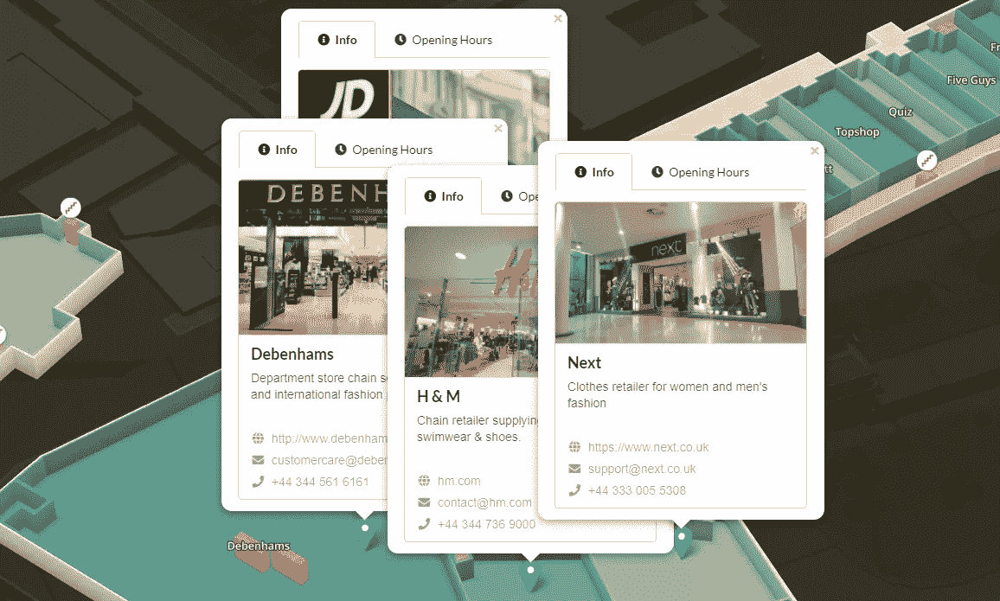
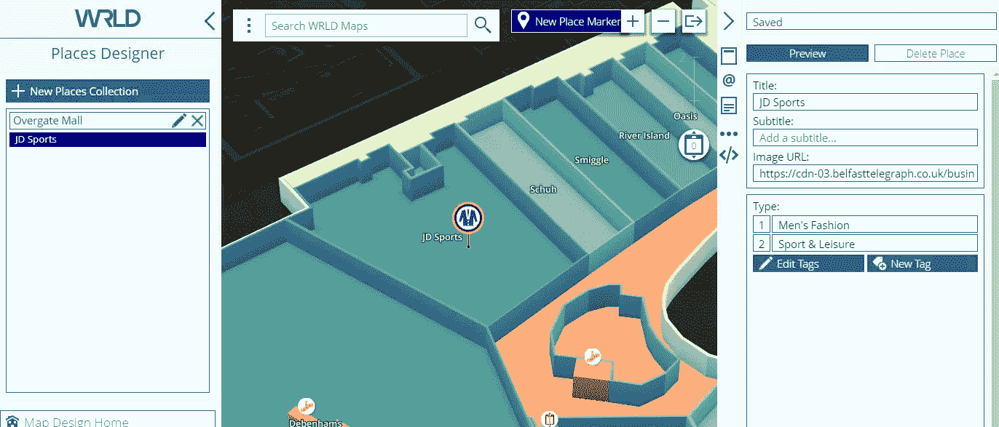
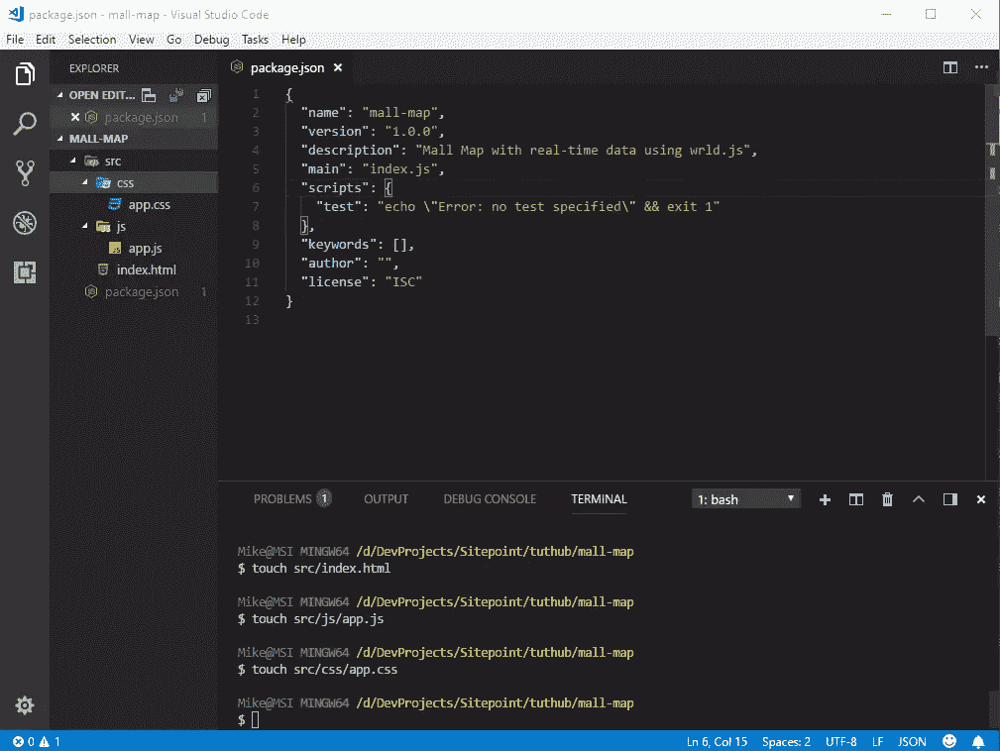
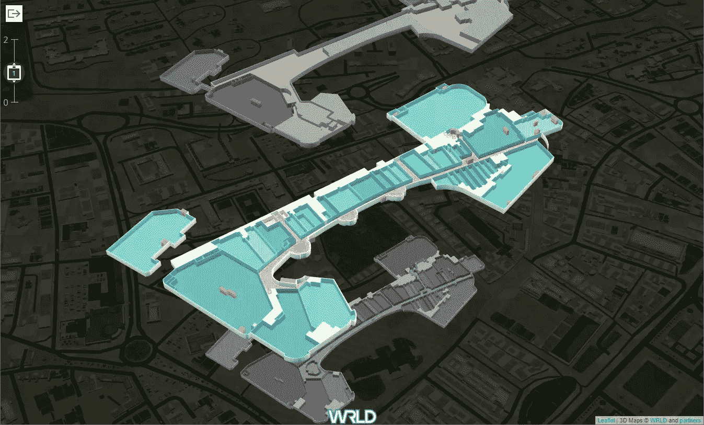
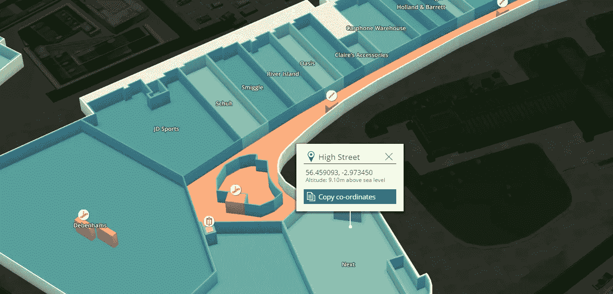
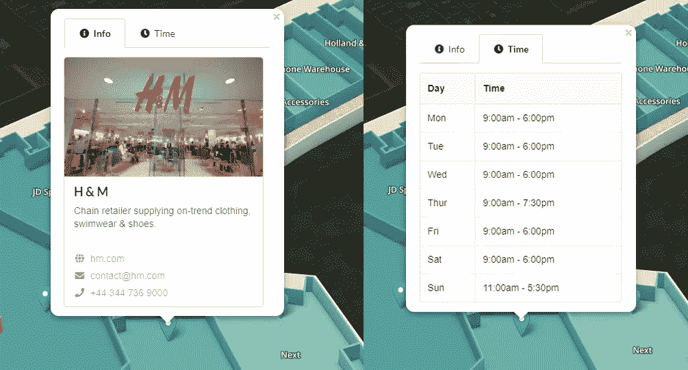
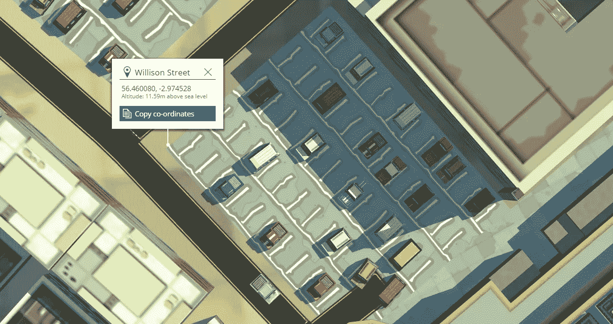
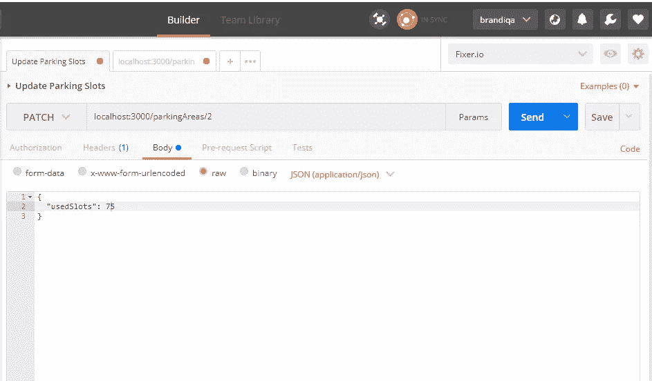
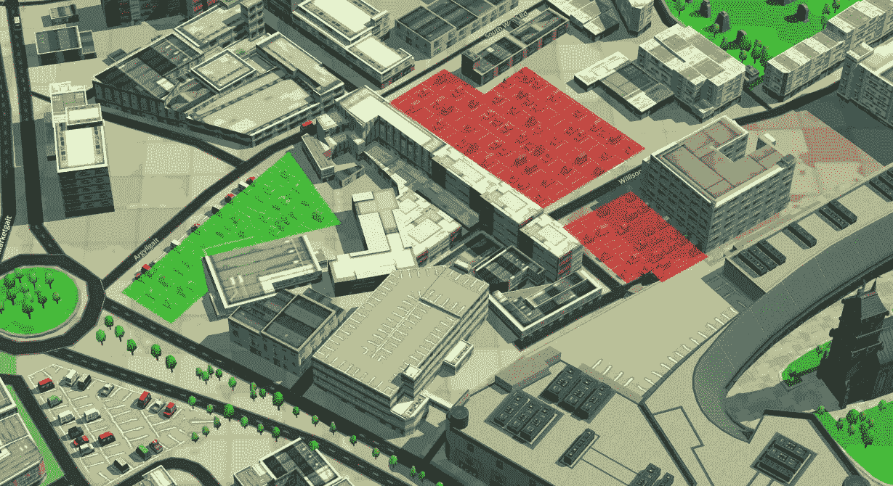

# 如何使用 WRLD 创建包含实时数据的商场地图

> 原文：<https://www.sitepoint.com/how-to-create-a-mall-map-with-real-time-data-using-wrld/>

*本文是与 [WRLD](https://wrld3d.com/) 合作创作的。感谢您对使 SitePoint 成为可能的合作伙伴的支持。*

作为一名 web 开发人员，您有时会发现自己处于一个需要实现地图的位置。你的第一选择是使用谷歌地图，对吗？



这看起来没问题。但是，您可能需要借助标记在地图上叠加附加信息。您可以使用这种方法，或者您可以找到一个更好的解决方案，允许您在室内 3D 地图中创建标记！多酷啊。使用室内标记，您可以为用户提供独特的体验，使他们能够在地图内访问信息并与 ui 进行交互。



在本教程中，我们将创建两个演示来展示 [WRLD 地图](https://www.wrld3d.com/)的威力。您将了解如何创建可在 3D 地图上叠加实时信息的自定义应用程序。在第一个演示中，我们将在现有的商场室内地图上添加交互式标记。在第二个演示中，我们将在停车区域放置彩色多边形，表示容量。

您可以在这个 [GitHub 资源库](https://github.com/brandiqa/sp-mall-park-wrld)中找到两个演示的完整项目。

## 先决条件

对于本文，您只需要对以下主题有一个基本的了解:

*   [JavaScript DOM](https://www.sitepoint.com/dom-manipulation-vanilla-javascript-no-jquery/)
*   [ES6 语法](https://www.sitepoint.com/premium/courses/introduction-to-es6-2980)
*   [ES6 模块](https://www.sitepoint.com/understanding-es6-modules/)

我想这是你第一次使用 WRLD 地图。然而，我建议你至少快速浏览一下这篇文章:

*   [构建动态三维地图](https://www.sitepoint.com/building-dynamic-3d-maps/)

您还需要在系统上安装 Node.js 和 npm 的最新版本(在撰写本文时，8.10 LTS 是最新的稳定版本)。对于 Windows 用户，我强烈建议您使用 [Git Bash](https://gitforwindows.org/) 或任何其他能够处理基本 Linux 命令的终端。

本教程将使用[纱](https://www.sitepoint.com/yarn-vs-npm/)进行包安装。如果您喜欢使用`npm`，如果您不熟悉纱线指令，请参考本[指南](https://yarnpkg.com/lang/en/docs/migrating-from-npm/)。

## 获取 API 密钥

开始之前，你需要在 [WRLD](https://www.wrld3d.com/) 上创建一个免费账户。一旦您登录并验证了您的电子邮件地址，您将需要获得一个 API 密钥。关于如何获得一个的详细说明，请查看关于[构建动态 3D 地图](https://www.sitepoint.com/building-dynamic-3d-maps/)的**入门**部分。

## 构建地图的方法

WRLD 地图的创建是一项重大的技术成就，对许多行业具有巨大的潜在利益。扩展平台功能有两种主要方式:

*   使用内置工具，例如地图设计器和地点设计器
*   构建自定义应用程序

让我来分析一下每种方法是如何达到预期效果的。

### 1.使用地图设计器和地点设计器

对于我们的第一个演示，我们可以使用 [Places Designer](https://mapdesigner.wrld3d.com/portal/latest/) 来创建商店卡片。这将需要我们创建一个`Collection Set`来保存所有的`Point of Interest`标记。这个集合既可以在 WRLD 生态系统内部访问，也可以通过 API key 从外部访问。我们可以将这些数据传递给使用[地图设计器](https://mapdesigner.wrld3d.com/portal/latest/)创建的自定义地图。借助此工具，我们可以使用生成的链接与他人共享地图。如果你想了解更多关于这个过程的信息，请观看这个 [YouTube 播放列表](https://www.youtube.com/watch?v=QrtE55W1PAc&list=PLfFyHNlP8idRL5i8OVOcjw2ETAkY5616j)的视频教程。



这种方法的优点是不需要编码。然而，在我们的例子中，它确实有局限性:

*   限制性用户界面设计——我们只能使用 Places Designer 附带的用户界面
*   限制性数据集–除了所提供的信息之外，我们无法显示其他信息

为了克服这些限制，我们需要使用第二种方法来应对我们的小地图挑战。

### 2.构建自定义应用程序

构建自定义应用程序是最灵活的选择。尽管这需要一些编码工作，但它确实允许我们全面挖掘 WRLD 平台提供的潜在财富。通过构建自定义应用程序，我们可以创建自己的 UI，添加更多字段并实时访问外部数据库。这是我们将在本教程中使用的方法。

## 构建应用程序

让我们首先创建一个基本地图，稍后我们将向其添加更多功能。转到您的工作区目录，为您的项目创建一个新文件夹。姑且称之为`mall-map`。

在代码编辑器中打开`mall-map`文件夹。如果您有 VSCode，使用 *Ctrl + `* 访问终端，并在项目目录中执行以下命令:

```
# Initialize package.json
npm init -f

# Create project directories
mkdir src
mkdir src/js src/css

# Create project files
touch src/index.html
touch src/js/app.js
touch src/css/app.css
touch env.js 
```

您的项目结构应该是这样的:



现在我们已经有了项目结构，我们可以开始编写代码了。我们从`index.html`开始。插入此代码:

```
<!DOCTYPE html>
<html lang="en">
<head>
  <meta charset="UTF-8">
  <meta name="viewport" content="width=device-width, initial-scale=1.0">
  <meta http-equiv="X-UA-Compatible" content="ie=edge">
  <link rel="stylesheet" href="./css/app.css" />
  <title>Shopping Mall</title>
</head>
<body>
  <div id="map"></div>
  <script src="js/app.js"></script>
</body>
</html> 
```

接下来，我们来研究一下`css/app.css`。我正在为整个项目提供完整的样式，这样我们就不必再次访问这个文件。随着教程的进展，到时候你会理解内容的。

```
@import "https://cdnjs.cloudflare.com/ajax/libs/leaflet/1.0.1/leaflet.css";
@import "https://cdn-webgl.wrld3d.com/wrldjs/addons/resources/latest/css/wrld.css";
@import "https://cdnjs.cloudflare.com/ajax/libs/semantic-ui/2.3.0/semantic.min.css";

html,
body {
  margin: 0;
  padding: 0;
  width: 100%;
  height: 100%;
}

#map {
  width: 100%;
  height: 100%;
  background-color: #000000;
}

/* -------- POPUP CONTENT -------- */
.main-wrapper > .segment {
  padding: 0px;
  width: 300px;
}

.contacts > span {
  display: block;
  padding-top: 5px;
} 
```

现在我们需要开始为`app.js`编写代码。但是，我们需要几个节点依赖关系:

```
yarn add wrld.js axios 
```

如前所述，我们将利用现代 JavaScript 语法来编写代码。因此，我们需要使用`babel`将现代代码编译成与大多数浏览器兼容的格式。这需要安装`babel`依赖项，并通过`.babelrc`文件配置它们。确保将它们安装为**开发依赖项**。

```
yarn add babel-core babel-plugin-transform-runtime babel-runtime --dev
touch .babelrc 
```

将这段代码复制到`.babelrc`文件中:

```
{
  "plugins": [
    [
      "transform-runtime",
      {
        "polyfill": false,
        "regenerator": true
      }
    ]
  ]
} 
```

我们还需要以下包来运行我们的项目:

*   [package bundler](https://www.npmjs.com/package/parcel-bundler)–这就像一个简化版的 webpack，几乎没有任何配置
*   [JSON 服务器](https://www.npmjs.com/package/json-server)–用于创建虚拟 API 服务器

像这样全局安装软件包:

```
yarn global add parcel-bundler json-server

# Alternative command for npm users
npm install -g parcel-bundler json-server 
```

这就是我们项目需要的所有节点依赖关系。现在让我们写一些 JavaScript 代码。首先，在`env.js`中提供您的 WRLD API 密钥:

```
module.exports = {
  WRLD_KEY: '<put api key here>',
 }; 
```

然后打开`js/app.js`并复制这段代码:

```
const Wrld = require('wrld.js');
const env = require('../../env');

const keys = {
  wrld: env.WRLD_KEY,
};

window.addEventListener('load', async () => {
  const map = await Wrld.map('map', keys.wrld, {
    center: [56.459733, -2.973371],
    zoom: 17,
    indoorsEnabled: true,
  });
}); 
```

前三个陈述非常明显。我们已经将所有代码放在了`window.addEventListener`函数中。这是为了确保我们的代码在 JavaScript 依赖项加载后执行，我们将在后面的`index.html`中指定。在这个函数中，我们通过传递几个参数初始化了 map:

*   `map`–我们在`index.html`中指定的 div 容器的 ID
*   `keys.wrld`–API 密钥
*   `center`–位于苏格兰邓迪的奥弗盖特购物中心的经纬度
*   `zoom`–标高
*   `indoorsEnabled`–允许用户访问室内地图

让我们开始我们的项目吧。转到您的终端并执行:

```
parcel src/index.html 
```

等待几秒钟，让项目完成绑定。完成后，打开浏览器并访问 [localhost:1234](http://localhost:1234) 。根据你的网速，地图应该不会花太长时间。


很美，不是吗？请随意点击蓝色图标。它会带你进入室内。四处逛逛，看看不同的商店。然而，你很快就会意识到你不能进入其他楼层。也没有退出室内地图的按钮。让我们在下一章解决这个问题。

## 创建室内控件

为了允许用户在不同楼层之间切换，我们将为他们提供一个控件，允许他们这样做。只需将以下脚本添加到`public/index.html`文件的头部分:

```
<script src="https://cdnjs.cloudflare.com/ajax/libs/jquery/3.3.1/jquery.js"></script>
<script src="https://cdnjs.cloudflare.com/ajax/libs/jqueryui/1.12.1/jquery-ui.min.js"></script>
<script src="https://cdn-webgl.wrld3d.com/wrldjs/addons/indoor_control/latest/indoor_control.js"></script> 
```

仍然在 html 文件中，将这个 div 添加到 body 部分，就在`#map` div 之前:

```
<div id="widget-container" class="wrld-widget-container"></div> 
```

现在让我们更新`js/app.js`来初始化小部件。将这段代码放在映射初始化部分之后:

```
const indoorControl = new WrldIndoorControl('widget-container', map); 
```

现在刷新页面，并单击“进入室内”图标。你应该有一个控件，允许你在楼层之间切换。只需上下拖动控件，即可在楼层间流畅移动。



很神奇，不是吗？现在让我们看看如何让我们的地图对用户来说更方便一点。

## 自动进入室内

你不觉得有点烦人吗，每次我们需要测试我们的地图，我们需要点击'室内'图标？用户可能会开始导航到其他位置，这不是这个应用程序的意图。为了解决这个问题，我们需要在应用程序启动时自动导航到室内，而无需任何用户交互。首先，我们需要`indoor map id`来实现这个特性。我们可以从`indoormapenter`事件中找到这个信息。在这里可以找到所有室内相关方法[。](https://www.wrld3d.com/wrld.js/latest/docs/api/L.Wrld.map.indoors/)

在`js/app.js`文件中添加以下代码。

```
...
// Place this code right after the Wrld.map() statement
map.indoors.on('indoormapenter', async (event) => {
  console.log(event.indoorMap.getIndoorMapId());
});
... 
```

刷新页面，然后检查您的控制台。你应该把这个 ID 打印出来:`EIM-e16a94b1-f64f-41ed-a3c6-8397d9cfe607`。现在让我们编写将执行实际导航的代码:

```
const indoorMapId = 'EIM-e16a94b1-f64f-41ed-a3c6-8397d9cfe607';

map.on('initialstreamingcomplete', () => {
  map.indoors.enter(indoorMapId);
}); 
```

保存文件后，刷新页面，看看会发生什么。

室内商场地图应该会自动导航。接下来，我们将看看如何为每个商店创建卡片。但首先，我们需要确定我们的数据来源。

## 商场地图规划

要为我们的地图创建商店卡片，我们需要几个项目:

*   商店的准确经度/纬度坐标
*   商店联系信息和营业时间
*   商店卡的设计模板

### 存储卡坐标

为了获取经度/纬度坐标，我们需要访问 maps.wrld3d.com 的 T2。等待地图加载完成，然后在搜索框中输入地址`56.459733, -2.973371`。按回车键，地图会快速导航到奥弗盖特购物中心。点击 Overgate 购物中心的蓝色室内图标，您将看到购物中心的室内地图。加载后，找到“下一个”商店，右键单击打开上下文菜单。点击‘这是什么地方？选项。应该会出现坐标弹出窗口。



点击“复制坐标”按钮。这将为您提供商店的准确经度/纬度坐标。将此位置地址临时保存在某个地方。

### 存储卡信息

你还需要从每个商店收集联系信息，包括:

*   图像
*   描述
*   电话
*   电子邮件
*   网
*   推特
*   营业时间

你可以从谷歌获得大部分信息。幸运的是，我已经为你收集了数据。在本教程中，我们将只讨论底层的四家商店。要访问这些信息，只需在项目的根目录下创建一个文件夹，并将其命名为 data。接下来将 GitHub 中的[文件](https://github.com/brandiqa/sp-mall-park-wrld/blob/master/data/db.json)保存到`data`文件夹中。确保将其保存为`db.json`。以下是我们将使用的数据示例:

```
{
  "id":1,
  "title": "JD Sports",
  "lat": 56.4593425,
  "long": -2.9741433,
  "floor_id": 0,
  "image_url": "https://cdn-03.belfasttelegraph.co.uk/business/news/...image.jpg",
  "description":"Retail chain specialising in training shoes, sportswear & accessories.",
  "phone": "+44 138 221 4545",
  "email": "customercare@jdsports.co.uk",
  "web": "https://www.jdsports.co.uk/",
  "twitter": "@jdhelpteam",
  "tags": "sports shopping",
  "open_time":[
    { "day": "Mon",
      "time": "9:30am - 6:00pm"
    },]
} 
```

数据存储在一个标记为“pois”的数组中。POI 代表**名胜古迹。**现在我们有了可用的数据，我们可以通过运行 [JSON 服务器](https://www.npmjs.com/package/json-server)轻松地通过 API REST 点访问它。只需打开一个新的终端并执行命令:

```
json-server --watch data/db.json 
```

API 应该需要几秒钟才能启动。一旦它被完全加载，你可以用你的浏览器在 [localhost:3000/pois](http://localhost:3000/pois) 测试它。您也可以使用以下语法提取单个 POI:

`- localhost:3000/pois/{id}`

例如， [localhost:3000/pois/3](http://localhost:3000/pois/3) 应该以 JSON 格式返回一个 ID 为 3 的`poi`记录。

### 商店卡片设计

我们将使用一个简洁优雅的主题，通过几个标签整齐地显示联系信息和开放时间。我们将创建一些标记，单击时会显示一个弹出窗口。该弹出窗口将具有以下用户界面。


这个 HTML 设计的代码放在这里有点长。您可以从这个[链接](https://github.com/brandiqa/sp-mall-park-wrld/blob/master/src/store_card.html)查看和下载文件。该设计只有三个依赖项:

*   语义 UI CSS
*   jQuery
*   语义 UI JS

现在我们已经有了所需的数据和设计，我们应该准备好开始绘制室内地图了。

## 在室内地图中实现商店卡

首先，让我们创建一个允许我们从 JSON REST APIs 访问数据的服务。这些数据将用于在存储卡中填入必要的信息。创建文件`js/api-service.js`并复制以下代码:

```
const axios = require('axios');

const client = axios.create({
  baseURL: 'http://127.0.0.1:3000',
  timeout: 1000,
});

module.exports = {
  getPOIs: async () => {
    try {
      const response = await client.get('/pois');
      return response.data;
    } catch (error) {
      console.error(error);
    }
    return [];
  },
  getPOI: async (id) => {
    try {
      const response = await client.get(`/pois/${id}`);
      return response.data;
    } catch (error) {
      console.error(error);
    }
    return {};
  },
} 
```

这里我们使用库 [axios](https://github.com/axios/axios) 从 JSON 服务器请求数据。

接下来，我们将把商店卡片的静态 HTML 设计转换成允许我们呈现数据的格式。为此，我们将使用 [JsRender](https://github.com/BorisMoore/jsrender) 。我们将把静态设计分成三个模板:

*   基础模板–包含菜单、信息和时间标签。
*   信息模板–商店联系信息标签。
*   时间模板–商店营业时间标签。

首先，打开`index.html`并将这些脚本添加到`head`部分，就在 jQuery 和室内控制脚本之后:

```
<head>
  ...
  <script src="https://cdnjs.cloudflare.com/ajax/libs/jsrender/0.9.90/jsrender.min.js"></script>
  <script src="https://cdnjs.cloudflare.com/ajax/libs/semantic-ui/2.3.0/semantic.min.js"></script>
  ...
</head> 
```

接下来，将这段代码复制到`widget-container` div 之前:

```
 ...
  <!-- Menu Tabs UI -->
 <script id="baseTemplate" type="text/x-jsrender"> <div class="main-wrapper">
      <div class="ui compact basic segment">
        <div class="ui menu tabular"> </div>
        <div id="infoTab" class="ui tab active" data-tab="Info"></div>
        <div id="timeTab" class="ui tab" data-tab="Time"></div>
      </div>
    </div> </script>

  <!-- Info Data Tab -->
  <script id="infoTemplate" type="text/x-jsrender"> <div class="ui card">
      <div class="image">
        
      </div>
      <div class="content">
        <div class="header">{{:title}}</div>
        <div class="description">
          {{:description}}
        </div>
      </div>
      <div class="extra content contacts">
        <span>
          <i class="globe icon"></i>
          <a href="{{:web}}" target="_blank">{{:web}}</a>
        </span>
        <span>
          <i class="mail icon"></i>
          {{:email}}
        </span>
        <span>
          <i class="phone icon"></i>
          {{:phone}}
        </span>
      </div>
    </div> </script>

  <!-- Opening Times Data Tab -->
  <script id="timeTemplate" type="text/x-jsrender"> <table class="ui celled table">
      <thead>
        <tr>
          <th>Day</th>
          <th>Time</th>
        </tr>
      </thead>
      <tbody>
        {{for open_time}}
        <tr>
          <td>{{:day}}</td>
          <td>{{:time}}</td>
        </tr>
        {{/for}}
      </tbody>
    </table> </script>
  ... 
```

index.html 的完整代码应该是这样的。

接下来，让我们创建另一个服务来管理`Popups`的创建。创建文件`js/popup-service.js`并复制以下代码:

```
const Wrld = require('wrld.js');
const { getPOI } = require('./api-service');

const baseTemplate = $.templates('#baseTemplate');
const infoTemplate = $.templates('#infoTemplate');
const timeTemplate = $.templates('#timeTemplate');

const popupOptions = {
  indoorMapId: 'EIM-e16a94b1-f64f-41ed-a3c6-8397d9cfe607',
  indoorMapFloorIndex: 0,
  autoClose: true,
  closeOnClick: true,
  elevation: 5,
}; 
```

让我一步一步地解释每个模块:

*   块 1:需要 WRLD 来创建`Popup`，需要`getPOI`函数来获取数据
*   块 2:我们之前讨论的模板是使用`jsrender`加载的
*   块 3:将在`Popup`实例化期间传递的参数。这是[参考文件](https://www.wrld3d.com/wrld.js/latest/docs/leaflet/L.Popup/)。

接下来，让我们添加将用于切换选项卡的选项卡菜单。只需将这段代码添加到`js/popup-service.js`:

```
const createMenuLink = (linkName, iconClass) => {
  const link = document.createElement('a');
  link.className = 'item';
  const icon = document.createElement('i');
  icon.className = `${iconClass} icon`;
  link.appendChild(icon);
  link.appendChild(document.createTextNode(`  ${linkName}`));
  link.setAttribute('data-tab', linkName);
  link.addEventListener('click', () => {
    $.tab('change tab', linkName);
    $('.item').toggleClass('active');
  });
  return link;
};

const createMenu = (menuParent) => {
  const infoLink = createMenuLink('Info', 'info circle');
  infoLink.className += ' active';
  menuParent.appendChild(infoLink);
  const timeLink = createMenuLink('Time', 'clock');
  menuParent.appendChild(timeLink);
}; 
```

你可能想知道为什么我们使用一种复杂的方法来创建菜单链接。理想情况下，我们应该能够使用 HTML 创建它们，然后添加一个小的 JavaScript 脚本来激活选项卡。不幸的是，这在`Popup`的上下文中不起作用。相反，我们需要使用 DOM 操作方法创建可点击的元素。

接下来，添加以下代码来完成基本内容部分:

```
const buildBaseContent = () => {
  const htmlOutput = baseTemplate.render({});
  const parent = $.parseHTML(htmlOutput)[1];
  const menuParent = parent.childNodes[1].childNodes[1];
  createMenu(menuParent);
  return parent;
};

const baseContent = buildBaseContent(); 
```

这里，我们将基本模板渲染成 HTML。然后我们将它转换成 DOM，以便能够附加 DOM 菜单。然后我们调用`buildBaseContent()`函数来创建我们的基本 DOM，稍后我们将为 info 和 time 标签附加内容。

在下一节中，我们将创建一个名为`showPopup`的函数。我们稍后将为每个商店创建标记。当用户点击一个标记时，会出现一个包含商店卡的弹出窗口。将此代码添加到`js/popup-service.js`:

```
// Clear existing tab content before adding another
const clearTab = (tab) => {
  while (tab.firstChild) {
    tab.removeChild(tab.firstChild);
  }
};

module.exports = {
  showPopup: async (event) => {
    // Fetch co-ordinates and map objects from event
    const latlang = event.target._latlng;
    const map = event.target._map;
    // Create an instance of Popup
    const popup = Wrld.popup(popupOptions)
      .setLatLng(latlang);
    try {
      // Fetch data from api-service
      const poi = await getPOI(event.target.options.id);
      // Bind data with templates to render html outputs
      const infoHTML = infoTemplate.render(poi);
      const timeHTML = timeTemplate.render(poi);
      // Convert HTML outputs to DOM objects
      const infoDOM = $.parseHTML(infoHTML)[1];
      const timeDOM = $.parseHTML(timeHTML)[1];
      // Populate Tabs with DOM objects
      const infoTab = baseContent.childNodes[1].childNodes[3];
      clearTab(infoTab); // Clear existing content if any
      infoTab.appendChild(infoDOM);
      const timeTab = baseContent.childNodes[1].childNodes[5];
      clearTab(timeTab); // Clear existing content if any
      timeTab.appendChild(timeDOM);

      // Populate popup with DOM content
      popup.setContent(baseContent);
      // Display the popup
      popup.addTo(map);
      // Navigate map to properly view the Popup
      map.setView(latlang, 18);
    } catch (error) {
      popup.setContent('Oops! Something went wrong');
      popup.addTo(map);
    }
  },
}; 
```

这里发生了很多事。我在代码中嵌入了注释，解释了每一部分的作用。如果你对完成的代码应该是什么样子有任何疑问，你可以从[这个链接](https://github.com/brandiqa/sp-mall-park-wrld/blob/master/src/js/popup-service.js)查看。

接下来，我们需要为在`db.json`中定义的每个兴趣点创建[标记](https://www.wrld3d.com/wrld.js/latest/docs/leaflet/L.Marker/)。每个标记都有一个`click`事件监听器，它将触发`showPopup()`功能。更新`js/app.js`如下:

```
..
const { getPOIs } = require('./api-service');
const { showPopup } = require('./popup-service');
...

// Place within window.addEventListener('load')
const placeMarkers = (pois) => {
  let marker;
  pois.forEach((poi) => {
    const latlang = [poi.lat, poi.long];
    marker = Wrld.marker(latlang, {
      id: poi.id,
      title: poi.title,
      indoorMapId,
      indoorMapFloorId: 1,
    }).addTo(map);
    marker.on('click', showPopup);
  });
};

map.indoors.on('indoormapenter', async (event) => {
  if (event.indoorMap.getIndoorMapId() === indoorMapId) {
    // Center map properly when indoors
    map.indoors.setFloor(0);
    map.setView([56.459342, -2.9741433], 18);

    // Create markers for each store.
    const pois = await getPOIs();
    placeMarkers(pois);
  }
}); 
```

请注意，我们通过 Options 对象参数将 POI ID 传递给标记。如果你回头参考一下`showPopup`函数，你会看到我们正在通过`event`对象提取这个 id。如果对完整代码的外观有疑问，可以通过这个[链接](https://github.com/brandiqa/sp-mall-park-wrld/blob/master/src/js/app.js)查看。

现在是时候测试我们的代码了。我假设您仍然让 JSON 服务器在后台运行。如果你不知道，请参考如何运行它。让我们也启动包裹捆扎机。一旦启动，刷新你的浏览器以防它没有启动。您现在应该有多个标记可供您点击。单击一个标记将会弹出这样一个窗口:



上面的演示说明了商店卡如何用于室内地图。现在，让我们看看另一个 Wrld.js 特性，我们可以在多个停车区域叠加停车可用性信息。

## 剩余的泊车位

你有没有因为寻找停车位而感到压力重重？好吧，让我们试试看能不能解决这个问题。我们将使用 WRLD 地图来突出显示停车区域。我们将使用不同的颜色来表示每个停车区的状态:

*   绿色:有停车位
*   黄色:80%的停车位被占用
*   红色:100%的停车位被占用

当然，您可以定义更多的颜色代码，以提供更详细的停车位级别。然而，请记住，人们可能很匆忙，他们需要在几毫秒内处理这些信息。让我们一步一步地开始创建这个地图。

### 1.停车区定位图

让我们从创建`parking.html`和`js/parking.js`开始。我们将独立于商场地图逻辑运行这个解决方案。创建 HTML 文件后，复制以下代码:

```
<!DOCTYPE html>
<html lang="en">
<head>
  <meta charset="UTF-8">
  <meta name="viewport" content="width=device-width, initial-scale=1.0">
  <meta http-equiv="X-UA-Compatible" content="ie=edge">
  <link rel="stylesheet" href="./css/app.css" />
  <title>Parking Availability</title>
</head>
<body>
  <div id="map"></div>

  <script src="js/parking.js"></script>
</body>
</html> 
```

接下来，为`js/parking.js`复制这段代码:

```
const Wrld = require('wrld.js');
const env = require('../../env');

const keys = {
  wrld: env.WRLD_KEY,
};

window.addEventListener('load', async () => {
  // Create map instance
  const map = await Wrld.map('map', keys.wrld, {
    center: [56.460087, -2.975432],
    zoom: 17.5,
  });
}); 
```

现在让我们运行我们的代码。对此我们将使用`parcel`。首先用 *Ctrl + C.* 停止现有的`parcel`实例要开始停车演示，执行:

```
parcel src/parking.html 
```

等待包完成编译。一旦完成，导航到 [localhost:1234](http://localhost:1234) 。您应该可以看到停车场的以下景观:


### 2.突出停车

现在让我们学习如何使用一个[多边形](https://www.wrld3d.com/wrld.js/latest/docs/api/L.Polygon/)实例来高亮显示一个区域。首先，我们需要为需要突出显示的区域的每个角落收集坐标。我们可以通过访问 maps.wrld3d.com 的[并搜索 Overgate 来找到停车区。向停车场方向放大，使用鼠标中键调整摄像机的倾斜度，以便您可以直接向下观看。这将很容易准确地放置鼠标点击。接下来，选择一个停车区，右键单击任意角落。点击“这是什么地方？”：](https://maps.wrld3d.com/)



单击复制坐标并将其保存在某个位置。您应该得到您点击的点的经度和纬度坐标。

`- 56.460080, -2.974528`

每个角都这样做。接下来使用这些数据构建一个`Polygon`实例。这里有一个添加到`js/parking.js`中的例子。将这段代码放在`map`初始化语句之后。

```
 const polygonPoints1 = [
    [56.459857, -2.974004],
    [56.459889, -2.974036],
    [56.459836, -2.974188],
    [56.460079, -2.974526],
    [56.460254, -2.974096],
    [56.459954, -2.973698]];
  const parking1 = Wrld.polygon(polygonPoints1).addTo(map); 
```

刷新 [localhost:1234](http://localhost:1234) 以防没有。您现在应该有这个视图:


既然我们已经学会了突出显示，我们应该收集我们感兴趣的每个停车区的坐标。我们还需要一种方法使这些数据远离我们的代码，这是我们接下来要研究的。但是首先，删除这段代码，因为我们会用更好的代码来替换它。

### 3.停车数据的 Rest API

我们将利用 JSON 服务器数据库来存储所有的停车坐标。你很幸运，我已经收集了这些数据，并将它们放在`db.json`中。以下是一个停车区的数据示例:

```
{
      "id": 1,
      "name" : "parking 1",
      "polygonPoints": [
        [
          56.459837,
          -2.973982
        ],
        [
          56.459952,
          -2.973691
        ],
        [
          56.460256,
          -2.974093
        ],
        [
          56.460079,
          -2.974530
        ],
        [
          56.459832,
          -2.974188
        ],
        [
          56.459888,
          -2.974035
        ]
      ],
      "totalSlots": 55,
      "usedSlots": 55
    }, 
```

请注意，这是对可用停车位总数的粗略估计。我还对二手停车位做了一个猜测，我们稍后会对其进行处理。您之前复制的`db.json`文件已经有此数据。现在我们已经有了停车场的数据，我们应该创建一个助手服务来获取这些信息。我们只需要用一个新函数更新`js/api-service`。复制这段代码，并将其放在`module.exports`中最后一个`get`函数之后:

```
 getParkingAreas: async () => {
    try {
      const url = id ? `/parkingAreas/${id}` : '/parkingAreas';
      const response = await client.get(url);
      return response.data;
    } catch (error) {
       console.error(error);
    }
    return [];
  }, 
```

该函数被设计为既可以获取所有停车场记录，也可以只获取一条记录，这取决于 ID 字段是否被填充。现在让我们看看如何从 JSON 服务器中提取这些数据，并将其覆盖在地图上。

### 3.彩色编码停车区

用这些颜色代码更新`js/parking.js`。将这段代码放在`keys`声明之后。

```
// Color Codes
const fullColor = [255, 0, 0, 128]; // Completely full, 100%
const almostColor = [255, 165, 0, 128]; // Few parking slots left, 80% full
const availableColor = [0, 255, 0, 128]; // Plenty of parking space available

const getColorCode = (parkingArea) => {
  const occupied = (parkingArea.usedSlots / parkingArea.totalSlots) * 100;
  if (occupied === 100) {
    return fullColor;
  } else if (occupied >= 80) {
    return almostColor;
  }
  return availableColor;
}; 
```

颜色代码只是代表 rgba 值的数组，即红色、绿色、蓝色和 alpha。还有一个函数`getColorCode`，它根据已用槽的百分比决定使用哪种颜色代码。接下来，让我们从 JSON 服务器获取停车场数据，并为每条记录创建一个多边形实例:

```
 // Place this at the top after other imports
  const { getParkingAreas } = require('./api-service');
  const parkPolys = [];
  ....
  // Place after `map` function
  map.on('initialstreamingcomplete', async () => {
    // Highlight Parking Areas
    const parkingAreas = await getParkingAreas();
    parkingAreas.forEach((parkingArea) => {
      const colorCode = getColorCode(parkingArea);
      const poly = Wrld.polygon(parkingArea.polygonPoints, { color: colorCode })
        .addTo(map);
      parkPolys.push({ id: parkingArea.id, poly });
    });
  });
  ... 
```

请注意，我们将多边形和`parkingArea.id`的关联保存在一个数组中。我们将在稍后处理这个问题，使我们的地图实时化。确保 JSON 服务器正在运行，这样代码才能工作。现在，刷新页面以查看更新后的结果:


很酷，不是吗？随意添加颜色代码标签来表明它们的含义。现在，地图的当前限制是用户看不到地图更新，除非他们刷新整个页面。让我们看看如何解决这个问题。

### 4.实时停车区

为此，我们将使用`sockets.io`库来实现实时更新。我们正在使用的`json server`程序本身不支持`sockets.io`。因此，我们需要编写自己的自定义实现。首先，让我们安装必要的依赖项:

```
yarn add json-server socket.io socket.io-client 
```

接下来，在项目的根目录下创建文件`server.js`,并复制以下代码:

```
const jsonServer = require('json-server');
// Initialize Socket.IO Server
const socketServer = require('http').createServer();
const io = require('socket.io')(socketServer);

// Initialize JSON Server
const server = jsonServer.create();
const router = jsonServer.router('./data/db.json');

// Set default middlewares (logger, static, cors and no-cache)
const middlewares = jsonServer.defaults();
server.use(middlewares);

// To handle POST, PUT and PATCH you need to use a body-parser
// You can use the one used by JSON Server
server.use(jsonServer.bodyParser);

// Broadcast `parkingAreas` PATCH requests
server.patch('/parkingAreas/:id', (req, res, next) => {
  const { id } = req.params;
  const { usedSlots } = req.body;
  console.log(`Parking Area ${id} updated to ${usedSlots} Used Slots`);
  io.emit('parkingAreas', { id, usedSlots });
  next(); // pass on to default logic
});

// Use default router
server.use(router);

// Bind JSON Server
server.listen(3000, () => {
  console.log('JSON Server is running at port 3000');
});

// Bind Socket.IO Server
socketServer.listen(3001, () => {
  console.log('Socket.IO Server is running at port 3001');
}); 
```

在上面的代码中，我们设置了两个并发运行的服务器实例。第一个实例，`json server`将在端口 3000 上提供 API 服务。第二个实例`socket server`将为通过端口 3001 连接到它的套接字客户端提供实时服务。

对于本文，我们将使用 Postman 发送每个停车场的容量级别(`usedSlots`)的更新。我们将使用的 HTTP 方法是 PATCH，它将允许我们只更新记录的子集。我们不能使用 UPDATE 方法，因为这将覆盖整个记录，导致我们丢失多边形点数据。

回到我们的服务器代码，您会注意到我们有一个`patch`函数。在这个函数中，`id`和`usedSlots`数据被提取出来，然后广播给任何一个监听 socket.io 的客户端。

既然我们已经设置了我们的服务器，是时候设置我们的客户机代码来接收实时更新了。回到`js/parking.js`并复制以下代码:

```
// Place this at the top section
const io = require('socket.io-client');
...
  // Place after `getColorCode` function
const updateParkingArea = async ({ id }) => {
  const parkingArea = await getParkingAreas(id);
  if (parkingArea) {
    const parkPoly = parkPolys.find(target => parkingArea.id === target.id);
    if (parkPoly) {
      parkPoly.poly.setColor(getColorCode(parkingArea));
    }
  }
};

const socket = io.connect('http://localhost:3001');

socket.on('connect', () => {
  console.log('connected to socket 3001');
  socket.on('parkingAreas', (data) => {
    console.log('parkingAreas event received');
    updateParkingArea(data);
  });
}); 
```

这里的客户端代码非常简单。我们创建一个绑定到端口 3001 的套接字客户端实例。然后我们设置它来监听`parkingAreas`事件，此时执行`updateParkingArea()`函数。

如果对代码的排列方式有疑问，请参考 [completed parking.js](https://github.com/brandiqa/sp-mall-park-wrld/blob/master/src/js/parking.js) 。

现在让我们做一个实验。首先，您需要取消任何现有的进程。接下来，在单独的终端上启动定制的 JSON 服务器代码。然后在单独的终端上启动`parking.html`代码:

```
# Start server first
node server

# Start Parking Map App
parcel src/parking.html 
```

现在打开或刷新页面 [localhost:1234](http://localhost:1234) 。为了向 JSON 服务器发送更新，我们将使用[邮递员](https://www.getpostman.com/)。没有的话简单安装一下。一旦打开，创建一个新的请求并输入以下参数:

*   **方法**–贴片
*   **URL**–localhost:3000/parking areas/2
*   **内容类型**–应用程序/json
*   **编码**–raw，JSON(应用程序/json)
*   **正文**–`{ "usedSlots": 75 }`

如果您不知道字段`Content-Type`在哪里，只需点击标题标签。下面是《邮差》的截图:



点击发送后，地图会立即更新:



您可以随意使用其他记录的`usedSlots`值，并查看地图本身的更新。相当有才！

## 摘要

既然我们已经到了教程的结尾，我希望你已经被你可以用 WRLD 的 3D 地图做的事情的可能性所震惊。这些可以与真实世界数据集成的演示，以及 WRLD 在真实世界中的应用，是无止境的。

例如，我们可以构建一个从实际停车传感器获取数据的服务。对于购物中心地图，我们可以显示更多有趣的信息，例如可以吸引更多人访问购物中心的每日优惠。这种技术不仅适用于商场，还可以应用于其他类型的企业和机构。例如，您可以将这种地图技术与库存管理系统集成。该地图可用于直观显示设备在企业场所的位置。

使用 WRLD 地图平台开发创新产品完全取决于您。

## 分享这篇文章