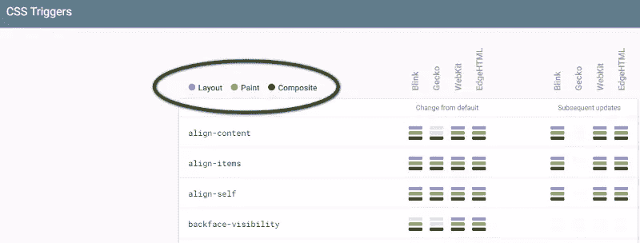
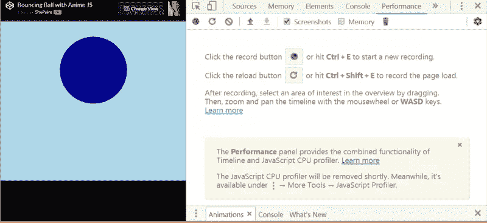
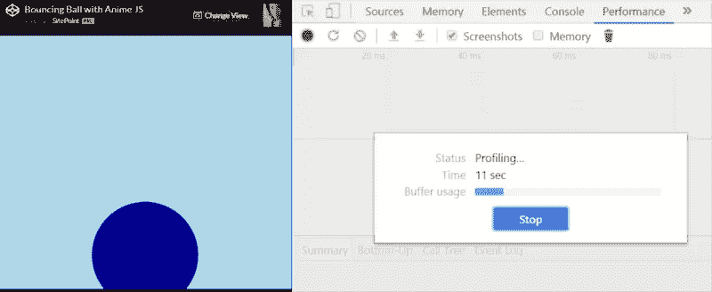
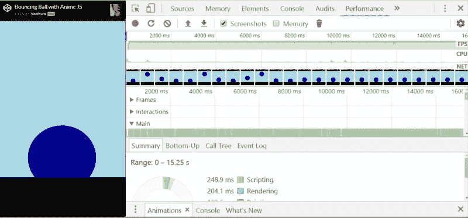

# 邱建免费 JavaScript 动画的 7 个性能技巧

> 原文：<https://www.sitepoint.com/7-performance-tips-jank-free-javascript-animations/>

web 动画的角色已经从仅仅是装饰性的绒毛演变为在用户体验的背景下服务于具体目的的——例如当用户与你的应用程序交互时提供视觉反馈，引导用户的注意力以实现你的应用程序的目标，提供视觉提示以帮助用户理解你的应用程序的界面，等等。

为了确保网页动画能够胜任如此重要的任务，重要的是动作要在正确的时间以流畅和平滑的方式发生，这样用户就会觉得它是在帮助他们，而不是妨碍他们在你的应用程序上试图执行的任何动作。

构思拙劣的动画的一个可怕效果是 **jank** ，jankfree.org[上是这样解释的:](http://jankfree.org/)

> 现代浏览器试图与设备的刷新率同步刷新屏幕内容。对于今天的大多数设备，屏幕将每秒刷新 60 次，即 60Hz。如果屏幕上有一些运动(如滚动、过渡或动画)，浏览器应该每秒创建 60 帧以匹配刷新率。邱建是当一个网站或应用程序跟不上刷新率时，用户看到的任何口吃、颤抖或干脆停顿。

如果动画很滑稽，用户最终会越来越少与你的应用程序互动，从而对它的成功产生负面影响。显然，没有人希望这样。

在本文中，我收集了一些性能技巧来帮助您解决 JavaScript 动画的问题，并使其更容易达到 60fps(每秒帧数)的目标，从而在 web 上实现流畅的运动。

## #1 避免动画昂贵的 CSS 属性

无论您计划使用 [CSS 过渡](https://developer.mozilla.org/en-US/docs/Web/CSS/CSS_Transitions/Using_CSS_transitions) / [CSS 关键帧](https://developer.mozilla.org/en-US/docs/Web/CSS/CSS_Animations/Using_CSS_animations)还是 JavaScript 来制作 CSS 属性的动画，了解哪些属性会改变页面的几何形状(布局)是很重要的——这意味着页面上其他元素的位置将不得不重新计算，或者将涉及绘画操作。对于浏览器来说，布局和绘制任务的处理成本都非常高，尤其是当页面上有多个元素时。因此，如果您避免对触发布局或绘画操作的 CSS 属性进行动画处理，而是坚持使用变换和不透明度等属性，您将会看到动画性能显著提高，因为现代浏览器在优化这些属性方面做得非常好。

在 [CSS 触发器](http://csstriggers.com/)上，你会发现一个 CSS 属性的最新列表，其中有关于它们在每个现代浏览器中触发的工作的信息，包括第一次更改和后续更改。



更改仅触发复合操作的 CSS 属性是优化 web 动画性能的一个简单而有效的步骤。

## #2 将您想要制作动画的元素提升到它们自己的层(小心)

如果你想要制作动画的元素在它自己的合成器层上，一些现代浏览器通过将工作卸载到 [GPU](https://en.wikipedia.org/wiki/Graphics_processing_unit) 来利用硬件加速。如果使用得当，这一步可以对动画的性能产生积极的影响。

要让元素在自己的层上，你需要**提升**它。一种方法是使用 [CSS will-change](https://developer.mozilla.org/en-US/docs/Web/CSS/will-change) 属性。该属性允许开发人员警告浏览器他们想要对元素进行的一些更改，以便浏览器可以提前进行所需的优化。

然而，不建议你在它们自己的层上提升太多的元素，或者夸张地这么做。事实上，浏览器创建的每一层都需要内存和管理，这可能很昂贵。

你可以在 Nick Salloum 的[CSS 改变属性](https://www.sitepoint.com/introduction-css-will-change-property/)介绍中了解如何使用`will-change`的细节，它的好处和坏处。

## #3 用 requestAnimationFrame 替换 setTimeOut/setInterval

JavaScript 动画通常使用 [setInterval()](https://developer.mozilla.org/en-US/docs/Web/API/WindowOrWorkerGlobalScope/setInterval) 或 [setTimeout()](https://developer.mozilla.org/en-US/docs/Web/API/WindowOrWorkerGlobalScope/setTimeout) 来编码。

代码看起来会像这样:

```
var timer;
function animateElement() {
  timer = setInterval( function() {
    // animation code goes here
  } , 2000 );
}

// To stop the animation, use clearInterval
function stopAnimation() {
  clearInterval(timer);
} 
```

虽然这样做可行，但是 jank 的风险很高，因为回调函数在帧中的某个点运行，可能是在最后，这可能导致一个或多个帧丢失。今天，你可以使用一个为流畅的网络动画(DOM 动画，canvas 等)定制的本地 JavaScript 方法。)，名为 [requestAnimationFrame()](https://developer.mozilla.org/en-US/docs/Web/API/Window/requestAnimationFrame) 。

在最适合浏览器的时间执行动画代码，通常是在帧的开始。

您的代码可能如下所示:

```
function makeChange( time ) {
  // Animation logic here

  // Call requestAnimationFrame recursively inside the callback function
  requestAnimationFrame( makeChange ):
}

// Call requestAnimationFrame again outside the callback function
requestAnimationFrame( makeChange ); 
```

由 Tim Evko 在 SitePoint 上制作的《requestAnimationFrame 的性能》提供了一个很好的视频介绍如何使用`requestAnimationFrame()`进行编码。

## #4 将事件与代码中的动画分离

在每秒 60 帧的速度下，浏览器有 16.67 毫秒的时间来处理每一帧。这并不是很多时间，所以保持代码简洁会对动画的流畅度产生影响。

解耦处理滚动、调整大小、鼠标事件等事件的代码。，从处理屏幕更新的代码中使用`requestAnimationFrame()`是优化动画代码性能的好方法。

关于这个优化技巧和相关示例代码的深入讨论，请查看 Paul Lewis 的 requestAnimationFrame 中的[更精简、更高效、更快速的动画。](https://www.html5rocks.com/en/tutorials/speed/animations/)

## #5 避免长时间运行的 JavaScript 代码

浏览器使用主线程运行 JavaScript，以及其他任务，如样式计算、布局和绘制操作。长时间运行的 JavaScript 代码可能会对这些任务产生负面影响，这可能会导致帧被跳过，从而导致动画失真。因此，简化代码肯定是确保动画流畅运行的好方法。

对于不需要访问 DOM 的复杂 JavaScript 操作，可以考虑使用 [Web Workers](https://developer.mozilla.org/en-US/docs/Web/API/Web_Workers_API/Using_web_workers) 。工作线程在不影响用户界面的情况下执行其任务。

## #6 利用浏览器的开发工具来控制性能问题

浏览器的开发工具提供了一种方式来监控浏览器运行 JavaScript 代码或第三方库代码的努力程度。它们还提供关于帧速率的有用信息等等。

您可以通过右键单击您的网页并在上下文菜单中选择 *Inspect* 来访问 Chrome DevTools。例如，使用性能工具记录您的网页将使您深入了解该页面上的性能瓶颈:



点击*记录*按钮，几秒钟后停止记录:



此时，您应该有大量的数据来帮助您分析页面的性能:



这份 [Chrome DevTools 指南](https://developers.google.com/web/tools/chrome-devtools/)将帮助你充分利用 DevTools 在你的 Chrome 浏览器中分析性能和许多其他类型的数据。如果 Chrome 不是你的首选浏览器，也没什么大不了的，因为现在大多数现代浏览器都配备了超级强大的开发工具，你可以利用它们来优化你的代码。

## #7 使用屏幕外的画布进行复杂的绘图操作

这个技巧特别与优化 [HTML5 画布](https://developer.mozilla.org/en-US/docs/Web/API/Canvas_API)的代码有关。

如果您的帧涉及复杂的绘制操作，一个好主意是创建一个离屏画布，您只需执行一次所有的绘制操作，或者只在发生变化时执行，然后在每个帧上只绘制离屏画布。

您可以在 MDN 上的[优化画布](https://developer.mozilla.org/en-US/docs/Web/API/Canvas_API/Tutorial/Optimizing_canvas)文章中找到与此技巧相关的细节和代码示例以及更多内容。

## 结论

如果你不想在今天的网络上辜负用户的期望，为性能优化代码是一项必要的任务，但这绝不总是容易或简单的。你的动画表现不佳可能有几个原因，但是如果你尝试了我上面列出的技巧，你将在避免最常见的动画性能陷阱方面走得很远，从而改善你的网站或应用程序的用户体验。

## 分享这篇文章