# 用现代 JavaScript 和 D3 实现交互式数据可视化

> 原文：<https://www.sitepoint.com/interactive-data-visualization-javascript-d3/>

在这篇文章中，我想带你看一个我最近构建的示例项目——一个使用 D3 库的完全原创的类型的可视化，它展示了这些组件如何使 D3 成为一个值得学习的伟大库。

D3 代表数据驱动文档。这是一个 JavaScript 库，可以用来制作各种奇妙的数据可视化和图表。

如果你曾经看过《纽约时报》上的任何一个[精彩的互动故事](https://www.nytimes.com/interactive/2017/12/21/us/2017-year-in-graphics.html)，你就已经看过 D3 的实际操作了。你也可以在这里看到一些用 D3 [构建的伟大项目的很酷的例子。](https://github.com/d3/d3/wiki/Gallery)

对于开始使用这个库来说，学习曲线是相当陡峭的，因为 D3 有一些你以前可能没有见过的特殊癖好。然而，如果你能通过第一阶段学习足够的 D3 来变得危险，那么你很快就能为自己创造一些真正酷的东西。

有三个主要因素让 D3 从其他库中脱颖而出:

1.  **灵活性**。D3 允许您获取任何类型的数据，并直接将其与浏览器窗口中的形状相关联。这些数据可以是*绝对任何东西*，允许大量有趣的用例创建完全原创的可视化。
2.  **优雅**。在两次更新之间用*平滑过渡*添加交互元素很容易。这个库*写得很漂亮*，一旦你掌握了语法，保持你的代码整洁就很容易了。
3.  **社区**。已经有一个庞大的生态系统，由优秀的开发者使用 D3，他们乐意在线分享他们的代码。你可以使用像 bl.ocks.org 的[和 blockbuilder.org 的](http://bl.ocks.org)[这样的网站快速找到他人预先写好的代码，并将这些代码片段直接复制到你自己的项目中。](http://blockbuilder.org)

## 该项目

作为一名大学经济学专业的学生，我一直对收入不平等感兴趣。我上了几堂关于这个主题的课，这让我觉得有些东西还没有被完全理解到应有的程度。

我开始用谷歌的公共数据浏览器探索收入不平等

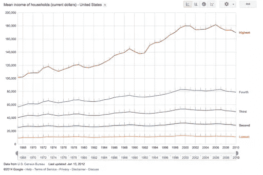

当你对通货膨胀进行调整时，对于社会底层 40%的人来说，家庭收入几乎保持不变，尽管人均生产率一直在飙升。只有*前 20%* 的人获得了更多的好处(在这个范围内，如果你看一下前 5%的人，这种差别甚至更令人震惊)。

这里有一个我想以令人信服的方式传达的信息，这提供了一个使用一些 D3.js 的完美机会，所以我开始草拟一些想法。

## 草图

因为我们在和 D3 一起工作，我可以或多或少地开始画出我能想到的任何东西。制作一个简单的折线图、条形图或气泡图应该很容易，但是我想做一些不同的东西。

我发现，人们倾向于用最常见的类比来反驳对不平等的担忧，那就是“如果[馅饼变大了](https://en.wikipedia.org/wiki/Grow_the_Pie_%28phrase%29)，那么还会有更多的东西分给大家”。直觉是，如果国内生产总值的总份额大幅度增长，那么即使一些人得到了*更薄的一块*馅饼，他们仍然会过得*更好*。然而，正如我们所看到的，馅饼完全有可能变得更大*而人们总体上得到的却更少*。

我将这些数据可视化的第一个想法是这样的:

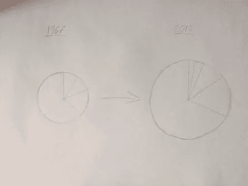

这个想法是，我们会有这个脉动饼图，每个切片代表美国收入分配的五分之一。每个饼图切片的面积将与该部分人口的收入有关，图表的总面积将代表其总 GDP。

然而，我很快就遇到了一点问题。事实证明，人类的大脑在区分不同区域的大小方面非常差。当我更具体地描绘出这一点时，信息远没有它应该有的那样明显:

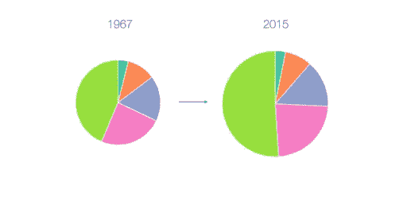

在这里，随着时间的推移，最贫穷的美国人似乎变得越来越富有，这证实了直觉上的真理。我对这个问题想了更多，我的解决方案包括保持每个圆弧的角度不变，而每个圆弧的半径动态变化。

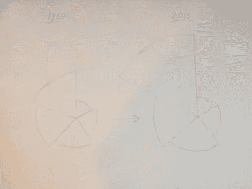

下面是它在实践中的结局:

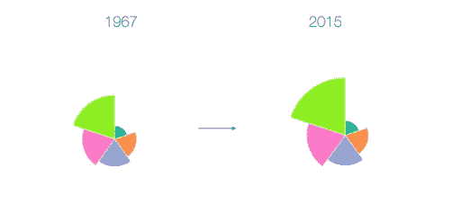

我想指出的是，这个图像仍然倾向于低估这里的效果。如果我们使用简单的条形图，效果会更明显:

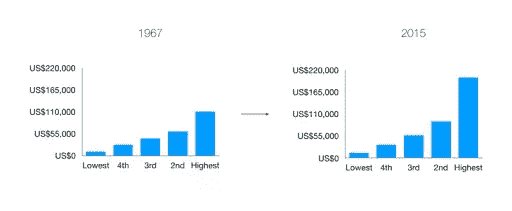

然而，我致力于制作一个独特的可视化，我想反复强调这个信息，即*派*可以让*变大*，而*的一部分*可以让*变小*。现在我有了自己的想法，是时候用 D3 来构建它了。

## 借用代码

所以，现在我知道我要构建什么，是时候进入这个项目的真正内容了，开始*写一些代码*。

你可能认为我会从头开始写前几行代码，但是你错了。这是 D3，因为我们正在使用 D3，我们总是可以从社区中找到一些预先编写的代码来开始我们的工作。

我们正在创造一些全新的东西，但它与常规的饼状图有很多共同点，所以我快速浏览了一下[bl.ocks.org](http://bl.ocks.org)，我决定使用 D3 的创造者之一迈克·博斯托克的这个[经典实现](https://bl.ocks.org/mbostock/1346410)。这个文件可能已经被复制了数千次，编写它的人是一个真正的 JavaScript 奇才，所以我们可以肯定我们已经从一个很好的代码块开始了。

这个文件是用 D3 V3 写的，现在已经过时两个版本了，因为上个月终于发布了版本 5。D3 V4 中一个很大的变化是库切换到使用平面名称空间，因此像`d3.scale.ordinal()`这样的 scale 函数被写成像`d3.scaleOrdinal()`一样。在版本 5 中，最大的变化是数据加载函数现在被结构化为[承诺的](https://developer.mozilla.org/en-US/docs/Web/JavaScript/Reference/Global_Objects/Promise)，这使得一次处理多个数据集变得更加容易。

为了避免混淆，我已经创建了这段代码的更新版本 V5，并保存在了[blockbuilder.org](http://blockbuilder.org/adamjanes/5e53cfa2ef3d3f05828020315a3ba18c)上。我还转换了语法以适应 ES6 惯例，比如将 ES5 匿名函数转换成箭头函数。

以下是我们已经开始的内容:

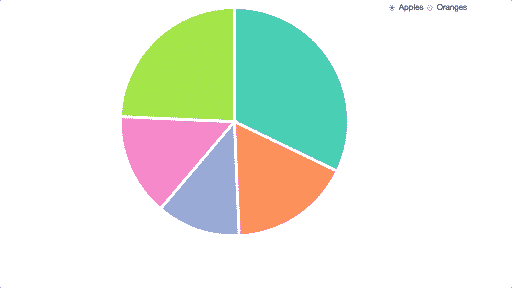

然后，我将这些文件复制到我的工作目录中，并确保我可以在自己的机器上复制所有内容。如果你想自己跟随这个教程，那么你可以从我们的 GitHub repo 中克隆这个项目。可以从文件`starter.html`中的代码开始。请注意，您将需要一个服务器(如[这个](https://www.npmjs.com/package/http-server))来运行这段代码，因为它依赖于[获取 API](https://www.sitepoint.com/introduction-to-the-fetch-api/) 来检索数据。

让我简单介绍一下这段代码是如何工作的。

## 浏览我们的代码

首先，我们在文件的顶部声明几个常量，我们将使用它们来定义饼图的大小:

```
const width = 540;
const height = 540;
const radius = Math.min(width, height) / 2; 
```

这使得我们的代码非常可重用，因为如果我们想让它变大或变小，那么我们只需要担心在这里改变这些值。

接下来，我们将一个 SVG 画布附加到屏幕上。如果你不太了解 SVG，那么你可以把画布想象成页面上的空间，我们可以在上面画形状。如果我们试图在这个区域之外绘制一个 SVG，它就不会显示在屏幕上:

```
const svg = d3.select("#chart-area")
  .append("svg")
    .attr("width", width)
    .attr("height", height)
  .append("g")
    .attr("transform", `translate(${width / 2}, ${height / 2})`); 
```

我们通过调用`d3.select()`来获取一个 ID 为`chart-area`的空 div。我们还用`d3.append()`方法附加了一个 SVG 画布，并用`d3.attr()`方法设置了它的宽度和高度。

我们还将一个 SVG 组元素附加到这个画布上，这是一种特殊类型的元素，我们可以用它来将元素组织在一起。这允许我们使用 group 元素的`transform`属性将整个可视化效果转移到屏幕的中央。

之后，我们将设置一个默认比例，用于为饼图的每一部分分配一种新颜色:

```
const color = d3.scaleOrdinal(["#66c2a5", "#fc8d62", "#8da0cb","#e78ac3", "#a6d854", "#ffd92f"]); 
```

接下来，我们有几行代码来设置 D3 的饼图布局:

```
const pie = d3.pie()
  .value(d => d.count)
  .sort(null); 
```

在 D3 中，**布局**是我们可以在一组数据上调用的特殊函数。一个布局函数接收一个特定格式的数据数组，并使用一些自动生成的值发出一个经过*转换的数组*，然后我们可以对其进行处理。

然后我们需要定义一个[路径生成器](https://github.com/d3/d3-shape)，我们可以用它来画出我们的弧线。路径生成器允许我们在 web 浏览器中绘制路径 SVG。D3 真正做的只是将数据片段与屏幕上的形状关联起来，但是在这种情况下，我们想要定义一个更复杂的形状，而不仅仅是一个简单的圆形或正方形。路径 SVG 的工作原理是定义一条线的路线，我们可以用它的`d`属性来定义。

这可能是这样的:

```
<svg width="190" height="160">
  <path d="M10 80 C 40 10, 65 10, 95 80 S 150 150, 180 80" stroke="black" fill="transparent"/>
</svg> 
```

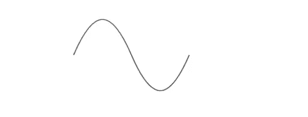

属性包含一个特殊的编码，让浏览器画出我们想要的路径。如果你真的想知道这个字符串是什么意思，你可以在 [MDN 的 SVG 文档](https://developer.mozilla.org/en-US/docs/Web/SVG/Tutorial/Paths)中找到。对于 D3 编程，我们不需要知道任何关于这种特殊编码的东西，因为我们有生成器，它会为我们提供我们的`d`属性，我们只需要用一些简单的参数进行初始化。

对于一个圆弧，我们需要给我们的路径生成器一个`innerRadius`和一个`outerRadius`像素值，生成器会整理出计算每个角度的复杂数学:

```
const arc = d3.arc()
  .innerRadius(0)
  .outerRadius(radius); 
```

对于我们的图表，我们使用零值作为我们的`innerRadius`，这给了我们一个标准的饼图。然而，如果我们想画一个**甜甜圈图**，那么我们需要做的就是插入一个比我们的`outerRadius`值小的值。

在几个函数声明之后，我们用`d3.json()`函数加载数据:

```
d3.json("data.json", type).then(data => {
  // Do something with our data
}); 
```

在 D3 version 5.x 中，对`d3.json()`的调用返回一个[承诺](https://developer.mozilla.org/en-US/docs/Web/JavaScript/Reference/Global_Objects/Promise)，这意味着 D3 将获取它在我们给它的相对路径中找到的 JSON 文件的内容，并在它被加载后执行我们在`then()`方法中调用的函数。然后我们可以访问回调函数的`data`参数中的对象。

我们还在这里传入了一个函数引用— `type` —它将把我们加载的所有值转换成数字，我们稍后可以使用这些数字:

```
function type(d) {
  d.apples = Number(d.apples);
  d.oranges = Number(d.oranges);
  return d;
} 
```

如果我们在我们的`d3.json`回调的顶部添加一个`console.log(data);`语句，我们可以看看我们现在正在处理的数据:

```
{apples: Array(5), oranges: Array(5)}
  apples: Array(5)
    0: {region: "North", count: "53245"}
    1: {region: "South", count: "28479"}
    2: {region: "East", count: "19697"}
    3: {region: "West", count: "24037"}
    4: {region: "Central", count: "40245"}
  oranges: Array(5)
    0: {region: "North", count: "200"}
    1: {region: "South", count: "200"}
    2: {region: "East", count: "200"}
    3: {region: "West", count: "200"}
    4: {region: "Central", count: "200"} 
```

我们的数据在这里被分成两个不同的数组，分别代表苹果**和桔子**的数据。****

在这一行中，每当我们的一个单选按钮被单击时，我们将切换我们正在查看的数据:

```
d3.selectAll("input")
  .on("change", update); 
```

我们还需要在第一次运行可视化时调用`update()`函数，传递一个初始值(用我们的“apples”数组)。

```
update("apples"); 
```

让我们看看我们的`update()`函数在做什么。如果你是 D3 的新手，这可能会引起一些混乱，因为这是 D3 最难理解的部分之一…

```
function update(value = this.value) {
  // Join new data
  const path = svg.selectAll("path")
    .data(pie(data[value]));

  // Update existing arcs
  path.transition().duration(200).attrTween("d", arcTween);

  // Enter new arcs
  path.enter().append("path")
    .attr("fill", (d, i) => color(i))
    .attr("d", arc)
    .attr("stroke", "white")
    .attr("stroke-width", "6px")
    .each(function(d) { this._current = d; });
} 
```

首先，我们为`value`使用一个默认的函数参数。如果我们向我们的`update()`函数传递一个参数(当我们第一次运行它时)，我们将使用那个字符串，否则我们将从我们的无线电输入的`click`事件中获得我们想要的值。

然后我们使用 D3 的 *[通用更新模式](http://quintonlouisaiken.com/d3-general-update-pattern/)* 来处理我们的弧线行为。这通常包括执行数据连接、退出旧元素、更新屏幕上的现有元素，以及添加已经添加到数据中的新元素。在这个例子中，我们不需要担心退出元素，因为我们在屏幕上总是有相同数量的饼图切片。

首先，是我们的数据连接:

```
// JOIN
const path = svg.selectAll("path")
  .data(pie(data[val])); 
```

每次我们的可视化更新时，都会将一组新的数据与屏幕上的 SVG 相关联。我们将数据(或者是“苹果”或者是“橙子”的数组)传递到我们的`pie()`布局函数中，该函数计算一些开始和结束的角度，这些角度可以用来绘制我们的弧线。这个`path`变量现在包含了屏幕上所有弧线的一个特殊的*虚拟选择*。

接下来，我们将更新屏幕上仍然存在于我们的数据数组中的所有 SVG。我们在这里添加了一个[转换](https://github.com/d3/d3-transition)——D3 库的一个奇妙特性——将这些更新分散在 200 毫秒内:

```
// UPDATE
path.transition().duration(200)
  .attrTween("d", arcTween); 
```

我们在`d3.transition()`调用中使用`attrTween()`方法来定义一个定制的过渡，D3 应该使用它来更新它的每个弧的位置(用`d`属性进行过渡)。如果我们试图给我们的大多数属性添加一个过渡，我们不需要这样做，但是对于不同路径之间的过渡，我们需要这样做。D3 真的不知道如何在自定义路径之间转换，所以我们使用`arcTween()`函数让 D3 知道我们的每条路径在每一时刻应该如何绘制。

这个函数是这样的:

```
function arcTween(a) {
  const i = d3.interpolate(this._current, a);
  this._current = i(1);
  return t => arc(i(t));
} 
```

我们在这里使用`d3.interpolate()`来创建所谓的**插值器**。当我们调用存储在变量`i`中的值介于 0 和 1 之间的函数时，我们将得到一个介于`this._current`和`a`之间的值。在这种情况下，`this._current`是一个包含我们正在查看的饼图扇区的开始和结束角度的对象，而`a`表示我们正在更新的新数据点。

一旦我们设置了插值器，我们就更新`this._current`值以包含我们将在结束时得到的值(`i(a)`)，然后我们返回一个函数，该函数将基于这个`t`值计算我们的弧应该包含的路径。我们的转换将在其时钟的每一点运行这个函数(传入一个介于 0 和 1 之间的参数)，这个代码将意味着我们的转换将知道在任何时间点我们的弧线应该画在哪里。

最后，我们的`update()`函数需要添加之前的数据数组中没有的新元素:

```
// ENTER
path.enter().append("path")
  .attr("fill", (d, i) => color(i))
  .attr("d", arc)
  .attr("stroke", "white")
  .attr("stroke-width", "6px")
  .each(function(d) { this._current = d; }); 
```

第一次运行这个更新函数时，这个代码块将设置每个弧的初始位置。这里的`enter()`方法为我们提供了数据中需要添加到屏幕上的所有元素，然后我们可以使用`attr()`方法循环遍历这些元素中的每一个，以设置每个弧线的填充和位置。我们也给每个弧线加了一个白色的边框，这让我们的图表看起来更整洁。最后，我们将每个弧的`this._current`属性设置为数据中项的初始值，我们将在`arcTween()`函数中使用它。

如果您不能完全理解这是如何工作的，也不要担心，因为这是 D3 的一个相当高级的主题。这个库的伟大之处在于，你不需要知道它所有的内部工作原理就可以用它来创建一些强大的东西。只要你能理解你需要改变的部分，那么抽象出一些不完全必要的细节就可以了。

这让我们进入了流程的下一步…

## 改编代码

现在，我们在本地环境中有了一些代码，并且我们了解它在做什么，我将切换出我们正在查看的数据，以便它可以处理我们感兴趣的数据。

我已经将我们将要使用的数据包含在我们项目的`data/`文件夹中。由于这个新的`incomes.csv`文件这次是 CSV 格式的(这种文件可以用 Microsoft Excel 打开)，我将使用`d3.csv()`函数，而不是`d3.json()`函数:

```
d3.csv("data/incomes.csv").then(data => {
  ...
}); 
```

这个函数做的事情基本上和`d3.json()`一样——将我们的数据转换成我们可以使用的格式。我还删除了作为第二个参数的`type()`初始化函数，因为它是特定于我们的旧数据的。

如果您在`d3.csv`回调的顶部添加一个`console.log(data)`语句，您将能够看到我们正在处理的数据的形状:

```
(50) [{…}, {…}, {…}, {…}, {…}, {…}, {…} ... columns: Array(9)]
  0:
    1: "12457"
    2: "32631"
    3: "56832"
    4: "92031"
    5: "202366"
    average: "79263"
    top: "350870"
    total: "396317"
    year: "2015"
  1: {1: "11690", 2: "31123", 3: "54104", 4: "87935", 5: "194277", year: "2014", top: "332729", average: "75826", total: "379129"}
  2: {1: "11797", 2: "31353", 3: "54683", 4: "87989", 5: "196742", year: "2013", top: "340329", average: "76513", total: "382564"}
  ... 
```

我们有一个 50 个条目的数组，每个条目代表数据中的一年。对于每一年，我们都有一个对象，包含五个收入组中每一组的数据，以及一些其他字段。我们可以在这里为这些年中的某一年创建一个饼图，但首先我们需要稍微调整一下我们的数据，以便它是正确的格式。当我们想用 D3 写一个数据连接时，我们需要传入一个数组，数组中的每一项都被绑定到一个 SVG。

回想一下，在我们的上一个例子中，我们有一个数组，其中包含我们希望在屏幕上显示的每个饼图扇区的一个项目。与我们现在拥有的相比，它是一个对象，键 1 到 5 代表我们想要绘制的每个饼图切片。

为了解决这个问题，我将添加一个名为`prepareData()`的新函数来替换我们之前的`type()`函数，它将在加载数据时迭代每一项:

```
function prepareData(d){
  return {
    name: d.year,
    average: parseInt(d.average),
    values: [
      {
        name: "first",
        value: parseInt(d["1"])
      },
      {
        name: "second",
        value: parseInt(d["2"])
      },
      {
        name: "third",
        value: parseInt(d["3"])
      },
      {
        name: "fourth",
        value: parseInt(d["4"])
      },
      {
        name: "fifth",
        value: parseInt(d["5"])
      }
    ]
  }
}

d3.csv("data/incomes.csv", prepareData).then(data => {
    ...
}); 
```

每年，这个函数将返回一个带有`values`数组的对象，我们将把它传递到我们的数据连接中。我们用一个`name`字段来标记这些值中的每一个，并根据我们已经得到的收入值给它们一个数值。我们还记录了每年的平均收入以便比较。

此时，我们有了可以使用的数据格式:

```
(50) [{…}, {…}, {…}, {…}, {…}, {…}, {…} ... columns: Array(9)]
  0:
  average: 79263
  name: "2015"
  values: Array(5)
    0: {name: "first", value: 12457}
    1: {name: "second", value: 32631}
    2: {name: "third", value: 56832}
    3: {name: "fourth", value: 92031}
    4: {name: "fifth", value: 202366}
  1: {name: "2014", average: 75826, values: Array(5)}
  2: {name: "2013", average: 76513, values: Array(5)}
  ... 
```

我将首先为我们的数据中的第一年生成一个图表，然后我将考虑为剩下的几年更新它。

目前，我们的数据从 2015 年开始，到 1967 年结束，因此在做任何其他事情之前，我们需要反转这个数组:

```
d3.csv("data/incomes.csv", prepareData).then(data => {
  data = data.reverse();
  ...
}); 
```

与普通的饼图不同，对于我们的图表，我们希望固定每个弧的角度，并在可视化更新时改变半径。为此，我们将更改饼图布局上的`value()`方法，以便每个饼图切片总是获得相同的角度:

```
const pie = d3.pie()
  .value(1)
  .sort(null); 
```

接下来，我们需要在每次可视化更新时更新我们的半径。为此，我们需要想出一个我们可以使用的[标度](https://github.com/d3/d3-scale)。**标度**是 D3 的一个函数，它接受两个值之间的*输入*，我们将其作为**域**传入，然后在两个不同的值之间输出*输出*，我们将其作为**范围**传入。这是我们将使用的尺度:

```
d3.csv("data/incomes.csv", prepareData).then(data => {
  data = data.reverse();
  const radiusScale = d3.scaleSqrt()
    .domain([0, data[49].values[4].value])
    .range([0, Math.min(width, height) / 2]);
  ...
}); 
```

一旦我们可以访问我们的数据，我们就添加这个尺度，我们说我们的输入应该在 0 和我们数据集中的最大值之间，即我们数据中最富有的群体去年的收入(`data[49].values[4].value`)。对于域，我们设置输出值的区间。

这意味着零输入应该为我们提供零像素值，数据中最大值的输入应该为我们提供宽度或高度值的一半，以较小者为准。

注意，我们在这里也使用了*平方根标度*。我们这样做的原因是，我们希望我们的饼图切片面积与我们每个组的收入成比例，而不是与半径成比例。由于面积= πr <sup>2</sup> ，我们需要使用平方根标度来说明这一点。

然后，我们可以使用这个比例来更新我们的`update()`函数中电弧发生器的`outerRadius`值:

```
function update(value = this.value) {
  arc.outerRadius(d => radiusScale(d.data.value));
  ...
}); 
```

每当我们的数据改变，这将编辑半径值，我们要使用的每一个弧。

我们还应该在最初设置 arc 生成器时删除对`outerRadius`的调用，这样我们就可以将它放在文件的顶部:

```
const arc = d3.arc()
  .innerRadius(0); 
```

最后，我们需要对这个`update()`函数进行一些编辑，以便一切都与我们的新数据相匹配:

```
function update(data) {
  arc.outerRadius(d => radiusScale(d.data.value));

  // JOIN
  const path = svg.selectAll("path")
    .data(pie(data.values));

  // UPDATE
  path.transition().duration(200).attrTween("d", arcTween);

  // ENTER
  path.enter().append("path")
    .attr("fill", (d, i) => color(i))
    .attr("d", arc)
    .attr("stroke", "white")
    .attr("stroke-width", "2px")
    .each(function(d) { this._current = d; });
} 
```

因为我们不再使用单选按钮，所以我只是通过调用以下命令来传递我们想要使用的 year 对象:

```
// Render the first year in our data
update(data[0]); 
```

最后，我将删除为表单输入设置的事件侦听器。如果一切按计划进行，我们应该有一个第一年数据的漂亮图表:

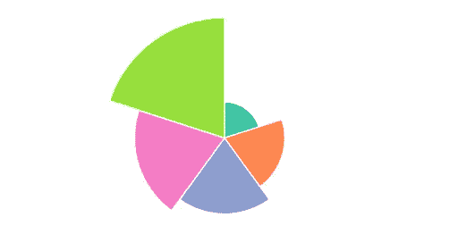

## 让它充满活力

下一步是让我们的可视化周期在不同的年份之间变化，显示收入如何随着时间的推移而变化。我们将通过添加对 JavaScript 的`setInterval()`函数的调用来做到这一点，我们可以用它来重复执行一些代码:

```
d3.csv("data/incomes.csv", prepareData).then(data => {
  ...

  function update(data) {
    ...
  }

  let time = 0;
  let interval = setInterval(step, 200);

  function step() {
    update(data[time]);
    time = (time == 49) ? 0 : time + 1;
  }

  update(data[0]);
}); 
```

我们在这个`time`变量中设置了一个计时器，每隔 200 毫秒，这段代码将运行`step()`函数，将我们的图表更新为下一年的数据，并将计时器递增 1。如果计时器的值为 49(我们数据中的最后一年)，它会自动重置。这给了我们一个可以连续运行的好循环:

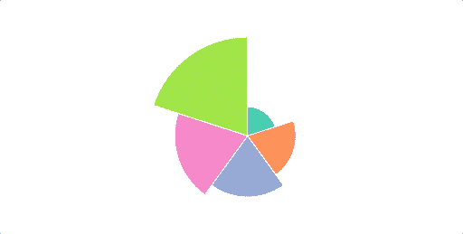

让事情变得更有用。我还会添加一些标签，为我们提供原始数据。我将用以下代码替换文件主体中的所有 HTML 代码:

```
<h2>Year: <span id="year"></span></h2>

<div class="container" id="page-main">
  <div class="row">
    <div class="col-md-7">
      <div id="chart-area"></div>
    </div>

    <div class="col-md-5">
      <table class="table">
        <tbody>
          <tr>
            <th></th>
            <th>Income Bracket</th>
            <th>Household Income (2015 dollars)</th>
          </tr>
          <tr>
            <td id="leg5"></td>
            <td>Highest 20%</td>
            <td class="money-cell"><span id="fig5"></span></td>
          </tr>
          <tr>
            <td id="leg4"></td>
            <td>Second-Highest 20%</td>
            <td class="money-cell"><span id="fig4"></span></td>
          </tr>
          <tr>
            <td id="leg3"></td>
            <td>Middle 20%</td>
            <td class="money-cell"><span id="fig3"></span></td>
          </tr>
          <tr>
            <td id="leg2"></td>
            <td>Second-Lowest 20%</td>
            <td class="money-cell"><span id="fig2"></span></td>
          </tr>
          <tr>
            <td id="leg1"></td>
            <td>Lowest 20%</td>
            <td class="money-cell"><span id="fig1"></span></td>
          </tr>
        </tbody>
        <tfoot>
          <tr>
            <td id="avLeg"></td>
            <th>Average</th>
            <th class="money-cell"><span id="avFig"></span></th>
          </tr>
        </tfoot>
      </table>
    </div>
  </div>
</div> 
```

我们在这里使用 [Bootstrap 的网格系统](https://getbootstrap.com/docs/3.3/css/#grid)来构建我们的页面，这让我们可以将页面元素整齐地格式化成框。

每当我们的数据发生变化时，我将使用 [jQuery](http://api.jquery.com/) 更新所有这些:

```
function updateHTML(data) {
  // Update title
  $("#year").text(data.name);

  // Update table values
  $("#fig1").html(data.values[0].value.toLocaleString());
  $("#fig2").html(data.values[1].value.toLocaleString());
  $("#fig3").html(data.values[2].value.toLocaleString());
  $("#fig4").html(data.values[3].value.toLocaleString());
  $("#fig5").html(data.values[4].value.toLocaleString());
  $("#avFig").html(data.average.toLocaleString());
}

d3.csv("data/incomes.csv", prepareData).then(data => {
  ...
  function update(data) {
    updateHTML(data);
    ...
  }
  ...
} 
```

我还将对文件顶部的 CSS 进行一些编辑，这将为我们的每个弧提供一个图例，并使我们的标题居中:

```
<style> #chart-area svg {
    margin:auto;
    display:inherit;
  }

  .money-cell { text-align: right; }
  h2 { text-align: center; }

  #leg1 { background-color: #66c2a5; }
  #leg2 { background-color: #fc8d62; }
  #leg3 { background-color: #8da0cb; }
  #leg4 { background-color: #e78ac3; }
  #leg5 { background-color: #a6d854; }
  #avLeg { background-color: grey; }

  @media screen and (min-width: 768px) {
    table { margin-top: 100px; }
  } </style> 
```

我们最终得到的是相当像样的东西:

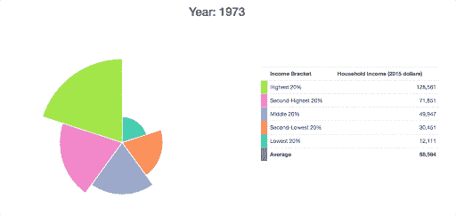

由于很难看出这些弧线是如何随着时间的推移而变化的，我想添加一些网格线来显示数据第一年的收入分布情况:

```
d3.csv("data/incomes.csv", prepareData).then(data => {
  ...
  update(data[0]);

  data[0].values.forEach((d, i) => {
    svg.append("circle")
      .attr("fill", "none")
      .attr("cx", 0)
      .attr("cy", 0)
      .attr("r", radiusScale(d.value))
      .attr("stroke", color(i))
      .attr("stroke-dasharray", "4,4");
  });
}); 
```

我使用`Array.forEach()`方法来完成这个，尽管我也可以使用 D3 常用的*通用更新模式*(加入/退出/更新/进入)。

我还想添加一行来显示美国的平均收入，我将每年更新。首先，我第一次添加平均线:

```
d3.csv("data/incomes.csv", prepareData).then(data => {
  ...

  data[0].values.forEach((d, i) => {
    svg.append("circle")
      .attr("fill", "none")
      .attr("cx", 0)
      .attr("cy", 0)
      .attr("r", radiusScale(d.value))
      .attr("stroke", color(i))
      .attr("stroke-dasharray", "4,4");
  });   

  svg.append("circle")
    .attr("class", "averageLine")
    .attr("fill", "none")
    .attr("cx", 0)
    .attr("cy", 0)
    .attr("stroke", "grey")
    .attr("stroke-width", "2px");
}); 
```

然后我会在我们的`update()`函数结束时，每当年份发生变化时更新它:

```
function update(data) {
  ...
  svg.select(".averageLine").transition().duration(200)
    .attr("r", radiusScale(data.average));
} 
```

我应该注意到，在我们第一次调用`update()`的之后添加这些圆*对我们来说很重要，因为否则它们最终会被呈现在我们每个弧形路径*之后*(SVG 层是由它们被添加到屏幕的顺序决定的，而不是由它们的 z 索引决定的)。*

在这一点上，我们有一些东西可以更清楚地传达我们正在处理的数据:

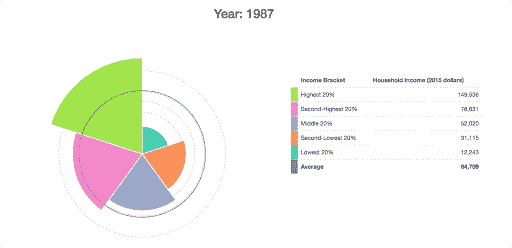

## 让它互动

作为最后一步，我希望我们添加一些控件，让用户深入了解特定的年份。我想添加一个*播放/暂停*按钮，以及一个年份滑块，允许用户选择一个特定的日期来查看。

下面是我将用来在屏幕上添加这些元素的 HTML:

```
<div class="container" id="page-main">
  <div id="controls" class="row">
    <div class="col-md-12">
      <button id="play-button" class="btn btn-primary">Play</button>
      <div id="slider-div">
        <label>Year: <span id="year-label"></span></label>
        <div id="date-slider"></div>
      </div>
    </div>
  </div>
  ...
</div> 
```

我们需要向这两个元素添加一些事件侦听器，以设计我们正在寻找的行为。

首先，我想定义我们的*播放/暂停*按钮的行为。我们需要替换之前为间隔编写的代码，以允许我们用按钮停止和启动计时器。我假设可视化开始于“暂停”状态，我们需要按下这个按钮来开始。

```
function update(data) {
  ...

  let time = 0;
  let interval;

  function step() {
    update(data[time]);
    time = (time == 49) ? 0 : time + 1;
  }

  $("#play-button").on("click", function() {
    const button = $(this);
    if (button.text() === "Play"){
      button.text("Pause");
      interval = setInterval(step, 200);
    } else {
      button.text("Play");
      clearInterval(interval);
    }
  });
  ...
} 
```

每当我们的按钮被点击时，这里的`if/else`块将定义不同的行为，这取决于我们的按钮是“播放”按钮还是“暂停”按钮。如果我们点击的按钮显示“播放”，我们将把按钮改为“暂停”按钮，并开始我们的间歇循环。或者，如果按钮是一个“暂停”按钮，我们将把它的文本改为“播放”，并且我们将使用`clearInterval()`函数来停止循环运行。

对于我们的滑块，我想使用带有 jQuery UI 库的滑块。我将它包含在我们的 HTML 中，我将写几行代码将它添加到屏幕上:

```
function update(data) {
  ...
  $("#date-slider").slider({
    max: 49,
    min: 0,
    step: 1,
    slide: (event, ui) => {
      time = ui.value;
      update(data[time]);
    }
  });

  update(data[0]);
  ...
} 
```

这里，我们使用`slide`选项将一个事件监听器附加到滑块上。每当我们的滑块移动到另一个值时，我们就将计时器更新到这个新值，并且在我们的数据中运行那一年的`update()`函数。

我们可以在我们的`update()`函数的末尾添加这一行，这样当我们的循环运行时，我们的滑块就会移动到正确的年份:

```
function update(data) {
  ...

  // Update slider position
  $("#date-slider").slider("value", time);
} 
```

我还将在我们的`updateHTML()`函数中添加一行代码(每当我们的可视化发生变化时运行)，它可以根据数据中的当前年份调整标签的值:

```
function updateHTML(data) {
  // Update title
  $("#year").text(data.name);

  // Update slider label
  $("#year-label").text(data.name);

  // Update table values
  $("#fig1").html(data.values[0].value.toLocaleString());
  ...
} 
```

我将在我们的 CSS 中添加几行代码，让一切看起来更整洁一些:

```
<style> ...
  @media screen and (min-width: 768px) {
    table { margin-top: 100px; }
  }

  #page-main { margin-top: 10px; }
  #controls { margin-bottom: 20px; }

  #play-button {
    margin-top: 10px;
    width: 100px;
  }

  #slider-div {
    width:300px;
    float:right;
  } </style> 
```

这就是我们的最终产品——一个全功能的交互式数据可视化，一切都按预期运行。

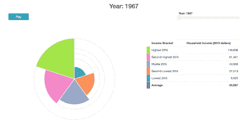

希望这篇教程展示了 D3 的真正威力，让你创造出你能想象的任何东西。

从零开始使用 D3 总是一个艰难的过程，但回报是值得的。如果您想学习如何创建自己的自定义可视化效果，这里有一些可能对您有所帮助的在线资源:

*   [SitePoint 的 D3.js 内容](https://www.sitepoint.com/premium/books/learn-d3-js/read/1)概述。
*   D3 主页上库的[介绍。这贯穿了一些最基本的命令，向您展示了如何在 D3 中迈出最初的几步。](https://d3js.org/#introduction)
*   D3 的创造者 Mike Bostock 的“让我们制作一个条形图”向初学者展示了如何制作库中最简单的图表之一。
*   伊利亚·米克斯(Elijah Meeks)(35 美元)的 D3.js in Action，这是一本深入许多细节的扎实的入门教材。
*   [D3 的 Slack 频道](https://d3js.slack.com/)非常欢迎 D3 的新人。它还有一个“学习材料”部分，里面收集了大量的资源。
*   这个在线 Udemy 课程(20 美元)，在一系列视频讲座中涵盖了图书馆的所有内容。这是针对 JavaScript 开发人员的，包括四个很酷的项目。
*   bl.ocks.org 大学和 blockbuilder.org 大学提供的大量可视化实例。
*   [D3 API 引用](https://github.com/d3/d3/blob/master/API.md)，它对 D3 必须提供的一切给出了全面的技术解释。

别忘了，如果你想看我在文章中使用的代码的完成版本，那么你可以在我们的 GitHub repo 上找到它。

## 分享这篇文章