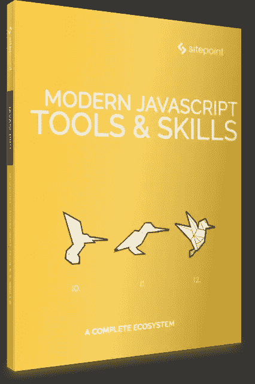

# 现代 JavaScript 工具和技能——2018 年 6 月发布

> 原文：<https://www.sitepoint.com/modern-javascript-tools-skills-released-june-2018/>

## 

## 关于这本书

毫无疑问，JavaScript 生态系统变化很快。随着 ES2015(又名 ES6)的推出，不仅新工具和框架被快速引入和开发，语言本身也经历了巨大的变化。可以理解的是，现在已经有很多文章抱怨学习现代 JavaScript 开发有多么困难。我们的目标是通过这套现代 JavaScript 书籍将这种混淆最小化。

## 你会学到什么

这本书概述了每个现代开发人员都应该知道的基本 Javascript 工具和技能。它包含:

*   詹姆斯·科尔斯的巴别塔初学者指南
*   马克·布朗的《Webpack 4 和模块捆绑初学者指南》
*   克雷格·巴克勒的《Gulp.js 简介》
*   编译成 JavaScript 的 10 种语言
*   迈克尔·万约克的《JavaScript 开发者必备的 10 个 VS 代码扩展》
*   *介绍 Axios，这是一个流行的、基于 Promise 的 HTTP 客户端*,作者 Nilson Jacques

本书面向所有希望提高 JavaScript 技能的前端开发人员。为了跟上讨论，您需要熟悉 HTML 和 CSS，并对 JavaScript 有一定的理解。

## **在哪里买**

成为 [SitePoint Premium](https://www.sitepoint.com/premium/books/modern-javascript-tools-skills?ref_source=sitepoint&ref_medium=article_copy&ref_campaign=modern-javascript-tools) 的月会员——我们所有的书籍和课程每月只需**9 美元**！

现在就在[亚马逊](https://www.amazon.com/dp/B07DGMSDF7/ref=emc_b_5_i)或者通过 [Google Play](https://play.google.com/store/books/details/James_Kolce_Modern_JavaScript_Tools_Skills?id=3CReDwAAQBAJ) 购买，或者作为[现代 Javascript 收藏](https://www.amazon.com/dp/B07DHYM4ZW/ref=emc_b_5_i)的一部分购买

## 分享这篇文章