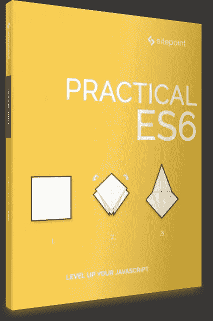

# 实用 ES6，2018 年 6 月发布

> 原文：<https://www.sitepoint.com/practical-es6/>

## 

## 关于这本书

毫无疑问，JavaScript 生态系统变化很快。随着 ES2015(又名 ES6)的推出，不仅新工具和框架被快速引入和开发，语言本身也经历了巨大的变化。可以理解的是，现在已经有很多文章抱怨学习现代 JavaScript 开发有多么困难。我们的目标是通过这套现代 JavaScript 书籍将这种混淆最小化。

## 你会学到什么

本书介绍了 ECMAScript 2015 中引入的许多强大的新 JavaScript 语言功能，以及 ECMAScript 2016 和 2017 中引入的功能。它还介绍了 ECMAScript 2018 在这种快速发展的语言中计划的功能。它包含:

*   新关键词:let 和 const
*   凯尔·彭内尔著
*   *新阵。*和 Array.prototype.*方法*作者 Aurelio de Rosa
*   *新的字符串方法— String.prototype.** 作者奥雷利奥·德·罗萨
*   Aurelio de Rosa 的新编号方法
*   *[ES6 箭头函数](https://www.sitepoint.com/javascript-arrow-functions/):JavaScript 中的胖而简洁的语法*
*   尼尔森·雅克的《符号及其用途》
*   Craig Buckler 的《如何使用代理人》
*   克雷格·巴克勒的破坏任务
*   Byron Houwens 的《ES6 生成器和迭代器:开发者指南》
*   Jeff Mott 的《面向对象的 JavaScript:深入探究 ES6 类》
*   Craig Buckler 的*了解 ES6 模块*
*   Sandeep Panda 的 JavaScript 承诺概述
*   JavaScript 装饰者:他们是什么以及何时使用他们
*   Craig Buckler 的增强的对象文字
*   Ludovico Fischer 对获取 API 的介绍
*   詹姆斯·赖特的《ES6 (ES2015)及以后:理解 JavaScript 版本化》
*   *es 2017 的新功能:异步函数、改进的对象和更多内容*Craig Buckler
*   *es 2018 的新功能*Craig Buckler

本书面向所有希望提高 JavaScript 技能的前端开发人员。为了跟上讨论，您需要熟悉 HTML 和 CSS，并对 JavaScript 有一定的理解。

## **在哪里买**

成为 [SitePoint Premium](https://www.sitepoint.com/premium/books/practical-es6?ref_source=sitepoint&ref_medium=article_copy&ref_campaign=practical-es6) 的月会员——我们所有的书籍和课程每月只需**9 美元**！

现在就在[亚马逊](https://www.amazon.com/dp/B07DGMHXX3/ref=emc_b_5_i)或者通过 [Google Play](https://play.google.com/store/books/details/Aurelio_De_Rosa_Practical_ES6?id=1iReDwAAQBAJ) 购买，或者作为[现代 Javascript 收藏](https://www.amazon.com/dp/B07DHYM4ZW/ref=emc_b_5_i)的一部分购买

## 分享这篇文章