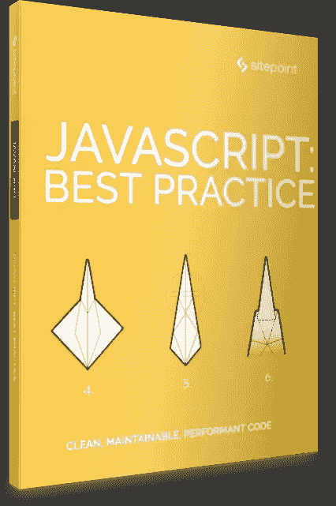

# JavaScript:最佳实践，2018 年 6 月发布

> 原文：<https://www.sitepoint.com/javascript-best-practice-released-june-2018/>

## 

## 关于这本书

毫无疑问，JavaScript 生态系统变化很快。随着 ES2015(又名 ES6)的推出，不仅新工具和框架被快速引入和开发，语言本身也经历了巨大的变化。

可以理解的是，现在已经有很多文章抱怨学习现代 JavaScript 开发有多么困难。我们的目标是通过这套现代 JavaScript 书籍将这种混淆最小化。

## 你会学到什么

这本书介绍了现代 JavaScript 的最佳实践，利用了语言中现有的特性，使您能够编写更强大的代码，这些代码是干净的、高性能的、可维护的和可重用的。它包含:

*   詹姆斯·科尔斯的《现代 JavaScript 应用剖析》
*   *用 ES6 默认参数清理代码&属性 Shorthands* 作者 Moritz krger
*   *JavaScript 性能优化技巧:概述*
*   Samier Saeed 的《JavaScript 设计模式:单一模式》
*   杰夫·莫特的《JavaScript 对象创建:模式和最佳实践》
*   使用现代 JavaScript 语法的最佳实践
*   现代 JS 中的流程控制:对异步/等待承诺的回调
*   JavaScript 的新私有类字段，以及如何使用它们

本书面向所有希望提高 JavaScript 技能的前端开发人员。为了跟上讨论，您需要熟悉 HTML 和 CSS，并对 JavaScript 有一定的理解。

## **在哪里买**

成为 [SitePoint Premium](https://www.sitepoint.com/premium/books/javascript-best-practice?ref_source=sitepoint&ref_medium=article_copy&ref_campaign=js-best-practice) 的月会员——我们所有的书籍和课程每月只需**9 美元**！

现在就在[亚马逊](https://www.amazon.com/JavaScript-Best-Practice-James-Kolce-ebook/dp/B07DGPHH8Q/ref=sr_1_1?s=books)或者通过 [Google Play](https://play.google.com/store/books/details/James_Kolce_JavaScript_Best_Practice?id=2iReDwAAQBAJ) 购买，或者作为[现代 Javascript 收藏](https://www.amazon.com/dp/B07DHYM4ZW/ref=emc_b_5_i)的一部分购买

## 分享这篇文章