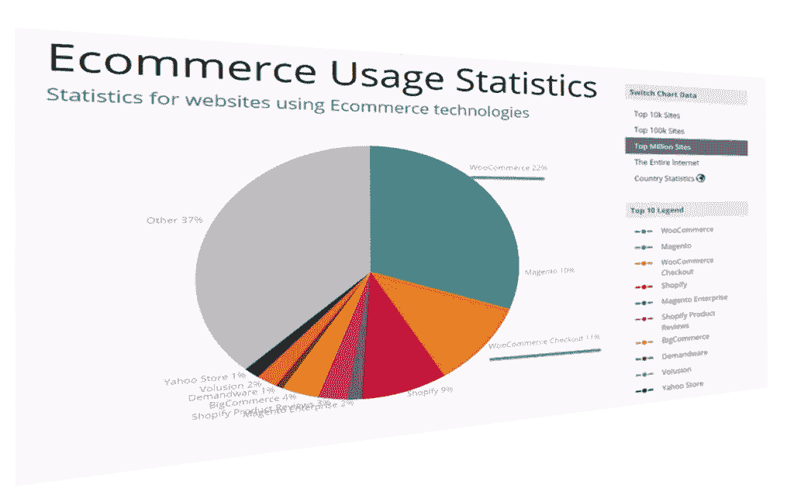
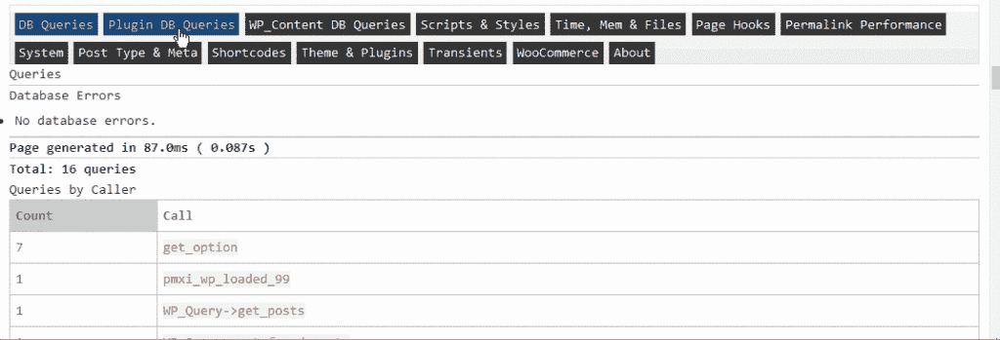
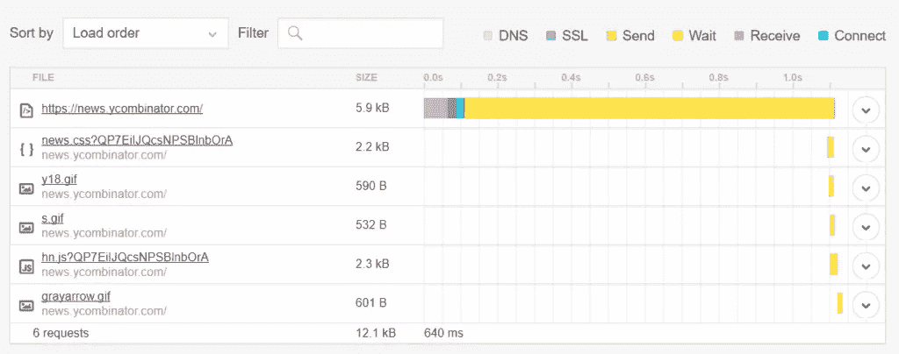
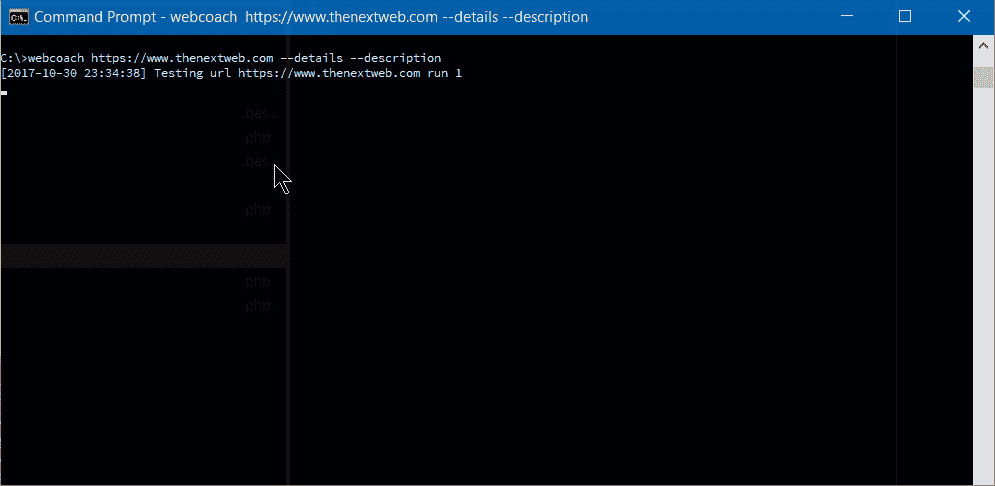

# WordPress 性能优化完全指南

> 原文：<https://www.sitepoint.com/complete-guide-wordpress-performance-optimization/>

**根据[Builtwith.com](https://builtwith.com)的数据，WordPress [在全球 100 万个顶级网站中占有将近 50%的 CMS 份额。至于电子商务领域，我们与 WooCommerce 的份额为 33%。如果我们撒开更大的网，百分比会更高。尽管我们可能会抱怨 WordPress 可能会变得臃肿，占用大量资源，并且它的数据模型还有很多需要改进的地方，但不可否认的是，WordPress 无处不在。](https://trends.builtwith.com/cms)**



WordPress 可以感谢它的简单和低门槛的普及。它很容易安装，几乎不需要任何技术知识。WordPress 的虚拟主机每月只需几美元，基本设置只需点击半小时。WordPress 的免费主题非常丰富，有些包含所见即所得页面生成器。

许多人看不起它，但在许多方面我们可以感谢 WordPress 对互联网和 PHP 的发展，许多互联网专业人士对 WP 的职业生涯有着温和的学习曲线。

但是这种进入的便利是有代价的。许多自豪地佩戴 WordPress 徽章的网站不是由专业人员完成的，而是由最廉价的开发者完成的。通常，它会显示出来。专业的外观和专业的表现是事后的想法。

一个有抱负的高质量网站的所有者将从一个不情愿的专业人士那里得到的反馈的要点之一是，性能和专业的外观和感觉不应该是事后的想法。你不能轻易地把它们画在或贴在网站上。专业网站要有预谋。


英国一家著名的二手车经销商，凌的汽车，尝试了一种独特的方式来制作一个媚俗的营销笑点。除非你真的确定你在做什么，否则不要在家里尝试。

这始于…

## 主机选择

一般来说，新用户会选择低成本的产品，其中大部分是初学者友好的附加功能。考虑到这个领域中一些大型行业参与者的[见不得人的商业行为](https://www.reviewhell.com/blog/endurance-international-group-eig-hosting/)，以及客户对网站迁移专业人员的投诉和需求，这是网站设置中需要适当关注的一部分。

我们可以把 WordPress 主机供应商分成几层。

高级的 WordPress 专用供应商，如每月 100 美元起价的 Kinsta，甚至更高级的托管服务，如 Automattic 的 T2 WordPress VIP，可能是物有所值的，但对许多网站所有者来说也是遥不可及的。

中层[飞轮](https://getflywheel.com)、 [A2 托管](https://www.a2hosting.com/)、[场地](https://www.siteground.com/)和[万神殿](https://pantheon.io)被认为是可靠和注重性能的，为那些更注重价格的人提供可接受的速度和托管服务。这里的用户可能不太愿意亲自动手，但是这些服务通常在可靠的设置、价格和更高级用户的选择之间取得了可接受的平衡。别忘了，还有 [Cloudways](https://www.cloudways.com/en/) ，它是 VPS 和托管的混合体。那些在欧洲有读者的人可能会关注 Pilvia，因为它提供了一个高性能的服务器堆栈，而且价格相当便宜。

Codeinwp 发布的[有一个关于更著名的主机供应商的客户满意度的有趣调查。](https://www.codeinwp.com/blog/wordpress-hosting-infographic/)

对于我们这些不害怕命令行的人来说，有副总裁和专用服务器供应商，如欧洲的[数字海洋](https://www.digitalocean.com/)、 [Vultr](https://www.vultr.com/) 、 [Linode](https://www.linode.com/) 、亚马逊的 [Lightsail](https://amazonlightsail.com/) 、 [Hetzner](https://www.hetzner.de/) 和 [OVH](https://www.ovh.com/us/) 。Hetzner 是一家德国供应商，以其提供的高质量物理服务器而闻名，略高于虚拟服务器的价格，而 OVH 提供非常经济高效的虚拟服务器。出于对价格的考虑，OVH 在欧洲和加拿大的子公司 [Kimsufi](https://www.kimsufi.com/en/) 也提供廉价的物理专用服务器，而 [Host US](https://hostus.us/kvm-vps.html) 拥有非常实惠的虚拟服务器。

对于托管主机，需要寻找的是一个好的**服务器堆栈**，良好的 CDN 集成，当然还有 SSD 存储。有保证的资源，[就像 A2](https://www.a2hosting.com/web-hosting/compare) 一样，是一大优势。接下来要寻找的是 SSH-access。精通技术的用户可能会从 [WP-CLI](http://wp-cli.org/) 的可用性中获益。

当选择 VPS 时，要寻找的是基于 OpenVZ 的 XEN 或 KVM 虚拟化，因为它减少了资源的过度销售，有助于保证您购买的资源确实是您的。它还提供了更好的安全性。

Easy Engine 是一款软件，可以让你在一个小时内完成整个 VPS/WordPress 的安装。

关于服务器堆栈，如果我们追求性能，Nginx 比 Apache 更好，PHP 7 是必须的。如果我们真的需要 Apache，使用 Nginx 作为反向代理是一个优势，但这种设置会变得复杂。

进行的测试让 PHP 7 比之前的版本有了很大的优势。[据 fasthosts.co.uk](http://blogs.fasthosts.co.uk/web-design/php-7-performance-improvements/):

> 与 PHP 5.6 相比，WordPress 4.1 在 PHP 7 上每秒多执行 95%的请求。

当选择你的主机时，要意识到一些供应商的负面经验，这些供应商已经变得臭名昭著。

## 软件考虑

通常会降低 WordPress 网站速度的东西是庞大臃肿的前端，有很多静态资源和数据库查询。这些问题源于主题的选择(及其页面构建器、巨大的滑块等)，这不仅会因为许多请求和整体大小而降低初始加载速度，还会因为大量 JavaScript 和要呈现的内容而降低浏览器速度，使其无响应。

这里的黄金法则是:除非有充分的理由，否则不要使用它。

这似乎是出自荷马·辛普森之口的一条规则，但是如果你能跳过任何华而不实的东西，那就跳过吧。保守一点。如果您必须添加一些闪亮的功能或 JS 视觉糖果，总是喜欢那些尽可能具体地为您的确切需求定制和编码的功能。如果你是一个熟练的程序员，并且这个项目证明了你的努力是值得的，那么你自己用极简主义来编码吧。

检查所有你的网站离不开的插件——去掉其他的。

最重要的是:在开始修剪之前，先备份你的网站！

### 数据模型

如果你有一个主题，其中你使用了大量的自定义帖子或字段，要注意这些会降低你的数据库查询速度。尽可能保持你的数据模型简单，如果不简单，考虑 WordPress 最初的目的是作为一个博客引擎。如果您需要更多的东西，您可能会考虑一些 MVC web 框架，它们会让您更好地控制您的数据模型和数据库的选择。

在 WordPress **中，我们可以**通过使用[自定义帖子类型](https://codex.wordpress.org/Post_Types)、[自定义分类](https://codex.wordpress.org/Taxonomies)和[自定义字段](https://codex.wordpress.org/Custom_Fields)来构建丰富的自定义数据模型，但是要注意性能和复杂性成本。

如果你熟悉代码，检查你的主题，找到不必要的数据库查询。每次单独的数据库访问都会在您的 [TTFB](https://en.wikipedia.org/wiki/Time_to_first_byte) 中花费宝贵的毫秒，以及您的服务器内存的兆字节。记住[二次循环](https://wordpress.stackexchange.com/questions/110845/what-exactly-defines-a-main-loop-and-a-secondary-loop)会很昂贵——所以在使用显示额外帖子的插件时要小心，比如在滑块或插件区。如果你必须使用它们，[考虑一下在一个查询中获取你所有的帖子](https://code.tutsplus.com/tutorials/how-to-code-multiple-loops-while-only-querying-the-database-once--cms-25703)，否则会降低你网站的速度。对于那些不想从头开始编码的人，有一个 GitHub repo 。

### 元查询可能很昂贵

使用[定制字段](https://codex.wordpress.org/Custom_Fields)通过一些标准获取帖子可以是用 WP 开发复杂事物的一个很好的工具。这是一个[元查询](http://www.epicwebs.co.uk/wordpress-tutorials/how-to-use-wordpress-meta-queries-effectively/)的例子，而[在这里](https://wordpress.stackexchange.com/questions/276310/slow-meta-query-with-multi-meta-keys)你可以找到一些关于它的成本的详细说明。概要: **post meta 不是为过滤而构建的，分类法是**。

`get_post_meta` [是一个函数](https://developer.wordpress.org/reference/functions/get_post_meta/),通常被调用来获取定制字段，它可以只使用文章 ID 作为参数来调用，在这种情况下，它获取数组中文章的所有元字段，或者它可以使用定制字段的名称作为第二个参数，在这种情况下，它只返回指定的字段。

如果在一个页面或请求中多次使用`get_post_meta()`来处理某个帖子(针对多个自定义字段)，请注意[这个*不会*产生额外的开销](https://wordpress.stackexchange.com/a/167151/73217)，因为第一次调用这个函数时， [*所有*的帖子元都会被缓存](https://core.trac.wordpress.org/browser/tags/4.0/src/wp-includes/meta.php#L474)。

### 数据库卫生

安装和删除各种插件，以及在网站的生命周期中改变不同的主题，通常会使你的数据库充斥着大量不需要的数据。完全有可能发现——在检查为什么 WordPress 网站运行缓慢，或者为什么由于耗尽服务器内存而无法加载时——数据库已经增长到数百兆字节，或者超过千兆字节，却没有解释它的内容。

wp-options 是许多孤立数据通常被留下的地方。这包括但不限于各种 **[瞬变](https://codex.wordpress.org/Transients_API)** ( [本帖](https://salferrarello.com/delete-transients-plugin-deactivation/)警告插件中删除瞬变的最佳实践)。瞬态是缓存的一种形式，但是与任何其他缓存一样，如果使用不当，它可能弊大于利。如果您的服务器环境提供的话， [wp-cli 有一个专用于瞬态管理的命令集](https://developer.wordpress.org/cli/commands/transient/)，包括删除。如果没有，WordPress 插件库中有[插件](https://wordpress.org/plugins/artiss-transient-cleaner/)可以删除过期的瞬态，但是提供的控制较少。

如果删除瞬态仍然给我们留下一个没有任何有形原因的臃肿的数据库，WP-Sweep 是一个优秀的免费工具，可以清理数据库。另一个要考虑的是 [WP 优化](https://wordpress.org/plugins/wp-optimize/)。

在进行任何类型的数据库清理之前，强烈建议您备份数据库！

对于整个 WordPress 请求生命周期的剖析来说非常方便的插件之一是 [Debug Objects](https://wordpress.org/plugins/debug-objects/) 。它提供了对所有瞬态、短代码、类、样式和脚本、加载的模板、数据库查询和钩子的检查。



在确保一个合理的、面向性能的设置之后——预先考虑我们的服务器堆栈，消除由主题选择以及插件和小部件过载造成的可能膨胀——我们应该尝试识别瓶颈。

如果我们在类似于 [Pingdom Speed Test](https://tools.pingdom.com/) 的工具中测试我们的网站，我们将得到请求中加载的所有资源的瀑布图:



这为我们提供了关于请求-响应生命周期的详细信息，我们可以对其进行瓶颈分析。例如:

*   如果上面的粉红色 DNS 时间太长，这可能意味着我们应该考虑缓存我们的 DNS 记录更长的时间。这是通过增加我们的域管理/注册仪表板中的 **TTL** 设置来实现的。
*   如果 **SSL** 部分花费的时间太长，我们可能会考虑让 HTTP/2 受益于 [ALPN](https://en.wikipedia.org/wiki/Application-Layer_Protocol_Negotiation) ，调整我们的缓存控制头，最后切换到 CDN 服务。“ [Web 性能概述:HTTP/2、CDNs 和浏览器缓存](https://medium.baqend.com/hosting-lessons-learned-6010992eb257)”是关于这个主题的一篇全面的文章，KeyCDN 的“[分析 HTTPS 性能开销](https://www.keycdn.com/blog/https-performance-overhead/)”也是如此。
*   **连接**、**发送**和**接收**部分通常取决于网络延迟，因此这些可以通过在靠近目标受众的地方进行托管来改善，确保您的主机有快速的上行链路，并使用 CDN。对于这些项目，您可能也想考虑一个 [ping 工具](https://en.wikipedia.org/wiki/Ping_(networking_utility))(不要与上面提到的 Pingdom 工具混淆)，以确保您的服务器能够响应。
*   **等待**部分——瀑布的黄色部分——是您的服务器基础设施生成或返回请求的网站所需的时间。如果这部分花了太多时间，你可能想回到我们之前的优化服务器、WordPress 安装和数据库堆栈的主题。或者您可以考虑各种层次的缓存。

为了获得更广泛的测试和改进网站的技巧，有一个小的命令行工具叫做 **[webcoach](https://github.com/sitespeedio/coach)** 。在安装了 NodeJS 和 npm 的环境中(像[家园改进](https://www.sitepoint.com/quick-tip-get-homestead-vagrant-vm-running/))，安装很简单:

```
npm install webcoach -g 
```

安装后，我们可以获得详细的见解和建议，了解如何改进我们网站的各个方面，包括性能:



## 贮藏

当管理一个 WordPress 网站时，缓存可以带来很大的不同。有一些层和可能的缓存方式。

### 页面缓存

页面缓存是对 web 应用程序的整个 HTML 输出进行缓存。

如果可以的话，我们应该首先尝试测试服务器级的解决方案，比如 NGINX 缓存、Varnish 或者由托管主机供应商(比如 Kinsta、Siteground 等)提供的缓存系统。


如果这并不像我们希望的那样有帮助，我们可能会考虑像 [WP 超级缓存](https://wordpress.org/plugins/wp-super-cache/)、 [WP 最快缓存](https://wordpress.org/plugins/wp-fastest-cache/)或 GitHub 大修 W3 总缓存[这样的插件。所有这些都可以提高性能，但通常需要一些试验。配置不当的缓存解决方案实际上会损害网站的性能。例如，W3TC——至少在大修之前——被认为可能是最好的免费缓存解决方案，当它起作用时，会产生真正的奇迹。如果没有，它会让你的网站离线。](https://github.com/szepeviktor/w3-total-cache-fixed)

众所周知，WP Rocket 可能是最受称赞的高级缓存解决方案。

页面缓存可以极大地提高性能，从 RAM 中为整个网站提供服务，但是请注意，如果您有一个带有购物车的动态网站，或者部分依赖于 cookies 或个性化前端，它可能会带来复杂性。它可以将一个用户的 UI 部分提供给另一个用户，所以通常需要在投入生产之前进行测试。这尤其适用于非托管服务器上的解决方案，如 Varnish 或 Cloudflare 页面缓存。

### 片段缓存

当动态的、依赖 cookie 的网站很难用全页面的方法缓存时，或者当我们缓存 Ajax 请求时，片段缓存是一个值得考虑的解决方案。这里有一个很好的介绍。

### 对象缓存

[对象缓存](https://www.scalewp.io/object-caching/)意味着编译并在内存中存储所有的数据库查询和 PHP 对象。一些缓存插件试图为我们管理对象缓存后端。使用的后端通常是 APCu、Memcached 和 Redis。
它们需要被[安装在](https://guides.wp-bullet.com/install-apcu-object-cache-for-php7-for-wordpress-ubuntu-16-04/)服务器上。

为了更深入地对我们的 PHP 代码和对象缓存的性能进行基准测试，需要 shell 访问和安装 [wp-cli](http://wp-cli.org/) 的一个有价值的工具是 [profile 命令](https://github.com/wp-cli/profile-command)。我们可以安装它:

```
wp package install git@github.com:wp-cli/profile-command.git 
```

或者

```
wp package install wp-cli/profile-command 
```

*(根据安装情况，您可能需要添加`--allow-root`标志。)*

然后我们可以分析整个加载周期，或者深入到特定的钩子、文件和类，它们的加载时间和缓存比率。


### 浏览器缓存

浏览器缓存意味着强制访问者的浏览器将静态文件保存在缓存中，这样他们就不需要在重复访问时从我们的服务器上获取这些文件。这里使用了 *`cache-control`* 和 *`expires`* 表头。缓存插件通常管理浏览器缓存和设置标题。Technumero [制作了一个更深入的指南](https://technumero.com/how-to-leverage-browser-caching-wordpress/)。

## 静态文件

静态文件是图像、样式表、JS 代码、字体、媒体文件等。我们应该确保压缩它们，并且如果可能的话，利用 HTTP/2 来服务这些文件。如果我们的托管主机不支持 HTTP/2，或者无法将我们的非托管 VPS 迁移到 HTTP/2，最简单的方法就是在我们的堆栈中实现一个 CDN。cdn 从最接近我们受众的数据中心提供静态文件。这减少了延迟，通常意味着利用他们高度调整的基础设施。

Autooptimize 是一个插件，可以帮助操作我们的静态资产，减少请求的数量，连接 JS 和样式表文件，缩小它们，从而缩小页面输出。

关于媒体文件，我们应该考虑压缩/编码我们的视频以减小它们的大小，并通过像 YouTube 这样的提供商提供它们，以减轻我们服务器的压力。像亚马逊 S3 这样的云存储提供商是另一个不错的选择。视频托管超出了本文的范围，但是 WPMUDEV 为这个主题制作了一个方便的指南。

关于图像，这些对于网络来说通常太大了。有时候，唯一能让我们的服务器喘息的解决方案——可能需要很长时间——是通过 shell 进行批量压缩。Linux 上的 Imagemagick 有一个有用的`convert`工具，允许我们批量压缩我们的图像。此示例对文件夹中的所有 jpg 进行递归处理，将 JPEG 质量降低到 80%,同时进行其他小的增强，并调整图像的大小(这应该是不言自明的):

```
for file in *.jpg; do convert "${file}" -resize 20% -sharpen 3 -sharpen 2 -brightness-contrast "0x26" -quality 80 thumb."${file}"; done 
```

WP Bullet 有[两个优秀的指南批量压缩 JPG 和 PNG 文件](https://guides.wp-bullet.com/category/image-optimization/)。

除此之外，还有 [Imagify](https://imagify.io/) 服务和附带的减少图像尺寸的 WordPress 插件、 [EWWW 图像优化器](https://wordpress.org/plugins/ewww-image-optimizer/)等等…

## 其他随机提示

*   **内存** : [确保你的安装有足够的](https://docs.woocommerce.com/document/increasing-the-wordpress-memory-limit/)。

*   **XML-RPC 和登录页面**经常遭受自动化的脚本暴力攻击——即使不是大鱼。即使没有闯入，它们也会浪费 CPU 周期。在我们的 WordPress 安装被加载之前，我们应该尝试在服务器级别上阻止它们。如果我们不需要访问`xml-rpc.php`，我们可以将这个片段放在 nginx 上的虚拟主机块中:

    ```
    location = /xmlrpc.php {    
        deny all;    
    } 
    ```

    在 Apache 中:

    ```
    <Files xmlrpc.php>
        deny from all
    </Files> 
    ```

    像 [iThemes Security](https://wordpress.org/plugins/better-wp-security/) 、 [WPS Hide login](https://wordpress.org/plugins/wps-hide-login/) 等插件可以帮助我们改变登录页面的 URL。

    如果您受到暴力攻击，并且没有受到 Cloudflare 等 CDN 的保护，或者受管理主机的保护，请考虑使用类似 [fail2ban](https://www.digitalocean.com/community/tutorials/how-to-protect-wordpress-with-fail2ban-on-ubuntu-14-04) 的防火墙(无论是否受到攻击，您都应该有一个防火墙)。

*   **[WordPress heart beat](https://developer.wordpress.org/plugins/javascript/heartbeat-api/)**:当 WordPress dashboard 打开时轮询服务器会降低服务器的速度，并使你的 dashboard 无响应。尤其是当它在多个浏览器标签中打开或被多个用户打开时。[心跳](https://wordpress.org/plugins/heartbeat-control/)插件可以帮助解决这个问题。

*   **MAX_INPUT_VARS** :当保存带有大量元字段的帖子，或 WooCommerce 的可变产品时，我们可能会达到最大允许请求变量的限制(复杂 WooCommerce 产品发送的变量可能会达到数千)。这可能会导致您的服务器停机。[下面是如何解决的](https://www.a2hosting.com/kb/developer-corner/php/using-php.ini-directives/php-max-input-vars-directive)。

*   如果你的 WordPress 安装了一个大数据库——尤其是 WooCommerce 安装——开始出现速度问题，而你无法用其他方法解决，考虑一下 [ElasticPress](https://wordpress.org/plugins/elasticpress/) 。有些人运气不错。

*   如果您使用 WordFence，请确保关闭实时视图功能。它甚至可以让几千兆字节内存的 VPS 停止工作。

*   如果你正在登录你的网站——特别是在你的`wp-content`目录中的`debug.log`——注意它的大小。它可以增长到千兆字节的水平，使您的服务器崩溃。

*   如果你的服务器/主机出现系统崩溃，[核心转储](http://www.inmotionhosting.com/support/website/what-is/what-are-core-dumps)将填满你的存储空间。让某人分析那些崩溃的原因，然后删除那些文件。你会通过看起来像`core.XXXXXX`的图案认出它们。

尽管如此，我还是要再次提醒你:在你对你的网站做任何改动之前，请先备份！

## 结论

希望这个 WordPress 优化小技巧的汇编能派上用场。随着网站规模的增长，这些技巧越来越难以追溯应用。这就是为什么最好尽早开始，并努力获得最大效果:在发布前尽可能多地应用这些技术，你不仅会有一个平稳的发布，而且从第一天起就有一个高性能的应用程序——对所有新用户来说肯定是一个奇妙的体验。

请确保您也查看了 SitePoint 的 [PWA 指南](https://www.sitepoint.com/retrofit-your-website-as-a-progressive-web-app/)。让你的 WP 网站从第 0 天起就尽可能地 PWA 化，这将帮助用户把它安装在他们设备的主屏幕上，为他们的重复访问做好准备。

## 分享这篇文章