# 如何使用 MongoDB Stitch 集成 MongoDB Atlas 和 Segment

> 原文：<https://www.sitepoint.com/how-to-integrate-mongodb-atlas-and-segment-using-mongodb-stitch/>

*本文最初发表于 [MongoDB](https://www.mongodb.com/blog/post/how-to-integrate-mongodb-atlas-and-segment-using-mongodb-stitch?utm_medium=sp-synd&utm_source=sitepoint&utm_content=segment&jmp=sp-ref) 。感谢您对使 SitePoint 成为可能的合作伙伴的支持。*

将多个系统、API 和第三方服务捆绑在一起可能相当困难。最近，我们在内部遇到了这个问题，当时我们希望将 Segment 中的数据导入 MongoDB，以便利用 MongoDB 的原生分析功能和丰富的查询语言。使用一些巧妙的工具，我们能够在不到一个小时的时间内实现这一点——这还是第一次。

虽然这篇文章很详细，但实际的实现应该只需要 20 分钟左右。我将首先介绍我们的演员阵容(**我们用什么**工具来做这件事)，然后我们将介绍**我们是如何**做这件事的。

## 人物

为了从包括移动、网络、云应用和服务器在内的各种来源收集数据，开发人员从 2011 年开始转向**细分市场**。Segment 将多个数据源生成的所有事件整合到一个点击流中。然后，只需点击一个按钮，您就可以将数据发送到 200 多个集成中。像[数字海洋](https://www.digitalocean.com/)、[新遗迹](https://newrelic.com/)、[视觉](https://www.invisionapp.com/)和 [Instacart](https://www.instacart.com/) 这样的公司都依赖细分市场实现其增长战略的不同部分。

为了存储 Segment 生成的数据，我们求助于 MongoDB Atlas——MongoDB 的数据库即服务。Atlas 提供了最好的 MongoDB:

*   一种简单明了的查询语言，可以轻松处理您的数据
*   本机复制和分片，确保数据可以存储在需要的位置
*   一种灵活的数据模型，允许您轻松地从各种来源获取数据，而无需准确了解数据的结构(其形状)

所有这些都包含在一个完全托管的服务中，由构建数据库的同一个团队设计和运行，这意味着作为开发人员，您实际上可以鱼和熊掌兼得。

最后的角色是 [**MongoDB Stitch**](https://www.mongodb.com/cloud/stitch?utm_medium=sp-synd&utm_source=sitepoint&utm_content=segment&jmp=sp-ref) ，MongoDB 的无服务器平台。Stitch 通过简单、安全地访问数据和服务来简化应用开发和部署，从而加快应用上市速度，同时降低运营成本。Stitch 允许我们实现连接 Segment 等第三方工具与 MongoDB 的服务器端逻辑，同时确保从安全性到性能的一切都得到优化。

## 操作顺序

我们将经历以下步骤。如果您已经完成了其中任何一项，请随意挑选您需要帮助的相关项目:

1.  设置段工作空间
2.  将 Segment 的 JavaScript 库添加到您的前端应用程序中—[我还构建了一个简单得可笑的 HTML 页面，您可以用它来测试](https://github.com/jkras/MongoDBStitchSegmentIntegration/tree/master/FlayvaDemo)
3.  当用户单击按钮时向 Segment 发送事件
4.  注册 MongoDB Atlas
5.  创建一个集群，让您的数据有地方存放
6.  创建一个 MongoDB Stitch 应用程序，它接受来自 Segment 的数据并将其保存到您的 MongoDB Atlas 集群中

虽然这篇博客关注的是 Segment 与 MongoDB 的集成，但是我们下面概述的过程将与其他 API 和 web 服务一起工作。[加入社区 Slack](https://launchpass.com/mongo-db) 如果你想跟进一项不同的服务，可以问一些问题。

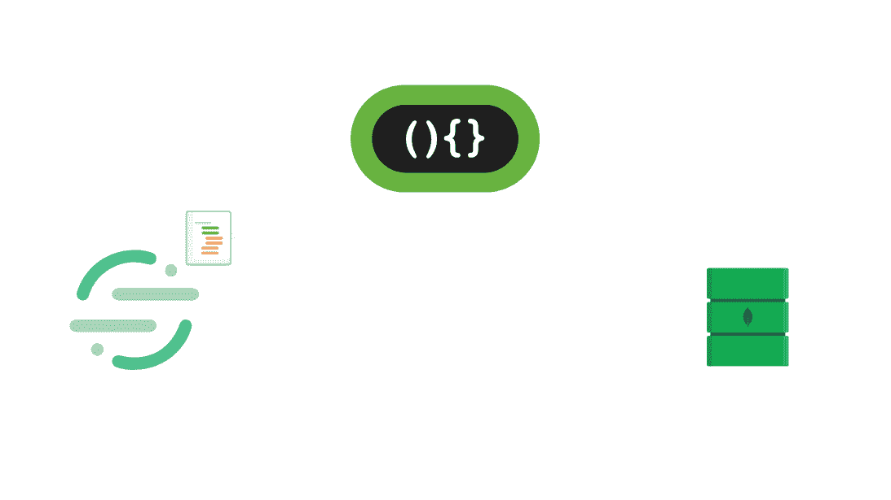

每次 Segment 看到新数据时，webhook 都会触发 HTTP Post 请求进行缝合。然后，一个 Stitch 函数处理请求的身份验证，并在不执行任何数据操作的情况下，将请求的主体直接保存到数据库中，以备进一步分析。

## 在段中设置工作空间

前往[Segment.com](https://segment.com)注册一个账户。一旦完成，Segment 将自动为您创建一个工作区。工作区允许您与团队成员协作，控制权限，并在整个团队中共享数据源。点击进入您刚刚创建的工作区。

要开始在您的工作区中收集数据，我们需要添加一个数据源。在本例中，我将从一个网站收集数据，因此我将选择该选项，在下一个屏幕上，Segment 将向我的工作区添加一个 JavaScript 源。任何来自我们网站的数据都将归功于这个来源。有一个蓝色的切换链接，我可以在源中单击，这将为我提供我需要添加到我的网站的代码，这样它就可以发送数据到部分。请注意这一点，因为我们很快就会需要它。

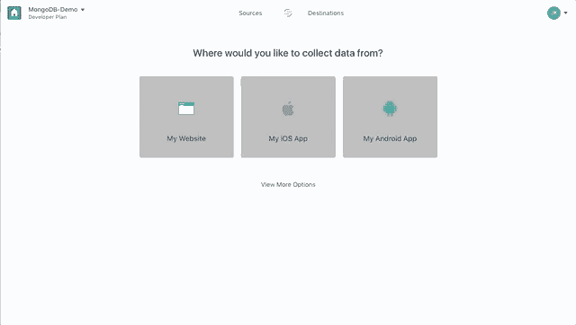

### 向您的网站添加细分市场

我提到了我创建的一个简单的示例页面，以防您想要在您已经处理过的其他代码之外测试这个实现。你可以从[这个 GitHub repo](https://github.com/jkras/MongoDBStitchSegmentIntegration/tree/master/FlayvaDemo) 里抢。

在我的示例页面中，您会看到我已经复制并粘贴了段代码，并将其放在页面的`<head>`标签之间。您需要用您正在使用的任何代码或语言做同样的事情。

如果您在浏览器中打开该页面，它应该会自动开始向 Segment 发送数据。最简单的方法是在另一个窗口中打开 Segment 并点击调试器。

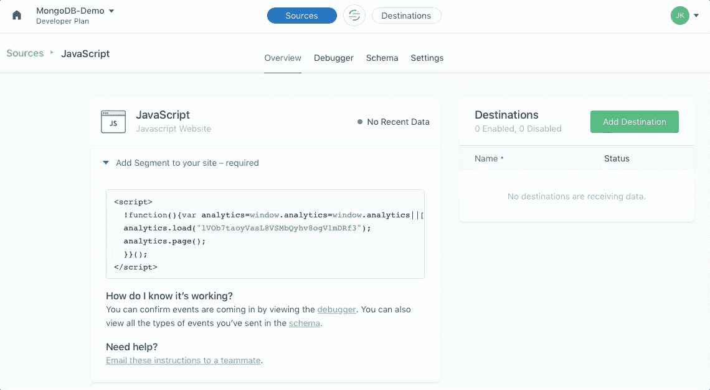

点击细分用户界面中的调试器按钮，您将看到由您的应用程序发送的实时事件流。

## 自定义您发送给 Segment 的事件

通过段库，您可以根据自己的意愿对从应用程序发送的数据进行细化。

随着应用程序的增长，您可能希望扩大跟踪的范围。最佳实践要求您考虑如何命名事件以及发送什么数据。否则，不同的开发者会给事件起不同的名字，并在不同的时间发送它们—[阅读这篇文章](https://segment.com/academy/collecting-data/naming-conventions-for-clean-data/)了解更多关于这个话题的信息。

为了让我们开始，我将假设我们想要跟踪每次有人点击网页上最喜欢的按钮。我们将使用一些简单的 JavaScript 来调用 Segment 的分析跟踪代码，并向 Segment API 发送一个名为“track”的事件。这样，每次有人点击我们最喜欢的按钮时，我们都会知道。

你会在我的网页底部看到，有一个 jQuery 函数附加到了`.btn`类。让我们在`alert()`函数后添加以下内容。

```
analytics.track("Favorited", {
        itemId: this.id,
        itemName: itemName
      }); 
```

现在，刷新浏览器中的页面，点击一个最喜欢的按钮。您应该会看到一个警告框出现。如果您在 Segment 中打开调试器窗口，您还会观察到跟踪事件流。很酷，对吧！

您可能已经注意到，上面的分析代码将您想要发送的数据存储在一个 JSON 文档中。您可以随时添加包含更具体信息的字段。传统上，这些数据会被发送到某种表格数据存储中，比如 MySQL 或 PostgreSQL，但是每次添加新信息时，您都必须执行迁移，以便向表中添加新列。最重要的是，您可能需要更新负责在数据库中保存事件的对象关系映射代码。MongoDB 是一个灵活的数据存储，这意味着不需要迁移或翻译，因为我们将按照您发送的格式存储数据。

## MongoDB Atlas 和 Stitch 入门

如前所述，我们将使用来自 MongoDB 的两种不同的服务。第一个是 MongoDB Atlas，它是一个数据库即服务。它是细分市场产生的所有数据将长期存在的地方。第二个，MongoDB Stitch，将扮演我们后端的角色。我们将使用 Stitch 来设置一个端点，Segment 可以在这里发送数据，一旦接收到数据，Stitch 将验证请求 Stitch 是否是从 Segment 发送的，然后协调所有逻辑将该数据保存到 MongoDB Atlas 中，供以后的分析和其他活动使用。

## 第一次使用 MongoDB Atlas？

[点击此处](https://www.mongodb.com/cloud/atlas/lp/general?utm_medium=sp-synd&utm_source=sitepoint&utm_content=segment&jmp=sp-ref)在 MongoDB Atlas 中设置账户。

一旦您创建了一个帐户，我们将使用 Atlas 的集群生成器来设置我们的第一个集群(每个 MongoDB Atlas 部署都由多个节点组成，这些节点有助于实现高可用性，这就是为什么我们称之为*集群*)。对于这个演示，我们可以使用 M0 实例——它永远免费，非常适合沙盒。它不在专用基础设施上，因此对于任何生产工作负载，调查其他实例大小都是值得的。

当 Cluster Builder 出现在屏幕上时，默认的云提供商是 AWS，选择的地区是 North Virginia。让这些保持原样。向下滚动并单击“Cluster Tier”部分，这将展开以显示我们不同的规模调整选项。选择列表顶部的 M0。

您还可以通过单击集群名称部分来自定义集群的名称。

完成后，单击创建集群。设置您的集群需要 7-10 分钟，所以也许可以去喝一杯，伸伸腿，然后回来……当您准备好了，请继续阅读。

## 创建缝合应用程序

构建集群时，在左侧菜单中，单击缝合应用程序。您将被带到“缝合应用程序”页面，在该页面中，您可以单击“创建新应用程序”。

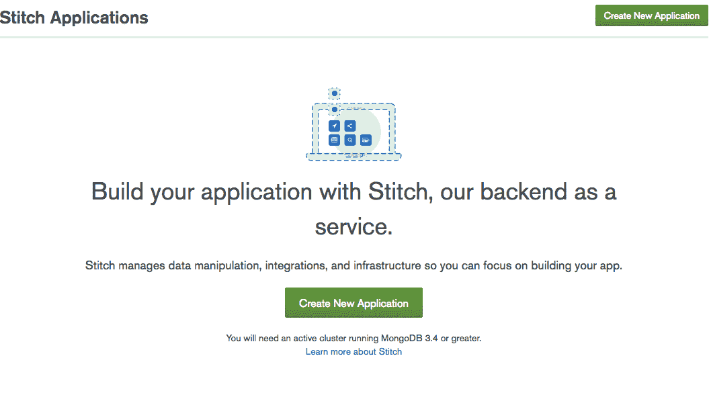

为您的应用程序命名，在本例中，我称之为“SegmentIntegration ”,并将其链接到正确的集群。单击创建。

一旦应用程序准备就绪，您将被带到 Stitch 欢迎页面。在这种情况下，我们可以关闭匿名身份验证。

我们确实需要启用对 MongoDB 集合的访问，以存储来自 Segment 的数据。对于数据库名称，我使用“segment”，对于集合，我使用“events”。单击添加收藏。

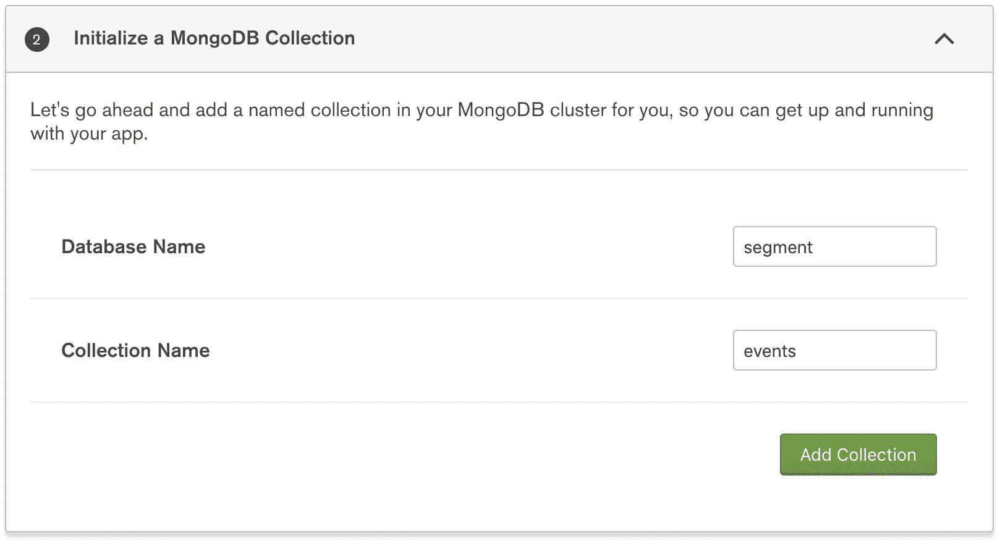

接下来，我们需要添加一个服务。在这种情况下，我们将手动配置一个 HTTP 服务，它可以通过 web 与 Segment 的服务进行通信。向下滚动并单击添加服务。

你会跳到一页，应该会看到一个大标志，上面写着，“这个应用程序没有服务”…不会太久。再次单击添加服务…。

从现在可见的选项中，选择 HTTP，然后为服务命名。我就用“SegmentHTTP”。单击添加服务。

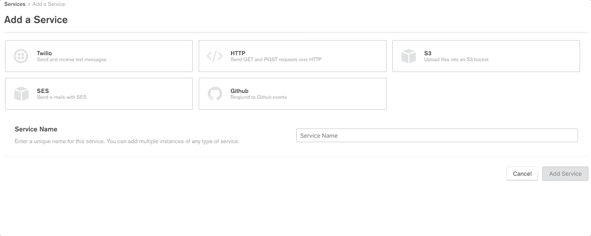

接下来，我们需要添加一个传入的 Webhook。Webhook 是一个 HTTP 端点，它将持续监听来自 Segment 的传入调用，当被调用时，它将触发 Stitch 中的一个函数运行。

单击添加传入网络挂钩

*   保持默认名称不变，并更改以下字段:
*   打开 Respond with Result，因为这将返回我们的插入操作的结果
*   将请求验证更改为“要求机密作为查询参数”
*   向页面上的最后一个字段添加密码。*重要提示:我们将这称为我们的“公共秘密”,因为它不受外界保护，它更像是 Stitch 在运行我们将要创建的函数之前可以使用的一个简单的验证。简而言之，我们还将定义一个“私人秘密”,它在缝合和分段之外是不可见的。*

最后，点击“保存”。

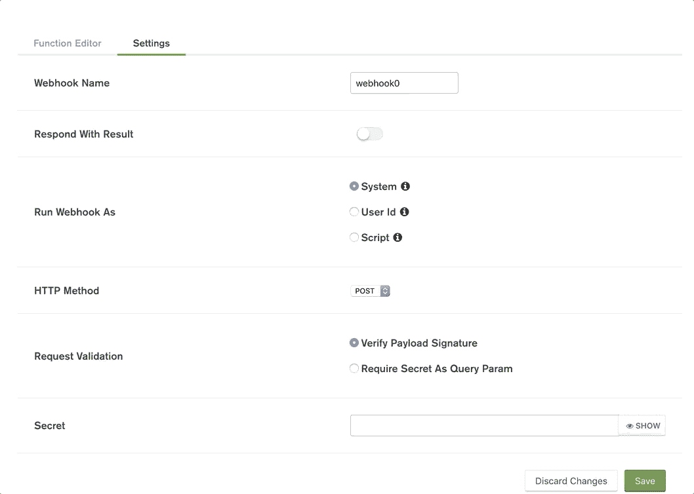

## 用 Stitch 中的函数定义请求处理逻辑

我们使用[函数](https://docs.mongodb.com/stitch/functions/?utm_medium=sp-synd&utm_source=sitepoint&utm_content=segment&jmp=sp-ref)定义 Stitch 中的自定义行为，简单的 JavaScript (ES6)可用于实现逻辑并与 Stitch 集成的所有不同服务一起工作。

谢天谢地，我们不需要在这里做太多的工作。史迪奇已经为我们准备好了基本的东西。我们需要定义做以下事情的逻辑:

1.  从 HTTP 头中获取请求签名
2.  使用签名来验证请求的真实性(即，它来自数据段)
3.  将请求写入 MongoDB Atlas 中的`segment.events`集合

## 获取 HTTP 报头并生成 HMAC 签名

将以下内容添加到第 8 行的大括号}之后。

```
const signature = payload.headers['X-Signature']; 
```

然后使用 Stitch 的内置[加密库](https://docs.mongodb.com/stitch/reference/functions/utilities/#utils-crypto?utm_medium=sp-synd&utm_source=sitepoint&utm_content=segment&jmp=sp-ref)生成一个摘要，我们将与签名进行比较。

```
const digest = utils.crypto.hmac(payload.body.text(), context.values.get("segment_shared_secret"), "sha1", "hex"); 
```

这里发生了很多事情，所以我将逐一解释。Segment 使用签名对请求进行签名，该签名是 HTTP 主体和共享机密的组合。如果我们知道请求体、共享秘密、用于创建签名的散列函数段以及输出格式，我们可以尝试使用`utils.crytop.hmac`函数生成一个相同的签名。如果我们可以复制来自段的 X-Signature 报头中包含的内容，我们将认为这是一个经过身份验证的请求。

**注意**:这将使用私有秘密，而不是我们在创建 webhook 时在设置页面中定义的公共秘密。这个秘密永远不应该公开。Stitch 允许我们定义用于存储变量的值，比如 API 密钥和秘密。我们很快就会这样做。

## 验证请求是可信的，并写入 MongoDB Atlas

为了验证请求，我们只需要比较`digest`和`signature`。如果它们相等，那么我们将写入数据库。在我们生成`digest`之后，直接添加下面的代码。

```
if (digest == signature) {
    // Request is valid
} else {
    // Request is invalid
    console.log("Request is invalid");
} 
```

最后，我们将用保存数据所需的适当行为来扩充 if 语句。在 if 语句的第一行，我们将得到我们的“mongodb-atlas”服务。添加以下代码:

```
let mongodb = context.services.get("mongodb-atlas"); 
```

接下来，我们将获得我们的数据库集合，以便我们可以向其中写入数据。

```
let events = mongodb.db("segment").collection("events"); 
```

最后，我们写入数据。

```
events.insertOne(body); 
```

单击代码编辑器左上角的保存按钮。最后，我们的整个函数应该是这样的:

```
exports = function(payload) {

  var queryArg = payload.query.arg || '';
  var body = {};

  if (payload.body) {
    body = JSON.parse(payload.body.text());
  }

  // Get x-signature header and create digest for comparison
  const signature = payload.headers['X-Signature'];
  const digest = utils.crypto.hmac(payload.body.text(), 
    context.values.get("segment_shared_secret"), "sha1", "hex");

  //Only write the data if the digest matches Segment's x-signature!
  if (digest == signature) {

    let mongodb = context.services.get("mongodb-atlas");

    // Set the collection up to write data
    let events = mongodb.db("segment").collection("events");

    // Write the data
    events.insertOne(body);

  } else  {
    console.log("Digest didn't match");
  }

  return queryArg + ' ' + body.msg;
}; 
```

## 为 MongoDB Atlas 集合定义规则

接下来，我们需要更新允许 Stitch 写入数据库集合的规则。为此，在左侧菜单中，单击“mongodb-atlas”。

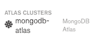

选择我们之前创建的集合，名为“`segment.events`”。这将显示顶层文档的字段规则。我们可以使用这些规则来定义我们的 Stitch 函数必须存在什么条件才能读取或写入集合。

我们将暂时保留读取规则，因为我们不会直接从我们的 Stitch 应用程序中读取。但是，我们将把写规则改为“evaluate ”,这样我们的函数就可以写入数据库。

更改“写”框的内容:

*   指定一个空的 JSON 文档{}作为文档级的写规则。
*   如果尚未设置，请将“允许所有其他字段”设置为“已启用”。

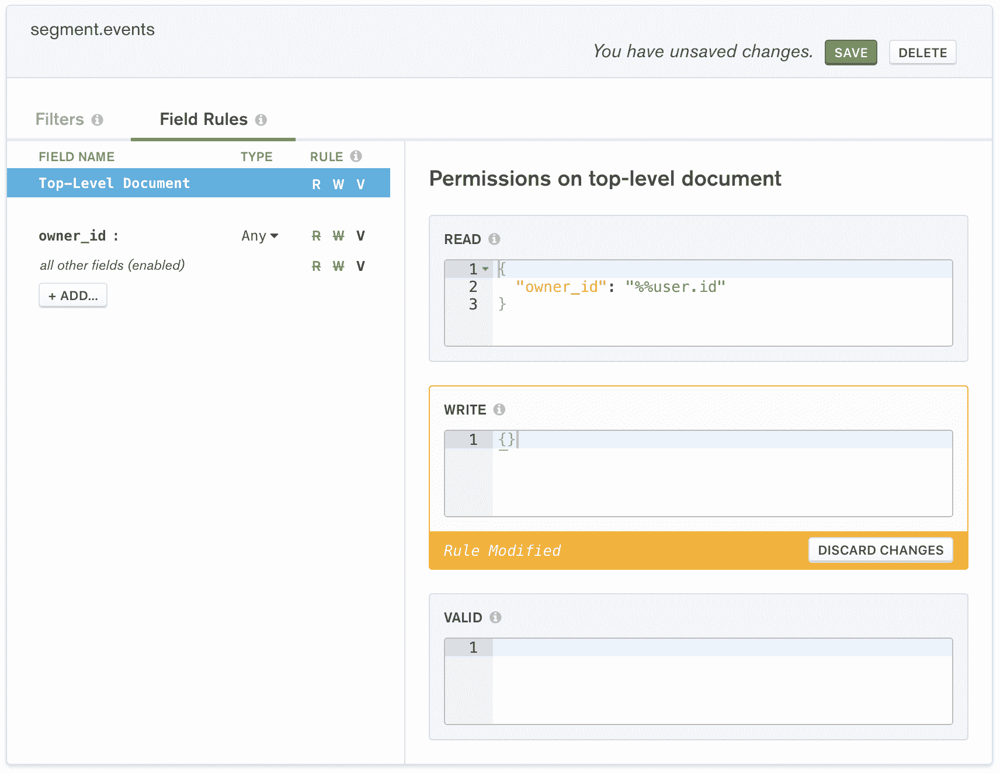

单击编辑器顶部的保存。

## 在 MongoDB Stitch 中添加一个秘密值

按照惯例，API 密钥和密码被存储为变量，这意味着它们永远不会被提交到代码报告中——可见性降低了。Stitch 允许我们创建私有变量(值),这些变量只能被传入的 webhooks、规则和命名函数访问。

我们通过在 Stitch 菜单上点击 Values，点击 Create New Value，并给我们的值起一个名字——在这里是`segment_shared_secret`(我们称之为我们的私有秘密)。我们在大文本框中输入内容。完成后，请确保点按“保存”。

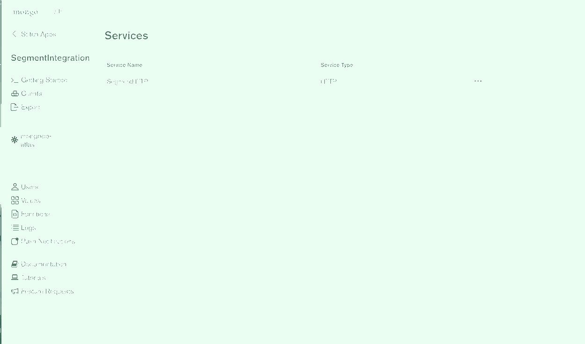

## 获取我们的 Webhook URL

要将 webhook URL 从 Stitch 复制到 Segment，请使用控制菜单导航:服务> SegmentHTTP > webhook0 >设置(位于页面顶部)。现在复制“Webhook URL”。

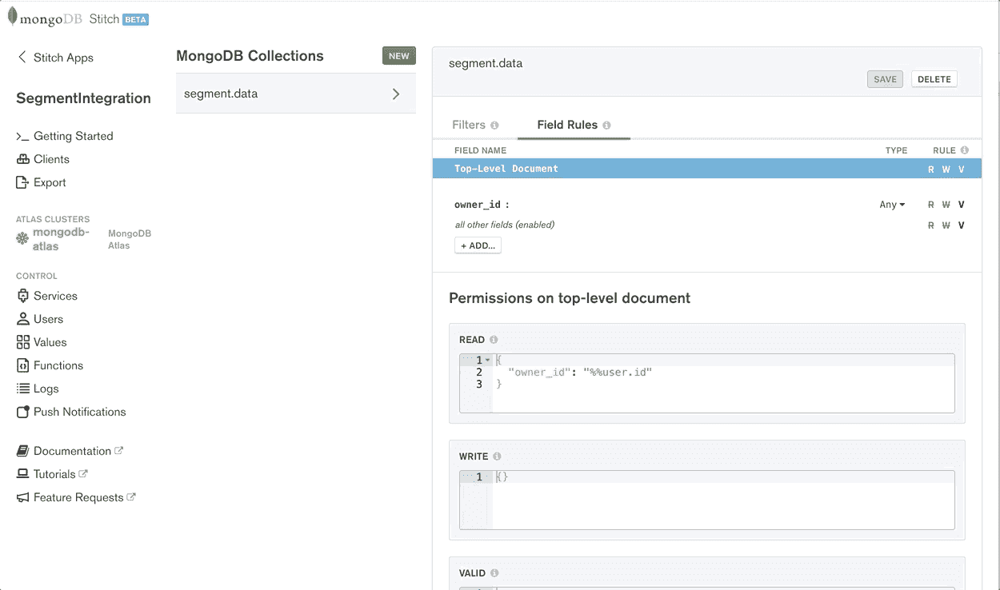

在我们的例子中，Webhooks 看起来像这样:

```
https://webhooks.mongodb-stitch.com/api/client/v2.0/app/segmentintegration/service/SegmentHTTP/incoming_webhook/webhook0 
```

## 将 Webhook URL 添加到段

前往 Segment 并登录到您的工作区。在目的地中，我们将单击添加目的地。

在目的地目录中搜索 Webhook，然后单击 Webhooks。进入下一页后，点击配置网页挂钩。然后选择要发送数据的任何来源。选择后，单击确认来源。

接下来，我们将进入目的地设置页面。我们需要配置我们的连接设置。单击标有 Webhooks(最多 5 个)的方框。

从 Stitch 复制您的 webhook URL，并确保使用以下语法将您的公共秘密附加到它的末尾:

初始 URL:

```
https://webhooks.mongodb-stitch.com/api/client/v2.0/app/segmentintegration/service/SegmentHTTP/incoming_webhook/webhook0 
```

在末尾添加以下内容:`?secret=<YOUR_PUBLIC_SECRET_HERE>`

Final URL:

```
https://webhooks.mongodb-stitch.com/api/client/v2.0/app/segmentintegration/service/SegmentHTTP/incoming_webhook/webhook0?secret=PUBLIC_SECRET 
```

单击保存。

我们还需要告诉 Segment 我们的私人秘密是什么，这样它就可以创建一个签名，我们可以在 Stitch 中验证它。通过点击共享秘密字段并输入与用于`segment_shared_secret`相同的值来完成此操作。单击保存。

最后，我们需要做的就是通过点击目的地设置页面顶部的开关来激活 webhook:


## 生成事件，并在 MongoDB 中查看您的数据

现在，我们需要做的就是使用我们的测试 HTML 页面生成一些发送到 Segment 的事件——我们可以使用 Segment 的调试器来确保它们进入。一旦我们看到它们流动，它们也将进入 MongoDB Stitch，后者将把事件写入 MongoDB Atlas。

我们将使用 [Compass](https://www.mongodb.com/compass?utm_medium=sp-synd&utm_source=sitepoint&utm_content=segment&jmp=sp-ref) 快速查看一下，以确保我们的数据可见。一旦我们连接到我们的集群，我们应该看到一个名为“segment”的数据库。点击“细分市场”,您将看到我们名为“活动”的集合。如果你点击这里，你会看到我们的前端生成的数据样本！

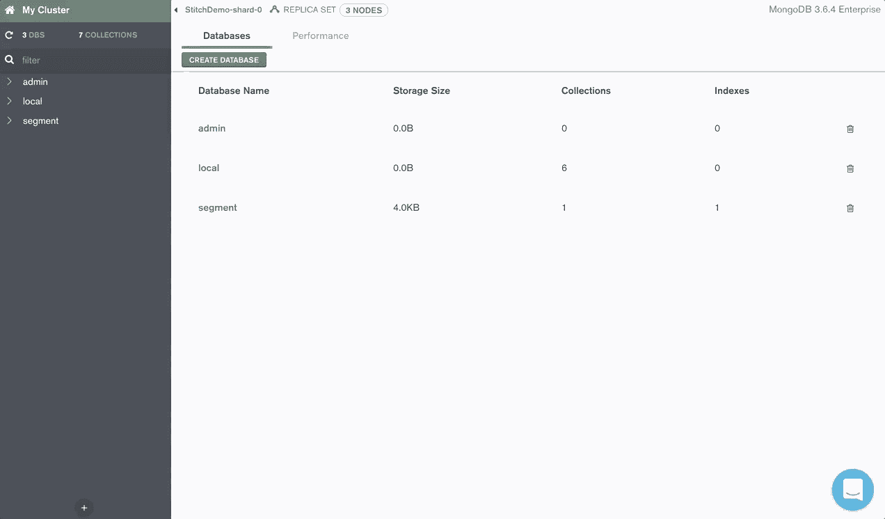

## 结束了

感谢您通读，希望这对您有所帮助。如果你正在用 MongoDB Stitch 构建新的东西，我们很乐意听到它。[加入社区 Slack](https://launchpass.com/mongo-db) 在#stitch 频道提问！

## 分享这篇文章