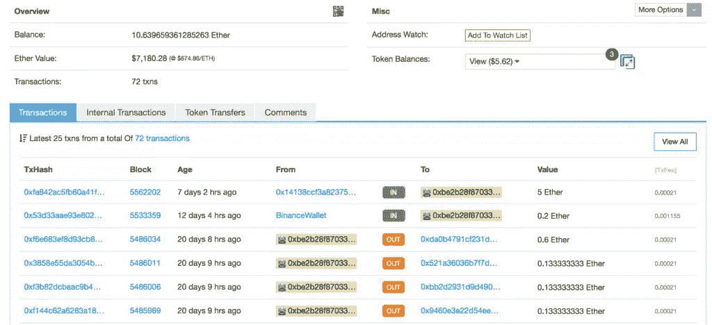
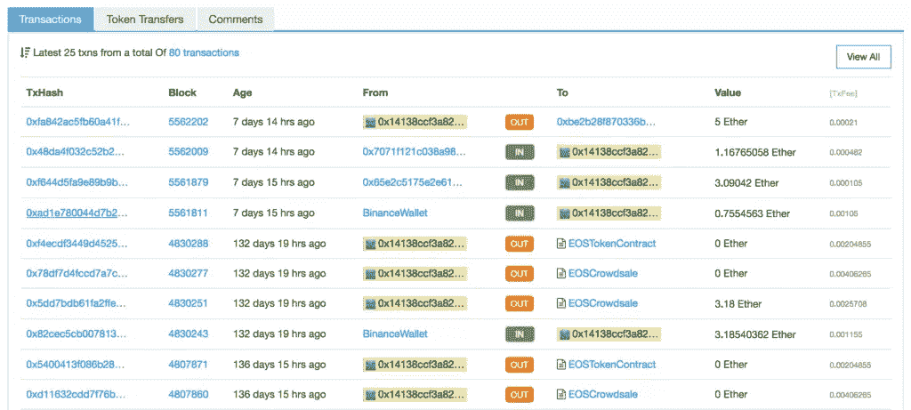
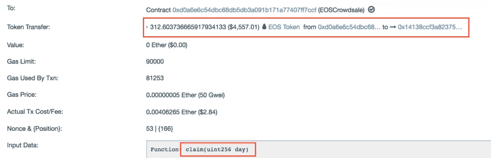
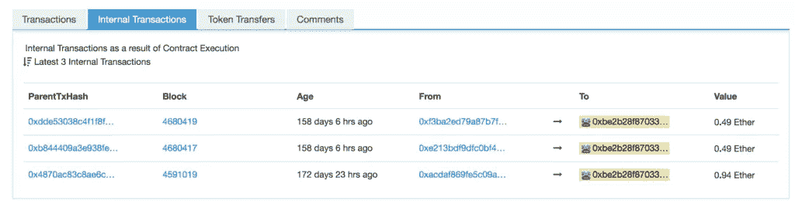
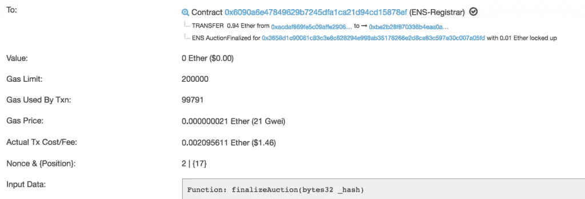
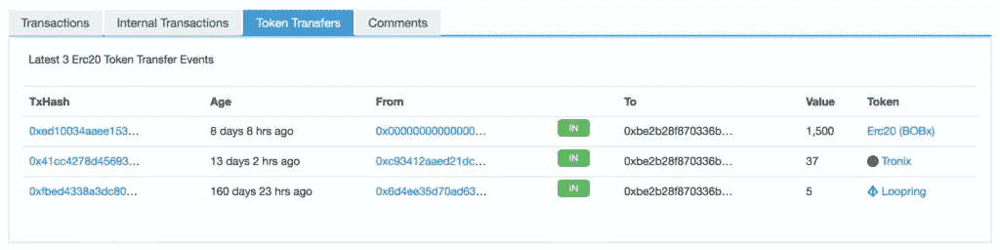
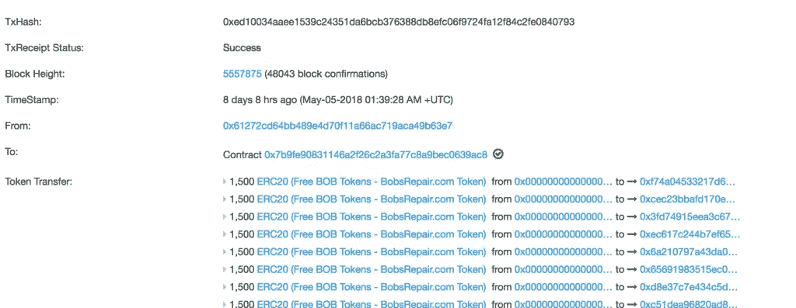
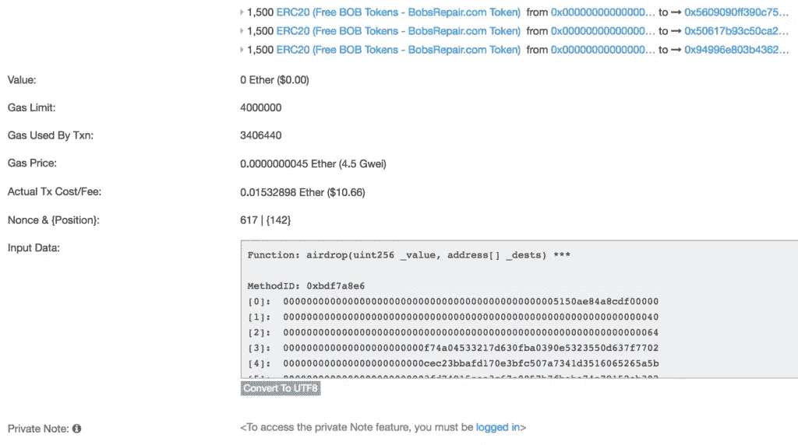

# 以太坊:内部交易和令牌转移讲解

> 原文：<https://www.sitepoint.com/ethereum-internal-transactions-token-transfers/>

**使用以太坊[区块链探索者](https://bitfalls.com/2017/10/03/read-bitcoin-blockchain-data-blockexplorer/)如以太扫描检查地址时，你可能会遇到某些地址有*交易*、*内部交易*和*令牌转移*。要了解它们之间的区别，我们首先要了解以太坊上外部和内部地址的概念。**

## 外部和内部地址

以太坊有两种地址(账户):外部和内部。

当一个用户创建一个地址时，这个地址被称为*外部*地址，因为它用于从外部——从“用户世界”访问区块链*。*

当您将一个[智能合约](https://bitfalls.com/2018/03/31/solidity-development-crash-course-building-blockchain-raffle/)部署到以太坊区块链时，会生成一个*内部*地址，该地址用作指向正在运行的区块链程序(一个已部署的智能合约)的指针。您可以[从外部将它作为调用函数](https://bitfalls.com/2018/04/08/how-to-call-ethereum-smart-contract-functions/)的目标，或者您可以从内部将其作为目标，以便另一个已部署的契约可以调用已经部署的契约上的函数。

需要注意的是，以太坊区块链上的所有*交易都是从外部账户开始的。即使一个智能合约应该调用另一个智能合约，而另一个智能合约又调用另一个智能合约，第一笔交易*必须*由外部账户完成。目前还没有办法从外部自动调用事务，尽管解决方案正在[的](http://www.ethereum-alarm-clock.com/)上进行。*

外部账户和内部账户的主要区别如下:

**外部地址有私钥，用户可以访问。内部地址不能作为钱包直接访问，只能通过调用其函数来使用。**

## 交易类型

这使我们回到了事务类型。让我们检查一下这个地址。

该地址在*事务*选项卡中有几个条目——一些是传出的，一些是传入的。这些交易是*外部*交易——进出外部账户。所以根据截图，我们可以看到这个地址 7 天前从[这个地址](https://etherscan.io/address/0x14138ccf3a82375adfd53842d4959ece91a99582)收到 5 以太，12 天前从一个[币安钱包](https://etherscan.io/address/0x3f5ce5fbfe3e9af3971dd833d26ba9b5c936f0be)收到 0.2 以太。但是如果我们查看最近的发送者，我们会看到一些更有趣的条目:

这个地址一直在向个人发送以太网，但它也做了其他事情:它向 EOS 众卖捐款，并收回了 EOS 代币。这些事务中的大多数发送 0 以太；他们只是调用函数。例如，[这个交易](https://etherscan.io/tx/0x78df7d4fccd7a7c4955c001f75cdb537360ae57eb673ae0712628f126bd58ee2)显示，大约半年前，我们的主角调用了 EOS 众卖合同上的`claim`函数，这导致众卖给那个人 312 个代币作为回报。

这笔交易的细节没多大关系。我们只是查看它来正确定义*事务*选项卡:

***交易*选项卡列出了由外部账户发起的所有交易*，不管是谁发起的——收款人还是汇款人。***

现在我们来看看我们第一个地址的第二个标签:*内部交易*。

*注意:并非所有地址都有此标签。只有当账户上实际发生内部交易时，它才会出现。*

让我们来看看其中的一个——例如，[这个](https://etherscan.io/tx/0x4870ac83c8ae6cecc10b6c11d961f5d710124afa6a2d8f38cae54f1b71de8ce6)。

这是对 ENS(以太坊域名服务)域名服务的竞标，该服务允许实体注册一个类似于`bitfalls.eth`的`eth`域名，这样人们就可以直接向其发送以太网，而不是像`0xbE2B28F870336B4eAA0aCc73cE02757fcC428dC9`这样又长又神秘的地址。该事务将自己描述为被发送到`ENS-Registrar`契约，该契约然后将 0.94 ether 传输到最初形成拍卖的地址，然后该契约调用终结函数。

但是，如果它仍然需要由来自外部账户的交易发起，这怎么会是内部交易呢？是的，最初发起的 TX 是外部的，但是这个特殊的交易只是发生在区块链内部的一系列交易中的一个，从合同到合同。由于该合同因被另一个合同(ENS 拍卖流程)触发而自动发回以太网，因此它被记录为内部交易，因为以太网的转移是智能合同内置的逻辑的结果，而不是由外部人员发送的。因此:

***内部交易*页签列出了由内部账户发起的所有交易*作为一个或多个先前交易的结果。***

## 代币转账

最后，还有*令牌转移*选项卡。

有些不言自明的是，令牌转移是仅做以下事情的交易:转移令牌。有问题的令牌必须是 ERC20 令牌(即具有标准化功能)，如果交易的唯一目的是转移令牌，则会在此处列出。这里我们可以看到一个[垃圾邮件令牌](https://etherscan.io/tx/0xed10034aaee1539c24351da6bcb376388db8efc06f9724fa12f84c2fe0840793)的例子:8 天前，1500 个 BOBx 令牌被发送到该地址。垃圾令牌(airdrop)是推广 ICO 项目的常用方法。空投让收件人想知道代币从何而来。当他们搜索这个项目时，它的 Google SERP 评级会上升，反向链接也会被创建。考虑到构建自己的令牌几乎是免费的，而且非常简单，这种噱头的营销成本几乎为零。更准确地说是 10 美元，如果我们更仔细地观察这笔交易，这一点就变得很明显了…

我们可以看到，这确实是一次空投，有许多地址被作为收件人。

您还会注意到令牌是“从”`0x00000...`发送的。这意味着什么呢？空地址怎么会是原点呢？这仅仅意味着这一垃圾邮件交易也是令牌的来源。这种代币以区区 10 美元的价格一次性被制作出来并分发给 100 个人。你可以通过查看*输入数据*来检查有多少地址是这个噱头的一部分。

## 结论

您现在知道如何在 Etherscan 上解释 Ethereum 中的交易类型，并且能够以合理的确定度说出什么在何时何地被转移给谁，以及识别是什么触发了它。这将在你未来探索区块链以太坊时派上用场。

## 分享这篇文章