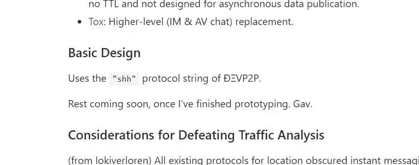
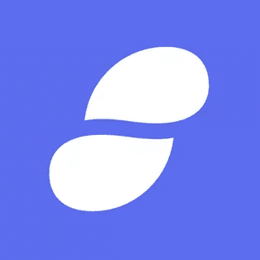
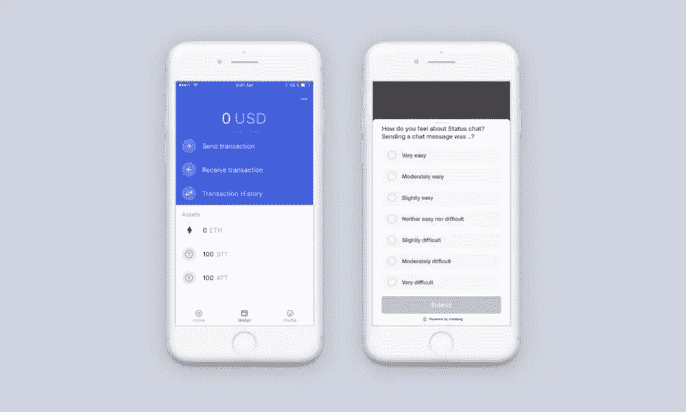
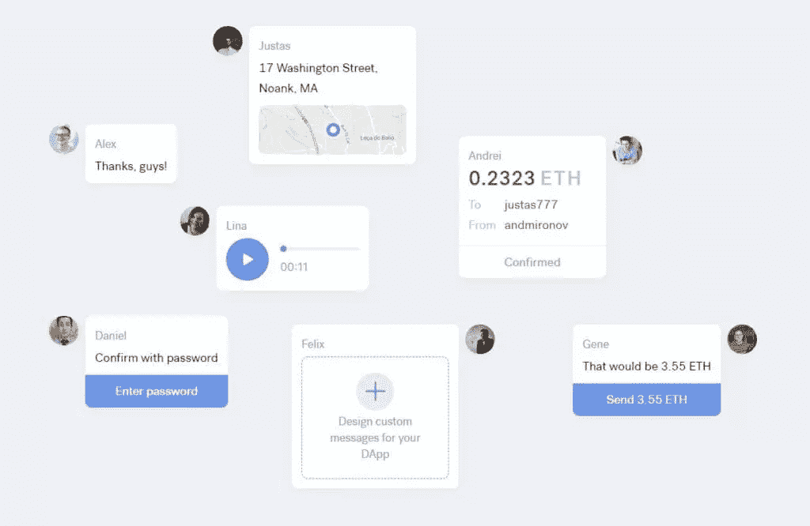

# 以太坊消息:解释耳语和状态

> 原文：<https://www.sitepoint.com/ethereum-messaging-whisper-status/>

本文将展示以太坊是如何发展成一个完整的生态系统，而不仅仅是一个加密货币或智能合约平台。

* * *

> 后斯诺登时代的网络有四个组成部分:静态内容发布、动态信息、无信任交易和集成用户界面。— [加文·伍德](http://gavwood.com/dappsweb3.html)

* * *

20 世纪 90 年代，互联网应运而生，年复一年，它彻底改变了我们交流的方式、做生意的方式、看新闻和看电视的方式。在许多方面，它使信息获取民主化，并大幅降低了全球通信成本，但它也提高了普通公民对通信、新闻和隐私的期望。

像维基解密、脸书、推特这样的网站，在第二次浪潮中——被称为 Web 2.0——与其他网站一起，如 Youtube、Linkedin 和许多个人发布平台，如 WordPress，改变了信息的发布，使其难以隐藏。无论外面有什么消息，迟早都会被披露。

政府和官员因此而下台。不管是好是坏，维基解密 2010 年公布的泄密电报引发了突尼斯、利比亚等国的公众抗议，火花后来变成了改变中东面貌的大火。当时，由于政府电报泄露，西方国家也发生了一系列抗议活动。

朱利安·阿桑奇在他的书《当谷歌遇到维基解密》中概述了政治、科技巨头和情报界之间的邪恶联系。在评论 Eric Schmidt 和 Jared Cohen 的书*新数字时代*时，他正确地指出:

> 虽然施密特和科恩告诉我们，隐私的消亡将有助于“专制独裁”的政府“瞄准其公民”，但他们也表示，“开放”民主国家的政府将把它视为“一份礼物”，使它们能够“更好地回应公民和客户的关切”。

金融机构对维基解密的镇压向我们展示了我们是多么容易受到审查——即使是在互联网时代。

接着是斯诺登爆料，公众对我们的隐私每天被侵犯的实际程度的幻想被冲进了马桶。

以太坊就是在这种环境下诞生的。斯诺登爆料几个月后，以太坊的联合创始人加文·伍德[写了一篇文章](http://gavwood.com/dappsweb3.html)概述了他对 Web 3.0 的愿景——一个利用我们已经拥有的互联网基础设施和可用的加密技术以及区块链来建设更好的互联网的网络。这将包括内容发布、消息传递和价值交易——以分散的、防审查的方式，并保证隐私。

## 低语

在这篇文章中，Wood 概述了一个基于身份的匿名低级消息系统(T1)，该系统将为其用户(包括人和应用程序)提供基于哈希的身份、隐私保证、加密消息、关于发送者的加密保证以及具有定义的生存时间的消息。由于没有更好的词，这个系统有模块化的隐私和匿名，以及“黑暗”的保证——允许用户选择加入或退出不同的隐私功能。它使用以太坊网络的基础设施。

Whisper 是作为一个*协议*构建的，这意味着它为更高级别的实现奠定了基础，基于它构建的应用程序有不同的变化，使用不同的协议功能和不同的设置。它目前处于 POC 2 阶段，可用于当前版本的 [geth](https://bitfalls.com/2018/02/12/explaining-ethereum-tools-geth-mist/) 和[奇偶校验](https://wiki.parity.io/Whisper-PoC-2-Wire-Protocol.html)。mainnet 上的使用受到启用了 Whisper 协议的正在运行的生产以太坊节点数量的限制。我们可以说，该协议处于初级阶段。许多规格将会改变。

以太坊和 Whisper 客户端节点都使用[Vp2p 有线协议](https://github.com/ethereum/wiki/wiki/%C3%90%CE%9EVp2p-Wire-Protocol)进行 p2p 通信。特别是使用了 [RPLx 协议](https://github.com/ethereum/devp2p/blob/master/rlpx.md)，它被描述为—

> 一种加密对等网络和协议套件，为应用程序通过 P2P 网络进行通信提供通用传输和接口。

分散的、抵制审查的网络的[节点发现算法](https://github.com/ethereum/devp2p/blob/master/rlpx.md#node-discovery)是它的主要部分。以太坊为此使用了适应的 Kademlia UDP，类似于 Bittorrent 网络的对等点发现。

由于不断发展的规范，该协议当前定义的最佳位置是以太坊的维基——目前是 [Whisper POC 2 规范页面](https://github.com/ethereum/wiki/wiki/Whisper-PoC-2-Protocol-Spec)。

> Whisper 结合了 DHTs 和数据报消息系统(例如 UDP)的各个方面。

当设计一个以*完全黑暗*——意味着保证隐私和匿名——为目标的系统时，会有性能上的权衡。我们认为，这就是选择 UDP 的原因，UDP 级别较低，但同时比 TCP 更快，并提供更大的控制。

规范中的这一行可以解释许多设计决策:

> 它旨在成为下一代应用程序的一个构建模块，这些应用程序需要大规模的多对多数据发现、信号协商和适度的传输，并且具有绝对最小的大惊小怪，并期望对完全隐私有非常合理的保证。

正如规范所说，信息加密和漆黑的黑暗之间有一个重要的区别，这也是以太坊的设计者试图实现的。今天，我们知道资金充足的演员能够打破隐私保证，甚至像 Tor 这样的网络。对于许多目的来说，仅仅知道某人通信的目的地就可以结束必要的隐私保证，而不必破坏内容的加密。(与维基解密交流的政党内部人士就是一个例子。)关于我们交流的元数据，在充分、大量地分析后，可以给出大量数据，有时会抵消加密内容的效果。

欧洲最近的 GDPR 立法多少反映了这一点。

这就是为什么需要深入的原因——从非常低的级别开始编写新系统的代码。

Whisper 的 POC2 承诺“100%黑暗操作”——这是一个大胆的说法。

他们继续说:

> 这不仅适用于从对等管道(即主干网设备)收集元数据，甚至还适用于更为艰巨的“100%–2”攻击；也就是说，网络中的每个节点都受到了威胁(尽管功能正常),为想要在没有其他人知道的情况下进行通信的人保存一对运行的应用程序。

## 协议元素

主要元素有*信封*、*消息*和*话题*。

**信封**是包含生存时间(以秒为单位)*到期时间*(在 Unix 时间内)*主题*(例如，这些可能对应于“twitter”散列标签或使用某个会话随机数或应用程序身份散列的预期接收者的公钥)和*随机数*(在未来的实现中为消息发送者提供工作证明要求)的数据包。然后是*消息数据字段*。

信封内的**消息数据字段**包含实际消息——T2 有效载荷—*标志*和*签名*。有效负载由发送方加密，由接收方解密，两种方式都有。

该协议通过节点对对等体进行排序，并通过我们之前提到的获取*随机数*所花费的*工作对消息本身进行排序。更大工作的证明应该在网络上给予消息更大的优先权。*

节点可以向彼此通告它们感兴趣的主题。发送方和接收方可以选择加入或退出不同的隐私功能和性能功能，因为这有时是一种折衷。



由于规范目前是不稳定的，并且实现正在进行中，所以很难精确区分什么已经实现，什么正在进行，什么在提议的级别上。

## Status.im



Status 自称“*为以太坊*打造的移动操作系统”。这是一个以太坊客户端，旨在为智能手机带来丰富的以太坊功能。[它于 2016 年在上海的第二届发展大会上推出](https://vimeo.com/186241386)。

在引擎盖下，移动应用程序运行 geth 的完整实现。应用程序正在用户的手机上运行。他们可以被添加到聊天。



聊天功能是在 Whisper 之上实现的。

在撰写本文时(2018 年 5 月)，状态 [0.9.18 是当前版本](https://blog.status.im/status-alpha-0-9-18-release-notes-941cc289232b)。

许多应用程序，如 Gnosis、Aragon、Etherisc、Uport、Ethlance、CryptoKitties、Bancor、Peepeth 和其他应用程序都可以在应用程序中使用。

Status 结合了运行在以太坊网络之上的信使和浏览器，旨在成为一个应用浏览器，使开发者能够接触到用户。因此，连同可能涌现的类似项目，它是以太坊和区块链应用成为主流的一个重要的高级元素。他们说他们的任务是“降低以太坊的准入门槛”。

除了以太钱包和加密聊天，它还旨在提供一种基于应用程序和耳语协议的社交网络，并提供可选的匿名级别。



这篇新闻稿说:

> 在这个最新版本中，群聊已被暂时禁用，以便我们可以专注于一对一和公共聊天。它将在未来的版本中重新引入。

P2P 交易所旨在促进现实世界中的分散交易。他们的商业模式是为此收取少量费用。


### 状态网络令牌

2017 年 5 月，来自 Status 的乡亲们宣布了*Status Network*，以及令牌[*【SNT】*](https://coinmarketcap.com/currencies/status/)——一种旨在促进网络和应用功能的实用令牌。它将作为客户端治理、分散式推送通知市场、使用[以太坊名称服务](https://ens.domains/)的用户名注册、内容监管、前述 P2P 交换和其他功能的机制。

白皮书可从[这里](https://status.im/whitepaper.pdf)获得。从 [CoinMarketCap](https://coinmarketcap.com/currencies/status/) 的数据来看，关于令牌的交易信息，通常可以用来确定项目的活跃程度，市值约为 3 亿美元的 Status Network 做得很好，市场似乎已经接受了它。

### 状态维基

Status.im wiki 有一个用户指南和给开发者的信息，无论是那些想要建立一个无服务器聊天机器人的人，还是他们自己的应用程序，并将其添加到 Status。

他们的 [Open Bounty](https://openbounty.status.im/) 向为开发做出贡献的开发者提供奖励。

## 生态系统

通过为应用程序建立一个接触最终用户的空间，并将以太坊技术带给更高层次的大众，Status 正在建立一个生态系统。这一点在他们的 **[孵化器项目](https://status.im/incubate/)**——*一个致力于去中心化的孵化器*中得到进一步强调。

Status' **[Embark](https://embark.status.im/)** 是一个开发应用程序的框架。它可以通过 npm 安装:

```
npm install -g embark 
```

这是一个试图统一和简化 Web 3 所有三个部分的使用的框架——Swarm 或 IPFS，用于存储，Whisper 或 Orbit 用于通信，以太坊区块链和 Apps 本身，最后是前端技术，如 React、Foundation、Angular 和不同的前端实用工具。

有一个仪表板，配置系统，插件生态系统。更多可以在这里了解[。](https://embark.status.im/docs/quick_start.html)

该公司在瑞士楚格注册成立，在新加坡设有办事处。除了标准的 Go(geth 语言)之外，移动应用程序还在开发 Clojure/Clojurescript，这是一种非常适合高级逻辑的函数式语言。

## 结论

构建 Web 3.0 是一项巨大的努力。许多公司正试图修复互联网。成功是不同的。但是以太坊项目从一开始就有改变互联网的愿景。因此，将以太坊仅仅视为一个加密货币平台或智能合约平台是一种保守的说法。在以太坊区块链旁边有一个完整的生态系统正在建造中。

根据以太坊本身的采用、内置的激励系统以及围绕其他两个分支——Swarm 和 Whisper 以及 Status.im 这样的项目——的活动来判断，我们有理由预计未来几年互联网将发生一些非常有趣的变化。

## 分享这篇文章