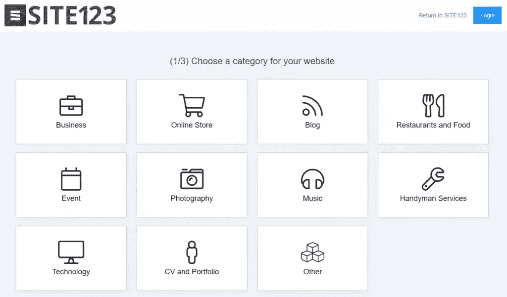
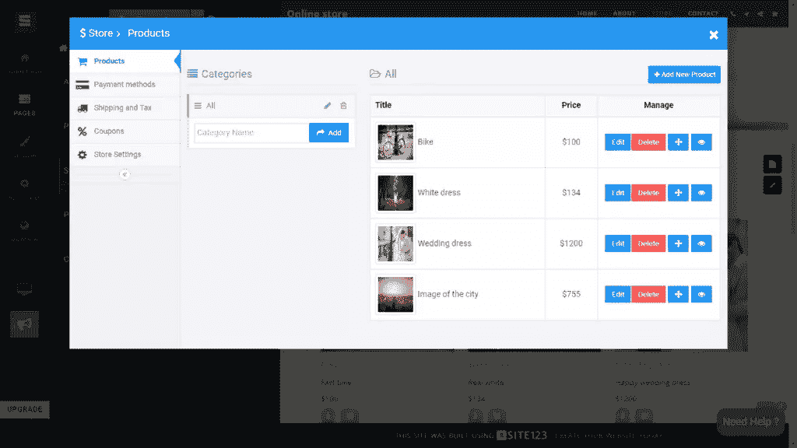

# 网站 123:节省时间和金钱的网站建设者

> 原文：<https://www.sitepoint.com/site123-website-builder-save-time-money/>

*本文是与 [SITE123](https://site123.com) 合作创作的。感谢您对使 SitePoint 成为可能的合作伙伴的支持。*

花几分钟，做一些小小的调整，上传你的内容，你就会拥有一个拥有 SITE123 的惊艳网站。

互联网现在充满了让你创建自己网站的平台——这不是新闻。

然而，那些已经沉浸在试图在虚拟世界建立品牌的宇宙中的人知道，找到一个好的既完整又安全的免费网站建设者是多么困难。

找到一个好的平台可能是一项艰巨的任务。这需要做一些研究，创建几个用户账户，你仍然有可能找不到建立网站的理想地点。

但是你再也不用担心了，因为现在你已经设法找到了合适的地方，不用任何投资就可以创建自己的网站。

[SITE123](https://www.site123.com) 是一个丰富的平台，它的布局可以让你根据你的业务领域来建立你的网站。

SITE123 是最近市场上增长最快的网站建设者之一，因为它为客户提供了方便和实用性。

你将不必花费数小时设计和编码一个网站。如果你不会编码，你也不必为程序员/网站开发者付费。你可以用最简单快捷的方式自己创造一切，而不必为此聘请任何专业知识。

除了让你的口袋装满和你的日程自由之外，你还可以自豪地说，你已经能够在不到一个小时内创建一个网站**。**

 **还有比这更好的吗？

## 模板

SITE123 为任何类型的企业提供最好的免费网站模板。这里的一个很大的区别是，您不会被选项淹没，所以很容易在模型中进行选择。

你的目标是[创建一个免费博客](https://www.site123.com/create-a-blog)、商店、作品集或商业频道？你只需要选择与你的目标相匹配的选项，你将立即被重定向到正确的网站画布。然后你只需要插入一些信息来定制模板的主要部分。

之后，您可以使用实际的网站生成器进行所有您想要的更改，直到您的页面达到您想要的效果:现代且引人注目。

## 特征

SITE123 对你来说各方面都有几个优势。你会发现:

*   **免费托管**-除了免费创建网站，你不必担心支付托管费用，以保持你的网站在空中。平台会完全负责为你打理好这部分，以专业高效的方式。您可以放心，您的网站的速度和运行将始终得到保证，而不必支付托管费用。
*   SEO 工具-有了 SEO 工具，你的网站将有可能出现在整个互联网的搜索引擎结果中。每当有人在谷歌搜索栏中输入与你网站内容相关的内容时，你就有机会出现在搜索网页的人面前。这样，你就有机会吸引**更多的关注者进入你的空间**，而不必投资于从事 SEO 开发的经验丰富的专业人士，也不必花时间在各种形式的数字广告上。
*   **24 小时支持**–site 123 的 24 小时支持随时为您提供所需的一切帮助。每当您有疑问或遇到问题时，您将获得技术支持的帮助。还有一个问题和答案的支持区，很可能你的问题的答案已经准备好了，可以帮助你。
*   **设计工具**——在平台上，你会发现几个专业的设计工具。它们非常容易使用，所以你可以照顾你的页面的外观和亮点，这是获得新粉丝的一件非常重要的事情。你可以用自己的品牌，以一种简单的方式建立自己的网站。永远记住，当主题是一个在线页面时，第一印象很重要。为你的网站访问者做一个好的展示。
*   伟大的免费图库–在 SITE123，你将拥有伟大的图像、图标和视频库，完全免费用于创建你的网站。你不必浪费时间去寻找免版税的图片，甚至不必为了拥有一个可以使用的图库而去购买昂贵的照片库。选择正确的图片，看起来你已经雇佣了一个顶级摄影师来为你的网站拍照。
*   **无限页面**–如果你打算在网站上发布大量内容和页面，你不必担心。SITE123 是为了确保世界上所有的页面和新网站的空间，所以你的内容可以不受任何限制或约束地发布。即使需求很高，你也不必担心。我们支持你。
*   **响应性**-有了 SITE123 的响应模板，任何人都可以很容易地在任何设备上访问您的网站，无论是手机、平板电脑、电脑等。您的页面的显示和呈现将适合每种不同类型的设备。这使得你的追随者可以随时随地访问你的网站，同时拥有相同的体验。这也使它更适合那些只能使用一种设备的客户，比如手机。有了响应式模板，人们肯定会轻松地使用任何设备浏览你的网站。
*   **与社交网络的互动**——将你的网站和社交媒体联系起来，将极大地帮助你从其他地方推广和吸引人们到你的新网页。在社交网络上放上你网站的链接，在那里推广你的业务和网页。另外，反过来把社交媒体链接放在你的网站上。SITE123 可以让你做到这一切。
*   多语言选项——这可能是所有特性中最令人印象深刻的。SITE123 有助于让来自其他国家和讲其他语言的人毫无问题地访问你的页面。它是怎么做到的？它为你提供了一个多语言工具，这个工具可以立即翻译你的整个网站。有来自世界各地的 80 种不同的语言，所以你可以选择一种作为你网站的官方语言。您还可以通过几次点击来创建多种语言的版本。有了这个功能，其他国家的人将能够关注你的内容，因此，你将最终转化更多的客户。

Site123 提供的功能和优势不止于此。

让我们更进一步，看看最重要的工具之一。

## 电子商务

我们都看到了电子商务在过去几年的巨大增长。作为平台的一部分，SITE123 为您提供了一个高级的[电子商务网站构建器](https://www.site123.com/ecommerce-website)。虚拟销售和网上商店现在几乎是每个人生活的一部分。

在现实生活中，现代公司的第一阶段之一，即创建在线销售网站，是让许多伟大的未来企业家放弃的原因。你不必担心这个问题，因为网站 123 非常容易使用，而且 T2 可以在几分钟内建立一个网上商店。

企业家在网上商店建设方面面临的其他问题是高昂的订阅价格、难以使用的平台以及缺乏安全性。

在 SITE123 上，任何人创建自己的网上商店都非常简单、快速和容易。你可以在这个平台上下注，你的投资是零美元。

在您的在线商店管理面板上，很容易看到您收到了多少订单以及其他详细信息，因此您可以跟踪您需要交付的一切。在这里，您可以非常方便地查看所有销售和库存信息，从而简化您的工作，让您有更多时间专注于发展业务。

除此之外，网站建设者后端提供安全，以及各种安全功能，为 24 小时的运作，在一周的所有日子。全年停机时间收敛到 0%。凭借这种可靠性，您的客户可以随时顺利地进行购买。

不要浪费时间，[现在就创建网上商店](https://www.site123.com/ecommerce-website)！

## 免费增值优势

你可以坐下来放松一下，因为这不是你发现你必须支付数百美元来发布你的网站的时候。

你真的可以[创建一个免费网站](https://www.site123.com)并发布它，而无需支付一分钱。但对于那些正在寻找更专业的东西，使用一个独特的领域，如 yourbusiness.com，你可以指望保费计划。

在 Premium 计划中，您将拥有自己的定制域名、我们平台上的更多存储空间和额外的带宽等。

只有你喜欢，你才会付钱。

如果您订阅了高级计划，但您发现免费版本已经满足了您的需求，并且您想退出付费版本，您可以随时这样做。

这表明了 SITE123 是如何以客户为中心的，但在尝试了溢价计划后，由于其优势，很难放弃它。

对于那些只想有一个自定义域，仅此而已，你可以选择一个更简单的选项。但是当然，它只会随着其他计划变得更好。

好消息是:不管你选择什么计划，如果选择按年、两年或三年付款，你会得到很大的折扣。

如果您已经使用了该服务，并希望获得一个高级包或检查付款方式，只需进入您的仪表板，选择您想要改进的网站，然后单击升级。

## 最后的想法

SITE123 由于其实用性和易用性，每天都在快速增长。它让 100 多万注册用户实现了拥有自己网站的梦想，无论是[博客](https://www.site123.com/create-a-blog)，作品集，还是商店，都不需要花任何钱来启动。

你不需要成为一个专业的开发者，你也不需要理解一行代码来创建你的网站。从今天开始，创建并发布您的网页，以充分利用您企业的未来。

前往 [SITE123](https://www.site123.com) ，免费享受 SITE123 为您提供的所有优惠。

在 SITE123，您的企业拥有成长所需的一切！

## 分享这篇文章**