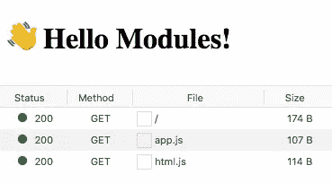

# 今天在浏览器中使用 ES 模块

> 原文：<https://www.sitepoint.com/using-es-modules/>

本文将向您展示如何在浏览器中使用 ES 模块。

直到最近，JavaScript 还没有模块的概念。不可能在另一个 JavaScript 文件中直接引用或包含一个 JavaScript 文件。随着应用程序规模和复杂性的增长，这使得为浏览器编写 JavaScript 变得棘手。

一种常见的解决方案是使用`<script>`标签在网页中加载任意脚本。但是，这也带来了自身的问题。例如，每个脚本发起一个呈现阻塞 HTTP 请求，这会使 JS 繁重的页面感觉迟钝和缓慢。由于加载顺序很重要，依赖性管理也变得复杂。

ES6 (ES2015)通过引入单一的本机模块标准，在一定程度上解决了这种情况。(你可以[在这里](https://www.sitepoint.com/understanding-es6-modules/)阅读更多关于 ES6 模块的信息。)然而，由于浏览器最初对 ES6 模块的支持很差，人们开始使用模块加载器将依赖项捆绑到单个 ES5 跨浏览器兼容文件中。这个过程引入了它自己的问题和复杂程度。

但是好消息就在眼前。浏览器支持变得越来越好，所以让我们看看如何在今天的浏览器中使用 ES6 模块。

## 当前的 ES 模块格局

Safari、Chrome、Firefox 和 Edge 都支持 ES6 模块[导入](https://developer.mozilla.org/en-US/docs/Web/JavaScript/Reference/Statements/import)语法。这是它们的样子。

```
<script type="module"> import { tag } from './html.js'

  const h1 = tag('h1', '👋 Hello Modules!')
  document.body.appendChild(h1) </script> 
```

```
// html.js
export function tag (tag, text) {
  const el = document.createElement(tag)
  el.textContent = text

  return el
} 
```

或者作为外部脚本:

```
<script type="module" src="app.js"></script> 
```

```
// app.js
import { tag } from './html.js'

const h1 = tag('h1', '👋 Hello Modules!')
document.body.appendChild(h1) 
```

只需将`type="module"`添加到您的脚本标签中，浏览器就会将它们作为 ES 模块加载。浏览器将遵循所有导入路径，每个模块只下载和执行一次。



旧的浏览器不会执行未知“类型”的脚本，但是您可以使用`nomodule`属性定义回退脚本:

```
<script type="module" src="module.js"></script>
<script nomodule src="fallback.js"></script> 
```

## 要求

您将需要一个能够通过 import 获取数据的服务器，因为它不支持`file://`协议。您可以使用`npx serve`在当前目录下启动一个服务器进行本地测试。

如果您想在不同的域上加载 ES 模块，您需要启用 CORS [](https://developer.mozilla.org/en-US/docs/Web/HTTP/CORS) 。

如果您足够大胆地在今天的生产中尝试这一点，您仍然需要为旧的浏览器创建单独的包。在 [browser-es-module-loader](https://github.com/ModuleLoader/browser-es-module-loader) 中有一个符合规范的 polyfill。然而，这根本不建议用于生产。

```
<script nomodule src="https://unpkg.com/browser-es-module-loader/dist/babel-browser-build.js"></script>
<script nomodule src="https://unpkg.com/browser-es-module-loader"></script>
<script type="module" src="./app.js"></script> 
```

*   [参见演示](https://modules-in-the-browser-urdpsqcfiy.now.sh/)
*   [查看信号源](https://github.com/sitepoint-editors/modules-in-the-browser/blob/master/index.html)

## 表演

不要扔掉你的构建工具，比如 Babel 和 Webpack，因为浏览器仍然在实现优化抓取的方法。尽管如此，ES 模块在未来仍有性能缺陷和 T2 增益。

### 我们为什么捆绑销售

今天，我们捆绑 JavaScript 来减少 HTTP 请求的数量，因为*网络*通常是加载网页最慢的部分。这在今天仍然是一个非常合理的担忧，但是未来是光明的:ES 模块具有 HTTP2 的能力，可以通过[服务器推送](https://www.smashingmagazine.com/2017/04/guide-http2-server-push/)和实现[预加载](https://www.smashingmagazine.com/2016/02/preload-what-is-it-good-for/)的浏览器来传输多种资产。

### 预加载

[link rel="modulepreload"](https://html.spec.whatwg.org/multipage/links.html#link-type-modulepreload) 即将登陆您身边的浏览器。而不是让浏览器逐个解析所有的模块导入，产生这样的网络瀑布…

```
<script type="module" src="./app.js"></script> 
```

```
---> GET index.html
<---
    ---> GET app.js
    <---
        ---> GET html.js
        <---
            ---> GET lib.js
            <--- 
```

…您将能够预先告诉浏览器页面需要`html.js`和`lib.js`，从而控制瀑布:

```
<link rel="modulepreload" href="html.js">
<link rel="modulepreload" href="lib.js">
<script type="module" src="./app.js"></script> 
```

```
---> GET /index.html
<---
      ---> GET app.js
      ---> GET html.js
      ---> GET lib.js
      <---
      <---
      <--- 
```

### 带有服务器推送的 HTTP2

HTTP2 能够在一个响应中推送多个资源，而 HTTP1.1 只能提供一个资源。这将有助于将网络上的往返次数降至最低。

在我们的例子中，可以在一个请求中交付`index.html`、`app.js`和`html.js`:

```
---> GET /index.html
<--- index.html
<--- app.js
<--- html.js
<--- lib.js 
```

### 贮藏

交付多个较小的 ES 模块可能有利于缓存，因为浏览器只需获取已经更改的模块。生成大型包的问题是，如果您更改了一行，就会使整个包无效。

### 异步/延迟

ES 模块默认不呈现阻塞，像`<script defer>`。如果您的模块不需要按照它们在 HTML 中定义的顺序执行，您也可以添加`async`来在它们下载后立即执行它们。

### 图书馆

流行的库现在开始作为 es 模块发布，但是它们仍然针对 bundlers，而不是直接导入。

这个不起眼的小导入触发了 *640 个请求*的瀑布:

```
<script type="module"> import _ from 'https://unpkg.com/lodash-es' </script> 
```

如果我们做正确的事情，只导入我们需要的函数，怎么样？我们只剩下 *119 个请求*:

```
<script type="module"> import cloneDeep from 'https://unpkg.com/lodash-es/cloneDeep' </script> 
```

这只是一个例子，说明`lodash-es`还不能直接加载到浏览器中。为此，您仍然需要以 ES 模块为目标创建自己的包。

## 浏览器支持

如下表所示，浏览器对 ES 模块的支持很好(并且一直在变得更好)。

我可以使用 es6 模块吗？caniuse.com 主要浏览器支持 es6 模块特性的数据。