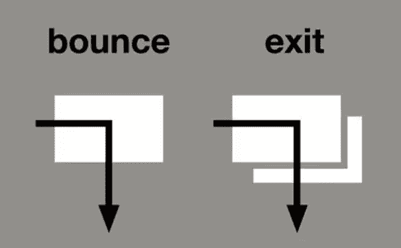
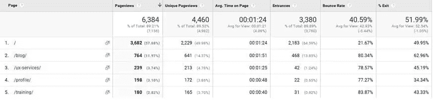
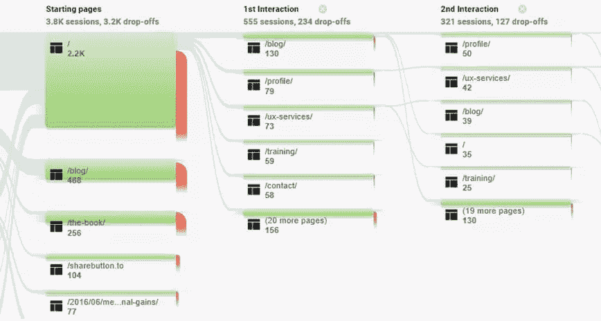
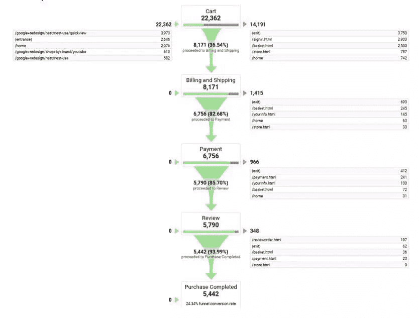
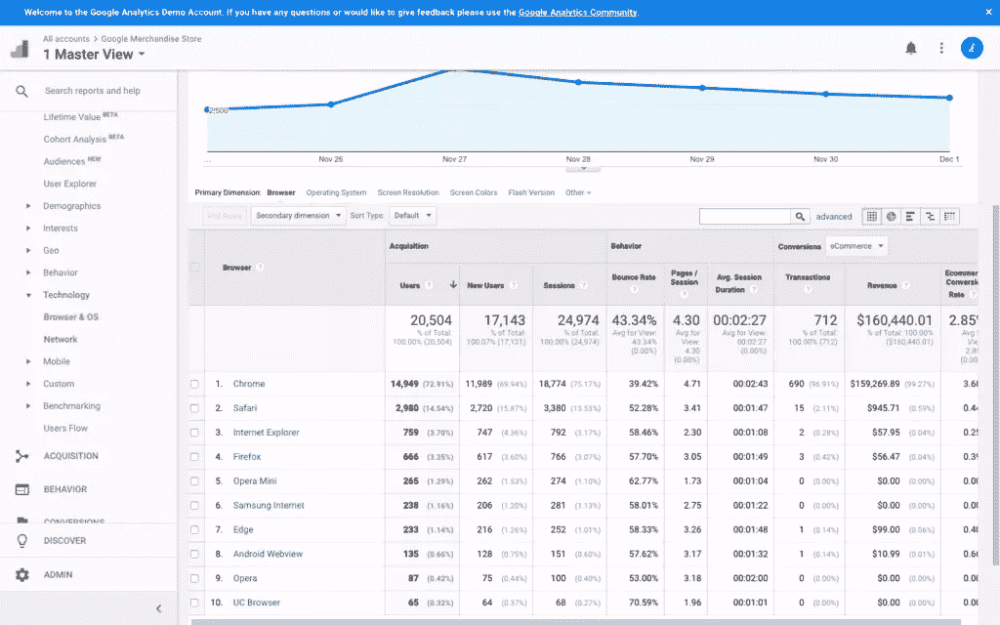
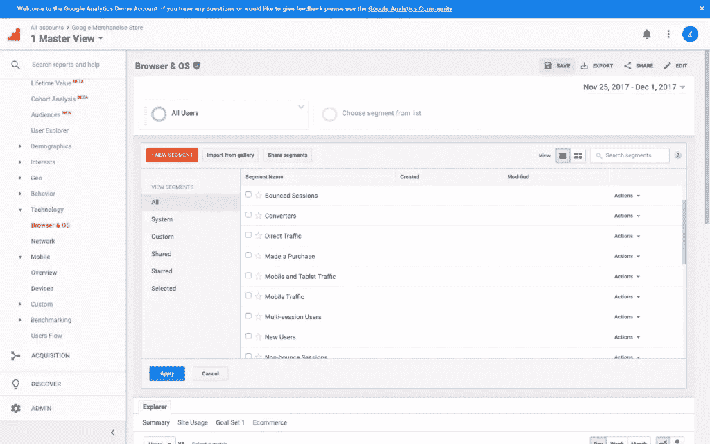

# 使用谷歌分析在你的网站上寻找问题区域

> 原文：<https://www.sitepoint.com/finding-problem-areas-on-your-website-with-google-analytics/>

**找出*T2 的用户在你的网站上做什么可以告诉你*UX 可能在哪些方面有所欠缺。虽然需要进一步的调查来找出*为什么*，但对 UX 设计采取分析优先的方法会告诉你从哪里开始。在这篇文章中，我将告诉你在哪里使用谷歌分析寻找你的网站表现不佳的地方。****

*如果你觉得自己陷入了困境，那么请先阅读我们的介绍性文章“[开始使用谷歌分析](https://www.sitepoint.com/google-analytics-basics-and-pitfalls/)”，或者如果你只是错过了该系列的第二部分，那么这里是我们关于“[如何使用谷歌分析](https://www.sitepoint.com/google-analytics-how-to-perform-user-research/)进行用户研究”的指南。*

好吧，我们开始吧。

## 页面级问题

寻找问题区域的一个很好的起点是查看单个页面的性能。要注意的关键指标是跳出率和退出率。这两个指标经常引起混淆，但是理解它们之间的区别是非常重要的。

**反弹**指的是对一个网站的访问(或“会话”)，在此期间，用户在离开之前只查看了一个页面。一个**退出**是指用户离开你的网站的时刻。用户可以在退出前查看多个页面，这也是退出不同于弹回的地方。跳出率和退出率分别是跳出率和退出的用户的百分比。

看看我自己网站上的指标，[lukehay.co.uk](http://www.lukehay.co.uk/):

如你所见，`/training/`网页的跳出率很高，这表明它没有引导访问者查看网站上的任何其他页面。看来我需要让这个网页更吸引人！

页面的退出率很高，尽管这是意料之中的事，因为用户在给我发消息后自然会想退出网站。在做出假设之前，一定要考虑用户的意图。在这种情况下，退出率似乎与预期一致。

## 页面值

页面值对于识别哪些页面有助于转换非常有用。页面价值是 Google Analytics 赋予单个网页货币价值的方式。对于电子商务网站，谷歌分析从交易收入中获取价值，对于所有其他类型的网站，它获取[目标价值](http://www.seerinteractive.com/blog/how-to-calculate-goal-values/)。以下是页面价值的计算方法:

从 UX 的角度来看，你真正需要知道的是，对转化(金融和非金融)贡献更大的页面通常会有更高的页面价值。这意味着您通常可以使用此指标来识别转换过程中的关键页面。

然后，您可以将注意力集中在任何具有高页面价值以及高跳出率或退出率的网页上，因为这些页面可以被认为是从您的网站“泄漏”价值的，这可能是由于用户体验中的严重缺陷。

*你也可以使用[事件跟踪](https://www.sitepoint.com/google-analytics-track-javascript-ajax-events/)来分析页面上的行为(这是指用户在没有在浏览器中加载新网页的情况下与网页进行交互)，尽管这需要由开发人员手动设置。*

## 用户旅程

孤立地看特定的网页当然会让你了解你的网站是如何运行的，但是为了得到完整的图片，你也需要看用户的旅程。Google Analytics 中的行为流报告(*行为→行为流*)帮助你可视化用户实际上是如何浏览你的网站的。

虽然这些报告看起来很酷，但它们可能很难解读。如果你想找到真正有用的见解，你需要花一些时间来详细探索这些用户旅程。与大型网站相比，用户访问次数较少的小型网站更容易使用这些报告进行分析。

## 转换漏斗

转换漏斗可以用来更好地理解你的用户在哪里脱离了转换流。这些漏斗将显示在某个转换的旅程中的每一步，以及你的用户在哪里进入和退出这些旅程。转化漏斗报告可以在*转化→目标→漏斗可视化*下找到。

以下示例摘自一个电子商务网站:

该报告显示，虽然有超过 22，000 名用户进入购物车，但总共只有 5，442 名用户继续完成购买。它还显示，最大的遗漏发生在第一步，36%的用户在购物车和账单/运输步骤之间遗漏，因此我们已经发现了另一个问题领域。对这些问题领域进行改进可能会大大提高销售转化率。漏斗报告还为您提供了一种体面的方式来衡量您对这些用户旅程中的步骤所做的更改的影响。

## 搜索术语

您需要查看的另一个报告是内部搜索报告(*行为→站点搜索→搜索词*)。该报告将告诉您用户在您网站的搜索框中输入了哪些搜索词(如果您有搜索框的话)。在此框中键入的最流行的搜索词通常分为两类:

1.  内容/产品存在于您的网站上，但很难找到，所以您需要改进对它的发现。
2.  内容/产品在你的网站上不存在，因此你可能想寻找内容或开始购买产品。

如果您看到某个特定术语的搜索量很高，您需要考虑这意味着什么，以及您是否还能做些什么来帮助这些用户找到他们想要的东西。

## 技术

浏览器(*受众→技术→浏览器&操作系统*)和设备(*受众→移动→设备*)报告可以帮助您找到网站表现不佳的地方。虽然移动设备上的转化率可能会较低，但设备概览报告可能仍会向您显示有改进的空间。例如，如果你的移动转换率比你的桌面转换率低 10 倍，你可能想知道为什么会这样！

您的网站在不同浏览器上的表现也可能不同，这可能意味着开发问题/浏览器不兼容。例如，如果您的网站在 Internet Explorer/Edge 中转换不佳，您可能希望检查您的网站在该浏览器中是否正确呈现并按预期执行。

同样的原则也适用于设备类型。如果你的网站指标在某个设备上看起来很差，你会想在那个设备上(或者在模拟器上)好好看看，看看是否有什么明显的问题。

## 为结果分段

当分析你的网站的性能时，你也可以[分割你的数据](https://www.smartinsights.com/google-analytics/google-analytics-segmentation/segmenting-google-analytics/)以更好地了解它对特定用户群的表现。正如我的文章“[如何使用谷歌分析](https://www.sitepoint.com/google-analytics-how-to-perform-user-research/)进行用户研究”中所述，你可以根据你的关键用户群在谷歌分析中创建细分市场。这样做可以让你发现是否只有某些群体有问题。

例如，细分可以帮助你看到，你的老年人口在平板设备上的转化很差，或者德国用户由于支付限制而在你的转化漏斗的支付阶段退出。请记住，仅仅因为你的网站的总体指标看起来不错，并不意味着你的所有用户都同样满意。总有改进的空间。

您可以通过点击 Google Analytics 界面顶部的 *+添加细分市场*按钮来对用户进行细分，您可以从列表中选择一个细分市场，也可以点击 *+新细分市场*来定义自己的细分市场。

## 结论

在你的 UX 设计过程中采取一种*分析优先*的方法是一种极好的方式，可以发现你应该在哪里集中更多的定性努力。谷歌分析会告诉你*你的网站发生了什么*，然后由你来找出*为什么*可能会这样。谷歌分析一开始可能会令人望而生畏，但花时间学习如何使用它是值得的，因为可以从这些数据中获得如此多的洞察力。

请务必查看我们 UX 分析系列的所有文章。

要深入了解 UX 分析，请查阅 SitePoint 的书[研究 UX:分析](https://www.sitepoint.com/premium/books/researching-ux-analytics)。

## 分享这篇文章