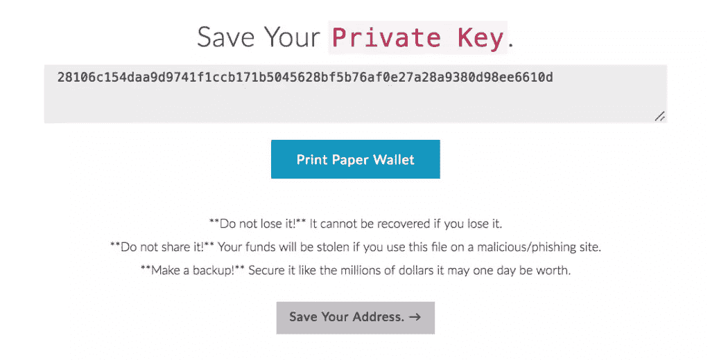
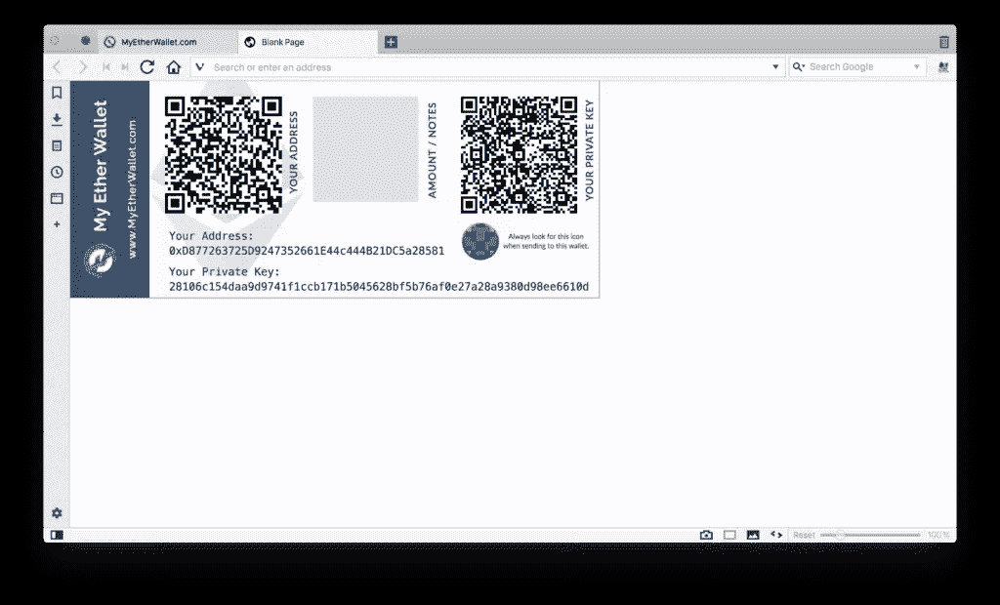
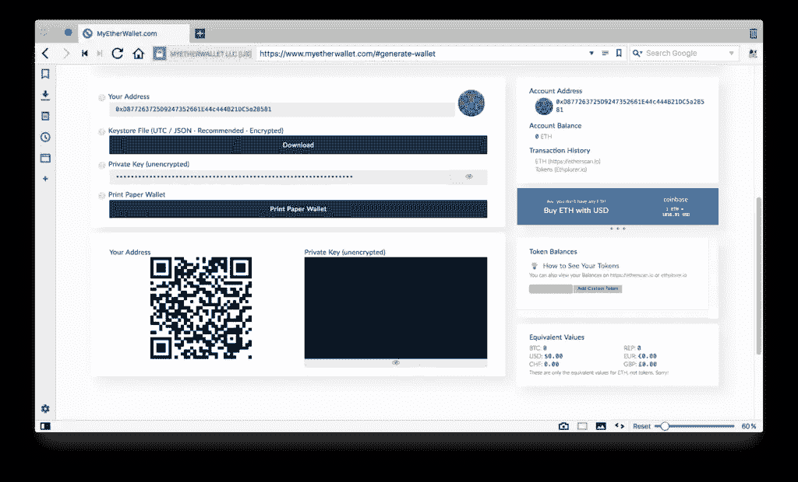
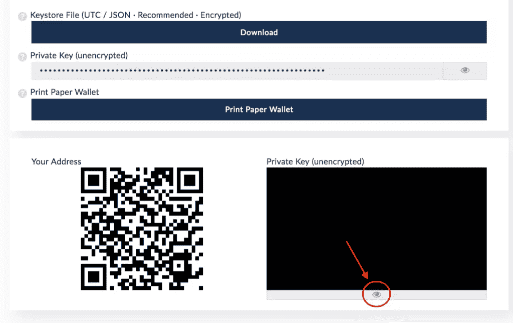
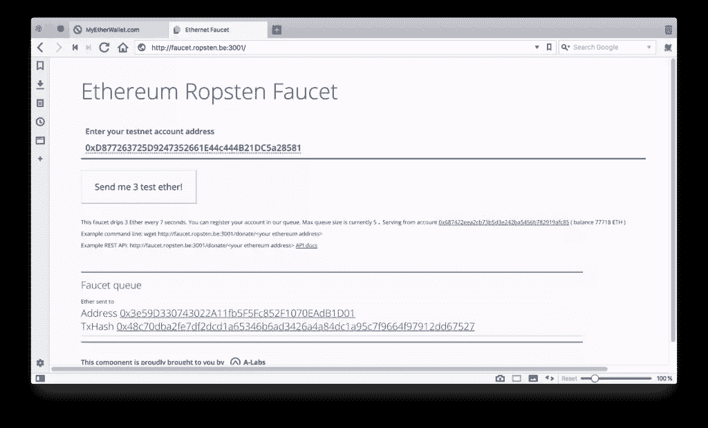
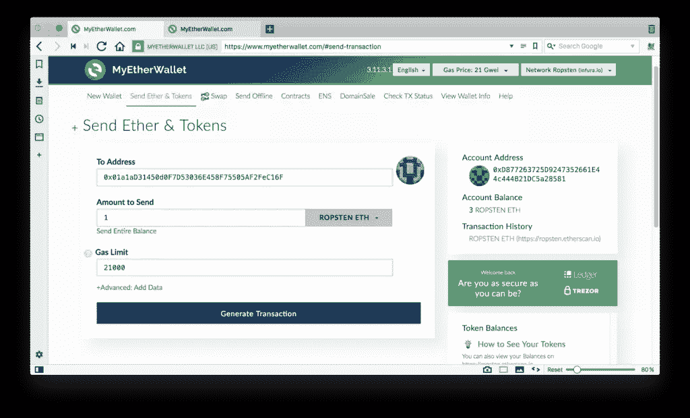
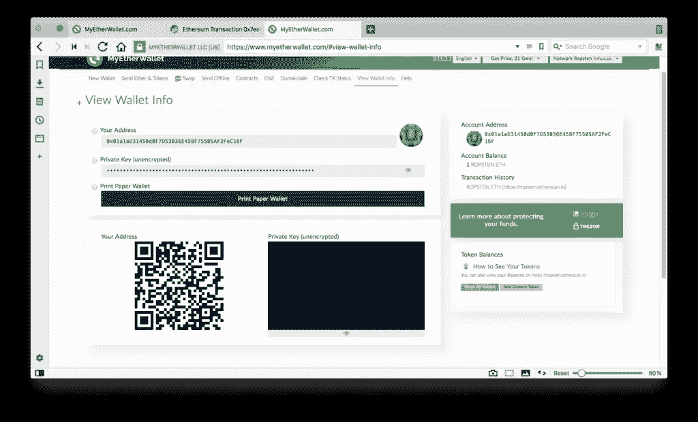

# 以太坊钱包:用我的以太钱包发送和接收以太

> 原文：<https://www.sitepoint.com/ethereum-wallets-myetherwallet/>

**在本文中，我们将介绍生成您的第一个以太坊钱包以及通过 MyEtherWallet 接口发送和接收以太的过程。**

为了更好地理解以下信息，建议您首先阅读以下内容:

*   [什么是区块链？](https://www.sitepoint.com/blockchain-what-it-is-how-it-works-why-its-so-popular)
*   [以太坊是什么？](https://bitfalls.com/2017/09/19/what-ethereum-compare-to-bitcoin/)
*   [什么是加密货币钱包？](https://bitfalls.com/2017/08/31/what-cryptocurrency-wallet/)

* * *

有许多方法可以与以太坊区块链互动。在这个片段中，我们将使用 [MyEtherWallet](https://myetherwallet.com) (MEW)。

注意:打开网站后，请将它加入书签，这样你就不必再将它粘贴到你的浏览器中。有许多坏人想要你的以太，他们已经购买了与这个网站的域名相似的域名，希望你会因为输入错误而落入那个陷阱！

加载后，页面会立即显示一些警告，说明他们不是银行，如果你因为他们没有权限存取资金而损失了资金，他们基本上无法帮助你。要点是你要对自己的资金负责。

## 创建和读取地址

MEW 的第一个屏幕是“输入密码”屏幕。输入新钱包的密码。(让它变得复杂但容易记忆，或者使用像 LastPass 这样的密码生成器。)

地址马上在后台生成，但是 MEW 还不让你看。只要您没有将密钥库文件保存在安全的地方，您就不能继续。点击*下载密钥库文件(UTC / JSON)* 并存储在 u 盘上，然后对好奇的家人隐藏。该文件将被命名为类似于`UTC--2018-01-26T10-39-56.592Z--d877263725d9247352661e44c444b21dc5a28581`的名称。第一部分是创建日期，第二部分是地址本身。安全存储后，下一个屏幕将显示[私钥](https://bitfalls.com/glossary/#private-key)。

***非常重要！！**私钥在访问级别上等同于您之前下载的文件。两者都可以导入钱包软件，用来解锁一个地址，在上面花钱。但是有一个**重要的区别**:私钥**不需要密码！**如果您将私钥输入另一个工具，如 [MetaMask](https://bitfalls.com/2018/02/16/metamask-send-receive-ether/) ，该地址将立即解锁，无需密码，可用于发送以太网和令牌。如果您将之前下载的文件导入到任何钱包软件中，在允许您完全访问它之前，它将需要密码。因此，最好只保留一种方法:要么存储文件并记住密码，要么只将私钥存储在一个非常安全的位置。破坏其他方法。进入钱包的方式越少，钱就越安全。*

您可以在同一个屏幕上生成一个[纸质钱包](https://bitfalls.com/2017/09/08/best-ways-protect-cryptocurrency-wallet/)。这将打开一个新的标签，带有两个 QR 码的可打印布局。一个是公钥——您可以向其发送资金和代币的地址——另一个是上面提到的私钥。

如果你打算用这个地址来长期持有乙醚，聪明的做法是把它打印出来，存放在一个保险箱里，就像你有一张债券或一大叠现金一样。

完成这些步骤后，MEW 让我们解锁钱包并查看其信息。这可以通过两种方式实现:

*   选择一个 Keystore/JSON 文件将为您提供一个表单，通过它您可以上传之前下载的文件。然后你会被要求输入密码。
*   选择私钥可以让您将私钥直接粘贴到字段中，从而解锁地址以供使用。

解锁您的钱包，您应该会看到类似下图的内容:

如果您丢失或破坏了以前的钱包，该接口允许您再次打印钱包，或者如果您丢失了 JSON 文件并使用私钥访问了钱包，则允许您重新下载 JSON 文件。可以通过点击屏幕底部黑色矩形下的眼睛图标来读取私钥的 QR 码。

在右边，你可以看到你的账户余额:0 Eth。再往下一点，您可以看到*代币余额*框，显示您有多少代币。因为有大量的可用令牌，你首先需要点击*显示所有令牌*来加载它们。

这个屏幕是可见的，因为你在*查看钱包信息*选项上，MEW 在创建后会自动将你重定向到这个选项。发送令牌或以太时，使用的选项是*发送以太和令牌*。

## 接收乙醚

在*查看钱包信息*屏幕上，左下角的二维码是代币和乙醚可以发送到的地址。代码的值相当于顶部的*你的地址*中的值，以及右边栏的*账户地址*中的值。

要接收一些以太，让我们切换到 Ropsten 测试网络。在屏幕的右上角，您可以选择要连接的网络:

随便挑一个。屏幕将刷新，你必须重新进入钱包。通过*发送以太&令牌*标签重新进入后，界面会略有不同。没有二维码，余额将在 ROPSTEN ETH，而不是 ETH。

测试网是在没有经济后果的情况下，测试以太坊区块链的环境。你可以在这里找到更多关于他们[的信息。接下来打开 Ropsten 水龙头。这是一个让我们申请免费香水的页面:](https://bitfalls.com/2018/02/08/what-is-an-ethereum-testnet-and-how-is-it-used/)[水龙头.香水. be:3001](http://faucet.ropsten.be:3001)

在收件人字段中，输入您的钱包地址。从 MEW 的*账户地址*部分复制。

以太应该在一两分钟内到达，这取决于测试网有多忙。

## 发送以太网

现在让我们送一些乙醚。在一个新的标签中，再次打开 MEW 并生成另一个钱包，按照之前的说明。用测试以太网将这个新生成的地址公钥(*账户地址*)复制到原来解锁的钱包的*到地址*字段。

将金额设置为小于最大值，并点击*生成交易*。生成后，用*发送交易*确认。

将出现另一个确认窗口，列出迄今为止提供的所有信息:

*   发件人和收件人
*   数量
*   发送方账户余额
*   正在发送硬币
*   正在使用的网络
*   [气限](https://bitfalls.com/2017/12/05/ethereum-gas-and-transaction-fees-explained/)和价格——即交易成本
*   随机数和数据(现在不相关)。

确认发送。发送后，屏幕底部会出现一条绿色的确认信息，并带有一个*验证*链接，让你可以查看以太坊最受欢迎的[区块浏览器](https://bitfalls.com/2017/10/03/read-bitcoin-blockchain-data-blockexplorer/)ether scan 上的交易。以太网扫描可以访问 Ropsten 网络并对其进行检查。

TX 是这样看待我们上面的案例的:

待定表示交易仍在处理中。[油价](https://bitfalls.com/2017/12/05/ethereum-gas-and-transaction-fees-explained/)越高，就越快转化为成功。一旦成功，第二个新地址的 ROPSTEN ETH 状态将会改变(有时需要重新解锁，因此 MEW 会记录这些改变)。

## 结论

MyEtherWallet 是一款简单安全的工具，用于与以太坊区块链互动。你可以使用它来与合同互动，注册域名(如 bitfalls.eth)，跟踪账户，激活智能合同，发送以太网，甚至运行分散的应用程序(在后续帖子中会有更多相关内容)。

虽然 MEW 是一个非常安全的选择，但没有什么能像 Ledger Nano S 一样比得上硬件钱包的安全性。鉴于 MEW 的界面可能看起来有点复杂，还有一个更简单的替代方法——[meta mask](https://bitfalls.com/2018/02/16/metamask-send-receive-ether/)。

## 分享这篇文章