# 15 个引导工具和操场

> 原文：<https://www.sitepoint.com/bootstrap-tools-playgrounds/>

在本帖中，我们在网上搜寻了一些引导工具和游戏场所，并只与你分享其中最好的。

网页设计者和开发者在一个伟大的行业中工作。我们的专业知识和对廉价开发资源的访问使我们有能力做一些独特的事情——一些在少数(如果有的话)行业中发现的事情:为其他网页设计者和开发者发布工具的能力。

像我们这样的人有很多工具。其中许多是免费的，有些是付费的。都很牛逼。

几乎所有东西都有工具和平台，包括 Bootstrap。我们来回顾一下其中的佼佼者。

## 1.滴

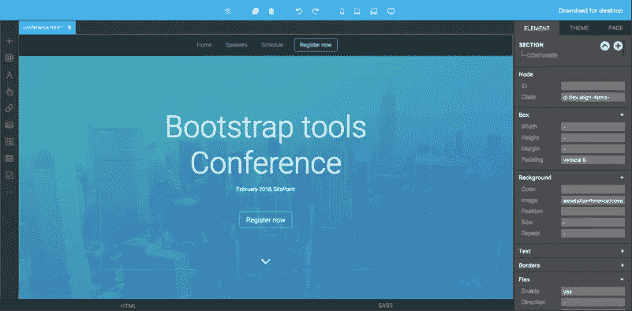

**价格**:非商业用途免费或一次性支付 99 美元

Pingendo 是一个 Bootstrap 4 builder，有两种版本，一种是在线版本，另一种是桌面版本，适用于 Windows、macOS 和 Linux。

Pingendo 提供了相当不错的模板选择，可以让你真正启动你的网页设计。在可用的模板中，您会发现一个应用程序介绍网站、一个会议网站模板和一个餐厅模板，它们有不同的主题。

还有许多现成的线框，包括相册、封面、结帐表单页面、登录页面、产品页面和价格表。

## 2.[白利度](http://brix.io/)

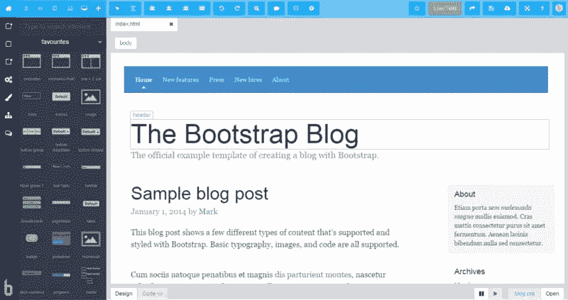

**价格**:14.90 美元/月起

Brix 是一个引导构建器，用于设计、创建和编辑响应网站和用户界面。该服务完全基于云，作为 Bootstrap 框架的快速原型工具而构建。

该工具源自自启动开始以来收集的经验。

20 多种模板也可用作网页的起点。

## 3.[喷气背带](https://jetstrap.com/)

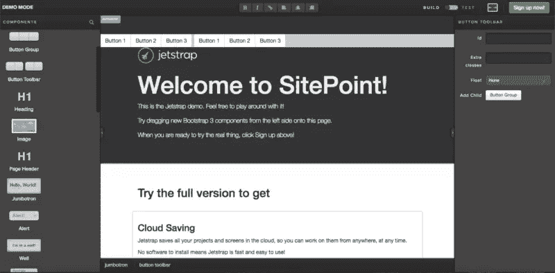

**价格**:3 个项目每月 16 美元起

Jetstrap 是一个引导界面构建器，它是实体模型工具和界面构建工具的结合体，将两者的一点都带到了桌面上。事实上，最棒的是，你实际上是在动态地构建它们，而不是模仿你的屏幕。

该工具是完全基于网络的，包括拖放组件和良好的干净标记片段，可以轻松创建复杂的组件。

## 4.[松树生长](https://pinegrow.com)

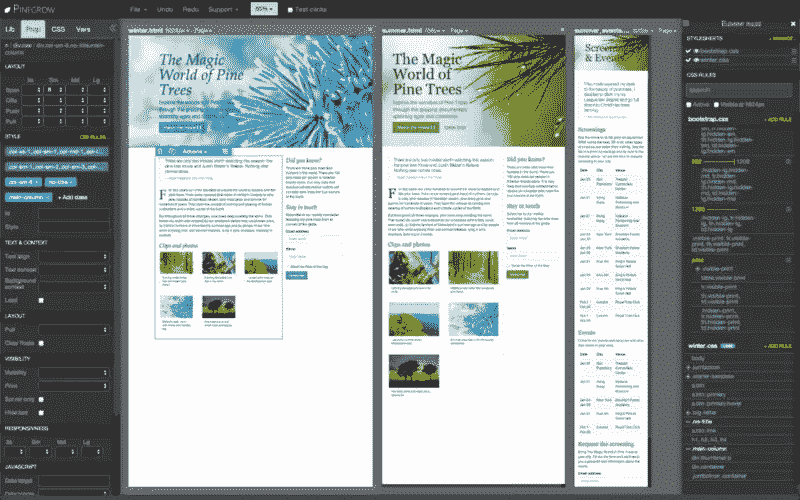

**价格**:49 美元起

Pinegrow 是一个桌面 web 编辑器，允许你使用实时、多页面编辑、CSS 和 Sass 样式以及 Bootstrap、Foundation 和 WordPress 的组件来构建响应站点。

适用于 macOS、Windows 和 Linux，您可以使用 Bootstrap 3、4 或其他您喜欢的框架进行开发。

## 5.[自举工作室](https://bootstrapstudio.io/)

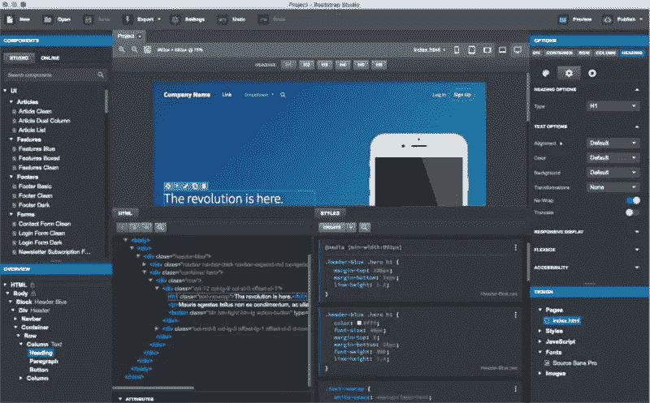

**价格**:25 美元起

Bootstrap Studio 是一个桌面应用程序，但它提供了其功能的在线演示。

它是围绕拖放功能构建的，带有一组相当好的内置组件，包括页眉、页脚、图库和幻灯片。

## 6\. Bootply

**价格**:免费带广告，9 美元/月

Bootply 将自己标榜为 Bootstrap 游乐场、编辑器和构建器。

到目前为止，在我们看到的所有工具中，这似乎是最适合那些喜欢拥有拖放功能，但手头拥有完整编码能力的人的工具。它允许您在代码编辑器和预览之间切换，以便您可以快速检查您的构建。

Bootply 还附带了许多预构建的初学者模板，可以让您快速启动并运行。除了普通的登录页面、单页应用程序或文章，你还可以获得更复杂的模板，如控制面板和仪表板模板，以及技术新闻网站的现代布局。

## 7. [BootMetro](http://aozora.github.io/bootmetro/)

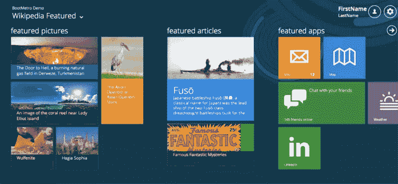

**价格**:免费

这是一个简单的 UI 框架，允许你使用 Bootstrap 创建一个类似 Metro 的界面。

## 8. [BootTheme](https://www.boottheme.com/)

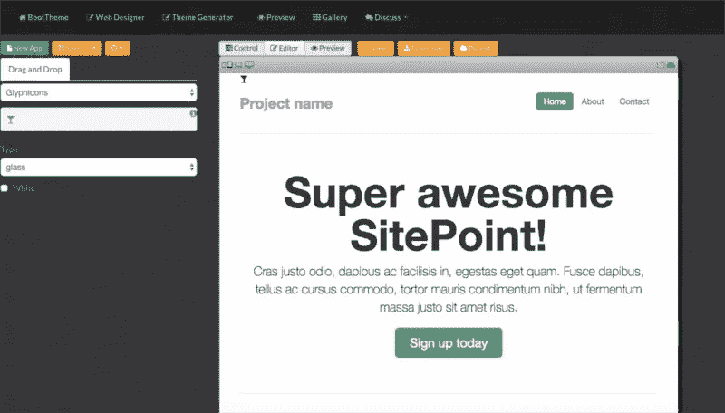

**价格**:免费或 9.99 美元/月

用一句口号*在 5 分钟内建立一个网页，不需要编码*，你可以知道这个工具最强的地方。

本质上，它是另一个 UI 生成器，允许您使用拖放和必要的代码调整来生成整个 UI。

## 9.[摆弄自举](http://jsfiddle.net/S9qrZ/1/)

**价格**:免费

你可能已经见过 JSFiddle，一个流行的 JS 游乐场。但是，如果您还想摆弄 Bootstrap 呢？

上面是一个 js diddle 工作区，其中 Bootstrap 资源及其依赖项作为外部资源添加，因此您可以在 Bootstrap 环境中进行 js diddle。

这是为控制狂准备的——所有想自己动手的人——所以没有组件，没有拖拽，什么都没有。

这是一块供您摆弄的白板，非常适合运行一些测试来让东西按照您的方式工作，快速而便宜，并具有您需要的所有控制。

## 10.[js fiddle(Bootstrap+Font Awesome)](https://jsfiddle.net/codeandcloud/vk3qw09f/)

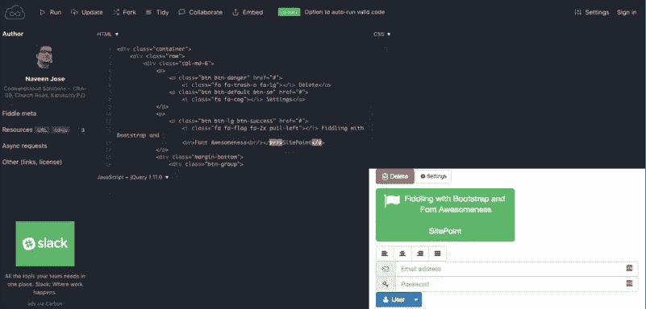

**价格**:免费

虽然之前的工具只涉及 Bootstrap，但这个工具是 Bootstrap + [Font Awesome](http://fontawesome.io/) ，所以你也可以嵌入字体，随心所欲地摆弄。

## 11.[启动按钮](https://www.bootpress.org/)

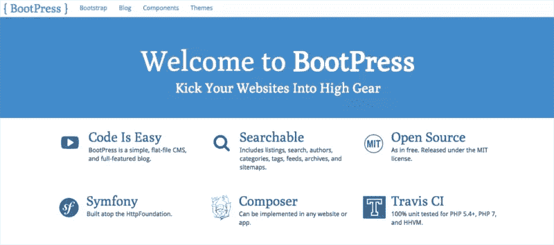

**价格**:免费

BootPress(灵感来源于 WordPress？)实际上是一个简单的平面文件 CMS 和博客框架，您可以将它添加到您的项目中，以便快速地将该功能添加到您的引导项目中。此外，它还有许多包装器和组件，用于分页、表格、层次结构、验证等。，以及一些现成的主题，你可以用它们来开始一个博客或网站。

## 12.[鞋带](http://shoelace.io/)

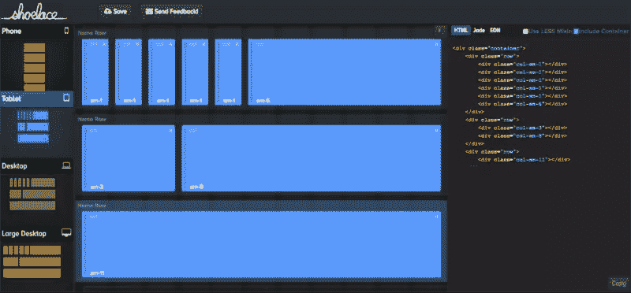

**价格**:免费

如果您正在努力完成您的引导网格，您可以尝试可视化地设计它们，并自动生成代码，准备好粘贴到您的项目中。

这就是鞋带为你做的，它还包括所有为你照顾的响应引导类。

## 13.[过渡不足](https://understrap.com/)

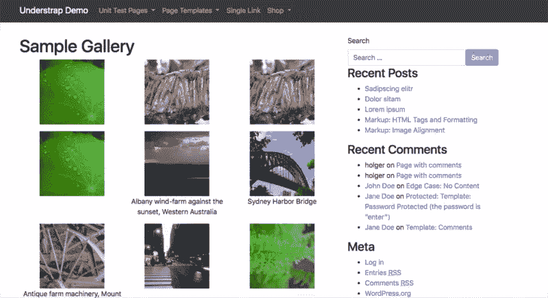

**价格**:免费

Understrap 有点像是[主题、WordPress 和 Bootstrap](https://www.collectiveray.com/wordpress/wordpress-tutorials/converting-psd-to-responsive-wordpress-using-bootstrap-in-just-5-steps.html) 的组合——这是一个基于 Automattic 和 Bootstrap 4 的[下划线主题](https://underscores.me/)的主题，因此如果你想创建一个 Bootstrap 支持的 WordPress 主题，这是一个很好的起点。

## 14.[自举按钮发生器](https://bootsnipp.com/buttons)

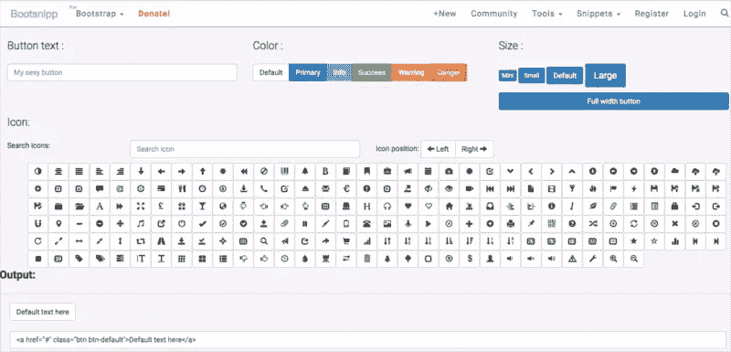

**价格**:免费

我努力让我的项目中的按钮看起来完美。一组好的按钮是一个好的用户界面和一个伟大的用户界面的真正区别。

然而，摆弄按钮可能很费时间。

这个引导按钮生成器通过提供一个易于使用的生成器来缩短时间，您可以根据需要进行调整。

## 15.[密码笔](https://codepen.io/)

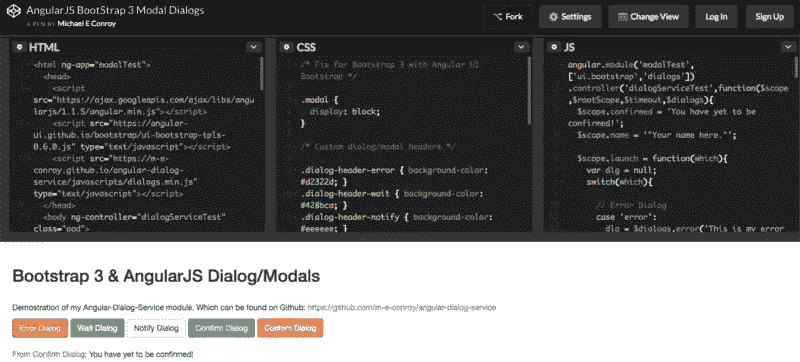

**价格**:免费，约 8 美元/月

我们把最好的留到了最后。

毫无疑问，这是最成熟的代码平台，当然，它完全支持 Bootstrap。Chris Coyier 的宠物项目已经迅速发展成为最受网站设计者和开发者欢迎的网站之一。

CodePen 不仅仅是一个游乐场。它也是其他人可以分享的实验的宝库。因此，为了让你开始使用 Bootstrap 构建的笔，[点击此链接，查找使用 Bootstrap](https://codepen.io/search/pens?q=bootstrap&limit=all&type=type-pens) 标记的最受欢迎的笔。

正如你所看到的，引导工具和操场是相当丰富的。你可能真的有点不知如何选择。

我们强烈建议尝试每一种方法。最终你会找到你自己喜欢的一套工具，你会继续使用它。在这一点上，这是一个挖掘并开始使用 Bootstrap 进行设计和编码的问题！

**如果你听说过 Bootstrap，但因为它看起来太复杂而推迟了学习，那么请浏览我们的[Bootstrap 简介 4](https://www.sitepoint.com/premium/courses/introduction-to-bootstrap-4-2984) 课程，快速而有趣地了解 Bootstrap 的强大功能。**

## 分享这篇文章