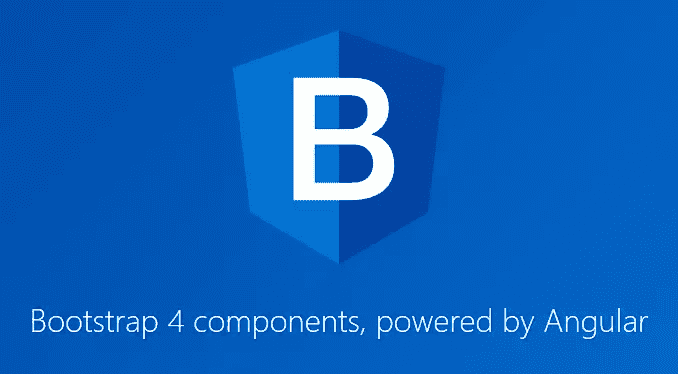
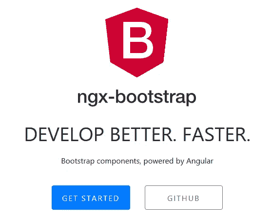
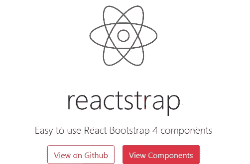
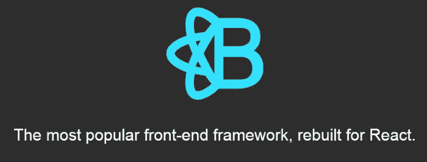
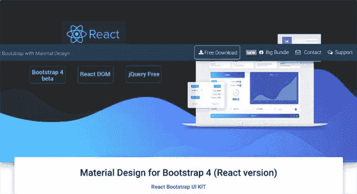
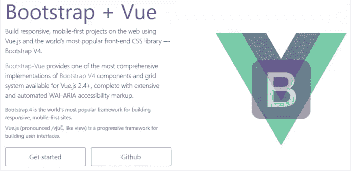

# Angular、React 和 Vue.js 的引导用户界面库

> 原文：<https://www.sitepoint.com/bootstrap-ui-libraries-angular-react-vue/>

**本文列出了许多为 Angular、React 和 Vue.js 应用程序提供引导组件的资源。**

如今，web 上充斥着单页应用程序(SPAs ),它们感觉起来很快，对用户交互的响应也很快。通常，它们由 JavaScript 框架驱动，如 [Angular](https://angularjs.org/) 、 [React](https://reactjs.org/) 和 [Vue.js](https://vuejs.org/) 。

这些库是很好的工具，有助于保持构建 spa 所需的 JavaScript 代码更有组织性和可维护性，同时使用巧妙的技术来更新 DOM，而不会降低 web 页面的速度。

当谈到使用这些库创建的组件样式时，您有太多的选择:您可以像在普通网站上一样编写自己的全局 CSS 文档，可以编写内联样式，或者可以使用 UI 框架——这是我在这里将重点介绍的。

## 角度开发者的引导界面元素

[Angular](https://angularjs.org/) 是我在本文中讨论的最古老的框架。它的成熟和在 JavaScript 框架[残酷的生命周期](https://stackoverflow.blog/2018/01/11/brutal-lifecycle-javascript-frameworks/)中的长久生命是它为 web 项目打下坚实可靠基础的标志。

如果你想使用 Bootstrap 来设计你的 Angular 应用程序，有哪些工具？

### ng 自举



ng-bootstrap 提供了一组 bootstrap 风格的组件，使得用 Angular 构建 Bootstrap 应用变得轻而易举。

更具体地说，这个资源包含一组基于 Bootstrap 的标记和样式的[角度指令](https://docs.angularjs.org/guide/directive)。要使用它，重要的是不要包含任何引导 JavaScript 文件。你只需要 Angular 和 [Bootstrap CSS](http://getbootstrap.com/docs/4.0/getting-started/introduction/) 文件。

ng-bootstrap 是一个免费的[开源项目](https://github.com/ng-bootstrap/ng-bootstrap/blob/master/CONTRIBUTING.md)。请随意为它做贡献或者在 GitHub 上询问新的特性。

### ngx-自举



这是由 Angular 提供支持的另一个伟大的、开源的引导组件模块化库。您不需要使用 jQuery 或任何 Bootstrap JS 代码，尽管标记和 CSS 由 Bootstrap 提供。

要使用`npm`安装库，请在命令行中键入以下内容:

```
npm install ngx-bootstrap --save
```

然后在`index.html`文档中包含 Bootstrap 样式表的链接:

```
<link href="https://maxcdn.bootstrapcdn.com/bootstrap/4.0.0/css/bootstrap.min.css" rel="stylesheet">
```

你可以参考 ngx-bootstrap 网站上的 awesome [docs](https://valor-software.com/ngx-bootstrap/#/getting-started) 页面，获取详细的解释和教程。

## React 开发人员的引导界面元素

由脸书开发者创建，是构建现代用户界面的最时尚的 JavaScript 库之一。

如果你想让你的 React 应用程序改头换面，这里有一些可供你选择的方法。

### 反应阱



reactstrap 是一个快速方便的库，可以让你在 React 应用中添加一个 Bootstrap 4 外观。

样式由 Bootstrap 提供，而 JavaScript 功能内置于 reactstrap 组件中。这意味着您不需要包含任何 jQuery 或 Bootstrap JS 代码。然而，您需要包括 [react-popper](https://github.com/souporserious/react-popper) ，因为一些动态引导组件，如下拉菜单，依赖于 [Popper.js](https://popper.js.org/) 才能正常工作。

您可以通过 CDN 安装 reactstrap:

```
<link rel="stylesheet" href="https://cdnjs.cloudflare.com/ajax/libs/reactstrap/4.8.0/reactstrap.min.js">
```

在这种情况下，您需要在 reactstrap 之前包含 [React 库](https://cdnjs.com/libraries/react)和 [ReactTransitionGroup](https://unpkg.com/react-transition-group@2.2.1/dist/react-transition-group.min.js) 。

您还可以安装该库以及 NPM 的所有依赖项:

```
npm install --save reactstrap@next react react-dom
```

如果您很好奇，可以跳到文档中，了解更多关于每个组件的信息，以及如何将 reactstrap 与 [Create React App](https://github.com/facebook/create-react-app) 设置集成。

### 反应引导



[React-Bootstrap](https://react-bootstrap.github.io/) 是一个开源项目，仍在积极开发中，以达到 1.0.0 版本。

因为这个库不支持任何特定的引导版本，所以您可以自由地包含任何您认为最适合您的项目的引导样式表。一般来说，包含最新的 Bootstrap 版本将确保您享受到改进和错误修复的好处，因此这应该是您的首选。

将引导程序包含在 React 应用程序中的最直接方式是通过 CDN:

```
<link rel="stylesheet" href="https://maxcdn.bootstrapcdn.com/bootstrap/4.0.0/css/bootstrap.min.css">
```

在 JavaScript 方面，您只需要做出反应；Rect-Bootstrap 工作不需要 jQuery 或 Bootstrap JS。您可以使用 NPM 安装这个引导用户界面库:

```
npm install --save react react-dom
npm install --save react-bootstrap
```

以这种方式安装库将允许您从`react-bootstrap/lib`导入单个组件，而不是整个库。这样做只获取您需要的单个组件，而不是整个包，这对控制文件大小很有好处。

或者，您可以使用 [CDNJS](https://cdnjs.com/libraries/react-bootstrap) 将 React-Bootstrap 和 React 库包含为一个包，并在您的`<script>`标签中引用这些文件:

```
<script src="https://cdnjs.cloudflare.com/ajax/libs/react/<react-version>/react.min.js"></script>
<script src="https://cdnjs.cloudflare.com/ajax/libs/react/<react-version>/react-dom.min.js"></script>
<script src="https://cdnjs.cloudflare.com/ajax/libs/react-bootstrap/<version>/react-bootstrap.min.js"></script>
```

### 自举反应型的材料设计



[Bootstrap 的材质设计](https://mdbootstrap.com/react/)(也可用于 [Angular](https://mdbootstrap.com/angular/) 和 [Vue](https://mdbootstrap.com/vue/) )是 React 的 UI 库，结合了 Bootstrap 的观感和 Google 的[材质设计](https://material.io/)。

其优点包括:

*   使用 Bootstrap 的最新版本
*   它的文档和教程非常棒
*   与 React 的最新版本兼容
*   它对 JSX 的使用
*   易于安装
*   对个人和商业项目免费。

要开始 Bootstrap 的材料设计，只需直接从项目的[网站](https://mdbootstrap.com/react/react-bootstrap-getting-started/)下载，或者使用 NPM:

```
npm install mdbreact
```

或者使用纱线:

```
yarn add mdbreact
```

一旦你拿到了文件，所有的东西都被恰当地链接起来，准备好了。运行`npm install`然后`npm start`并获取编码。

## 面向 Vue 开发人员的引导界面元素

Vue.js 出现的时间并不长，但由于它带来的诸多好处，它已经越来越受欢迎:

*   这很容易开始:您可以通过 CDN 将其快速包含在 HTML 项目中，并使用其指令将其合并到常规的 HTML 文档中
*   你可以决定从几个特性开始逐步加入 Vue，最终将其作为一个成熟的框架
*   它有一个小的文件大小，并且开箱即用。

要将 Bootstrap 集成到基于 Vue 的应用程序中，Bootstrap-Vue 是一个不错的选择。

### 引导程序视图



[Bootstrap-Vue](https://bootstrap-vue.js.org/) 在其网站上将自己介绍为 UI 库:

> 提供了可用于 Vue.js 2.4+的最全面的引导 V4 组件和网格系统实现之一，包括广泛和自动化的 WAI-ARIA 可访问性标记。

文档很棒，您也可以在将它包含到您的项目中之前，在 [Bootstrap-Vue playground](https://bootstrap-vue.js.org/play) 上试用该库。

## 结论

本文列出了一些 UI 库来帮助您给 SPA 的组件一个引导式的外观和感觉。这些是功能齐全的引导组件，开箱即可与 Angular、React 和 Vue 配合使用，无需您做额外的工作。

你最喜欢用什么方式将 Bootstrap 与你选择的 JavaScript 框架集成在一起？

## 分享这篇文章