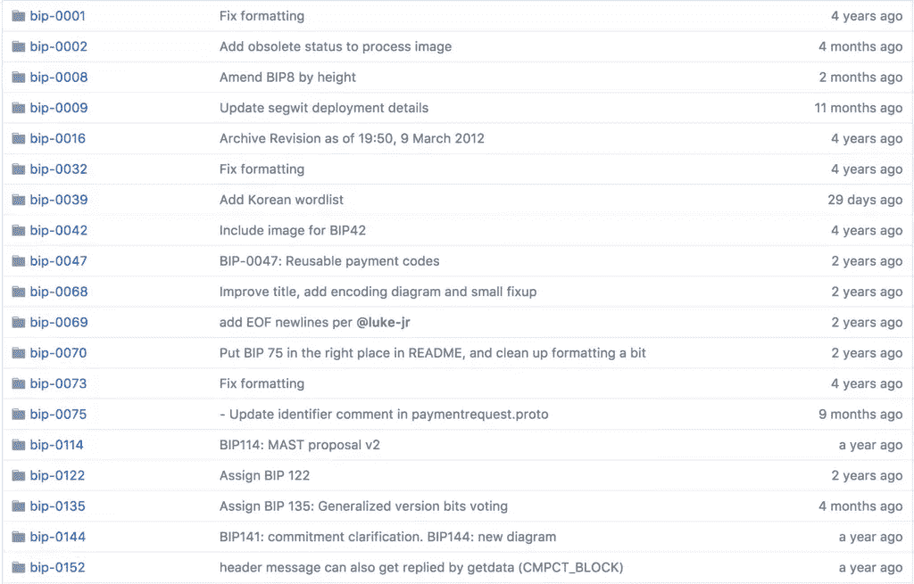
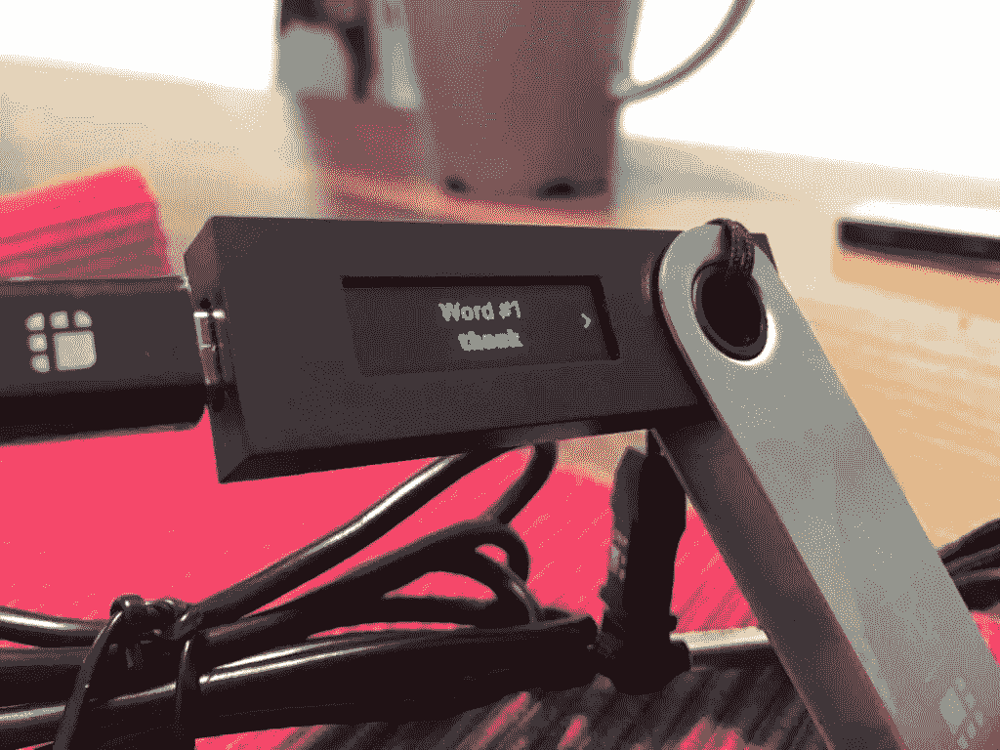
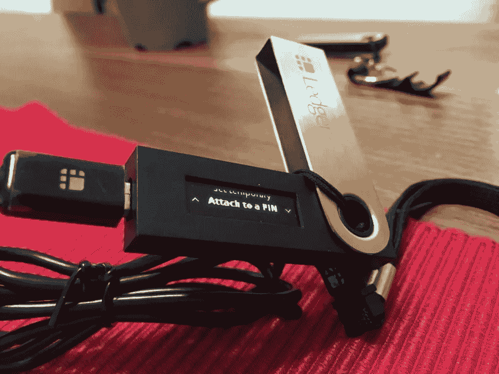

# 存储加密货币:硬件钱包如何工作

> 原文：<https://www.sitepoint.com/storing-cryptocurrency-how-hardware-wallets-work/>

*这篇关于硬件钱包的文章最初发表在 [Bruno 的 Bitfalls 网站](https://bitfalls.com/2017/09/08/hardware-wallets-like-ledger-nano-s-work/)，经允许在此转载。*

新的加密爱好者最常见的问题之一是，像 Ledger Nano S 这样的硬件钱包如何可能成为存储加密货币的最安全方式？如果设备被盗或被破坏怎么办？

在这篇文章中，我们将尝试从技术角度(但希望是人类可读的)解释这种设备是如何工作的，详细说明它是如何做到这一点的，以及它为什么如此灵活而又如此安全。

在我们深入解释之前，建议您阅读一下[这篇关于加密货币钱包的短文](https://bitfalls.com/2017/08/31/what-cryptocurrency-wallet/)，这样文章剩余部分使用的术语就变得清晰了。

## 静脉内细菌蛋白

当[区块链](https://bitfalls.com/2017/08/20/blockchain-explained-blockchain-works/)作为比特币背后的技术出现时，一群程序员/科学家想要提出一个新功能，他们必须以比特币网络所有参与者可读和可理解的方式正式提出这个想法。这样的正式提案被称为*比特币改进提案*或 BIPs。[所有 bip](https://github.com/bitcoin/bips)在实施到区块链之前都会进行公开讨论。



通过为新想法建立一个良好的基础，这允许其他区块链人采纳他们喜欢的好想法，抛弃他们不喜欢的。

这就是事情变得更加技术性和复杂的地方。我们保证在这篇文章结束时它是值得的——所以请继续阅读！

BIP 39 号就是这样一个好主意。BIP 39 使用数学计算出如何使用一组 24 个常规单词来获得一个**种子**——一个大随机数，随后从这个随机数中生成[加密钱包](https://bitfalls.com/2017/08/31/what-cryptocurrency-wallet/)的密钥。

好奇:如果你有兴趣看看支持的单词列表，请看这里的。

BIP 39 还定义了一种方法来保护这 24 个字，并附加了一个密码，该密码算作字 25。如果没有选择密码，则使用一个空密码，因此基本上总是 24 个单词+密码(空或空)。

好奇:这个密码短语不同于你在各种界面中习惯的密码，因为如果使用了错误的密码，它不会产生错误信息。任何密码短语与 24 个单词的组合都会产生一个有效的种子，这在貌似合理的拒绝场景中很有用——这是一种勒索保护机制，我们将在后面解释。

这个生成的种子号用于为你感兴趣的每种加密货币生成一个**根密钥**——一个不可访问的字母和数字的组合。每个[区块链](https://bitfalls.com/2017/08/20/blockchain-explained-blockchain-works/)都有自己的从种子生成根密钥的方法，在比特币的例子中是 [BIP 32](https://github.com/bitcoin/bips/blob/master/bip-0032.mediawiki) ，结果是这样一个密钥:

```
xprv9s21ZrQH143K3QTDL4LXw2F7HEK3wJUD2nW2nRk4stbPy6cq3jPPqjiChkVvvNKmPGJxWUtg6LnF5kejMRNNU3TGtRBeJgk33yuGBxrMPHi
```

这个密钥随后被用来生成几个私钥，然后成为给定区块链的[加密货币钱包](https://bitfalls.com/2017/08/31/what-cryptocurrency-wallet/)。

迷茫？


这一切都归结为:BIP 39 是用来挑选某个组合的话，这可能是或可能不是密码保护，然后用来产生钱包的公式，如 BIP 32 中描述的一个。

那么所有这些和像账本这样的设备有什么关系呢？

## 分类帐

当你第一次打开一个分类帐设备时，它会生成前面提到的 256 位种子。这个种子数将用于计算 24 个单词，然后显示在设备的屏幕上。



然后，用户应该将这 24 个单词写在一张纸上，这张纸随分类账一起放在盒子里，并妥善保管这张纸，远离分类账本身。

除此之外，分类帐需要使用一个四到八位数的 PIN。如果在设置之后，连续三次错误地输入 PIN，分类帐将自毁其上的所有数据。

如果账本被破坏、被盗或丢失，设备的原始所有者可以使用这张纸上的文字来恢复其内容——要么在备份账本上，要么在像 [MyEtherWallet](https://bitfalls.com/2018/02/19/first-ethereum-address-learning-use-myetherwallet/) 这样的软件钱包中——从而重新获得所有资金和地址。这是可能的，因为重新生成根密钥只需要这 24 个单词和密码短语(如果设置了的话)。

再次重申这一点很重要:相同的根密钥将总是从相同的 24 个字的组合中生成，并且相同的地址将从该根密钥中生成。因此，要收回用 BIP 39 个单词短语生成的所有钱包，你只需要将 24 个单词的单一组合插入支持该生成方法的硬件或软件中。

### 似是而非的否认

我们之前提到过勒索保护，所以让我们在这一部分解释一下。

当您打开它时，分类帐不会要求您输入密码，但会要求您输入 PIN。第一次设置设备时，也不能设置密码短语；只有在设置中，您才能添加它。



这允许您将一个单独的 PIN 附加到一个密码短语，以便拥有两个(或更多)。每个 PIN 将被绑定到它自己的密码短语，由于前面提到的 24 个单词+密码短语总是产生一个有效的种子(没有“密码不正确”的警告)，很容易定义一个诱饵 PIN 给迫使你放弃它的人。

在这种情况下，输入第二个诱饵 PIN 不会破坏分类帐的数据，但会在添加到您的 24 个单词时打开对应于该密码短语的钱包。抢劫犯不会知道你没有给他真正的个人识别码，他将获得伪造的地址。为了增加效果，在地址中添加一些微不足道的加密货币，让它们看起来更真实；零余额地址不会那么有说服力。

### 猜钥匙的概率

许多人想知道猜测 24 个单词并以这种方式进入某人的钱包会有多容易，特别是考虑到 BIP 39 甚至没有使用整个字典，而只是 2048 个单词。

24 个单词有 2 个 <sup>256 个</sup>或 11579208923731619542357098500868790785326984665640564039457584007913129639936 个可能的组合。如果我们假设我们有一台不可能的计算机，它能够在一秒钟内猜测 100 *万亿*种组合，要尝试所有这些组合，我们需要:

```
115792089237316195423570985008687907853269984665640564039457584007913129639936 / 100000000000000 = 1157920892373161954235709850086879078532699846656405640394575840 seconds 
```

那大约是 367174300000000000000536992568032848736216424136408984408 年，而且那只是在你有一台比人类曾经想象的任何东西都更强大的计算机的情况下。

如果你知道所有的单词，但不知道顺序呢？在这种情况下，可能的组合数是 24！(24 阶乘)。

```
24! = 620448401733239439360000 
```

因此，一台同样强大的计算机需要:

```
620448401733239439360000 / 100000000000000 = 6204484017 seconds 
```

那就是 196.6 年。

因此，即使你知道某人组合中的所有单词，但只需要猜测顺序，你也需要使用一台即使以今天的标准来看也难以想象的强大的计算机 200 年。如果你不知道你需要猜哪个单词，这个数字会被乘以 2048 以得到每一个遗漏的单词。因此，在这种情况下，如果不知道其中的一个，猜测所有组合所需的时间将增加到 40 万年。

## 结论

分类账是一种非常安全的存储加密货币的方式。它大大优于任何一种基于 USB 的存储，你只需将你的密钥保存到一个文件中，然后把它放好。

该设备有自己的处理器来计算密钥，这意味着你的根密钥永远不会离开设备。这使它免受潜在的病毒或自动交易恶意软件安装在计算机上，你使用它的安全。除此之外，分类账还要求对任何交易进行额外的硬件确认:无论何时发送资金，你都需要按下设备上的一个按钮，否则就无法工作。账本里没有偷偷摸摸的资金。

如果你丢失或毁坏了账本，只需输入第一次设置设备时获得的 24 个单词，就可以轻松取回所有资金。这些字应该放在安全的地方，远离窥探的目光。

## 分享这篇文章