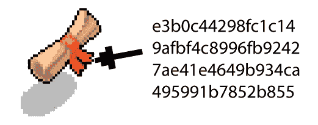

# 区块链:它是什么，它是如何工作的，为什么它如此受欢迎

> 原文：<https://www.sitepoint.com/blockchain-what-it-is-how-it-works-why-its-so-popular/>

*这篇关于区块链的介绍最初发表在 [Bruno 的 Bitfalls 网站](https://bitfalls.com/2017/08/20/blockchain-explained-blockchain-works/)，经允许在此转载。*

**什么是“区块链”？它是如何工作的，为什么它受欢迎，为什么这么多人声称它将彻底改变世界？**

在本文中，我们将通过一个平庸的例子来解释区块链技术，这个例子对目前流通的大多数加密货币都有效。不熟悉加密货币的概念？看[这里](https://bitfalls.com/2017/08/20/cryptocurrency/)！

## 马里奥和路易吉

马里奥需要给他的兄弟路易吉寄去 100 美元，因为路易吉就是路易吉，他在世界的另一端欠了一些债。


马里奥走进银行，说“我想给路易吉汇 100 美元”。柜员依次说“请出示账户卡”、“请出示身份证”和“办好”。


在这个*中央集权*的场景中，银行是*对马里奥和路易吉的钱的中央*权威。Mario 和 Luigi 都相信银行会转账，并相信银行账户对账单上显示的数字。他们信任银行——尽管事实上银行所要做的只是改变数据库中的一个数字。毕竟都是数字化的。

然而，当我们依赖这样一个中央权威时，这种权威会带来一定的威胁。它可以随着我们的钱消失，它可以是邪恶的，不增加路易吉的价值，同时减少马里奥的价值，从而保持差异，或者它可以只是笨拙地犯了一个错误。我们的财务状况直接取决于他们的能力。


防止这种情况的一个方法是完全跳过银行，拥有我们自己的系统来跟踪价值和价值从一个地方到另一个地方的旅行。

想象一下，我们在一张纸上记下了我们银行账户的状态。如果只有马里奥和路易吉在使用那个系统，很难保持公平。如果他们中的一个变得贪婪，系统就已经妥协了。因此，这样一个*分布式*(非*集中式*)系统需要有足够的参与者来使其可行——最少三个。

## 报纸

假设我们有五个参与者:耀西、马里奥、路易吉、瓦里奥和布瑟，每个人都有自己的一张纸。


马里奥想给路易吉寄 100 美元。为此，他让每个人都知道(大声宣布):“我要给 Luigi 寄 100 美元！请大家注意！”


此时，每个参与者都会检查 Mario 的账户，以确保他的账户上有足够的金额发送给 Luigi(是的，每个账户的状态都是公开的)，如果有，就在他们的纸上写下这笔交易。这种类型的交易被写在参与者的纸上，直到用完为止。换句话说，*任意两个人*之间的*每一笔*交易都被记录在*每个参与者的纸上*。

在我们把写满的纸归档到文件夹或文件柜中，并拿一张新的空白纸之前，我们需要用一个特殊的代码把写满的纸封起来。

## 海豹和采矿

这个“印章”保证论文内容真实。

我们怎么得到这个封印？使用一种特殊的算法(数学运算)，当我们向它输入一些输入数据时，如果输入数据是相同的，它总是产生相同的输出*。*

下面我们来举个例子:

```
X1 + X2 + … Xn = Z 
```

换句话说，简单的求和。

让我们假设当且仅当给定的求和运算产生数字 10000 时，我们的纸张值为*真且有效*(即所有交易都被确认)。

```
1000 + 6000 + 3000 = 10000 
```

在这种情况下，输入数据是 1000、6000 和 3000，而*印章*是 10000。

好吧，让我们假设我们的参与者达成了以下协议:如果，当你将纸上的所有数字和其他数字的特定组合相加，得到 10000，那么纸上的交易是有效的，可以被认为是确认的。

例如，如果票据包含以下五项交易:

*   马里奥->路易吉= 100
*   布瑟->耀西= 200
*   耀西->路易吉= 100
*   马里奥->耀西= 500
*   路易吉->瓦里奥= 100

总和是 1000，所以我们要寻找一个当加到 1000 时给出 10000 的数字。剩下的 9000 可以通过多种组合实现:

*   5000 + 4000
*   1000 + 1000 + 1000 + 1000 + 1000 + 1000 + 1000 + 1000 + 1000
*   2000 + 3000 + 2000 + 2000
*   等等…

计算机无法直观地判断哪些数字会产生所需的数字。为了得到这个结果，计算机必须*在 10000 以下的不同数字组合中随机猜测*，直到得到一个产生 10000 的组合。因此，在我们的参与者中，第一个正确猜出一组数字的组合(当与纸上的所有交易值相加时产生 10000)的人将告诉其他人结果。

假设耀西找到了 4000 + 5000 的组合。他告诉每个人:“我得了 10000 分！试试 4000，5000！”假设通过简单地将 Yoshi 的数字输入到算法中来验证它们的正确性是非常容易的，其他参与者验证了这一点。所有其他参与者的文件，在这次检查中，当与 4000 和 5000 相加时，现在也产生 10000，有效地验证了他们面前的交易列表。通过这样做，达成共识，即文件都是有效的。

如果有人的论文*用 4000 和 5000 相加*不出 10000，那我们就有问题了。例如，如果布瑟有意或无意地记录了一笔不同的交易——比方说，马里奥给了路易吉 200 美元，而不是 100 美元——那么这笔钱就不符合要求。


布瑟的论文因此被认为是无效的，如果他想继续参与这个系统，他将不得不丢弃他的论文，复制别人的有效论文，并承诺在未来更加小心。另一方面，发现获胜组合的 Yoshi 从系统中获得例如 5 美元的奖励。系统*凭空产生*5 美元作为对幸运参与者的奖励。


这种凭空产生货币的*过程在加密货币领域被称为**挖矿**。*

虽然这是一个大大简化的例子，但与真正的区块链唯一真正的区别(除了事实上它是全数字和自动的)是用于生产*印章*的算法是不同的——一个更复杂的算法，可以接受数字和字母，并输出类似`90bdaa79bbccacf8558edcbb30df48d7fc920eeb75a28f883de4100f58a99b49`的代码。



*印记*被称为**散列**，产生它们的算法——比如产生上述代码的 sha 256——被称为**散列函数**。尝试打开[这个链接](http://www.xorbin.com/tools/sha256-hash-calculator)并在字段中输入任意数量的文本。无论你输入一个单词还是整本圣经，它都会产生正好 64 个字符的散列。

因此，为了得到密封我们纸张的散列，我们将纸张上出现的所有交易输入到算法中。它们变成了一团乱麻。由于我们可以为算法提供无限数量的字符组合作为输入，所以纯粹根据输出数据猜测原始输入数据集在数学上是不可能的。

具体来说，在比特币区块链中，网络及其所有参与者的共识是，只要产生的哈希(我们通过组合上一张纸的哈希和当前纸的所有交易，加上随机的数字和字母)以给定数量的零开头，它就是有效的。例如，如果论文 1 的散列为`0000000000000000058edcbb30df48d7fc920eeb75a28f883de4100f58a99b49`，那么论文 2 的有效散列将是(当当前论文的交易和一些随机数据被添加到最后一篇论文的散列时)前面包含相同数量或更多零的散列。

为了得到产生新的有效散列所需的随机字符组合，计算机必须进行猜测。现代计算机速度非常快，每秒钟可以轻松地尝试数千种组合，但考虑到可能的组合数量近乎无限，这仍然不够快。作为一个题外话，前面提到的 hash 向我们展示了猜测新密码的难度是 17，因为在它的前面有 17 个零。随着时间的推移，难度将会增加，新的有效散列将需要越来越多的零在前面。

当每个参与者的论文用散列法标记为有效时，它被放入一个文件夹——一个类似于*分类账*的文件夹——然后一个新的空白的被抽出来。

### 按照区块链的说法

用区块链的话说:

*   一张纸**一块**。
*   一个块包含多个**事务**。
*   一个积木总是跟随前一个积木，形成一个链条——一个**区块链**。经验证的块被放入**分类账**(与**区块链**同义)。
*   猜测这些组合的计算机被称为**节点**。猜测散列组合的节点获得区块链代币形式的奖励——在我们的特定示例中，是几个比特币。
*   对组合的猜测被称为**挖掘**，因为我们正在*从一大堆随机猜测中挖掘*新值。我们使用电力、时间和计算机的计算能力，而不是肌肉的力量和镐的工具。我们上面的故事中的角色都在小卡丁车里，因为这是一场比赛:谁先确认一个具有有效散列的块，谁就赢，并获得非常有价值的奖励。同样，在区块链世界，最强大的计算机(或计算机池)通常会赢得区块奖励。
*   新的有效散列的存在被认为是工作的**证明。这是当今大多数加密货币使用的模型，目的是因为过高的电力成本而使简单的猜测或金融欺诈不可行。像以太坊这样的一些协议正在转向**利益证明**，其中无谓的电力浪费被最小化，对无效参与的惩罚变得更加严格，但这是另一篇文章的主题。**

## 结论

所有的加密货币都基于*区块链技术*。区块链使它们变得透明、明确(不可能伪造或复制)，并在一定程度上限制了最大生产量。与法定货币(美元、欧元等)不同。)，加密货币不能简单地由它们的创造者印刷，除非是一些骗局货币，如 Ripple (XRP)或 OneCoin。(更多关于那些在另一个帖子。)

区块链技术允许对当地或全球社会的金融系统进行分布式控制，并有助于避免中间人。这也是为什么[加密货币](https://bitfalls.com/2017/08/20/cryptocurrency/)如此流行的主要原因之一。由于区块链和全球数百万用户的分布式性质，他们都充当“会计”和验证者，许多人认为加密货币是不可摧毁和不可阻挡的。遗憾的是，这是一种不同的错觉——我们将在后面讨论(见下一节的链接)。

## 接下来呢？

以下是一些进一步的阅读材料:

*   [什么是加密货币](https://bitfalls.com/2017/08/20/cryptocurrency/):了解它的全部内容以及价值来自哪里。
*   [比特币不是不可阻挡的](https://bitfalls.com/2017/08/21/is-bitcoin-unstoppable/):看看停止和摧毁一种加密货币有多容易。
*   [比特币不是有限的](https://bitfalls.com/2017/09/17/bitcoin-finite-just-myth/):了解一下为什么理论上的 2100 万个比特币的产量上限实际上并不成立。
*   [比特币不是匿名的](https://bitfalls.com/2017/09/18/anonymous-cryptocurrencies-like-bitcoin/):了解为什么人们经常(不正确地)说比特币是匿名的，对黑市和犯罪资金有用。
*   什么是[以太坊](https://bitfalls.com/2017/09/19/what-ethereum-compare-to-bitcoin/):了解当今最强大的区块链。

## 分享这篇文章