# 25 种以上的网络资源帮助您构建项目

> 原文：<https://www.sitepoint.com/25-web-resources-to-help-you-build-your-projects/>

*本文是与 [Mekanism](http://mekanism.co/) 合作创作的。感谢您对使 SitePoint 成为可能的合作伙伴的支持。*

网页设计师和开发者之间的竞争已经达到高潮。有几种方法可以打败你的对手。一个是有更多的知识，成为专家。另一个是从数十种非常有用的网络应用和服务中获得帮助，这些应用和服务为用户提供了出色的结果。

在这个展示中，我们将向您展示 25 个以上的网络资源，它们将帮助您每天构建和完成您的项目。通过使用它们，你将节省时间和金钱。

查看迷你评论并开始使用这些解决方案。

## 1.[Tickera-WordPress 活动票务系统](https://tickera.com/)

Tickera 是市场上最实惠、最完整、最专业、最简单的 WordPress 票务插件。除了所有包含的功能和出色的界面，Tickera 的一个大优势是它不会从你的利润中提成——它的策略是有年费和一次性费用，这两个数字都很小。

Tickera 允许您使用简单的 iPhone 和 Android 移动应用程序以及条形码阅读器，甚至是其强大的独立于平台的 Chrome 桌面应用程序来加速整个签到过程，从而轻松地为与会者签到。创建令人惊叹的场地平面图，让您的与会者更容易为您的展览选择最佳座位。制作座位组、站立区、圆桌或方桌、兴趣点……任何你需要的东西，任何你喜欢的方式。只需选择、拖放，就像听起来一样简单。

这个解决方案允许你有一个购物车，顾客可以一次购买任意数量的票。您可以通过提供折扣代码轻松提高销售额。使用票证生成器，您可以设计完全定制的票证，以区分标准票证和 VIP 票证。

定价从每年 49 美元加上 70 美元的一次性费用开始，可以永久使用，适用于任何数量的网站。

## 2.[layer Slider-Responsive WordPress 滑块插件](https://layerslider.kreaturamedia.com/?utm_medium=content&utm_campaign=mekanism201804)

LayerSlider 可能是市场上最好的解决方案，可以轻松创建令人惊叹的滑块、图库、具有震撼效果的幻灯片、登录页面、动画页面块，甚至是完整的网站。LayerSlider 可以用于 WordPress——终身更新和 6 个月支持的费用是 24 美元，jQuery 的费用是 15 美元。

使用包含大量强大功能(预览模式、撤销-重做、类似 Photoshop 的图像编辑器等)的拖放编辑器，您可以完全自定义现有模板(个人和公司主题)或从头开始。它使用起来超级简单，没有任何编码经验或专业知识的人也可以获得专业的结果。

在他们的网站上，你会找到很多对你有帮助的信息，以及一个专门的、友好的支持团队，他们会很快帮助你。

## 3.[页面管理 WordPress 主机](https://pagely.com/)

Pagely 是一个托管的 WordPress 托管解决方案，10 年前作为第一个同类产品投放市场。从那时起，它已经成为市场领导者，在其托管栈中使用尖端技术，这是建立在亚马逊网络服务之上的。这意味着更多的权力和近乎无限的资源。

过去是，现在仍然是，不同之处在于人类的力量。从成为市场先锋的第一天起，他们就努力善待客户和竞争对手，并始终凭良心行事。Pagely 继续为托管 WordPress 主机提供卓越的解决方案，拥有适应性强、经验丰富的工程师，不断为客户、员工和同事带来灵活、友好和一流的体验。

## 4.[Goodie-网络开发服务](https://goodiewebsite.com/)

Goodie 是一个专业的网络开发服务，它将帮助你从 999 美元开始拥有一个华丽的网站。如果您需要比基本包更多的功能，您将从您选择的开发人员那里收到一个可承受的报价。如果你的要求实现起来非常简单，网站开发者会为你的项目增值，所以你投入的每一分钱都是值得的。

创建 Goodie 的团队在过去十年里一直在经营小企业。他们知道让你信任的人在你身边有多重要。古迪有 10 年的经验，为像你这样的企业推出美丽的网站。

## 5.[Ultra——最强大的 WordPress 主题](https://themify.me/themes/ultra)

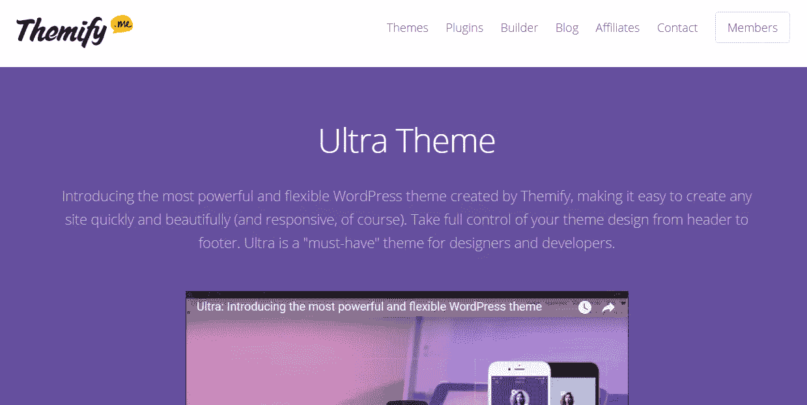

Themify Builder 是 WordPress 最强大、最易于使用的页面设计器和构建器。设计您可以想象的任何布局，使用拖放界面使其栩栩如生，并通过实时预览在您眼前观看它们的组合。选择、拖动和放下，您已经构建了漂亮的页面——无需任何编码！

## 6. [WPKube](https://www.wpkube.com/themes/)

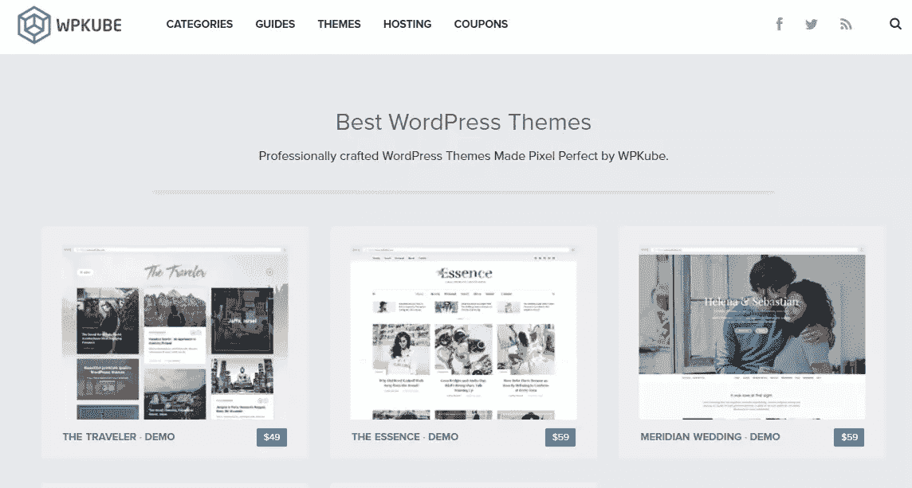

WPKube 是一个专业的 WordPress 主题开发者，它已经投入了大量资金来提供市场上优秀的模板。它的所有主题都响应迅速，加载速度快，搜索引擎友好，可以快速定制，以适应您的项目完美。

## 7.[color lib–应用](https://colorlib.com/wp/template/appy/)

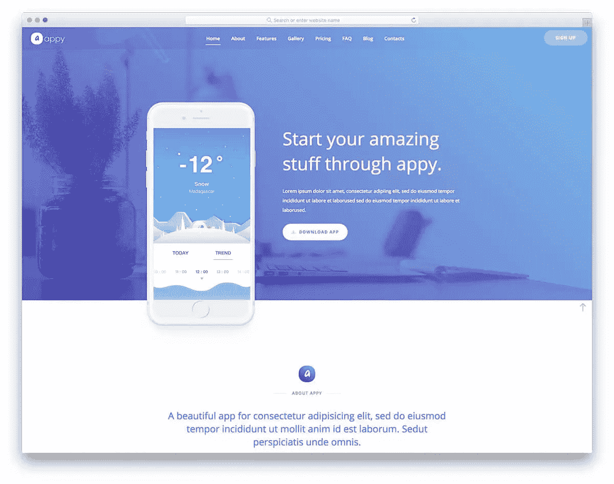

Apply 是一个免费的单页 WordPress 主题，优化了超快的速度，搜索引擎优化友好，像素完美，看起来很棒。它有一个现代和干净的设计，将是你的下一个项目的完美选择。下载并开始定制它。

## 8.[明信片](https://designmodo.com/postcards/)

借助明信片，您可以使用其专业且易于使用的拖放式构建器(包含 70 多个组件)快速创建美观且回复及时的电子邮件。定制设计比以往任何时候都更容易，你不需要编码技能或任何特殊知识。

请记住，它的模板模块已经过测试，可以在所有主要的电子邮件客户端上完美呈现，支持流行的 web、桌面和移动平台。

## 9.[幻灯片](https://designmodo.com/slides/)

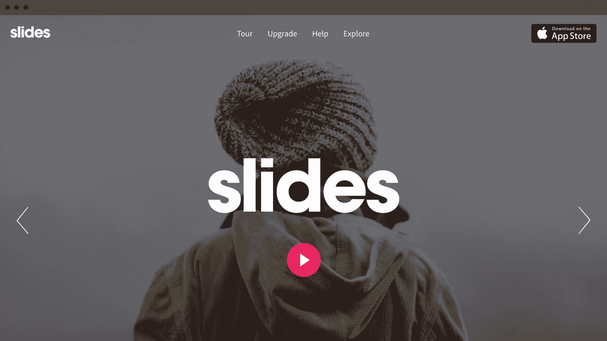

使用幻灯片，你可以很快创建一个漂亮的网站。只需选择你喜欢的幻灯片，并开始调整设计——它使用起来超级简单，几分钟内就能达到出色的效果。从易于理解和高度可定制的干净代码库高效工作。你用了幻灯片就再也不会回到平时的建站者了。

## 10.[编码员](https://www.codester.com/)

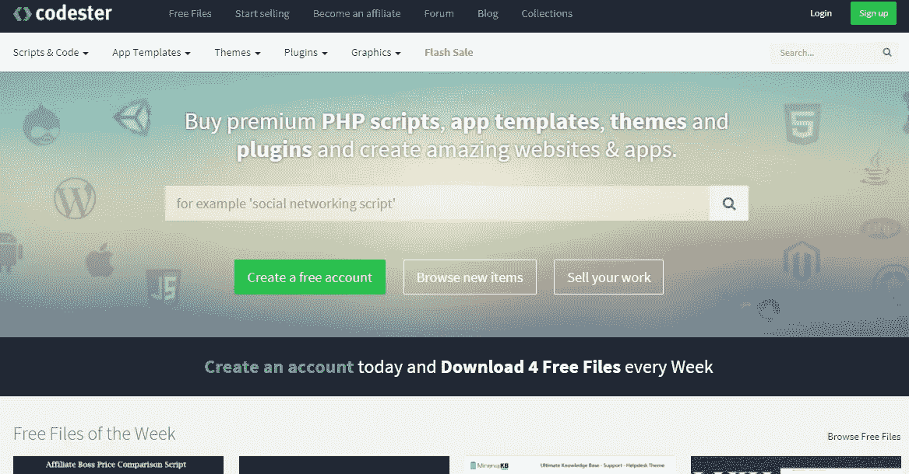

Codester 是一个伟大的市场，面向网页设计者、开发者和所有想买卖 PHP 脚本、应用模板、不同平台的主题、插件等等的人。有数千种产品，市场每月都在快速增长。

## 11.[子午线主题](https://meridianthemes.net/)

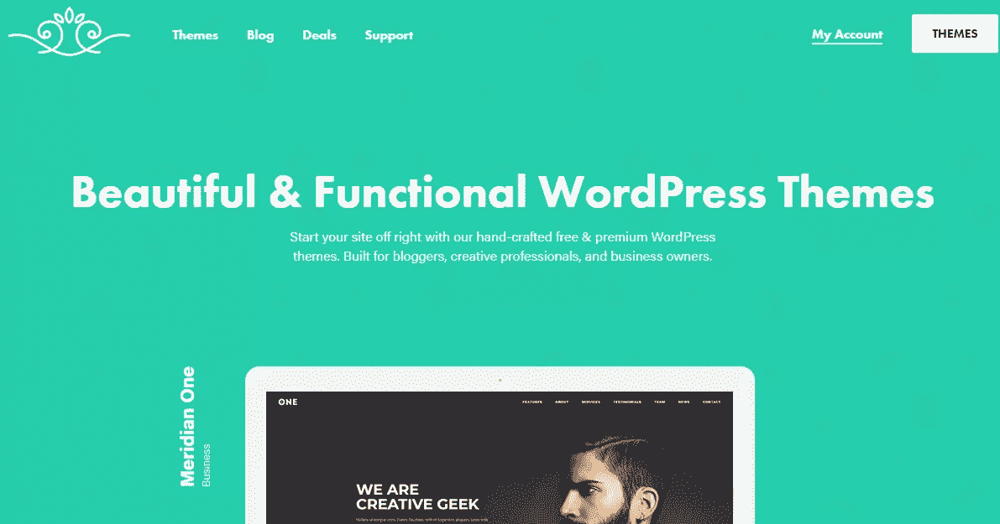

MeridianThemes 是一个受欢迎的 WordPress 主题开发者，它创建像素完美的多用途模板，可以在几分钟内完全定制以适应你的项目。在它的收藏中，你会发现免费和优质的主题，移动响应设计，兼容流行的插件和大量的选项。看看 Meridian 的投资组合。

## 12.uicookies–框架

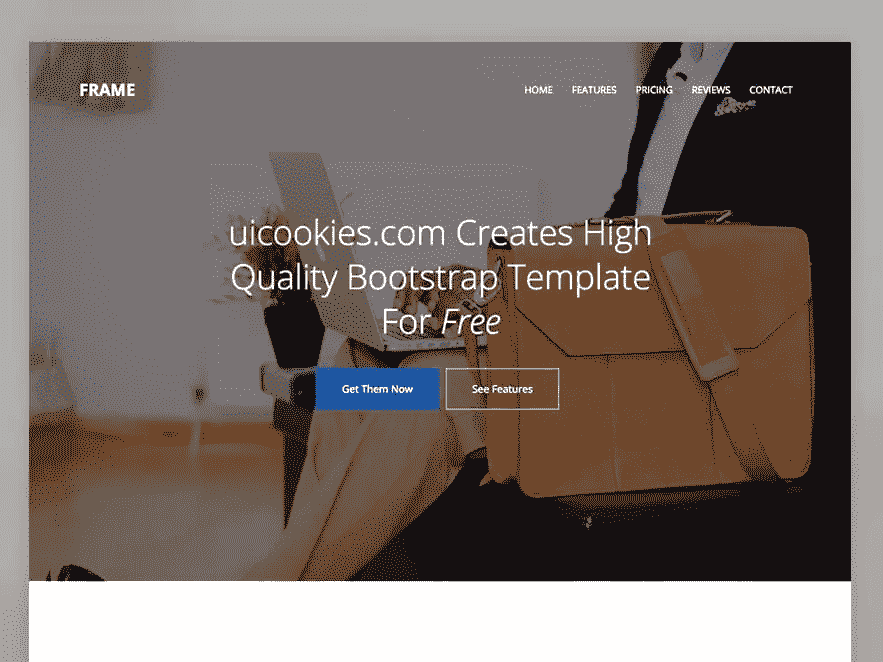

Frame 是一个免费的 HTML5 和多用途 WordPress 主题，由声誉卓著的开发者 uiCookies 开发。单页模板很容易定制，它有一个现代和干净的设计。一旦你开始使用 Frame，你将提高你的转化率。

## 13.[徽标](https://www.logoai.com/)

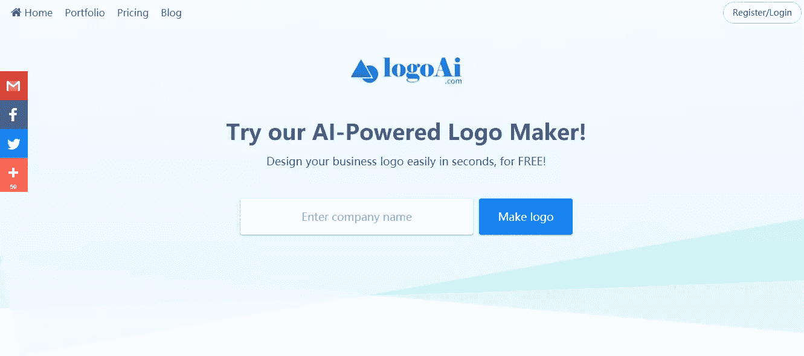

每当你正在寻找一个新的标志设计，但你不想花一大笔钱，LogoAI 是一个很好的去处。它使用人工智能来创建一个专业的标志设计，你会得到多种文件格式的文件，以及包括颜色和字体在内的品牌指南。LogoAI 提供了设计师需要的一切。

## 14. [MailMunch](https://www.mailmunch.co/)

MailMunch 是从您的网站获取潜在客户的一种快速而流行的方式，每天有超过 50，000 个网站使用这种解决方案。从专业设计的主题中选择可以完全匹配您的网站或博客的主题，并开始转换。MailMunch 提供永久免费计划，每月收费 15 美元起。

## 15.[什么是字体](https://www.whatfontis.com/)

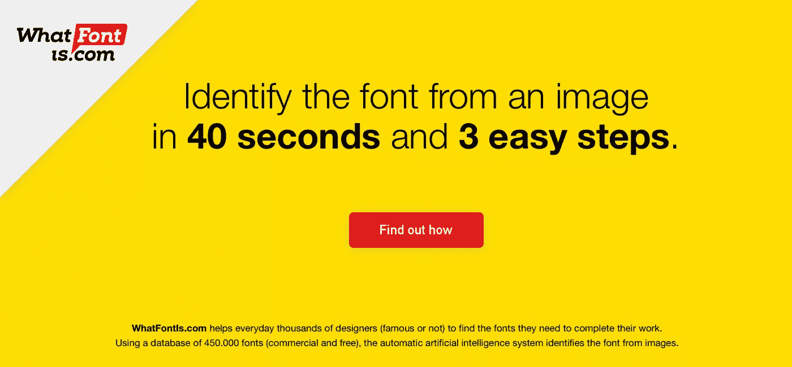

寻找新字体？无论你在搜索什么字体，WhatFontIs 都会向你展示 60 多种类似的免费或商业字体。使用起来超级简单，快如闪电。它的字体匹配平台使用了独特的人工智能，每天都在学习新的字体。

## 16. [Pixpa](https://www.pixpa.com/)

Pixpa 是摄影师、艺术家和设计师的一体化平台。使用 Pixpa 强大的拖放式构建器，通过内置的电子商务、客户打样和博客工具获得您的在线投资组合。

免费试用 15 天——你会印象深刻。

## 17.[超级网站构建者](https://superbwebsitebuilders.com/)

SuperbWebsiteBuilders 是寻找简单而强大的 web 构建解决方案的用户的最佳目的地。该网站提供了几十个高质量的网站建设者评论，揭示了众所周知的服务的概况，特点，鲜明的特点，利弊。对于无法决定最适合的系统的用户，该网站有一个包含类似服务比较及其评级的类别。审查和比较定期更新。

## 18.浮子

uKit 是一个全新的网站建设者，让企业能够创建一个专业的网站，无论是登陆页面，在线名片，电子商务网站等等。该平台让您可以免费开始使用，并提供丰富的设计库，确保多设备观看体验。感谢专门为 DIY 网站所有者提供的内置营销和 SEO 工具，创建一个成功的网站从未如此容易！

## 19.

uCalc 是一个现代的，但强大的网络计算器设计器，让您创建和嵌入计算器到您的网站，没有麻烦。构建过程是小菜一碟，不需要任何开发技能。无论您想计算什么，uCalc 都会处理—无论是披萨外卖报价计算器、窗口成本计算器，还是估计地基混凝土量或身体质量指数。

## 20. [IM XPRS](http://www.imcreator.com/)

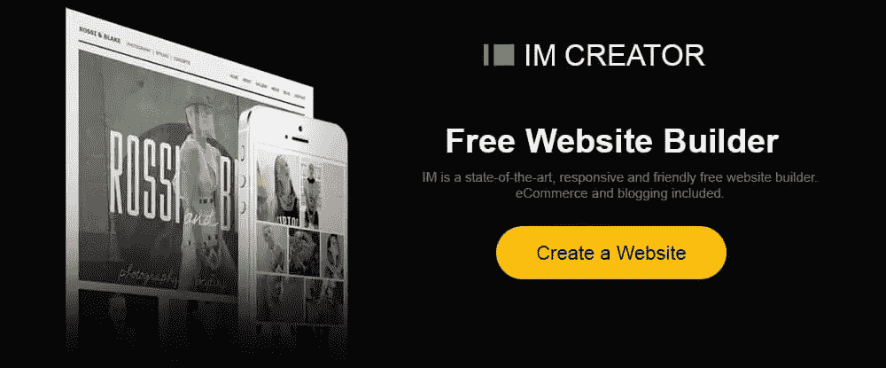

IM XPRS 是一个网站构建器，它允许您解决各种各样的网站构建任务，并启动不同类型的网站。该系统提供了各种各样的专题模板和定制工具，使模板具有理想的外观。网站建设者是绝对免费的，但它有一个完美的白色标签解决方案，为先进的网页设计师和大型企业的所有者。

## 21. [InvoiceBerry](https://www.invoiceberry.com/)

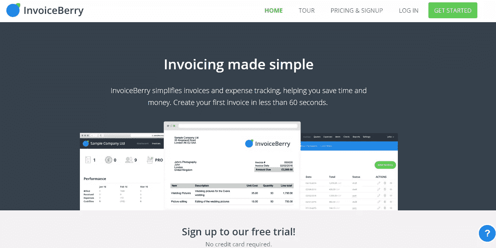

InvoiceBerry 是一款面向小公司和自由职业者的完整发票解决方案，可以快速创建和发送完全定制的发票，跟踪费用，创建报告，跟踪付款等。他们提供一个永远免费的计划，你可以从今天开始使用。

## 22.[售货员](https://www.salesmate.io/)

SalesMate 是一个一体化的 CRM 应用程序，web 设计人员和开发人员可以使用它来提高销售额，并在一个地方管理所有信息。关注合适的联系人，保存他们的重要信息，建立更好的销售流程。定价从 15 美元/月起。

## 23.[乌卡力](https://www.ucraft.com/)

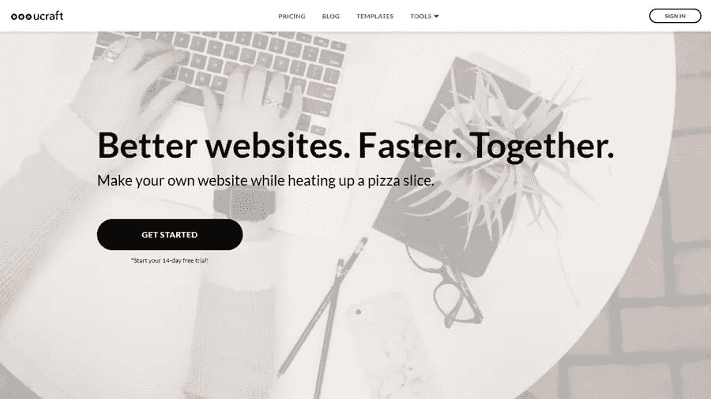

Ucraft 是一个基于云的网站构建器，具有一系列功能和工具，允许创建具有惊人功能的高质量网站。该服务确保了一个直观和简单的网页设计过程，这总是触发一个优秀的结果。在这里，你可以建立一个能满足你所有商业和个人需求的网站。应特别注意该服务提供的免费登录页面创建器、高级设计工具和电子商务引擎，以便轻松创建和管理在线商店。

## 24.[控制. net](https://controlio.net/)

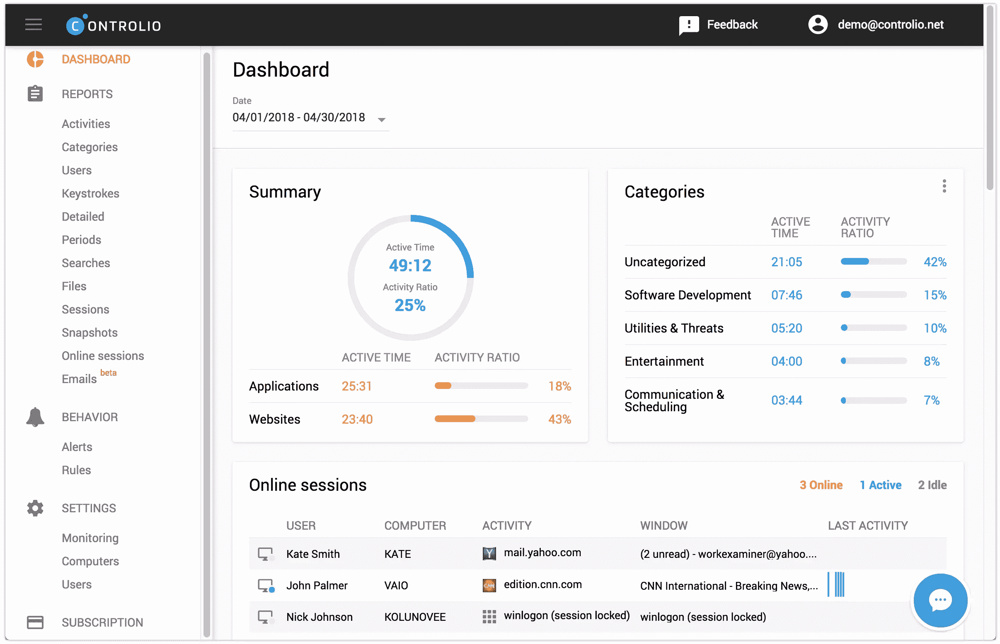

Controlio 是一款流行的计算机和互联网监控云软件，允许您在 100%隐形模式下从任何位置和设备远程跟踪 PC 上的用户活动。对于中小型公司，每个用户每月的成本为 7.99 美元。

## 25. [EvergreenFeed](https://www.evergreenfeed.com/)

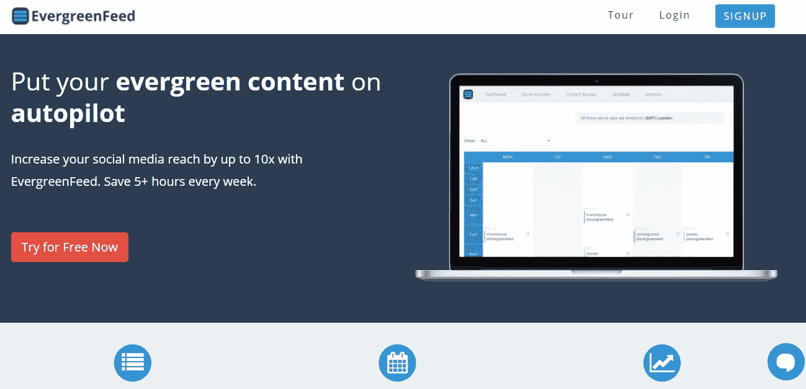

使用 EvergreenFeed，你可以自动控制你的社交媒体形象。听起来很简单，每周你会节省 5 个小时以上。您可以通过选择内容来添加新帖子，为每个社交媒体帐户选择时间表，并通过自动发布最佳内容和正确时间来增加覆盖范围。

## 26.[未编码](https://themeforest.net/item/uncode-creative-multiuse-wordpress-theme/13373220)

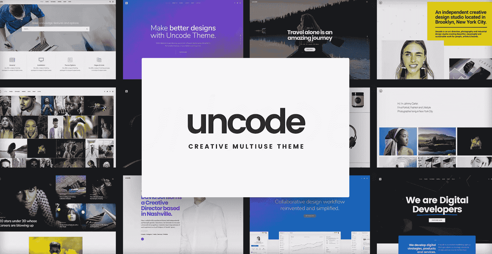

Uncode 是一个强大的、多范围的和像素完美的 WordPress 主题，它将使你的生活更容易，你的项目更好。Uncode 装载了一个拖放构建器，大量的特性和选项，将会是你下一个项目的完美选择。

## 27.[rumble talk–WordPress 社交聊天](https://www.rumbletalk.com/)

RumbleTalk 满足了网站和公司的需求，让他们的网站或活动访问者作为一个群体参与实时聊天。事实证明，这是一个简单而愉快的快速提高转化率的方法。

实现起来超级简单，见效也快。

## 结论

无论何时，当你想快速完成工作并取得好的结果时，以上任何网络资源都是很好的选择。其中一些有免费试用甚至永久免费的计划，所以测试它们很容易而且免费。

最后说明一下，这些网络工具和服务都是人工评选出来的，代表了 2018 年第一季度最好的 26 个网络资源。

## 分享这篇文章